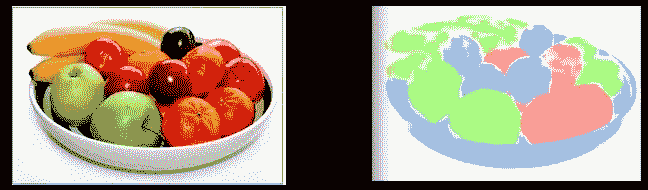
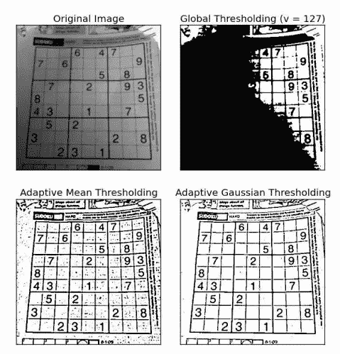
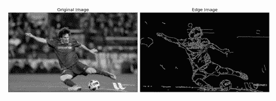
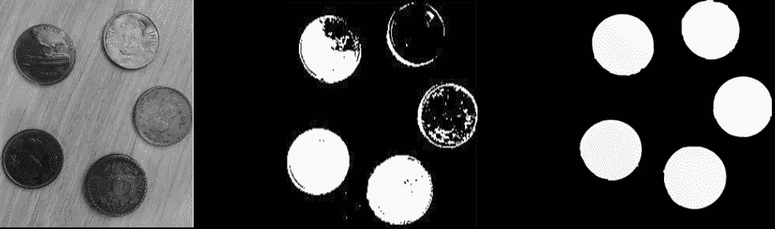
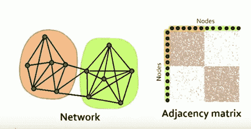
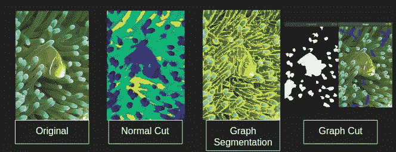
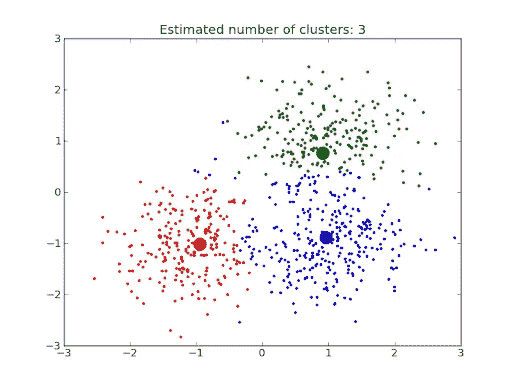
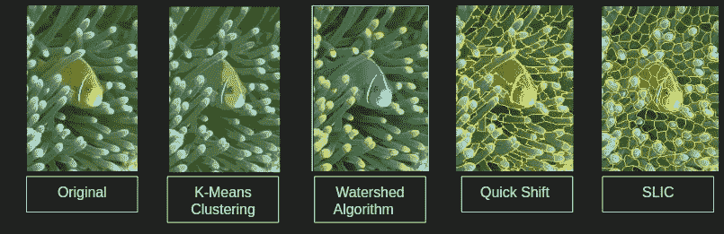
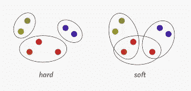
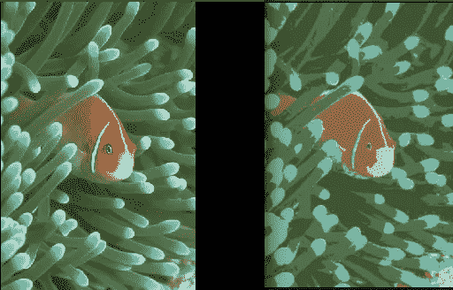

# 使用数字图像处理、机器学习和深度学习方法的图像分割技术。(第一部分)

> 原文：<https://medium.com/analytics-vidhya/image-segmentation-techniques-using-digital-image-processing-machine-learning-and-deep-learning-342773fcfef5?source=collection_archive---------0----------------------->

考虑图 1(左)所示的水果篮图像，我们能否将不同种类的水果分离出来？当然，答案是肯定的，但我们是如何做到的呢？

左图:一个水果篮的原图；右图:水果篮的分段图像

如果我们分析我们大脑中可能发生的思维或视觉处理，我们可以通过列举各种区分香蕉与苹果和橘子、橘子与苹果和香蕉的方法来回答这个问题。这可以通过分析不同颜色、形状、质地等的水果来实现。这是它们之间的一个区别因素。现在的问题是，我们如何让计算机来做这种思考，或者我们如何设计一种算法，使它能够捕捉每种水果的所有区分方法，并给出如图 1(右)所示的输出。这被称为图像分割，其中我们分割/划分图像或提取其中不同种类的对象。

这是 3 部分博客的第 1 部分，在这里我将讨论不同的数字图像处理方法，这些方法有助于实现我们的图像分割目标。以下博客将包含潜在图像分割的机器学习和深度学习方法。所以，让我们开始跳入知识的海洋吧。

来源:超现实艺术

## **目录:**

1.  什么是数字图像处理及其组件？
2.  基于 DIP 的不同图像分割方法简介。
3.  用于图像分割的最新高效的 DIP 方法有哪些？
4.  使用倾角图像分割方法的优缺点。

## 什么是数字图像处理？

参考 Rafael c. Gonzalez 的最著名的书*数字图像处理，*数字图像处理是指通过数字计算机对数字图像进行处理，以获得增强的图像或者提取一些有用的信息。图像分割是 DIP 的阶段/子类之一。

> 图像处理主要包括以下步骤:

1.  通过图像采集工具导入图像。
2.  分析和处理图像以获得期望的图像(在我们的情况下是分割图像)
3.  具有输出图像或基于分析该图像的报告。

> 数字图像处理系统的组件:

1.  **图像采集**–模拟图像转换为数字图像的阶段。这一过程通常发生在我们点击数码相机中的照片时，因为在现实中，如果被人类视觉系统捕获，图像就是模拟信号。
2.  **图像增强**–这是用于改变图像像素值的阶段，以便 HVS 能够很好地感知。这可以通过使用空间域或频域来完成。示例:直方图均衡、降噪、去模糊、锐化和软化图像、滤波等。
3.  **色彩空间转换**–它处理转换图像的色彩空间，以便更精确地表现图像，提取图像中感兴趣的特征。颜色空间的一些例子是 cieLAB、HSV、HSL 等。
4.  **数字图像转换** —它处理将图像表示成不同的格式，以便转换后的图像可用于图像压缩、特征提取等任务。这些变换包括 DFT、离散余弦变换、离散小波变换，将图像表示成特征向量和特征空间，也称为 PCA。
5.  **图像压缩—** 它涉及减少保存图像所需存储空间或传输图像所需带宽的技术。它包括各种编码技术，例如游程编码、EBCOT、无损和有损预测编码等。
6.  **形态学图像处理—** 它处理用于提取图像成分的工具，这些成分在形状的表示&描述中是有用的。示例:膨胀、腐蚀、边界提取、区域填充、打开和关闭等。
7.  **图像分割—** 它包括将图像分割成其组成部分或对象。示例:边缘检测、边界检测、阈值处理、基于区域的分割等。
8.  **图像描述符—** 它处理可用于唯一识别图像中特征点的特征生成，因此可用于 CBIR 系统类应用。例如:筛选、冲浪等。
9.  **对象识别—** 根据对象的描述符为其分配标签的过程。

现在我们对 DIP 及其组成部分有了一个基本的了解，我们可以深入了解它的组成部分之一，即图像分割。

## 基于 DIP 的不同图像分割方法简介。

在本节中，我们将学习如何仅使用图像处理技术来分割图像，而不使用其他技术，即机器学习或深度学习。我们将讨论的一些技术是在 90 年代早期提出的，因此这使我们相信图像分割不是一个新概念，而是在机器学习普及之前的一个老概念。

以下是使用 DIP 分割图像的方法:

1.  ***基于阈值的分割:*** 这是最简单的图像分割方法，将每个像素值与阈值进行比较。如果像素值小于阈值，则设置为 0，否则设置为最大值(一般为 255)。该阈值可以任意改变。这种算法的应用是当我们必须分离前景和背景。这种算法的缺点是它总是将图像分成两类。

三种阈值方法即 1。全局阈值处理当在整个图像中使用单个阈值时，2 .自适应均值阈值处理，其中阈值是大小为 s 的相邻区域的均值，可以手动设置。自适应高斯阈值，其中阈值是邻域值的加权和，权重是高斯窗口。

2. ***基于边缘的分割:*** 利用这种技术，图像中检测到的边缘被假定为表示对象边界，并用于识别这些对象。Sobel 和 canny 边缘检测算法是基于边缘的分割技术的一些例子。

Canny 边缘检测图像分割

3. ***基于形态学方法的分割:*** 它是一种分析图像内在几何结构的方法。在该技术中，输出图像像素值基于输入图像与其邻居的相似像素，并产生新的二进制图像。这种方法也用于前景背景分离。

形态学运算的基础是用逻辑 AND、OR 表示的膨胀、腐蚀、开、闭。这种技术主要用于图像阈值化后的形状分析和噪声去除。例如:分水岭算法。

1.原图 2。前景包含一些噪声的阈值图像 3。在对图像 2 执行闭合和膨胀操作后，清除无噪声图像。

4. ***基于图的分割技术:*** 基于图的方法将每个像素视为图中的一个节点。两个节点之间的边权重与相邻像素之间的相似性成比例。通过最小化在图形上定义的成本函数，像素被分组在一起以形成片段或又称为超像素。

网络中的灰色节点表示像素，边缘是这些像素的邻居。整个图像被视为一个无向图结构，目的是将该图分成像左图所示的红色和绿色区域那样的片段。右图是我们可以从图形网络中形成的邻接矩阵。

J. Malik 等人对一些流行的基于图的图像分割技术进行了归一化切割。图割是由维克斯列尔等人提出的。有效的基于图的图像分割。艾尔。

实现了基于图的图像分割方法。

5. ***基于聚类的分割技术:*** 从像素的粗略初始聚类开始，梯度上升方法迭代地改进聚类，直到满足某种收敛标准，以形成图像片段或超像素。这些类型的算法旨在最小化聚类中心和图像中每个像素之间的距离。对于每个算法，该距离被不同地定义，但是取决于像素和中心之间的空间距离、每个像素和中心之间的颜色距离或者两者。

数据点的聚类，其中实体数据点是每个聚类的聚类中心。

一些流行的基于聚类的图像分割技术是 k-均值聚类、分水岭算法、快速移位、SLIC 等。

实现了基于聚类的图像分割方法。

6. ***概率图像分割技术:*** 理论上有两种基于聚类的分割，一种是软聚类，另一种是硬聚类。在上面第 5 点中讨论的硬聚类中，每个像素将被分配给任何一个聚类(聚类 1、2 或 k)。而在软聚类中，每个像素或数据点将以一个概率被分类到每个聚类中。因此，软聚类是一种概率类型的聚类。软聚类在聚类之间存在重叠的情况下是有帮助的，因此重叠区域中的数据点/像素有一定的概率被分配给两个聚类。

软硬聚类技术的一个例子。

高斯混合模型是一种可用于图像分割的软聚类技术。

左图像是原始图像，右图像是 k=6 的 GMM 分割图像。

## 用于图像分割的最新有效的 DIP 方法

在现实世界的应用中，图像分割算法被期望分割大量不同的图像。这些图像可以有不同的对比度、角度、裁剪和强度。因此，为了满足期望并提供高精度的分割，我们需要选择那些对所有这些变化不敏感的方法。多种分割方法的结合使得我们能够处理图像的多样性和不确定性问题，有必要将多种分割方法结合起来，在多特征融合的基础上充分利用不同算法的优势，从而达到更好的分割效果。

此外，取决于问题陈述的软和硬聚类技术由于其高计算效率和更好的结果而被广泛使用。

## 使用倾角图像分割方法的优缺点

**优点:**使用这些方法的优点在于，它们在聚类算法的情况下是简单有效的，在其他分割方法的情况下是理论上(数学上)推导的，而在 CNN 或 DL 方法的情况下不是这样。在理论推导的方法中，我们可以很容易地看到隐藏的细节，以及哪些特征有助于我们得到的结果，或者换句话说，这些方法能够回答我们为什么会得到这个结果的问题？这在 CNN 或 DL 方法中还不能回答。

**缺点:**已经看到，将 DIP 方法应用于特定种类的数据集不能很好地推广到另一个类似种类的数据集。例如，如果我们应用并构建图像分割管道来从一个人身上分割出印度人的衣服，那么相同的管道可能无法用于分割非洲人或美洲人的衣服。这是因为 DIP 方法的选择和实施是根据目标数据集高度定制的，并且不像 ML 和 DL 的情况那样进行参数学习。

## 结论

在这篇博文中，我们讨论了什么是数字图像处理，以及如何使用 DIP 方法实现图像分割。此外，我们还讨论了图像分割的不同方法以及倾角图像分割方法的优缺点。在我的下一篇文章中，我将讨论使用机器学习和 DIP 的图像分割技术，这种技术可以产生更准确的结果，并且通常可以很好地推广。

要阅读第二部分，点击这个[链接](/analytics-vidhya/image-segmentation-techniques-using-digital-image-processing-machine-learning-and-deep-learning-ccf9e4589e94)。

## 确认

我要感谢我的 DIP 课程导师尼拉姆·辛哈教授，IIIT 班加罗尔，他教了我 DIP 课程并传授了宝贵的知识。

## **代码:**

本博客中展示的所有实现算法的代码都在这个[链接](https://github.com/deeksha004/Digital-Image-Processing)中。

对于自由职业者或获得 B-Tech，M-Tech 主要或次要项目的想法和代码，联系我在 youraiprojects@gmail.com 的团队。我们很乐意帮助你。