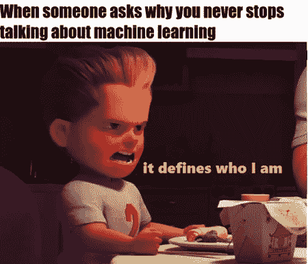
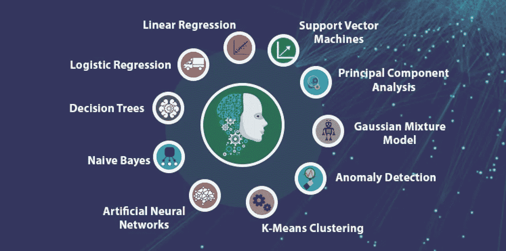
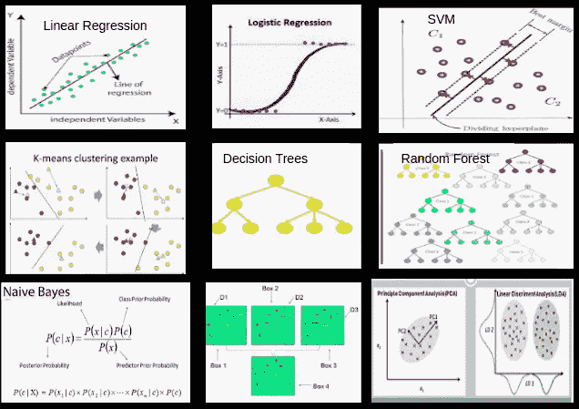
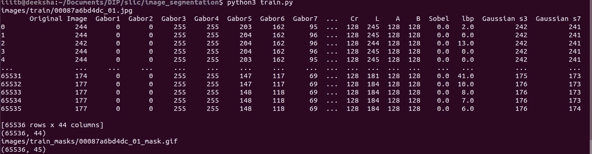
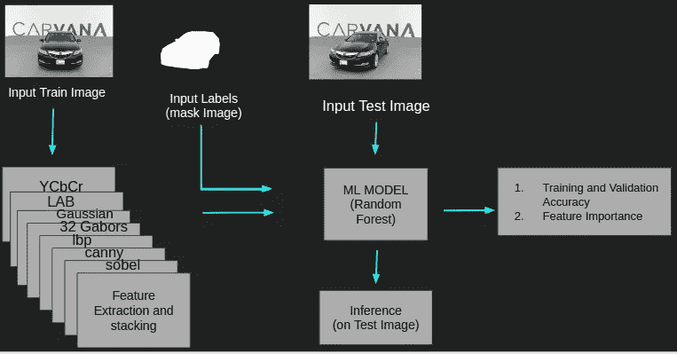

# 使用数字图像处理、机器学习和深度学习方法的图像分割技术。(第二部分)

> 原文：<https://medium.com/analytics-vidhya/image-segmentation-techniques-using-digital-image-processing-machine-learning-and-deep-learning-ccf9e4589e94?source=collection_archive---------6----------------------->

大家好，欢迎回到三部分系列的第二部分。在这一部分，我们将学习如何使用机器学习和数字图像处理来完成图像分割。在之前的[部分](/analytics-vidhya/image-segmentation-techniques-using-digital-image-processing-machine-learning-and-deep-learning-342773fcfef5)中，我们已经看到，仅使用 DIP 技术进行图像分割，会出现同一问题陈述的不同数据集之间泛化能力差的问题。也就是说，整个解决方案是为特定的一个目标用例及数据集定制的。所以现在为了克服这个限制，我们将借助机器学习。那么让我们跳到现在最著名的技术，即机器学习。

图 1

# 目录:

1.  什么是机器学习？
2.  不同机器学习算法简介。
3.  如何利用机器学习进行图像分割？
4.  使用最大似然图像分割方法的优缺点。

## 什么是机器学习？

参考汤姆·米切尔的最著名的书*机器学习，*机器学习(ML)是对通过经验自动改进的计算机算法的研究。它被视为人工智能的一个子集。机器学习算法基于样本数据建立数学模型，称为*【训练数据】*，以便在没有明确编程的情况下进行预测或决策。最大似然算法被广泛用于各种应用，例如电子邮件过滤和计算机视觉，在这些应用中，开发传统算法来执行所需的预测相关任务是困难的或不可行的。

图 2:不同类型的机器学习算法

> 最大似然算法的类型:

1.  **监督 ML 算法:**监督学习算法建立一组数据的数学模型，该模型包含输入和期望的输出。这些数据称为训练数据，由一组训练示例组成。数学模型可以简单到线性方程 y=mx + c，其中 y 是输出值/从属要素或标注，x 是输入值/独立要素，m 和 c 分别是权重和偏差。受监督的机器学习被进一步分成两种类型的问题陈述，即回归和分类。回归处理必须预测数值连续值的问题陈述，而分类处理必须预测类别或分类值的问题陈述。
2.  **无监督 ML 算法:**无监督学习算法获取一组只包含输入的数据，并在数据中找到结构，像数据点的分组或*聚类*。因此，算法从没有像监督算法那样被标记、分类或归类的数据中学习。无监督学习算法识别数据中的共性，并根据每个新数据中是否存在此类共性做出反应。无监督算法也用于维数减少，即当我们想要减少或分组数据集的特征或独立变量时，以便加速最大似然训练过程，并且还去除多重共线性。
3.  **强化学习:**强化学习是机器学习的一个领域，涉及软件代理应该如何在一个环境中采取行动，以最大化某种累积回报的概念。简单来说，RL 是一种学习，在这种学习中，代理学习如何以及应该采取什么行动，在什么状态下将给予他最大的回报。例如，在给定的网格中找到克服给定障碍的最短路径的问题。强化学习算法用于自动驾驶汽车或学习与人类对手进行游戏。要深入了解 RL，你可以点击[链接](/@deekshaml04/solving-dynamic-programming-problem-with-reinforcement-learning-3e96e32e409c)阅读我之前写的一篇博客。

## 不同机器学习算法简介

图 3。一些机器学习算法。

迄今为止，使用不同的数学和统计模型，例如基于贝叶斯、基于树、梯度推进算法、聚类算法等，设计了大约数百种 ml 算法。在一个博客中写下每一个算法是非常困难的，因为这些算法背后有一大堆数学和统计数据，所以我强烈建议你阅读它们，或者让我知道你是否想要一个单独的博客。

> 下面是常用的机器学习算法列表:

1.  **线性回归:**在统计学中，**线性回归是一种对标量响应(或因变量)与一个或多个解释变量(或自变量)之间的关系进行建模的线性**方法。
2.  **逻辑回归:**在统计学中，逻辑模型用于模拟某一类别或事件存在的概率，如通过/失败、赢/输、活着/死了或健康/生病。
3.  **支持向量机:**SVM 模型是将样本表示为空间中的点，对其进行映射，使得不同类别的样本被尽可能宽的间隙分开。然后，新的例子被映射到同一个空间，并根据它们落在缺口的哪一边来预测它们属于哪个类别。
4.  **朴素贝叶斯:**这是一个简单的“概率分类器”家族，基于应用贝叶斯定理和特征之间的强(天真)独立性假设。
5.  **K-Means 聚类:** k-means 聚类是一种旨在将 n 个观测值划分为 K 个簇的方法，其中每个观测值属于具有最近均值的簇，作为该簇的原型。
6.  **决策树:**决策树是一个类似流程图的结构，其中每个内部节点代表对一个属性/特征的“测试”(例如，掷硬币是正面还是反面)，每个分支代表测试的结果，每个叶节点代表一个类别标签。
7.  **随机森林:**随机森林或随机决策森林是一种用于分类、回归和其他任务的集成学习方法，通过在训练时构建大量决策树并输出作为类的模式或个体树的均值预测的类来操作。
8.  **降维算法:**是通过获得一组主变量来减少所考虑的随机变量的数量的过程。方法可以分为特征选择和特征提取。流行的算法有 PCA、LDA 和 t-sne。
9.  **梯度推进算法:**梯度推进是一种用于回归和分类问题的机器学习技术，它以弱预测模型的集合的形式产生预测模型，通常是决策树。它像其他 boosting 方法一样以分阶段的方式构建模型，并通过允许优化任意可微分损失函数来概括它们。流行的算法有 GBM，XGBoost，LightGBM，CatBoost，Adaboost。

图 4。常用的机器学习算法

## 如何利用机器学习进行图像分割？

使用 ML 进行图像分割主要包括以下步骤:

1.  选择一个问题陈述和带标签的训练数据集。
2.  对于每个训练图像，通过应用 sobel 滤波器、canny 边缘检测、gabor 滤波器、cieLAB 颜色特征等来提取特征。基本上，我们可以提取任何和所有图像特征，这有助于我们正确地定义图像特征。
3.  将所有特征堆叠在一个三维数组中，并将其展平以获得一个二维数组。类似地，展平所有带标签/遮罩的图像，并将其附加到图像二维数组的最后一列。
4.  现在，我们已经成功地预处理了我们的图像数据集，我们可以简单地应用机器学习算法进行训练。
5.  为了评估所应用的 ML 模型的性能，我们可以使用诸如 jaccard 得分/IOU 值之类的指标或简单的准确性度量。

图 5。说明步骤 2 和 3 的屏幕截图或已处理图像数据集的视图。这里，列名是应用的不同过滤器名，行是这些过滤器的值。

图 6。显示使用机器学习进行图像分割的步骤的体系结构图。

为了进一步提高准确性或 jaccard 得分，我们可以试验不同的 ML 算法，并且我们还可以对输入图像应用 SLIC 或 k-means 聚类，然后执行特征提取和建模步骤。这将首先将相似的区域聚集在一起，这可以在最后的步骤中增加准确性。为了消除无贡献或贡献较小的特征，我们可以使用诸如 PCA、LDA 之类的降维技术，或者可以使用由随机森林算法生成的特征重要性曲线，并消除一些特征，因此可以使整个管道化的计算成本更低。

## 使用最大似然图像分割方法的优缺点

**优点:**这种使用机器学习的图像分割方法在将预测很好地推广到另一种类似的数据集方面将是卓有成效的，它们没有在该数据集上进行训练，这与本系列第 1 部分中讨论的 DIP 方法的情况不同。这种方法包括权重的前向和后向传播，称为参数学习，有助于识别各种隐藏模式，从而产生有希望的结果。当我们具有较少数量非复杂图像，例如寄生细胞与非寄生细胞的分割时，使用 ML 方法。

**缺点:**提取更多的特征，堆叠它们，然后再次展平它们，以输入到 ML 算法中，这在计算上非常昂贵。虽然我们可以使用维数技术来解决这个问题，但是在训练的参数学习阶段，将会发生大量的参数更新，这又会导致存储器的耗尽。因此，需要一种更有效的技术，在存储效率和预测精度方面都有突出的结果，如卷积神经网络或 CNN，这将在本系列的下一部分和最后一部分讨论。这种方法的第二个缺点是，为了更好的分割结果，需要对问题陈述有非常好的领域知识来选择要提取的特征。

**结论**

在这篇博文中，我们讨论了什么是机器学习及其类型，并简要介绍了不同的机器学习算法。此外，我们还讨论了如何使用最大似然法实现图像分割，以及这种方法的优缺点。在我的下一篇文章中，我将讨论使用深度学习的图像分割技术，它在精度、参数学习的记忆效率方面产生更突出的结果，并且通常比 ML 方法更通用。

# 确认

我要感谢我的 ML 课程导师尼拉姆·辛哈教授和 IIIT 班加罗的 g·西里尼瓦萨·拉加万教授给我讲授 ML 课程并传授了宝贵的知识。

# 代码:

本博客中展示的所有实现算法的代码都在这个[链接](https://github.com/deeksha004/Digital-Image-Processing/blob/master/DIP_Paper_Implementation_slic/image_segmentation_with_ml/train.py)中。