# 使用 fastai 的图像分割

> 原文：<https://medium.com/analytics-vidhya/image-segmentation-using-fastai-ddded25f811e?source=collection_archive---------4----------------------->

在这篇博文中，我们将了解分段以及如何使用 fastai 实现分段。准备好，让我们开始吧。

# 意识形态自由

❓什么是图像分割

图像分割是一个过程，其中图像中的一些像素具有相同的属性，并且它们不同于另一组相似的像素。一般来说，我们对相同的像素进行着色，也就是说，这是一个将数字图像分成许多不同片段的过程。一般来说，我们给相似类型的像素分配一个颜色代码，比如 1 代表树木，2 代表道路，3 代表建筑物，每个数字对应一种颜色。因此，片段以不同的颜色彼此分开。

❔图像分割的目标是什么

最简单的目标是将图像的表示变成更有用或更有意义且易于分析的东西。

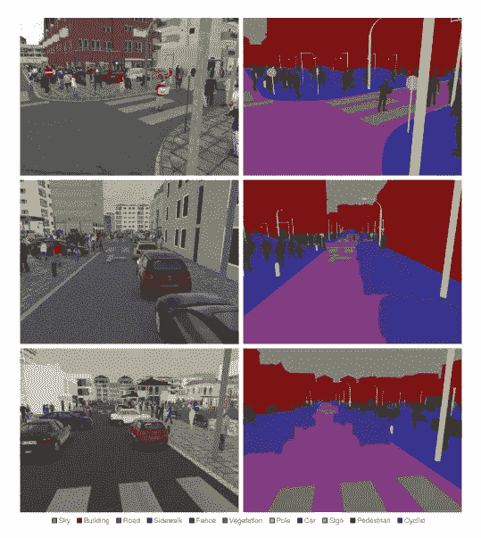

❔如何实现细分

在图像分割中，我们使用图像[分类技术](/analytics-vidhya/image-classification-using-fastai-5ff5b374d414)将像素彼此分类。相似种类的像素被分组并从不同类型的像素组中分离出来。

# 语用掌握

为了实现图像分割，我们需要下载或创建一个数据集，其中有人已经标记了每个像素。那是许多艰苦的工作。
Fastai 为我们提供了一个基于图像分割的学术数据集，称为 [*CamVid*](https://course.fast.ai/datasets#image-localization) 。有超过 700 张图片带有分段的蒙版。

让我们为分割导入 fastai 库。

```
from fastai.vision import *
```

Fastai 在 URLs 变量下提供了大量的学术数据集。点击“网址”后的 tab 键你会发现很多数据集。我们将解开网址。坎维德

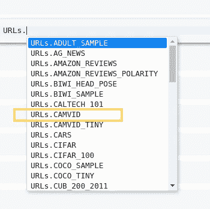

```
path = untar_data(URLs.CAMVID)
path.ls()
```

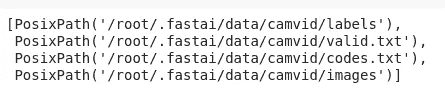

我们需要图像和标签

让我们创建标签和图像文件夹的路径。

```
path_lbl = path/'labels'
path_img = path/'images'
```

让我们检查类型图像文件 im 图像文件夹。

```
imageFileNames = get_image_files(path_img)
imageFileNames[:5]
```

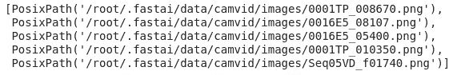

让我们抓住与图像相关的标签。

```
label_names = get_image_files(path_lbl)
label_names[:5]
```

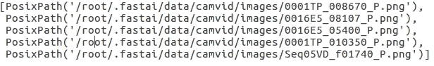

图像的标签名称中有更多的。这就是标签与图片的联系。不同的数据集在图像和它们的标签之间有不同的关系。

因此，我们可以创建一个 lambda 函数来定义这种关系。

```
get_label_image = lambda x: path_lbl/f'{x.stem}_P{x.suffix}'
```

## —源图像

```
img_f = fnames[5]
img = open_image(img_f)
img.show(figsize=(5,5))
```

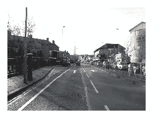

```
image.data
```

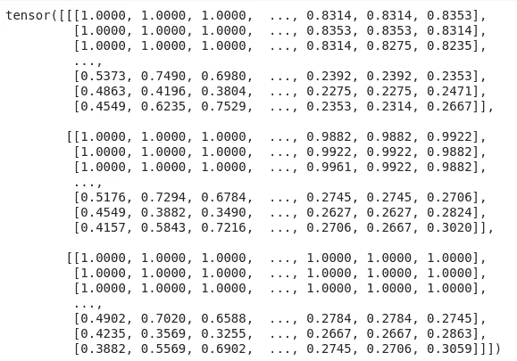

## —标签图像

标准照片是代表每个点的像素值的浮动的集合。但是标签图像不是典型的图像。它们可能由数字组成，但不是像素数字。这些数字是代表图像中各种分类对象的代码。因此，为了查看图像标签，我们将使用 open_mask() & mask()。

```
label_img_path = get_label_image(img_f)
img = open_mask(img_f)
img.mask(figsize=(5,5))
```

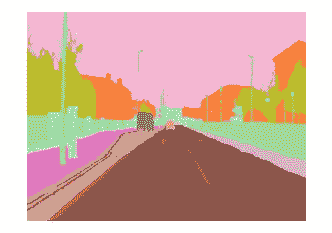

```
img.data
```

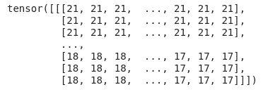

代码数组

现在，我们可以通过加载 codes.txt 文件来检查图像分类中使用的代码。

```
codes = np.loadtxt(path/'codes.txt', dtype=str); codes
```

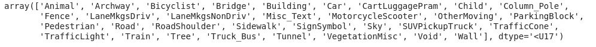

0 代表动物，1 代表拱门，4 代表建筑物，依此类推。

# 创建数据簇

我们正在使用 fastai 数据块 API 创建数据束。

—第一步

```
src = (SegmentationItemList
       .**from_folder**(path_img)
       .**split_by_fname_file**("valid.txt")
       .**label_from_func**(get_label_image,  classes=codes))
```

*   我们使用 SegmentationItemList 是因为我们得到的输入类型。
*   。from_folder() —我们的图像数据出现在指定的路径中。
*   split_by_fname_file() —我们希望使用文件名来分隔验证数据集，因为 valids.txt 文件中提供了验证数据集。我们需要提供文件的有效路径。
*   label_from_func () —我们需要创建标签，我们可以使用刚刚创建的 get_label_image (get Y 文件名函数)来创建标签。我们有一份班级名单。通常对于像行星数据集或宠物数据集这样的东西，我们有一个字符串说这是一只哈巴狗，或者这是多云或其他什么。在这种情况下，你不需要用一个完整的字符串来标记每个像素。它们每个都标有一个数字，然后有一个单独的文件告诉你这些数字的含义。因此，在这里我们可以对数据块 API 说，这是数字含义的列表。

—第 2 步

```
bs=8
src_size = np.array(mask.size)
size = src_size//2data = (src.transform(get_transforms(), size=size, tfm_y=True)
        .databunch(bs=bs)
        .normalize(imagenet_stats))
```

*   这里的批量大小是指一次要处理的图像数量。该值可以像 8、16，.., 64,..这取决于 GPU 配置。
*   tfm_y —该属性确保对输入变量应用什么转换，也对输出变量应用相同的转换。这在处理图像数据集时很有意义。
*   为了快速学习，我们将图像的尺寸缩小到原始图像的一半。//2 整数是否除数，因为它表示行*列，所以我们不想使用浮点数。

```
data.show_batch(2, figsize=(10,7))
```

# 培养

在训练我们的模型时，我们将使用 U-Net 神经网络架构，而不是 CNN。我们将很快了解它。我会直接用这些方程式来训练这个模型。如果你想了解下面写的方程式背后的动力学，我建议你阅读我的关于分类的[另一篇文章](/analytics-vidhya/image-classification-using-fastai-5ff5b374d414)。

—第一步

```
learn = unet_learner(data, models.resnet34, metrics=accuracy)lr_find(learn)
learn.recorder.plot()lr=1e-2
learn.fit_one_cycle(10, slice(lr))learn.save('stage-1')
```

—第 2 步

```
learn.unfreeze()lr_find(learn)
learn.recorder.plot()lrs = slice(1e-5,lr/5)
learn.fit_one_cycle(12, lrs)
```

现在，你已经有了一个完整的训练好的模型，足以进行细分。去玩吧。您可以使用下面的命令来绘制结果。

```
learn.show_results()
```

我们将在另一篇博文中了解 U-Net。在此之前，探索细分背后的动力。

# 变大

早期我们使用一半大小的图像，但这并没有完全解决我们的问题。根据问题，我们必须分割所有的像素。这里我们用迁移学习。我们已经教会我们的模型分割原始图像一半大小的图像。现在我们将指导模型学习全尺寸图像。这样，我们将避免过度拟合。

```
size = src_size
bs=4data = (src.transform(get_transforms(), size=size, tfm_y=True)
        .databunch(bs=bs)
        .normalize(imagenet_stats))
```

现在有两种方法可以做到:

*   —第一种方式

```
learn.data = data— But it may crash your GPU. If it doesn't, then go ahead.
```

*   —第二种方式

```
learn = Learner.create_unet(data, models.resnet34, metrics=metrics)
learn.load('stage-2');
```

在这里，我们创建一个新的学习者，并加载我们之前存储的权重。

```
lr_find(learn)
learn.recorder.plot()
lr=1e-3
learn.fit_one_cycle(10, slice(lr))learn.save('stage-1-big')
```

```
learn.unfreeze()
lrs = slice(1e-6,lr)
learn.fit_one_cycle(10, lrs, wd=1e-3)
learn.save('stage-2-big')
learn.show_results()
```

用于查看你的预测与实际情况相比如何，它们看起来相当不错。

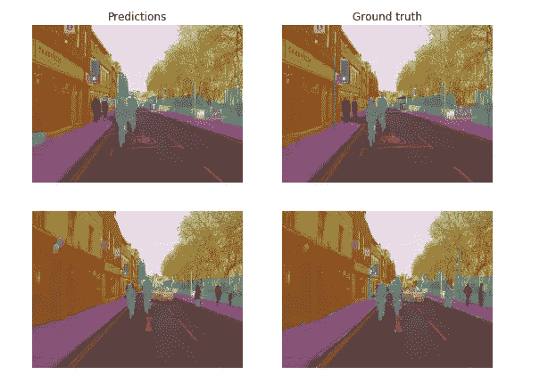

那是分段学习用的。您可能需要高 GPU 配置来实际执行上述代码。