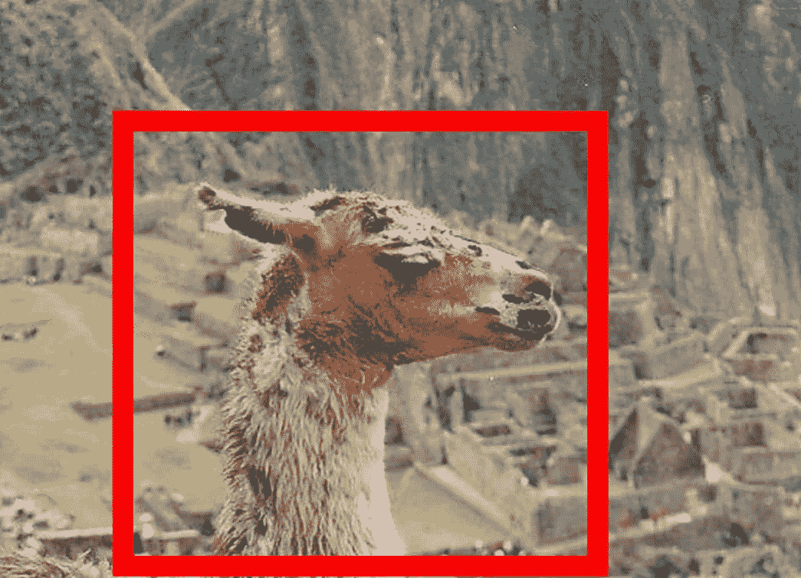
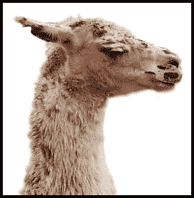
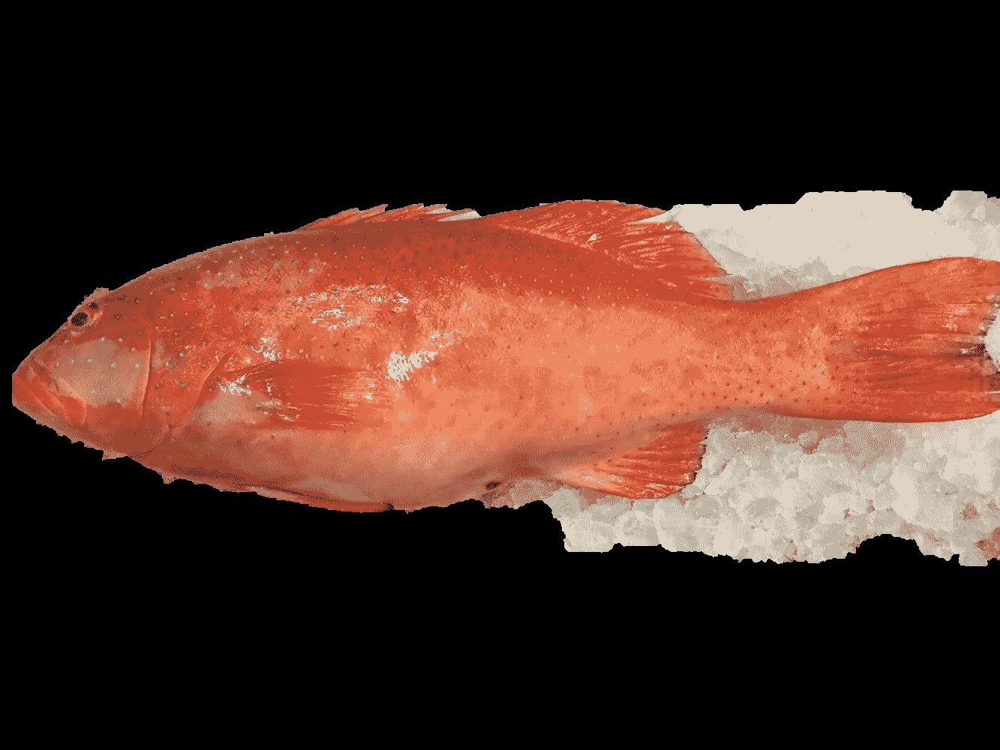

# 用 YOLOv3 和 GrabCut 进行图像分割

> 原文：<https://medium.com/analytics-vidhya/image-segmentation-with-yolov3-and-grabcut-59a0abaafa3e?source=collection_archive---------5----------------------->

## YOLOv3 和 GrabCut 的组合

> 被困在付费墙后面？点击这个[好友链接](/analytics-vidhya/image-segmentation-with-yolov3-and-grabcut-59a0abaafa3e?source=friends_link&sk=b05259efad6d0254e9393b38b3466294)！

# 动机

《YOLO》是一部以高 FPS 进行物体检测的惊艳之作，作者在过去几年里做了很多改动，分别是 YOLOv2 和 YOLOv3。

事实上，GrabCut[1]是一个有趣的算法，它使用用户提供的矩形进行图像分割。如论文所示，GrabCut 给了我们一个诱人的图像分割结果。

原象

GrabCut 应用于下图，红色加粗矩形。这两幅图像取自[1]。

总而言之，对象检测使用边界框来指示用户对象的位置，而 GrabCut 应用矩形或边界框来进行图像分割。当我在写毕业论文的时候，我突然想到，是否有可能将这两个看似不相关的东西结合在一起，这样我们就可以创建一个速度快、效果好的图像分割系统。因此，我做了这个兼职项目，并把结果和想法写在这个帖子里。此外，我还展示了如何在自定义数据集上应用这样的图像分割系统。

# 什么是 GrabCut

GrabCut 是一种交互式前景提取，它通过提供一个矩形来分割所需的对象。你在前景区域周围画一个矩形(确保你的前景完全在矩形内！).接下来，该算法尝试通过应用特定迭代来分割对象。更多信息可以阅读官方 OpenCV 教程中的[这篇帖子](https://docs.opencv.org/master/d8/d83/tutorial_py_grabcut.html)。

# 准备

1.  克隆这个回购。
2.  从 [my Google Drive](https://drive.google.com/file/d/1L6JgzbFhC7Bb_5w_V-stAkPSgMplvsmq/view?usp=sharing) 下载预训练的权重，并将其放入`yolo-fish`目录。
3.  创建`conda`虚拟环境并安装依赖项:
    T2
4.  激活虚拟环境。
5.  Run a demonstration with this command: `$ python main.py --image ./images/七星斑.jpg --yolo yolo-fish`

你会在`fish-yolo-grabcut`根目录下找到一个名为`grabcut0.jpg`的图片，应该是这样的:

Result of 七星斑.jpg

# 说明

你会想知道这种魔法是如何发生的，所以我将在这一节解释我是如何让这种魔法发生的。

对于 YOLOv3 对象检测部分，你可以在这里看到，因为它相当罗嗦:)

对于 GrabCut 部分，下面是创造这种奇迹的代码:

1.  `cv.grabCut(img, mask, rect, bgdModel, fgdModel, iterCount[, mode])`【2】这个函数用一个矩形对你的图像应用 GrabCut，我们接下来要近距离看一些参数:
    (1) `img`:输入 8 位 3 通道图像，通常是彩色图像。
    (2) `mask`:输入输出 8 位单通道掩码。在这里，我将`img`
    (3) `rect`的宽度和高度设置为相同:ROI(感兴趣区域)包含一个分割的对象。矩形外的像素或 ROI 被认为是“确定的背景”。
    (4) `bgdModel`:背景模型临时数组。
    (5) `fgdModel`:前景模型的临时数组。
    (6) `iterCount`:在函数返回结果之前，算法必须进行的迭代次数。这里我设置为 5。
    (7) `mode`:运行模式。我设置为`cv.GC_INIT_WITH_RECT`是因为我将使用 YOLOv3 生成的边界框来应用 GrabCut。
    综上所述，你现在可以体会到`GrabCut.py`中所写代码的含义了:

请注意，我使用输入图像的 deepcopy，因为可能有不止一个检测，我不想覆盖输入图像(将在以下要点中解释)。

2.应用 GrabCut 后的后处理，该函数将返回修改后的`mask`、`bgdModel`和`fgdModel`。我们可以通过这些代码得到分割结果:

你可以看到我在这里修改了`image`(第 23 行)；因此，我在上面的点上做了一个深拷贝。

此外，我将`image`添加到列表`imgs`中，因为可能有不止一个检测。

# 结论和想法

在这篇文章中，我举例说明了如何结合 YOLOv3 和 GrabCut 来创建一个图像分割系统，并在我的自定义数据集上展示了结果。此外，我还解释了如何使用 OpenCV GrabCut 函数，以及在应用 GrabCut 时需要注意的一些问题。

由于这些想法，我发现结果不如 GrabCut 论文中显示的结果有吸引力，但我认为我可以通过重新训练 YOLOv3 来改善这一点，以便它可以进行更精确的检测来改善 GrabCut 的结果。

# 参考

[1][https://cvg . ethz . ch/teaching/CVL/2012/grab cut-siggraph 04 . pdf](https://cvg.ethz.ch/teaching/cvl/2012/grabcut-siggraph04.pdf)

[2][https://docs . opencv . org/master/D7/d1b/group _ _ imgproc _ _ misc . html # ga 909 C1 DDA 50 efcbeaa 3a ce 126 be 862 b 37 f](https://docs.opencv.org/master/d7/d1b/group__imgproc__misc.html#ga909c1dda50efcbeaa3ce126be862b37f)

> *如果你有什么想法和问题要分享，请联系我*[***clh 960524【at】Gmail . com***](http://clh960524@gmail.com/)*。还有，其他作品可以查看我的* [*GitHub 库*](https://github.com/Cuda-Chen) *。如果你和我一样热衷于机器学习、图像处理和并行计算，可以随时在 LinkedIn 上* [*添加我*](https://www.linkedin.com/in/lu-hsuan-chen-78071b171/) *。*