# 图像相似性模型

> 原文：<https://medium.com/analytics-vidhya/image-similarity-model-6b89a22e2f1a?source=collection_archive---------2----------------------->

> 使用聚类和卷积自动编码器从数据集中查找给定查询图像的前 N 个相似图像！！！

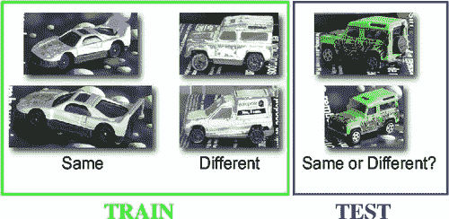

[http://lear . inrialpes . fr/people/Nowak/similarity/same or different . png](http://lear.inrialpes.fr/people/nowak/similarity/sameordifferent.png)

你能看出下面给出的两幅图像之间的区别吗？

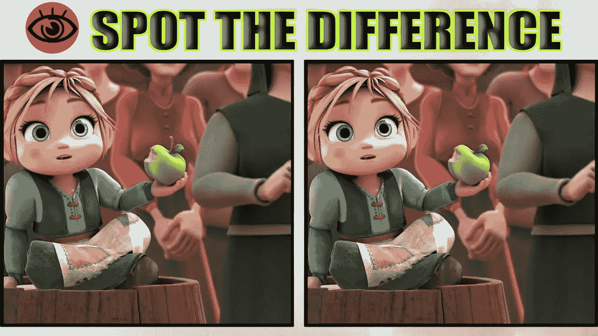

https://i.ytimg.com/vi/3Bm5gINwIFc/maxresdefault.jpg

## **业务问题:**

你小时候玩过这个游戏吗？他们会给你两张图片，让我们找出它们之间的区别。我们的问题陈述有点类似于此，我们需要从给定的数据集中找到查询图像上给出的前 N 个相似图像。类似这样的…

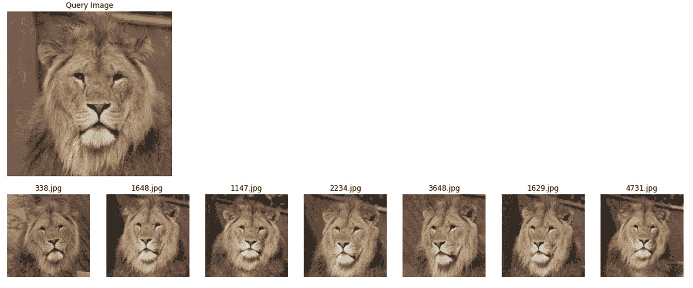

当 N = 7 时(N 可以是任何数字)

# **逆向图像搜索/图像相似度模型:**

**什么是图片搜索？**

相似图像搜索是这样一种搜索，其中我们上传或给出来自数据集的图像，它将输出来自该数据集的前 N 个相似图像。

[https://media.istockphoto.com](https://media.istockphoto.com/vectors/business-man-is-confused-thinking-businessman-surrounded-by-question-vector-id891433956?k=6&m=891433956&s=612x612&w=0&h=Ju6es3fMQ8sjd9z2RGcVO-VOI0pjp4TrkNg68JGKT4I=)

**它在现实世界中有什么帮助**

*   找到相似的图像。
*   寻找抄袭的照片。
*   创造反向链接机会。
*   去发现人、地方和产品。
*   寻找更多版本。
*   检测假账户。

## **目录:**

**第一章:数据提取/导入数据**

**第 2 章:卷积自动编码器**

第三章:K-均值聚类

**第 4 章:通过 K 近邻的相似性模型**

**第 5 章:结论**

> **第一章:数据提取:**

你可以在这里 **下载数据集 [**。**](https://drive.google.com/file/d/1VT-8w1rTT2GCE5IE5zFJPMzv7bqca-Ri/view?usp=sharing)**

运筹学

点击下面的博客 [**这里**](https://www.geeksforgeeks.org/how-to-download-google-images-using-python/) 从谷歌图片创建自己的数据集。

在这个案例研究中，我使用

*   Google colaboratory 以便访问 **GPU 和高 RAM。**
*   张量流。Keras (2.0 版本)
*   Python 3

我用 Curlwget 来更快地下载数据。要了解更多信息，请点击以下链接:

[https://www.thegeekstuff.com/2012/07/wget-curl/](http://For this case study I am using google colaboratory to get an access of GPU and high RAM. I am using Curlwget for the faster download of the data. To know more about this follow the given link: https://www.thegeekstuff.com/2012/07/wget-curl/)

## **拆分数据:**

分割数据主要对机器学习的**超参数调整**部分有用。由于 ML/DL 的每个任务在模型训练中起着关键作用，并且为了使我们的模型在测试数据上相当好，调整模型超参数是重要的。

为了完成这项任务，我们需要从训练数据中提取一小部分数据，例如基于训练数据大小的 1-2 %,这些数据可以称为交叉验证数据或简单的验证数据。

将数据分割成 85:15 的比例

获取所有图像的文件路径，并将该列表分为 train 和 test。这样将来就不需要再拆分数据，我们可以通过将它们存储在驱动器中来直接访问这些集合。将结果存储到。csv 格式，这样就不会有数据泄露的问题。

## 读取图像(图像到数组的转换) :

通过从训练和测试数据集读取图像来执行以下一系列动作:

1.  使用打开的 cv2 模块读取图像。
2.  将图像从 BGR(蓝色、绿色、红色)转换为 RGB(红色、绿色、蓝色)
3.  将图像形状从(512，512，3)调整为(224，224，3)。
4.  标准化数据。

图像到数组转换

我们有大约 5000 张 512x512 分辨率的图像，像素大约为 1，310，720，000。将它加载到 RAM 中并与其他图像一起处理每个图像将会在计算上非常昂贵，并且可能会使系统(GPU 或 TPU)崩溃，或者运行一个模型在计算上非常昂贵。

因此，作为一种解决方案，我们可以集成卷积神经网络和自动编码器的思想，从基于图像的数据中减少信息。这将被视为应用于集群的预处理步骤。

> **第 2 章:卷积自动编码器:**

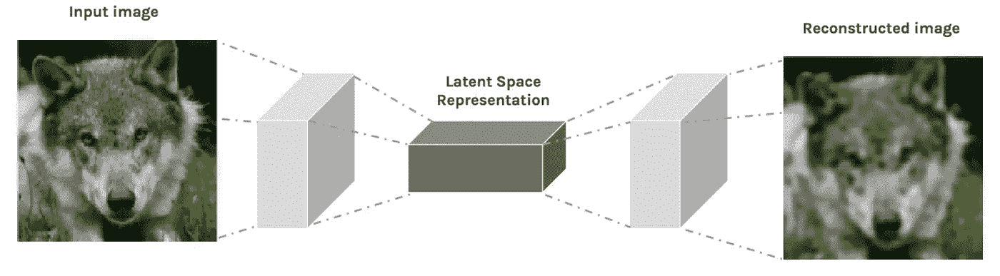

卷积自动编码器

卷积自动编码器(CAEs)是一种卷积神经网络。它们之间的主要区别是 CAEs 是无监督学习模型，其中前者被端到端地训练以学习过滤器和组合特征，目的是对它们的输入进行分类。

它试图保持输入图像数据的空间信息不变，并温和地提取信息。

*   **编码器**:通过一系列卷积运算将输入图像转换成潜在空间表示。(向左至质心)
*   **解码器**:它试图通过一系列的上采样/转置卷积运算，从潜在空间恢复原始图像。(质心向右)也称为反卷积。

你可以在这里阅读更多关于卷积自动编码器**。**

**卷积自动编码器模型架构**

****模型参数:****

**用最佳参数训练模型**

****车型性能:****

**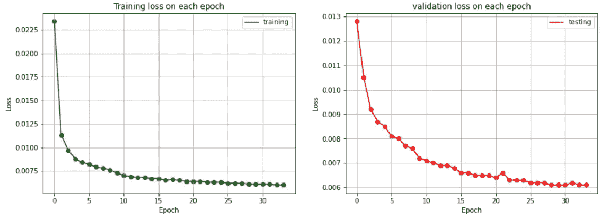**

**绘制每个时期的损失**

**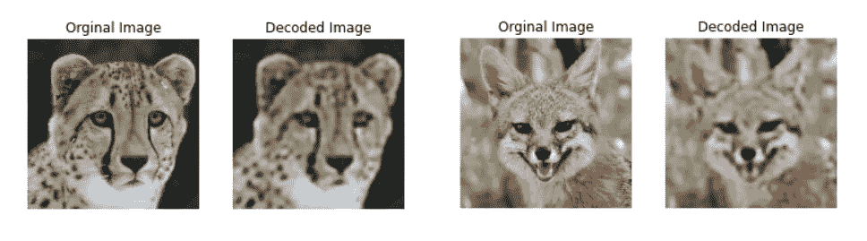**

**模型检验**

*   **修复看起来很令人满意。左侧的图像是原始图像，而右侧的图像是从压缩表示中恢复的。**
*   **由于压缩表示比原始图像占用的空间少 8 倍，因此处理解码图像比处理原始图像更加灵活和有效。**

## ****特征提取:****

**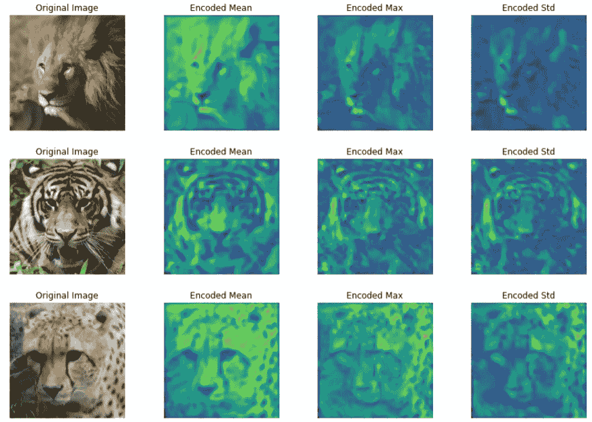**

**从中间层(第 9 层)提取特征**

1.  **狮子鬃毛的高度活化。**
2.  **老虎的鼻子和线条。**
3.  **猎豹鼻子上的点和线。**
4.  **狐狸的鼻子。**

**暗像素(黄色)表示高活性，这有助于与其他图像区分开来。这种激活有助于标签分类。**

> ****第三章:K 均值聚类:****

**在获得所有图像的压缩数据表示之后，我们由此可以应用 K 均值聚类算法来将图像分组到不同的簇中。这有助于我们标记未标记的数据。**

**但是为了可视化聚类，我们需要通过 T-SNE 进行降维。**

**k-均值聚类和 T-SNE 可视化**

**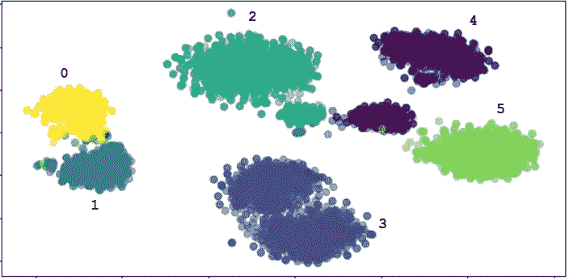**

**最佳 K 值= 6 的聚类数据**

1.  **猎豹 2。雄狮 3。雪狗 4。老虎队 5。豹子 6。狐狸**

> ****第 4 章:通过 K 近邻的相似性模型****

**对数据进行聚类后，我们得到了标记数据。现在，我们可以执行 K-NN 算法来查找相似的图像(最近的邻居)。**

**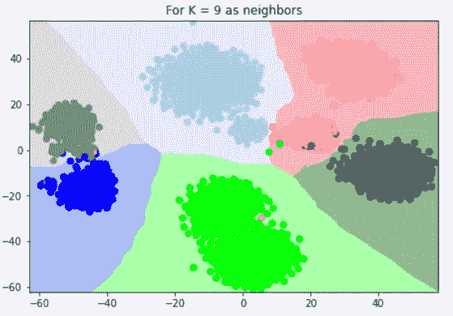**

**最优 K 值= 9 的 KNN 决策边界**

## **做出预测:**

**模型预测**

****模型测试:****

**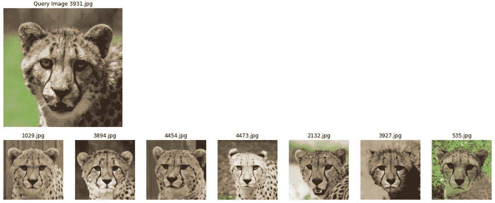****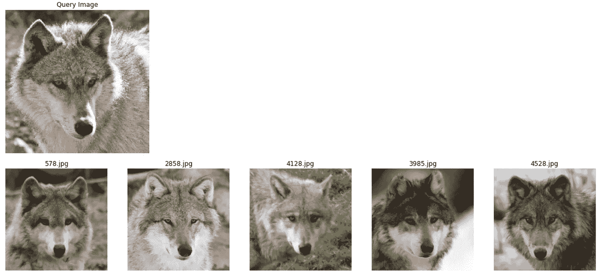**

> ****第 5 章:结论****

**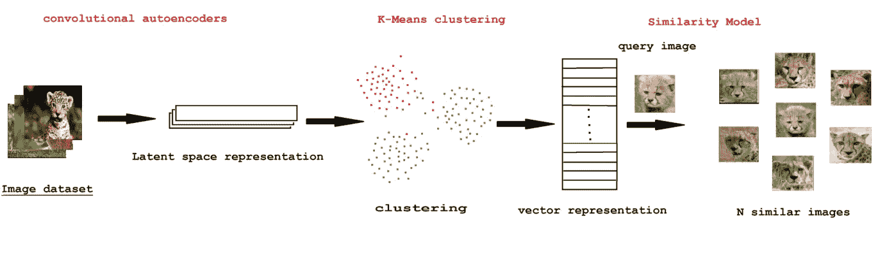**

**行动（或活动、袭击）计划**

## ****预测算法:****

**步骤 1:获取文件名或 URL，并将图像转换成图像数组。**

**步骤 2:使用该阵列从已训练的自动编码器模型的中间层中找到特征。**

**步骤 3:使用 K-Means 聚类从提取的特征中找到该图像所属的标签。**

**步骤 4:使用 KNN 模型，使用预测图像找到 N 个相似的图像，最后绘制结果**

****参考文献:****

*   **[https://arxiv.org/pdf/2011.04728.pdf](https://arxiv.org/pdf/2011.04728.pdf)**
*   **[https://towards data science . com/image-similarity-using-triplet-loss-3744 c0f 67973](https://towardsdatascience.com/image-similarity-using-triplet-loss-3744c0f67973)**
*   **[https://medium . com/better-programming/a-guide-on-encoder-decoder-model-and-the-attention-mechanism-401 c 836 e 2 CDB](/better-programming/a-guide-on-the-encoder-decoder-model-and-the-attention-mechanism-401c836e2cdb)**
*   **[https://www . analyticsvidhya . com/blog/2020/12/a-detailed-introduction-to-k-means-clustering-in-python/](https://www.analyticsvidhya.com/blog/2020/12/a-detailed-introduction-to-k-means-clustering-in-python/)**
*   **[https://www . tutorialspoint . com/machine _ learning _ with _ python/machine _ learning _ with _ python _ KNN _ algorithm _ finding _ nearest _ neighbors . htm](https://www.tutorialspoint.com/machine_learning_with_python/machine_learning_with_python_knn_algorithm_finding_nearest_neighbors.htm)**

**您可以查看。ipynb 在我的 [**Github 资源库**](https://github.com/ChaitanyaNarva/image-similarity-model) **中获取这个案例研究的完整代码片段。****

**[**关注我**](https://chaitanyanarava.medium.com/) 了解更多关于数据科学中不同真实案例研究的文章和实施！也可以通过 [**LinkedIn**](http://www.linkedin.com/in/sai-chaitanya-narava-20b3571a0) 和**[**Github**](https://github.com/ChaitanyaNarva/ChaitanyaNarva)与我联系****

****我希望你从这件事中学到了一些东西。这方面的学习没有止境，所以快乐学习吧！！bye 的签约:)****