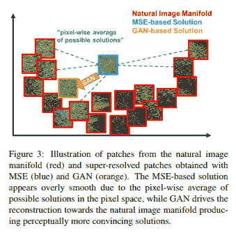

# 使用 GANs 的图像超分辨率

> 原文：<https://medium.com/analytics-vidhya/image-super-resolution-using-gans-a10254f58892?source=collection_archive---------13----------------------->

# ***简介***

**什么是超分辨率？**

图像超分辨率是一种从观察到的低分辨率图像重建高分辨率图像的技术。到目前为止，大多数图像超分辨率方法使用 MSE(均方误差)作为损失函数，MSE 作为损失函数的问题是图像的高纹理细节被平均以创建平滑的重建。

[来源](https://arxiv.org/pdf/1609.04802.pdf)