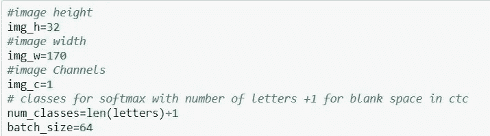
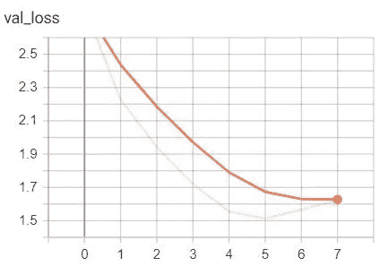

# 图像文本识别

> 原文：<https://medium.com/analytics-vidhya/image-text-recognition-738a368368f5?source=collection_archive---------2----------------------->

## 使用深度学习并在云中部署模型


在计算机视觉领域，从图像中读取或识别文本是一项具有挑战性的任务。这主要是因为图像中的文本表现出多样性和可变性。图像的背景实际上是不可预测的，因为一些图像可能具有深色背景，一些图像可能具有浅色背景，并且甚至存在图像字体和背景具有相同颜色并且具有将文本与背景区分开的小轮廓的情况。图像中可能会出现不同字体、方向和不同长度的文本模式。图像中的文字也可能模糊或扭曲

*那么，有没有一种方法可以克服这些挑战，并提出一种解决方案，能够在各种图像中以良好的准确度识别文本？*

# 眼前的问题

给定一个输入图像，我们需要以大于 80%的合理准确度(与实际文本标签精确匹配)预测图像中的文本，并且应该具有良好的字母匹配准确度。

你说这很好，有什么限制吗？是的，有。

*   这里有一个**低延迟**要求的意思，给定一张图片，模型应该能够快速预测文本
*   从带有可变长度标签/单词的图像中预测文本

# 性能指标

那么现在我们如何评估我们模型的性能呢？想一想。

明白了吗？是的，**精度**是评价模型的主要指标之一。此外，该模型还可以根据其他指标进行评估，如下所示:

*   字母准确性
*   CTC 损失

这个 CTC 是什么，什么意思？我过一会儿会回到这个话题，在那之前请继续阅读。

# 资料组

这道题用的数据集是 [**MJ 合成词数据集**](https://www.robots.ox.ac.uk/~vgg/data/text/) **。**数据集由 9 百万幅灰度图像组成，覆盖 9 万个英文单词。它有三个文本文件 annotation_train.txt、annotation_val.txt 和 annotation_test.txt，其中包含图像列表及其文件名中相应的文本标签。下面是 train_annotation 文本文件中的值的小图片:


**图 1** :图像是从 [**MJ 合成词数据集**](https://www.robots.ox.ac.uk/~vgg/data/text/) 下载的一段数据

为了解决这个问题，我从 Train 中抽取了 200000 幅图像，从 Validation 中抽取了 12000 幅图像，从标签长度在 4 到 12 之间的测试注释文件中抽取了 15000 幅图像，并将它们存储在三个独立的文件夹中(Train_data、Val_Data、Test_Data)。

# **资料准备**

在将图像存储在上述文件夹中后，我从图像文件中提取图像中包含的文本标签，并将字母转换为所有的大写字母。然后，我创建了一个 csv 文件，其中包含图像文件名及其在图像中对应的文本标签。让我们看看它是什么样子的


我已经为 Val_data，Test_Data 文件夹中的图像创建了类似的文件。


我想分析这些文件夹中图像的宽度和高度，以便在不丢失任何数据的情况下相应地调整它们的大小，并根据调整后的图像训练我的模型。为此，我使用 Open CV 处理了这些文件夹中的每个图像，提取了每个图像的宽度和高度，并将其与图像名称一起存储在一个 csv 文件中。我创建的文件如下所示


我已经在本节中简要介绍了我如何准备数据以开始解决问题，有关我如何处理和准备数据的更详细代码，请随时查看我在 GitHub 库 **中的 [**代码。**](https://github.com/AbhishekKarthik/ImageTextRecognition)**

# 数据分析

**图像高度和宽度分析**

请注意，我们将仅分析列车图像的图像大小(图像的高度和宽度)数据，并仅根据我们对列车图像大小的分析结果调整图像大小，以避免任何形式的数据泄漏。现在我们已经准备好了图像大小数据，让我们探索看看我们会发现什么！


从 CDF 图中，我们可以看到大多数图像的高度在 30 到 32 之间。


看一下图像宽度的 CDF 图，我们会发现几乎 95%的图像宽度为 200 或更小。

```
print("Train Images Height 90 percentile :",np.percentile(train_img_size['Height'].values,90))
print("Train Images Height 99 percentile :",np.percentile(train_img_size['Height'].values,99))
print("Train Images Width 90 percentile :",np.percentile(train_img_size['Width'].values,90))
print("Train Images Width 99 percentile :",np.percentile(train_img_size['Width'].values,99))
```


图像高度的第 90 和第 99 百分位值没有太大差别。图像宽度的第 90 和第 99 百分位值有相当大的差异。让我们仔细看看从第 90%到第 99%的图像宽度值。


从上面我们可以看到，第 90 和第 99 百分位之间的图像宽度存在差异。我们可以说，大多数图像的宽度为 170，这是第 91 百分位值。很少有图像的宽度超过 200。

**来自图像宽度和高度分析的见解**

1.  大多数图片的高度在 31 到 32 之间。
2.  几乎 90%的图像宽度为 170。
3.  基于这些见解，我们可以将图像调整到 32(高)X 170(宽)的尺寸。

**文本标签分析**

给定包含文本的输入图像，文本标签是我们的模型预测的输出。标签的长度在这个问题中起着重要的作用，我们有长度在 4 到 12 之间的标签。这为探索列车数据中标签的长度提供了一个有趣的案例。


标签长度的 PDF 图很好地展示了标签长度在数据中的分布情况。正如我们所见，大多数标签的长度为 7、8、9、10。长度为 4，5 的标签较少。


从 CDF 图中我们可以看到，长度为 4，5 的标签所占比例非常小，接近 10%。几乎 80%的数据的标签长度为 10 或更少。

```
def digit_count(labels,size):
    """
    Takes the list of labels and counts the number of labels with and without digits
    and prints its percentage
    """
    present=0
    absent=0
    for i in labels:
        pres=hasDigits(i)
        if pres==True:
            present+=1
        else:
            absent+=1
    present_percent=(present/size)*100
    absent_percent=(absent/size)*100
    print('Labels with Digits: ',present_percent,' %')
    print('Labels without Digits: ',absent_percent,' %')train_labels=[str(x) for x in train_data['Labels'].values]
digit_count(train_labels,len(train_labels))
```


在检查我们的文本标签中是否存在数字时，观察到训练数据中几乎所有的标签都不存在数字，并且很少有标签存在数字，但是它们的数量较少。

# **进场概述**


图片来源:[CRNN 研究论文 ](https://arxiv.org/pdf/1507.05717.pdf)

用于该问题的模型被称为卷积递归神经网络(CRNN ),因为它结合了深度卷积神经网络(DCNN)和 RNN，后者构建了用于序列识别的端到端系统。该模型由三个部分组成，包括卷积层、递归层和转录层。卷积层自动从每个输入图像中提取特征序列。在卷积网络之上，建立递归网络，用于对由卷积层输出的特征序列的每一帧进行预测。CRNN 顶部的转录层用于将递归层的每帧预测翻译成标签序列。虽然 CRNN 由不同类型的网络结构(DCNN 和 RNN)组成，但它可以用一个损失函数进行联合训练。

**使用 CNN 提取图像特征**

在 CRNN 模型中，卷积层由卷积层和最大池层构成。这种组件用于从输入图像中提取连续特征表示。

**使用 RNN 的序列标记**

深度双向递归神经网络建立在卷积层的顶部，作为递归层。循环层预测特征序列 x =x1 中每个帧 xt 的标签分布 yt；… ;xT。我们在这里使用双向 RNN，因为观察到在基于图像的序列中，来自两个方向的上下文都是有用的并且彼此互补。

**转录**

转录是将 RNN 做出的每帧预测转换成标签序列的过程。我们将在转录过程中使用连接主义时态分类(CTC)来解码 RNN 的输出，并将其转换为文本标签。现在让我们讨论一下连接主义者的时间分类。

**连接主义时间分类(CTC)**

序列标注问题由输入序列*X*=【*X*1、 *x* 2、..、 *xT* 及其对应的输出序列 *Y* =[ *y* 1、 *y* 2、…、 *yU* 。在这个问题中，我们需要找到从 X 到 Y 的精确映射，但这有几个问题，即 *X* 和 *Y* 的长度可能不同，我们没有 X 和 Y 的精确对齐(元素的对应)。CTC 算法克服了这些挑战。对于给定的 X，它给出了所有可能的 Y 的输出分布。我们可以使用这种分布来*推断*一个可能的产量，或者评估一个给定产量的*概率*。在这一节中，我试图简单地解释 CTC，你可以在这篇写得很好的文章[](https://towardsdatascience.com/intuitively-understanding-connectionist-temporal-classification-3797e43a86c)****和这篇博客 [**中阅读更多关于 CTC 的内容，这有助于我理解连接主义的时间分类及其细节。**](https://distill.pub/2017/ctc/)****

# ******建模******

****我在相同的数据上训练了两个 CRNN 模型，看看这两个模型中哪一个给出的结果更好。****

*   ******模型 1:** 使用 CNN，使用 Adam 优化器训练 RNN 的双向 LSTM。****
*   ******模型 2:** 使用 CNN，在 RAdam optimizer 上训练的 RNN 双向 GRU。修正亚当(RAdam)是最新的人工智能优化器。你可以在这篇解释优化器的[中型文章](/@lessw/new-state-of-the-art-ai-optimizer-rectified-adam-radam-5d854730807b)中读到关于 RAdam 的内容。****

********

****这些是我认为出现在我的文本标签中的字母，包括数字形式 0-9 以及常规字母。****

********

****模型参数****

******型号 1******

****模型架构有两个阶段:****

1.  ******训练阶段:**获取输入图像、文本标签(编码为整数)、输入长度(时间步长)、标签长度并输出 CTC 损失****
2.  ******预测阶段:**获取输入图像并输出尺寸为 42×37 的矩阵，其中 42 是 RNN 的时间步数，37 是字母的长度+ 1 个 ctc 空白字符****

****在 200000 幅图像上训练模型 1，并在 12000 幅图像上验证 20 个时期，并提前停止。****

****************

****该模型在这之后又训练了两个时期，并且 val_loss 没有改善，所以它在时期 14 停止。我在早期停止回调中使用了恢复最佳权重，因此它恢复了纪元 12 的权重。我保存了这个最佳模型的重量。****

****可视化模型的训练和验证损失。让我们看看张量板图****

********

****模型 1 列车损失图****

********

****模型 1 验证损失图****

******模型 2******

****模型 2 体系结构具有类似于模型 1 的训练和预测阶段。****

****在与模型 1 相同的一组图像上训练模型 2 20 个时期，并提前停止。****

********

****该模型训练了 8 个时期，并在 val_loss 没有改善时停止进一步训练。我恢复了最好的模型重量并保存了它们。****

****让我们看看模型 2 的张量板图****

********

****模型 2 列车损失图****

********

****模型 2 验证损失图****

# ****结果****

****我使用保存的模型预测了 15000 张测试图像的文本标签，并计算了准确度和字母准确度。我有一个柱状图，显示了预测文本标签和实际文本标签之间有 0，1，2，3，4 个字符不匹配的测试图像的百分比。****

******模型 1 结果******

********

****测试数据图像的模型 1 结果****

********

******模型 2 结果******

********

****测试数据图像的模型 2 结果****

********

# ****摘要****

****让我们看一下两个模型在测试数据图像上的结果总结。****

********

****在这两个模型中，模型 1 的结果更好。****

# ******结论******

1.  ****在来自 Synth Text Images 的 200000 幅图像上训练的模型 1 在看不见的 15000 幅可变长度标签的测试图像上表现得相当好，准确率约为 88%,字母准确率约为 94%。****
2.  ****同样在 200000 幅图像上训练的模型 2 在 15000 幅可变长度标签的测试图像上具有大约 82%的准确度和大约 93%的字母准确度。****

# ****图像的模型预测****

****我采用了模型 1，它在测试数据图像上具有 87%的准确性，并用于在几幅图像上进行预测，以显示该模型如何在给定输入图像的情况下预测输出。****

****我加载了模型 1，获取了我们预测输出的图像的路径，并将其传递给上面的函数以查看输出。所以让我们看看结果如何。****

********

****文本标签预测:计时表****

****你可以看到这个模型能够区分看起来几乎相似的字母 r，n。****

********

****文本标签的预测:男生****

# ****进一步的改进****

1.  ****我们可以用更多的图像来训练模型，比如 300000 或 400000 张图像，看看结果是否有所改善。****
2.  ****用 RAdam Optimizer 代替 Adam Optimizer 来试验模型 1。****
3.  ****我使用的模型是在单个单词图像上训练的，它可以被进一步训练以识别特殊的字符和句子。****

# ******车型部署******

****我创建了一个 flask 模型应用程序，它获取输入图像并预测输出，你可以在 github 中我的[Image _ Text _ Recognition _ Ap](https://github.com/AbhishekKarthik/Image_Text_Recognition_App)p 库中找到该应用程序的代码。我已经在 heroku 部署了我的应用程序，你可以在这里 访问它 [**。请注意，我已经训练这个模型来预测单个单词的文本图像。🙂**](http://text-image-recognition.herokuapp.com/)****

# ****一个小演示****

****我想让您看一下我部署的模型是如何工作的会很好****

********

****图像文本识别演示****

****这是我第一篇关于媒体深度学习问题的博客。我希望我能够解释并帮助你理解我解决手头问题的方法。请随意查看我的 [**GitHub 资源库**](https://github.com/AbhishekKarthik/ImageTextRecognition) 中的完整解决方案，并通过 [**LinkedIn**](http://www.linkedin.com/in/abhishek-anand9418) 联系我。****

******感谢您的阅读！！😃******

# ****参考****

1.  ****[https://arxiv.org/abs/1507.05717](https://arxiv.org/abs/1507.05717)****
2.  ****[https://www.appliedaicourse.com/](https://www.appliedaicourse.com/)****
3.  ****[https://www.robots.ox.ac.uk/~vgg/data/text/](https://www.robots.ox.ac.uk/~vgg/data/text/)****
4.  ****[https://keras.io/examples/image_ocr/](https://keras.io/examples/image_ocr/)****
5.  ****[https://towards data science . com/直观-理解-连接主义-时态-分类-3797e43a86c](https://towardsdatascience.com/intuitively-understanding-connectionist-temporal-classification-3797e43a86c)****
6.  ****[https://distill.pub/2017/ctc/](https://distill.pub/2017/ctc/)****
7.  ****[https://cvit . iiit . AC . in/projects/scene text understanding/iiit5k . html](https://cvit.iiit.ac.in/projects/SceneTextUnderstanding/IIIT5K.html)****