# 将任何图像转换成铅笔素描——只需 2 行代码！

> 原文：<https://medium.com/analytics-vidhya/image-to-pencil-sketch-in-just-2-lines-of-code-292de57be483?source=collection_archive---------3----------------------->

使用 Python 中的 sketchify 软件包创建美丽的现实主义铅笔草图。

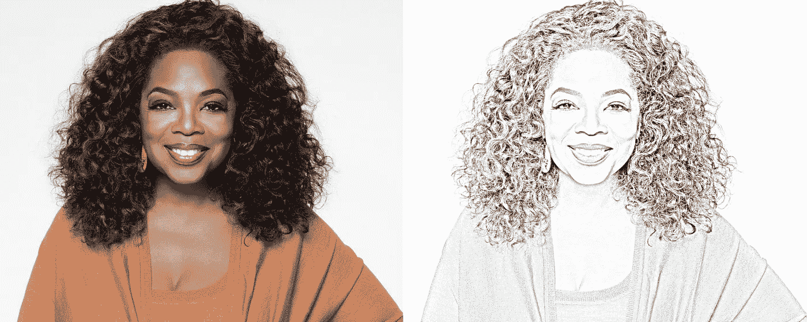

手工创作一幅逼真的铅笔素描需要数小时的痛苦工作:从转换纹理、完善阴影到最微小的细节。现在，您可以用 Python 创建逼真的铅笔草图——只需两行代码！

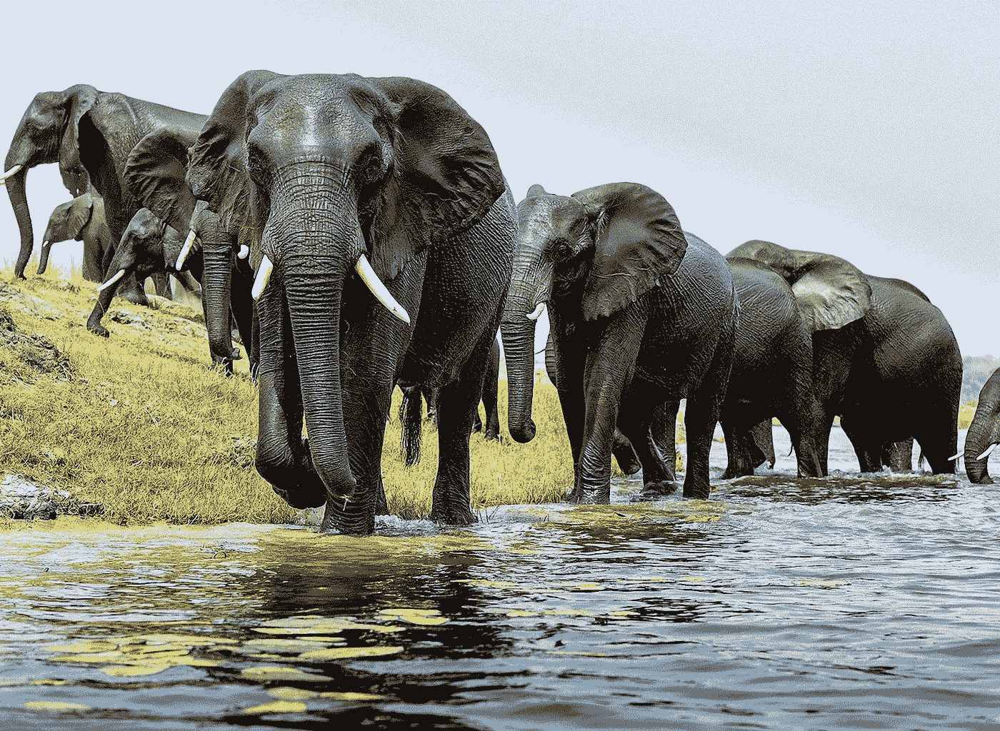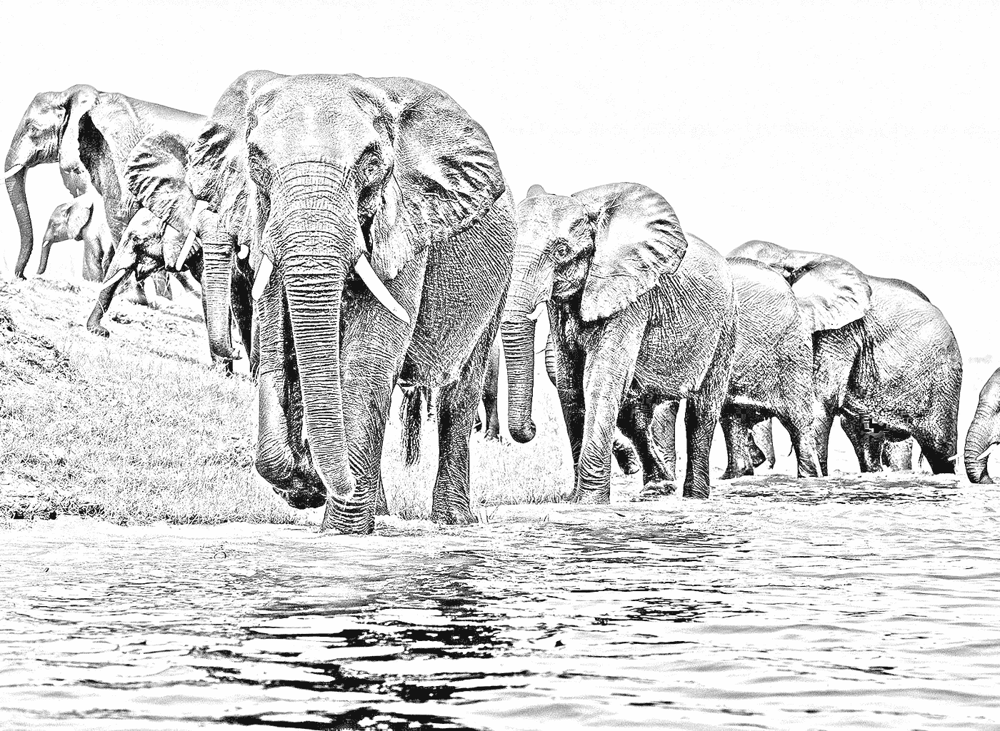

## 基础

首先，在 cmd 中使用 pip 安装 sketchify 包:

> pip 安装 sketchify

打开一个新的 Python 文件，编写如下内容:

就是这样！我们只需要两行代码就可以将任何图像转换成铅笔素描。Sketchify 将图像保存为 png 文件，因此，sketch ify 后的图像将保存在指定的文件夹*(路径/到/保存)*中，命名为*图像* .png

Sketchify 的妙处在于，它可以将任何照片转换成逼真的铅笔素描。如果你使用高清图像，你会得到额外的纹理，详细的阴影，等等。

## 例子

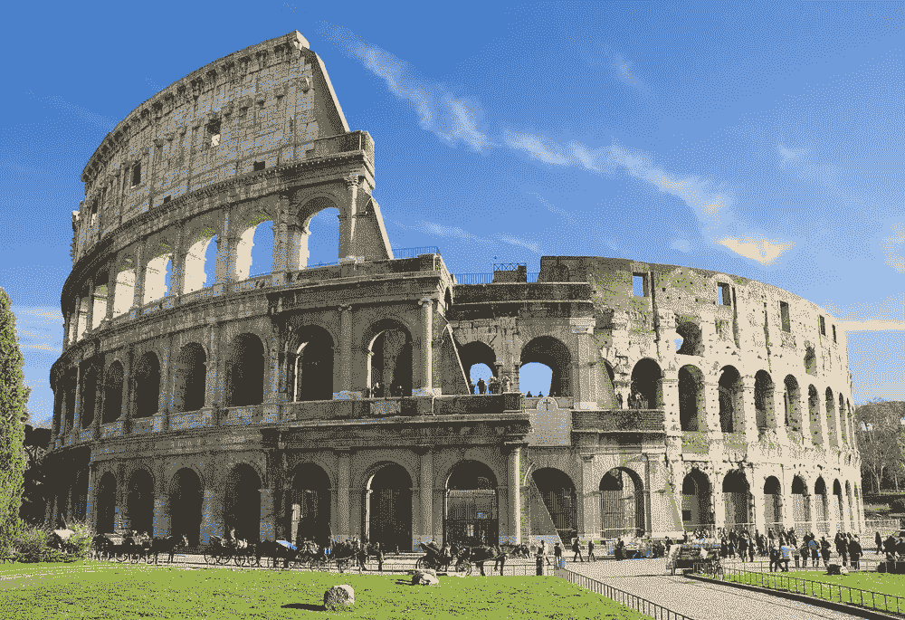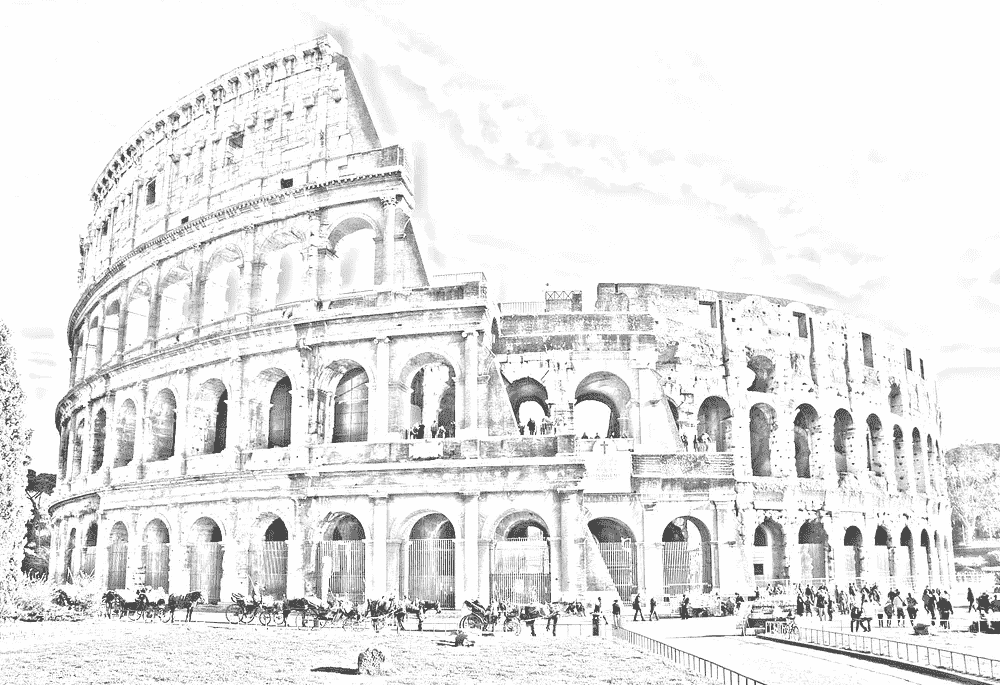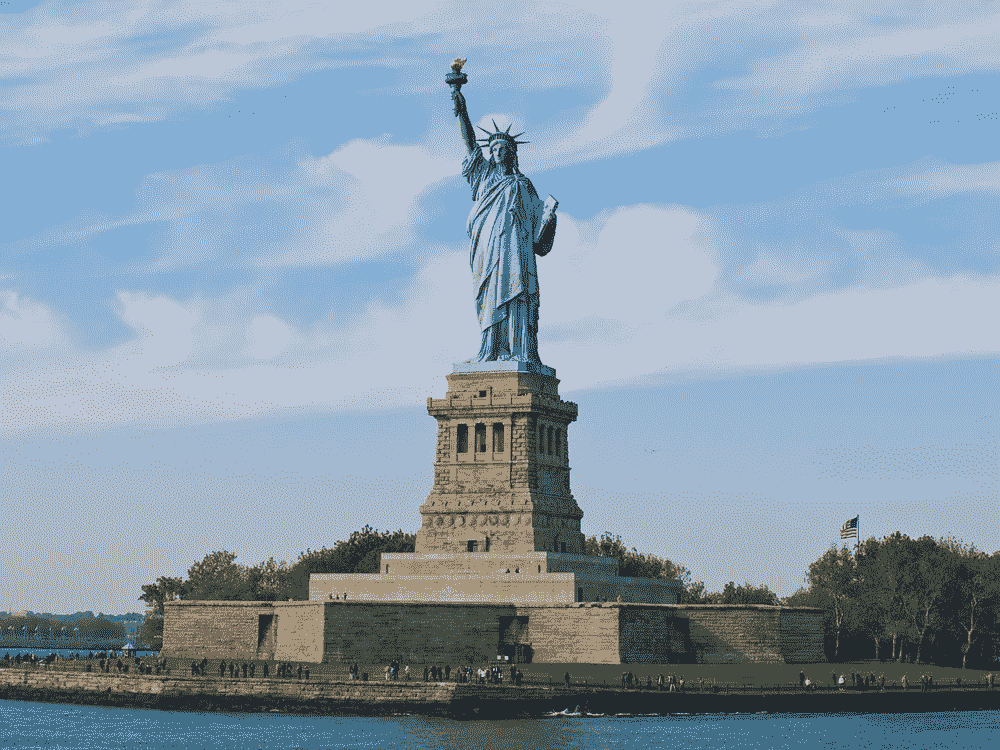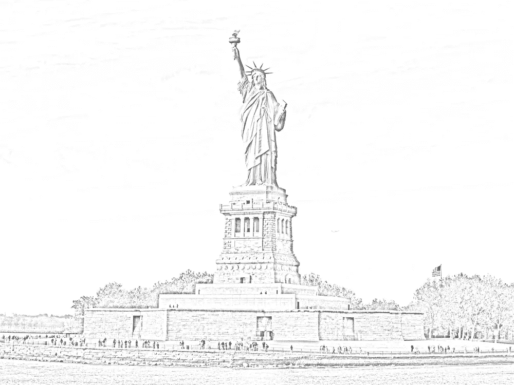

## 高级功能

您可以更改图像的比例以使图像变暗。请注意，在较轻的规模，更大的纹理实现。您可以在*普通草图*功能的*比例*参数中更改比例。请注意，小数位数必须是 1 到 10 之间的整数值。

要调整比例，只需将参数 *scale* 添加到现有代码中:

> sketch . normal sketch(' pathtoimage '，' savepath '，' savename '，scale=x)

标度的默认值是 10。

调整“比例”参数可让您将图像的“暗度”从极亮变为黑暗:

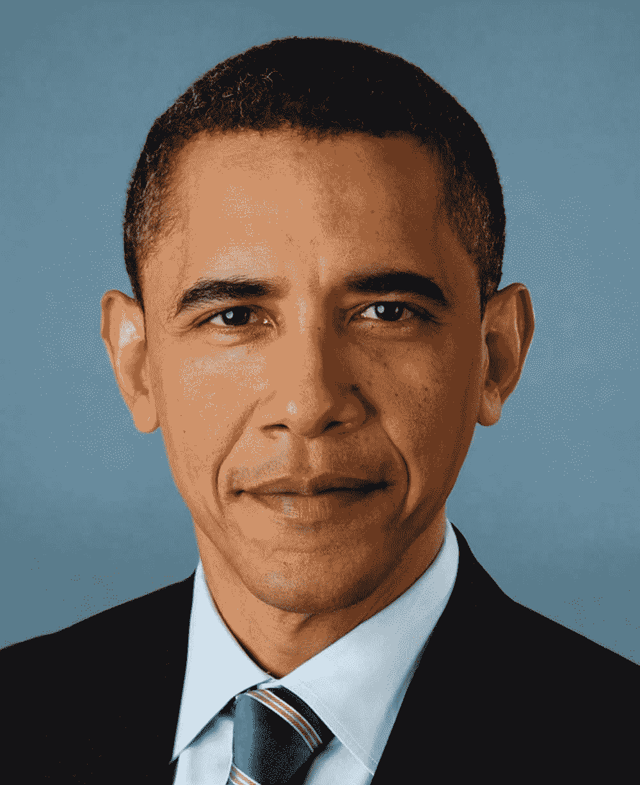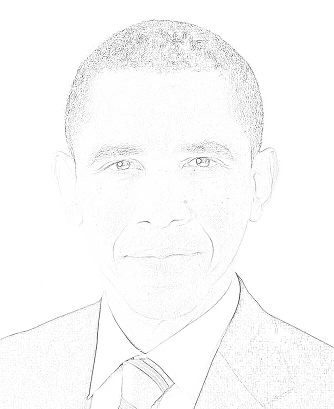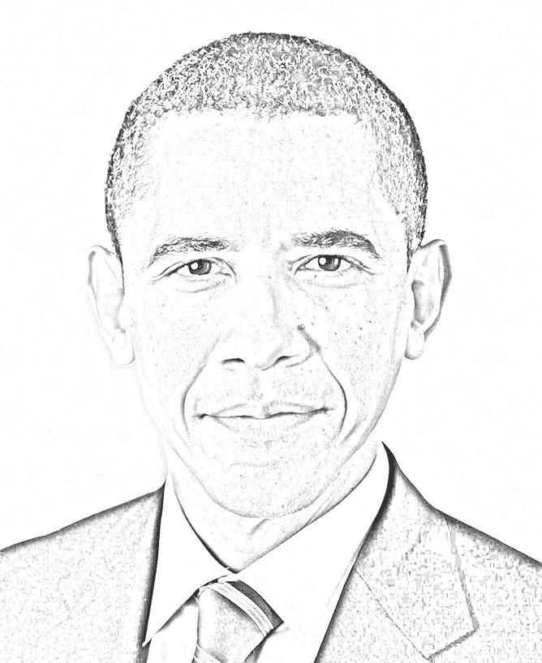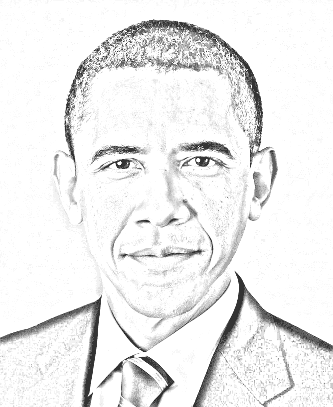

比例:1 比 5 比 10

请注意，纹理有所不同，尤其是阴影。在较小的图片或质量较差的图片中，建议您不要将比例保持在 *1* 或 *10 的两个极端。*

## 结论

这个包的 GitHub 库可以在 https://github.com/grokwithrahul/sketchify[获得。在不久的将来，像粉笔，卡通，和不同的艺术风格的效果将被添加，所以一定要保持检查！Sketchify 也在找投稿人，有兴趣的话可以随意 dro pa note:)。](https://github.com/grokwithrahul/sketchify)

拉胡尔·帕布 2020