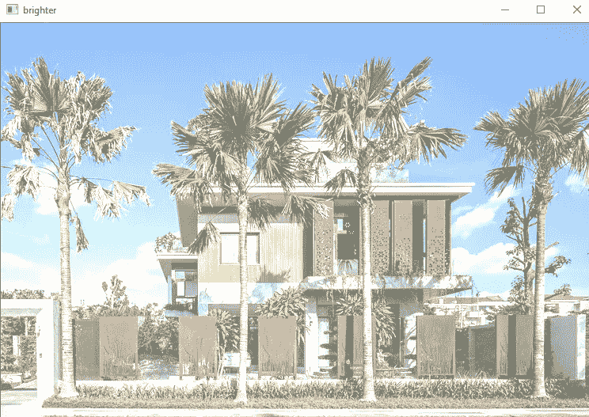
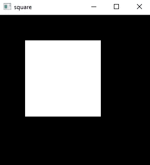

# 使用 OpenCV、Numpy 和 Python 进行图像处理

> 原文：<https://medium.com/analytics-vidhya/images-manipulations-using-opencv-numpy-and-python-2e5538d35614?source=collection_archive---------8----------------------->


O **penCV** 由**加里·布拉德斯基**于 1999 年在英特尔创立，第一版于 2000 年发布。Vadim Pisarevsky 加入 Gary Bradsky，管理英特尔的俄罗斯软件 OpenCV 团队。2005 年，OpenCV 被用在 Stanley 上，这辆车赢得了 2005 年 DARPA 大挑战赛。后来，在 Gary Bradsky 和 Vadim Pisarevsky 领导的 Willow Garage 的支持下，该项目继续积极发展。OpenCV 现在支持大量与计算机视觉和机器学习相关的算法，并且每天都在扩展

ython 是一种通用编程语言，由吉多·范·罗苏姆创立，很快变得非常流行，主要是因为它的简单性和代码可读性。它使程序员能够用更少的代码行表达思想，而不降低可读性

图像操作是很好理解 OpenCV 的非常基本的概念。在这里，我试图以一种简单易懂的方式介绍 OpenCV 的一些概念。

来开发 OpenCV。首先，检查是否安装了 OpenCV。打开新的 Jupiter 笔记本，键入 following 并运行。

```
import cv2
print(cv2.__version__)
```

如果输出是 OpenCV 的一个版本，则安装 OpenCV。如果没有，执行以下命令。

```
pip install opencv-python
pip install opencv-contrib-python
```

现在再次运行上面的命令来检查 OpenCV 是否成功安装

现在在下一个单元格中导入所需的库

```
import cv2
import numpy as np
```

# ***图片翻译***

翻译很简单。它基本上是在一个方向(左，右，上，下和对角线)移动图像。要进行翻译，我们需要翻译矩阵。

```
T = [[1 0 x],
      [0 1 y]] #Translation Matrix
```

**X** 表示沿 X 轴移动， **Y** 表示沿 Y 轴移动

首先，读取图像

```
image = cv2.imread('image.jpg')
cv2.imshow('image',image)
cv2.waitKey(0)
cv2.destroyAllWindows()
```


实际图像

现在对图像进行平移

```
image = cv2.imread('image.jpg')
height, width = image.shape[:2]
wrap_x, wrap_y = 100,100
T= np.float32([[1, 0, wrap_x],[0, 1, wrap_y]])
img_trans = cv2.warpAffine(image,T,(width,height))
cv2.imshow('image',img_trans)
cv2.waitKey(0)
cv2.destroyAllWindows()
```


对角翻译

我们可以通过改变**翻译矩阵**中的值来获得不同的翻译。

# **旋转**

OpenCV 允许我们一次旋转和缩放。我们使用**旋转矩阵**进行图像旋转。

> 语法:cv2.getRotationMatrix2D(center，angle，scale)
> 语法:cv2.warpAffine(src，Matrix，dsize，dst，flags，borderMode，borderValue)

```
image = cv2.imread('image.jpg')
height, width = image.shape[:2]
rotation_matrix = cv2.getRotationMatrix2D((width/2,height/2),90,1)
img_rotated = cv2.warpAffine(image,rotation_matrix,(width,height))
cv2.imshow('image',img_rotated)
cv2.waitKey(0)
cv2.destroyAllWindows()
```

90 表示图像逆时针旋转多少，1 表示缩放。


旋转图像

# 调整图像大小

调整图像大小是 OpenCV 的技术之一。这使得图像在磁盘中占用较少的空间。插值是调整图像大小的一种更好的方法。

**插值:**是在一组离散的已知数据点的范围内构造新的数据点的方法。

插值是可选的。插值有不同的类型。它采用以下方法之一。INTER _ NEAREST 最近邻插值 INTER _ LINEAR 双线性插值(默认情况下使用)INTER _ AREA 使用像素面积关系进行重采样。这可能是图像抽取的优选方法，因为它给出了无波纹的结果。但是当图像被缩放时，它类似于 INTER_NEAREST 方法。INTER _ CUBIC-4×4 像素邻域内的双三次插值 INTER _ LANCZOS 4-8×8 像素邻域内的 lanc zos 插值。

> 语法: cv2.resize(src，dsize，fx，fy，interpolation)

```
image = cv2.imread('image.jpg')
image_scaled = cv2.resize(image,None,fx=0.75,fy=0.75)
cv2.imshow('image Scalled',image_scaled)
cv2.waitKey(0)
cv2.destroyAllWindows()#interpolation
#increasing size of image
img_scl=cv2.resize(image,None,fx=2,fy=2,interpolation=cv2.INTER_CUBIC)
cv2.imshow('image Scalled',img_scl)
cv2.waitKey(0)
cv2.destroyAllWindows()#Resizing the image to specific size
image_scaled = cv2.resize(image,(700,540),interpolation=cv2.INTER_AREA) 
cv2.imshow('image Scalled',image_scaled)
cv2.waitKey(0)
cv2.destroyAllWindows()
```

# 种植

从图像中裁剪出特定的片段是如此简单。我们可以直接给出图像中的起点和终点来裁剪某个片段。

```
image = cv2.imread('image.jpg')
height, width = image.shape[:2]start_row,start_col =int(height * 0.25), int(width * 0.25)
end_row,end_col = int(height * 0.75),int( width * 0.75)
crop = image[start_row:end_row,start_col:end_col]cv2.imshow('actual image', image)
cv2.waitKey(0)
cv2.imshow('cropped image',crop)
cv2.waitKey(0)
cv2.destroyAllWindows()
```


裁剪图像

# 变亮和变暗

我们可以简单地通过在图像矩阵的每个元素上加/减一个值来使图像变亮或变暗。该值必须介于 0 和 255 之间。

```
image = cv2.imread('image.jpg')value =100
mat = np.ones(image.shape,dtype = 'uint8')*valuebrighter = cv2.add(image,mat)
cv2.imshow('brighter',brighter)
cv2.waitKey(0)
cv2.destroyAllWindows()
```



增亮图像

```
image = cv2.imread('image.jpg')value =100
mat = np.ones(image.shape,dtype = 'uint8')*value
subtract = cv2.subtract(image,mat)
cv2.imshow('subtract',subtract)
cv2.waitKey(0)
cv2.destroyAllWindows()
```


变暗图像

# 位运算

按位运算有助于图像蒙版。理解位运算。让我们建立一些形状。

**广场**

> **语法:** cv2.rectangle(图像，起点，终点，颜色，粗细)

```
image=np.zeros((300,300),np.uint8)
cv2.rectangle(image,(50,50),(250,250),255,-2)
cv2.imshow('square',image)
cv2.waitKey(0)
cv2.destroyAllWindows()
```



**椭圆**

> **语法:** cv2.ellipse(图像、中心坐标、轴长度、角度、起始角度、终止角度、颜色、厚度)

```
image=np.zeros((300,300),np.uint8)
cv2.ellipse(image,(150,150),(150,150),30,0,180,255,-1)
cv2.imshow('Eclipse',image)
cv2.waitKey(0)
cv2.destroyAllWindows()
```


现在应用位运算(AND，OR，XOR，NOT)来更清楚地理解上面的形状

**按位与**

```
And = cv2.bitwise_and(square,image)
cv2.imshow('And',And)
cv2.waitKey(0)
cv2.destroyAllWindows()
```


和

**按位或**

```
Or = cv2.bitwise_or(square,image)
cv2.imshow('OR',Or)
cv2.waitKey(0)
cv2.destroyAllWindows()
```


运筹学

**按位异或**

```
xor = cv2.bitwise_xor(square,image)
cv2.imshow('XOR',xor)
cv2.waitKey(0)
cv2.destroyAllWindows()
```


异或运算

**按位非**

```
Not = cv2.bitwise_not(square)
cv2.imshow('Not',Not)
cv2.waitKey(0)
cv2.destroyAllWindows()
```


不

这些是 OpenCV 的一些图像操作的概念。你可以在我的 GitHub repo [中找到完整的代码。如果你有任何疑问，请随时留下评论。](https://github.com/venku2208/OpenCV/blob/master/image%20manipulations/Image%20Manipulations.ipynb)