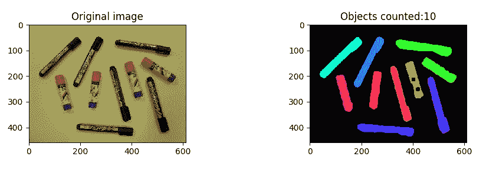

# 图像处理:使用 Python 和 OpenCV 进行分割和对象计数

> 原文：<https://medium.com/analytics-vidhya/images-processing-segmentation-and-objects-counting-in-an-image-with-python-and-opencv-216cd38aca8e?source=collection_archive---------0----------------------->

图像分割是计算机视觉领域中物体识别的重要步骤。在这篇文章中，我们提出了一些分割技术。分割的独创性是基于根据我们必须处理的图像从多种可用技术中选择技术。这里我们不会介绍所有的分割技术，我们将只讨论我们在这项工作中使用的技术。值得注意的是，这些技术并不是在这种情况下必须使用的唯一技术，因此您可以找到一些可以有效解决这个问题的技术。

# 目标

下图概括了我们希望执行的任务。



**图 1:原始图像(左)和分割图像(右)**

## **使用的工具和资源(图片)**

Python 3.5，opencv 4.1.0

使用的图像位于 https://photos.app.goo.gl/CGgNoSyvENRzvLmZ8

## **加工顺序**

分割过程可以分为 3 个部分:

1 —预处理，

2 —处理，以及

3 —后分割。

**1 —预处理**

我们有 4 个图像要被相同的处理序列分割，所以我们必须分析所有这些输入图像的特征(亮度，对比度，噪声，..以便选择对应于所有技术的技术。所有这些提高图像质量的处理都属于预处理步骤。让我们看看下面的四幅输入图像


**图 2:第一张图像**


**图 3:第二幅图像**


**图 4:第三幅图像**


**图 5:第四幅图像**

首先，我们将把我们的彩色图像转换成灰度图像，以便只有一个通道的图像。即使没有转换，我们也可以观察到这些图像特征之间的差异。第一幅图像(图 2)包含小物体，并且一些具有与背景相同的像素值(第五幅图像也是如此，图 5)。这一方面会导致 egdes 检测问题。为了防止这种情况，我们考虑图像对比度调整，因此我们必须在所有对比度提高方法中进行选择(直方图均衡化、线性变换、非线性变换，例如伽马校正、分段线性变换等)，让我们比较一下 opencv 中实现的两种方法的结果:伽马校正和直方图均衡化。

```
# Convert image in grayscalegray_im = cv.cvtColor(original, cv.COLOR_BGR2GRAY)
plt.subplot(221)
plt.title('Grayscale image')
plt.imshow(gray_im, cmap="gray", vmin=0, vmax=255)

# Contrast adjusting with gamma correction y = 1.2

gray_correct = np.array(255 * (gray_im / 255) ** 1.2 , dtype='uint8')
plt.subplot(222)
plt.title('Gamma Correction y= 1.2')
plt.imshow(gray_correct, cmap="gray", vmin=0, vmax=255)# Contrast adjusting with histogramm equalizationgray_equ = cv.equalizeHist(gray_im)
plt.subplot(223)
plt.title('Histogram equilization')
plt.imshow(gray_correct, cmap="gray", vmin=0, vmax=255)
```


**图 6:对比方法对比**

你认为我们必须选择哪一个？据我们说，我们认为伽马校正给出了更好的结果，所以我们保留这个。在我们的情况下，在这一步，只有这种处理可以解决我们的清晰度问题。但是注意，在某些情况下你必须做多重处理才能解决清晰度问题，所以让我们进入下一步。

**2 —处理**

至于前面的处理，这里我们也有不同的分割技术，可以分为两部分:基于边缘的技术和基于区域的技术。

否则，我们可以使用阈值技术来进行分割，在这种情况下，我们必须遵循其他处理技术，以获得满意的结果。

让我们试验一下这最后一种方法。

在这里，我们使用自适应局部阈值技术来二值化我们的灰度图像(对比度校正的灰度图像)，请注意，您可以使用其他技术，你认为更好地为您的图像。结果看起来像贝娄。

```
# Local adaptative threshold

thresh = cv.adaptiveThreshold(gray_correct, 255, cv.ADAPTIVE_THRESH_GAUSSIAN_C, cv.THRESH_BINARY, 255, 19)
thresh = cv.bitwise_not(thresh)plt.subplot(221)
plt.title('Local adapatative Threshold')
plt.imshow(thresh, cmap="gray", vmin=0, vmax=255)
```


图 7:局部适应阈值

如您所见，在前面的图(图 7)中，阈值处理后，我们有许多相连的区域，这不能帮助我们计数图像中的对象，因为对象的计数是由于相连区域的数量，所以此外，我们必须在计数图像中的对象数量之前应用一些其他技术。

我们将遵循侵蚀和扩张技术，这将有助于我们连接最近的区域，以便每个对象有一个区域。

```
# Dilatation et erosion
kernel = np.ones((15,15), np.uint8)
img_dilation = cv.dilate(thresh, kernel, iterations=1)
img_erode = cv.erode(img_dilation,kernel, iterations=1)# clean all noise after dilatation and erosionimg_erode = cv.medianBlur(img_erode, 7)plt.subplot(221)
plt.title('Dilatation + erosion')
plt.imshow(img_erode, cmap="gray", vmin=0, vmax=255)
```

让我们应用这些技术并欣赏结果。


图 8:侵蚀和扩张

现在我们每个连接区域有一个对象，所以我们可以计算图像中对象的数量。但在此之前，让我们先标记连接区域。

```
# Labeling

ret, labels = cv.connectedComponents(img_erode)
label_hue = np.uint8(179 * labels / np.max(labels))
blank_ch = 255 * np.ones_like(label_hue)
labeled_img = cv.merge([label_hue, blank_ch, blank_ch])
labeled_img = cv.cvtColor(labeled_img, cv.COLOR_HSV2BGR)
labeled_img[label_hue == 0] = 0

plt.subplot(222)
plt.title('Objects counted:'+ str(ret-1))
plt.imshow(labeled_img)print('objects number is:', ret-1)
plt.show()
```


图 9:标签和物体计数

在下一篇文章中，我们将在介绍后分割步骤之前介绍其他分割技术。希望这篇文章对你有所帮助，请在下面的评论区分享你的想法和反馈。