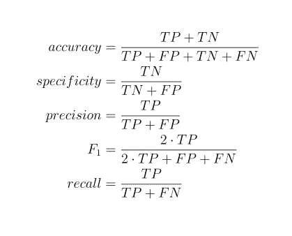
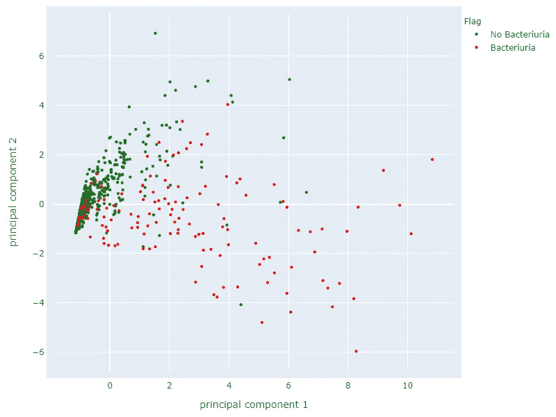
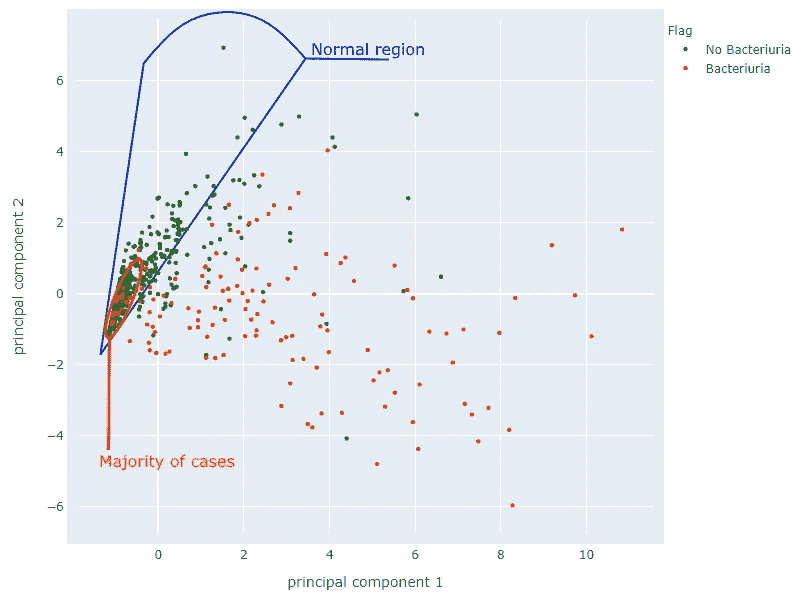
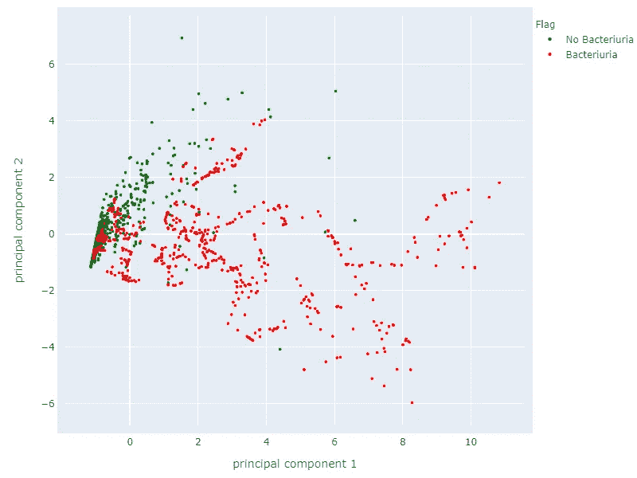

# 医学诊断的不平衡分类

> 原文：<https://medium.com/analytics-vidhya/imbalanced-classification-for-medical-diagnosis-75dfcaa783d3?source=collection_archive---------8----------------------->

本文解释了如何减少为医学诊断而训练的神经网络对疾病发病率低的数据集的偏差。

# 概观

在医学诊断研究中，不平衡分类是一个常见的挑战。对于几乎任何疾病，医学实验室都有更多的患者没有患病，而不是患病。在训练集中，具有感兴趣的疾病的患者的自然发生的流行将导致任何基于损失函数的模型向负面分类倾斜，因为它不会为患有该疾病的患者接收足够的损失。

在测试集中，具有相同的患者分布将导致测试报告过于乐观的准确性，仅轻微地受到患有该疾病的患者的不正确分类的影响。在所有常用于测量二进制分类性能的统计测量中，只有**召回**不会产生过于乐观的值。

在所有常见的统计测量中，只有回忆不会对不平衡诊断问题产生过于乐观的值。TP —真阳性，TN —真阴性，FP —假阳性，FN —假阴性

我们更关心消除第二类错误(假阴性)而不是第一类错误(假阳性)，这一事实也加剧了这种情况。在医疗实践中，对没有患病的患者进行一些额外的测试，几乎总是比对患病的患者不予治疗要好。

以下是一个不平衡数据集的示例(对其特征应用主成分分析后),包含 141 个菌尿感染患者的尿液样本和 663 个未感染患者的样本:

图 1:将 PCA 应用于实验室结果后的菌尿患者

在这种特殊情况下，我们希望分类器尽可能缩小绿色聚类的范围，并且我们可以容忍该聚类之外的大量绿色点。但是在边界区域没有足够的红点让一个模型做出这样的概括。

在下面的图片中，我用蓝色勾勒出了假定的正常区域。我们希望该区域之外的所有样本都被分类为红色，并且我们能够承受该区域之外的所有绿色点的错误分类。这里最好格外小心，因为每个错误分类的红点都是未经治疗的感染。

这种分类将导致损失函数从其最佳值增加，该最佳值可以由模型实现，因为在边界区域中绿色点比红色点多。

图片#2:正常区域和突出显示的大多数情况

让我们训练一个简单的具有 3 层的密集神经网络，包含 3 个 tanh、2 个 tanh 和 1 个输出 sigmoid 神经元。该模型将使用二进制交叉熵作为其损失函数，我们将使用随机梯度下降对上述数据集进行 100 个时期的训练。

正如预测的那样，神经网络报告了 0.92 的相对较高的准确度值，但是只有 0.60 的较低的召回值。

高精度值不能欺骗你。神经网络在错误分类大量红点方面表现不佳。高精度值可归因于正常区域底部的大量正确分类的贪婪点。

解决这个问题的方法称为重采样，可以通过对多数类欠采样或对少数类过采样来实现。

# 重采样

## 欠采样

如果没有足够的数据供模型进行归纳，随机欠采样可能效果不佳。

一种称为 Tomek 链接的方法可用于识别边界样本，从而移除剩余样本，因为它们对于泛化和测试不太重要。

另一种称为收缩 system⁴的想法将正负类的重叠区域分类为正类，主张通过从该区域移除负类样本来进行欠采样。

它在某些情况下有效，但可能不适用于上面的菌尿数据集。正如你在图片#2 中看到的，用橙色勾勒出的高密度绿色区域与适度稀疏的区域或红点重叠。从该区域移除绿点不会显著提高模型的召回率。

## 替换过采样

替换过采样可以通过从原始数据集中复制少数样本来完成，以匹配多数类中的案例数。问题是，这种方法在训练期间没有为模型提供任何新的信息，因此它不一定会导致更好的泛化。

## 合成过采样

合成过采样的想法来自于这样一个事实，对于一个模型来说，特殊化比一般化更容易。因此，可以构建更简单的生成模型来为更复杂的分类模型提供必要的多样性。

合成过采样方法的主要挑战是，即使在少数类区域内没有多数样本时可以检测到安全区域，但太多的新情况实际上会降低边界情况下模型的准确性。该模型不会从临界情况中接收到足够的损失，因此在对它们进行分类时会不太准确。这与我们的目标相反。

添加带有一些随机化的边界病例也可能是棘手的，因为随机噪声可能会根据一些分类器(如 k 最近邻)交换示例的标签。尽管随机噪音不能让猫的图像看起来像更罕见的鬣蜥，但它可以很容易地让医生眼中处于边缘疾病状态的病人看起来处于边缘健康状态。

合成过采样中的一种成功方法被称为 SMOTE⁵(合成少数过采样技术)，其中沿着 k 个最近邻聚类内的线生成新样本。SMOTE 在几项研究中显示了医疗诊断的改进结果，例如，诊断 diabetes⁶和 cancer⁷.

SMOTE implementation⁸在 Python⁹可用，它甚至允许将⁰合成过采样与欠采样相结合以获得更好的结果。

这是与上面相同的菌尿数据集，但在应用 SMOTE 后:

图片#3:应用 SMOTE 后来自图片#1 的数据集

红色聚类边界现在得到加强，并且在训练期间，模型将从导致更好的泛化的边界红色案例中接收足够的损失。

上面描述的并且在具有 SMOTE 样本的数据集上训练的神经网络报告了不太乐观的准确度值 0.87(之前为 0.92)，但是召回值 0.75(之前为 0.60)要好得多。

另一种称为 Deep SMOTE 的方法声称，通过使用深度神经网络来生成合成样本，可以提高 SMOTE 在精度、F₁和 AUC 方面的性能。

# 结论

不平衡分类是医学诊断研究中需要解决的一个重要问题。幸运的是，这个问题得到了很好的研究，并且基于数据插值和深度学习提出并实现了各种成功的方法来解决它。

# 参考

娜塔莉·贾普科维茨；[阶层失衡问题:意义与策略](http://citeseerx.ist.psu.edu/viewdoc/summary?doi=10.1.1.35.1693)；2000

马蒂亚斯·科尔；[业绩计量中的二进制分类](https://www.researchgate.net/publication/273136254_Performance_Measures_in_Binary_Classification)；2012.

伊万·托梅克；[CNN](https://ieeexplore.ieee.org/document/4309452)的两次修改；1976.

⁴·米罗斯拉夫·库巴特、斯坦·马特温；解决不平衡训练集的诅咒:单边选择。《第十四届机器学习国际会议论文集，第 179–186 页；1997.

⁵·尼泰什诉舒拉、凯文·鲍耶、劳伦斯·霍尔、菲利普·凯格尔迈耶； [SMOTE:合成少数过采样技术](https://arxiv.org/pdf/1106.1813.pdf)。2002

⁶·马纳尔·阿尔加姆迪、穆阿兹·马拉赫、史蒂文·科特伊安、克林顿·布朗纳、乔纳森·埃尔曼、谢里夫·萨克；[使用 SMOTE 和集成机器学习方法预测糖尿病:亨利·福特运动测试(FIT)项目](https://www.ncbi.nlm.nih.gov/pmc/articles/PMC5524285/)。2017

⁷·萨拉·福图希、沙赫洛克·阿萨迪、迈克尔·w·卡坦；[对不平衡数据进行癌症诊断的综合数据级分析](https://pubmed.ncbi.nlm.nih.gov/30611011/)；2019.

⁸·杰森·布朗利；[用 Python 打不平衡分类](https://machinelearningmastery.com/smote-oversampling-for-imbalanced-classification/)；2020.

⁹ [scikit-learn-contrib /不平衡-learn](http://scikit-learn-contrib / imbalanced-learn)

⁰·杰森·布朗利；[如何结合过采样和欠采样进行不平衡分类](https://machinelearningmastery.com/combine-oversampling-and-undersampling-for-imbalanced-classification/)；2020.

石卫东哈迪·曼苏里法尔；[深度合成少数过采样技术](https://arxiv.org/ftp/arxiv/papers/2003/2003.09788.pdf)；2020.