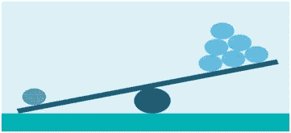
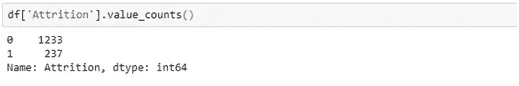
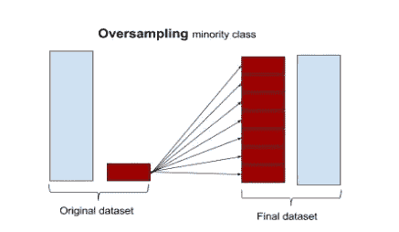
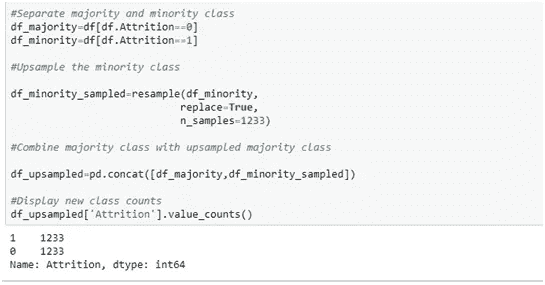
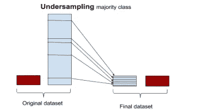
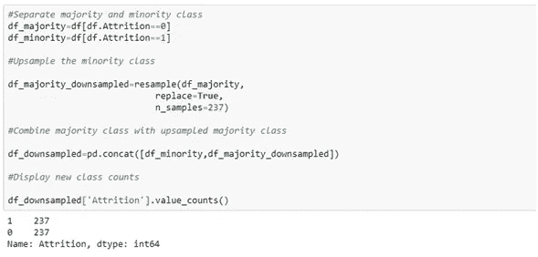
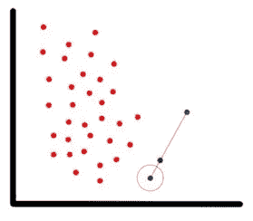

# 不平衡数据集

> 原文：<https://medium.com/analytics-vidhya/imbalanced-datasets-a95fa33e375?source=collection_archive---------23----------------------->

代表不平衡

一般来说，数据集在处理时会引发各种各样的问题。最常见的有哪些？

数据可能有多个缺失值

它可能没有足够的预测能力来做出正确的预测

它可能是不平衡的

在本指南中，我们将尝试不同的方法来处理这种不平衡的数据集。

要了解更多关于缺失值分析的信息，您可以参考此处的。

什么是不平衡数据集？

不平衡类是机器学习分类中的一个常见问题，其中每个类中的观察值比例不成比例。类别不平衡可以在许多不同的领域中发现，包括医疗诊断、垃圾邮件过滤、欺诈检测和广告点击。

员工流失数据集示例。我们可以看到阶级不平衡。

在深入研究之前，可以考虑一些简单的解决方案来处理不平衡数据集问题。

*   使用基于树的模型-基于树的模型更有可能在不平衡的数据集上表现得更好。本质上，它们基于分割/决策点构建层次结构，这可能更好地分离类。
*   收集更多的数据——更多的数据可以平衡你的数据集，也可能使它更加不平衡。无论哪种方式，您都需要更完整的数据。因此，收集更多的数据始终可以被视为一种选择。

现在让我们讨论几种处理不平衡数据集的技术。

1)使用正确的评估指标

2)对少数类进行上采样

3)对多数类进行下采样

4)使用 K 倍交叉验证

5)击打

**使用正确的评估指标**

每当我们处理不平衡的数据集时，选择正确的评估指标是非常重要的。多个指标可以提供更好的洞察力。下面列出了一些。

**——召回率和真阳性率(TPR)完全相同。回忆总结了正面类别的预测程度，与敏感度的计算方法相同。**

**真正/(真正+假负)**

****Precision** - Precision 总结了属于正类的分配给正类的实例的分数。**

**真阳性/(真阳性+假阳性)**

****F1****

****上采样或过采样****

****

**过采样**

**过采样包括从少数类中复制一些点，以增加其基数。下面来自 sklearn 的包用于对数据进行重采样。**

****

**重采样用于数据的重采样**

****

**向上采样少数民族类**

**现在我们可以看到新的数据框架比原来的有更多的观察值。此外，两个班级的比例现在是 1:1。**

****降采样或欠采样****

****

**在大数据集的情况下，下采样是优选的。下采样包括从多数类中随机移除观察值，以防止其观察值支配学习算法。这样做，直到多数和少数类实例达到平衡。**

****

**对多数类进行下采样**

****使用 K 倍交叉验证****

**重要的是，在使用过采样方法解决不平衡问题时，应正确应用交叉验证。交叉验证是一种重采样过程，用于在有限的数据样本上评估机器学习模型。该过程有一个称为 k 的参数，它指的是给定数据样本要被分成的组的数量。因此，这个过程通常被称为 k 倍交叉验证。当选择了 k 的特定值时，它可以在模型的引用中代替 k 使用，例如 k=10 成为 10 倍交叉验证。**

**数据科学家必须确保模型正在学习数据中的模式，而不是拟合噪声。**

****击杀****

**综合少数过采样技术(SMOTE)是一种非常流行的过采样方法，旨在改善随机过采样对高维数据的影响。**

**对于属于欠表示类的每个观察，该算法获得其 K 个最近邻，并在当前观察和其最近邻之间的线中的随机位置处合成少数标记的新实例。**

**在我们的示例中(如下图所示)，蓝色圆圈点是当前观测值，蓝色非圆圈点是其最近的邻居，绿色点是合成点。**

****

**重击**

**合成数据是智能生成的人造数据，类似于它想要增强的数据的形状或值。SMOTE 创建的数据与现有数据相似，而不仅仅是通过复制数据来创建新的示例。**

****结论****

**在处理不平衡数据集时，没有一个固定的解决方案。我们将不得不根据问题尝试多种方法。根据不平衡数据集的特征，最有效的技术会有所不同。**

**-在模型比较期间，应考虑相关的评估参数**

**-在某些情况下，合成采样方法(如 SMOTE)以及高级增强方法(如梯度增强和 XG 增强)可提供最佳结果**

**-可以使用重采样方法，但必须仔细考虑**

**希望你喜欢这个博客！请分享您的反馈和您想了解的话题。**