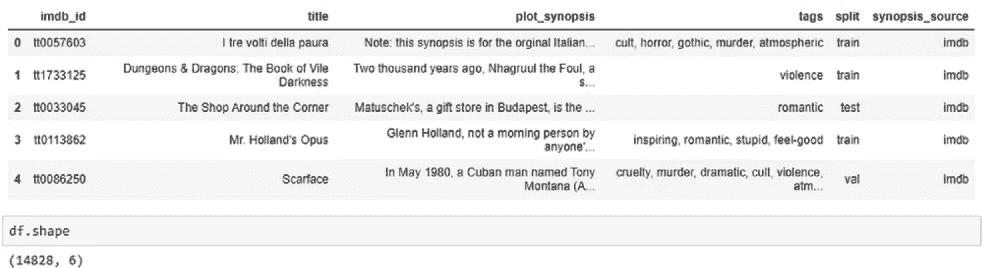
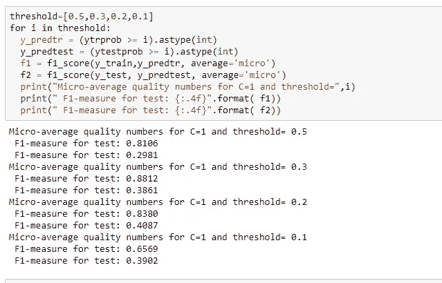

# IMDB 电影类型标签预测

> 原文：<https://medium.com/analytics-vidhya/imdb-movie-genre-tag-prediction-4ee71a0aa9bd?source=collection_archive---------7----------------------->

在这篇博客中，我们将知道如何使用经典和深度学习技术进行多标签分类。

电影情节包含了很多关于电影的信息。这些信息对于构建自动系统来为电影创建标签是很有价值的。

自动标记系统可以帮助推荐引擎改进相似电影的检索，以及帮助观众预先知道从电影中可以期待什么。

我们将尝试使用电影情节进行类型标签预测。

数据集:[https://www . ka ggle . com/cryptexcode/mpst-movie-plot-synopses-with-tags](https://www.kaggle.com/cryptexcode/mpst-movie-plot-synopses-with-tags)

**加载数据集:**

我们可以看到有 14828 部电影。电影类型是多标签的。所以，这个分类就是**多标签分类问题**。

**预处理电影剧情 _ 梗概**

在此阶段，我们将进行以下操作:

1.  从 plot_synopsis 中删除所有停用词。
2.  堵塞物
3.  以小写形式转换绘图。
4.  删除 html 标签
5.  删除 https 链接。
6.  删除除字母数字字符以外的所有字符。

**预处理标签:**

去除重复的流派标签是非常重要的。预处理标签后，我得到了 71 个不同的标签，而不是 141 个。

我去掉了空格，用空格代替了'，'。

现在，让我们进入正题。

这是一个多标签分类的问题。

**多标签分类**:多标签分类为每个样本分配一组目标标签。这可以被认为是预测一个数据点的不相互排斥的属性，例如与一个文档相关的主题。

参考:[https://www . analyticsvidhya . com/blog/2017/08/introduction-to-multi-label-class ification/](https://www.analyticsvidhya.com/blog/2017/08/introduction-to-multi-label-classification/)

**方法:**

对于任何类型的分类，我们都必须将文本转换成向量。有很多策略。

参考:[https://medium . com/@ paritosh _ 30025/natural-language-processing-text-data-矢量化-af2520529cf7](/@paritosh_30025/natural-language-processing-text-data-vectorization-af2520529cf7)

**绩效指标**

**“微 f1 分数”:**
通过计算总的真阳性、假阴性和假阳性来计算全局指标。当我们有**阶级不平衡时，这是一个更好的衡量标准。**

请参考:[http://rushdishams . blogspot . com/2011/08/micro-and-macro-average-of-precision . html](http://rushdishams.blogspot.com/2011/08/micro-and-macro-average-of-precision.html)

**文本特征化**

1.  **3 克 Tf-Idf** ，最小文档频率 10，最大特征 20000。

2. **LDA(话题建模)**拥有 10 个 n 话题。这是一个自动识别文本对象中存在的主题并导出文本语料库所展示的隐藏模式的过程。[https://www . analyticsvidhya . com/blog/2016/08/初学者指南-主题建模-python/](https://www.analyticsvidhya.com/blog/2016/08/beginners-guide-to-topic-modeling-in-python/)

**模型
对于多标签分类，我们在基本模型上使用一个 vs rest。**

**基本型号:**

1.  **朴素贝叶斯作为文本分类的基准。因此，建议采用这种模式。我们将首先在 Tf-idf 上应用朴素贝叶斯。**

**缺点(朴素贝叶斯)**:它假设特征是独立。但是在我们的例子中，有很多特征，这些假设可能会被违反。

2.**Tf-IDF 上的逻辑回归**:我们将应用逻辑回归，因为它在高维数据上非常有效。

逻辑回归试图找到一个将两个类分开的超平面，即假设数据是线性可分的。

随着维数的增加，线性可分数据的机会增加。

**设置正确的阈值:**

阈值默认为 **0.5** 。这意味着如果输出概率大于 0.5，则它被分类为 1，否则为 0。

我们将检查多个阈值，并选择一个给出最高**微 f1** 测量值的阈值。

得到适当的阈值**后，微 f1** 有所提高。

为了增加 f1，我们将应用具有 10 个 n 主题的**主题建模** (LDA)。我们合并 Tf-idf 和 LDA 并应用逻辑回归。

**3。LDA + Tf-idf 的逻辑回归:**

**4。LDA+Tf-idf 上的轻型 GBM:**

Light GBM 是一个基于决策树算法的快速、分布式、高性能梯度提升框架，用于排序、分类和许多其他机器学习任务。

增强技术是一种复杂的技术，它试图通过误差的附加减少来最小化偏差。

然而，不建议对多标签分类使用复杂的模型，因为这会增加时间复杂度。

因为我们的数据集很小，所以我们将尝试一次。

我们使用随机搜索 CV 来获得最佳超参数:

**尝试深度学习方法:**

深度学习是一种非常强大的数据特征化技术。所以，我们也尝试了这个。

**LSTM:** 长短期记忆网络——通常被称为“LSTM”，是一种特殊的 RNN，能够学习长期依赖关系。

LSTM 处理序列信息。

为了应用 LSTM，我们首先将预处理图转换成秩矩阵。

**以下是步骤:**

1.  删除出现在不到 10 个文档中的所有单词。
2.  根据每个词出现的频率来排列它们。
3.  用预处理图中单词各自的等级替换单词。
4.  应用填充以使每个地块大小相等。
5.  对此数据集应用 LSTM。

**训练模式:**

**缺点**:深度学习模型需要大数据集来训练。

**结论:**

1.  我从上面链接中提到的原始研究论文中获得了大约 5%的显著提高。
2.  尝试大量的特征和主题建模提高了我的分数。
3.  黑客使用阈值是非常有效的，提高了分数。
4.  标签需要预处理，因为它包含多个重复的标签，前面有一个空格
5.  我使用了每一种可能的方法，即 Tfidf、矩阵分解技术和深度学习。
6.  最终测试的最佳微 f1 为 0.408。
7.  给定的数据集非常小，特征图的维数很大。由于缺乏足够的数据点，深度学习表现不佳。
8.  我用数据集指定的训练和测试分割来训练模型。
9.  我担心数据泄露。
10.  决策树因为维数高而表现最差。

# 参考资料:

[https://www . ka ggle . com/cryptexcode/mpst-movie-plot-synopses-with-tags](https://www.kaggle.com/cryptexcode/mpst-movie-plot-synopses-with-tags)[https://www . analyticsvidhya . com/blog/2017/08/introduction-to-multi-label-class ification/](https://www.analyticsvidhya.com/blog/2017/08/introduction-to-multi-label-classification/)

**未来工作:**

BERT 是用于自然语言处理的很好的深度学习技术。BERT 的关键技术创新是将 Transformer(一种流行的注意力模型)的双向训练应用于语言建模。我们可以在体裁分类上试试。