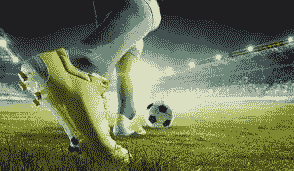
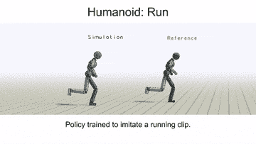
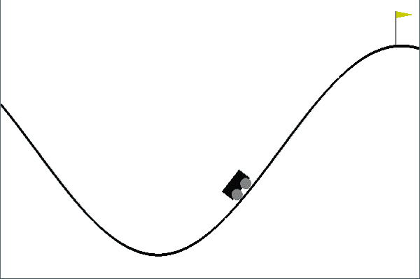
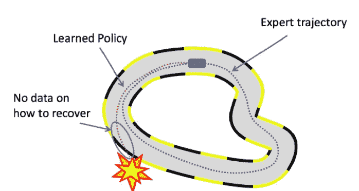
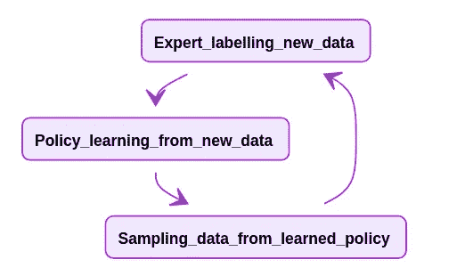
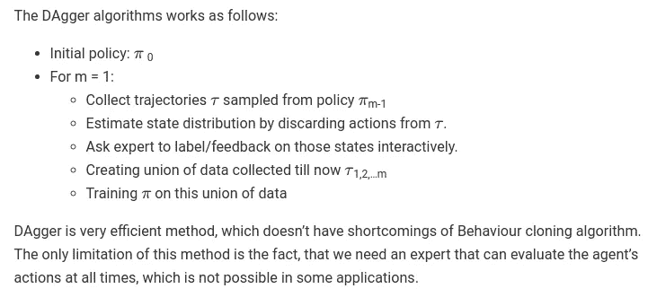
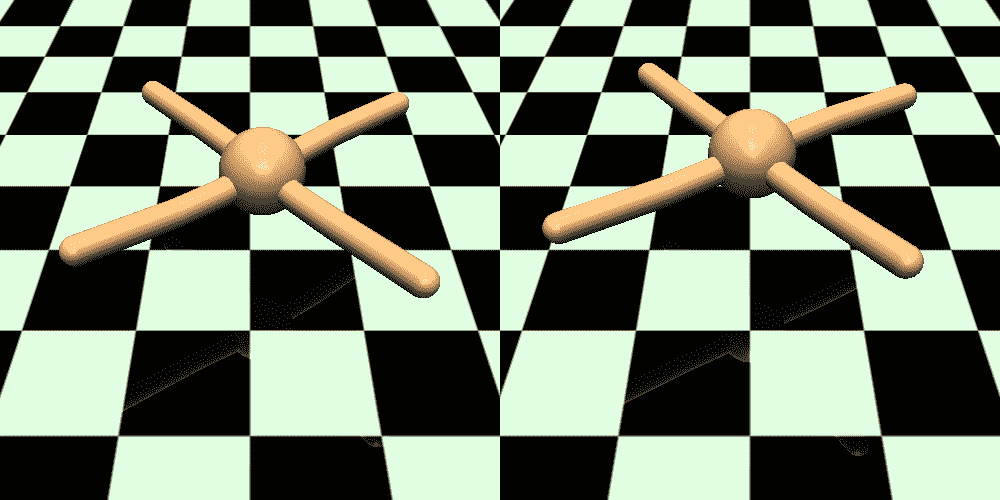
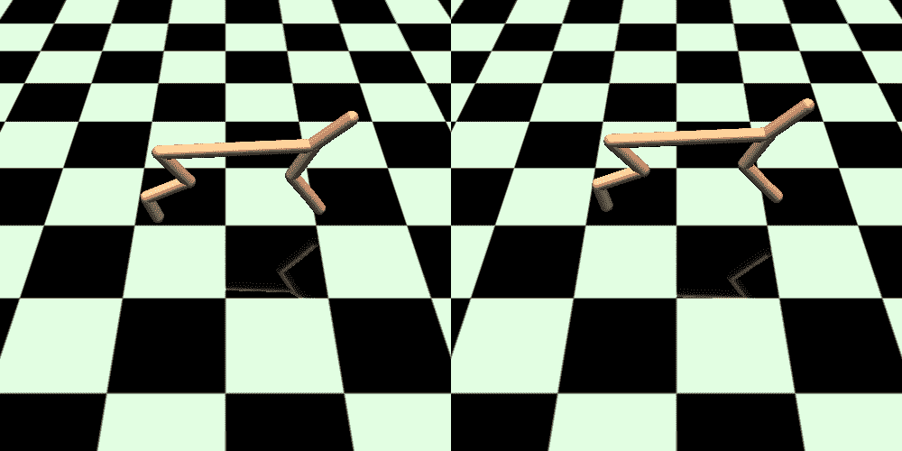
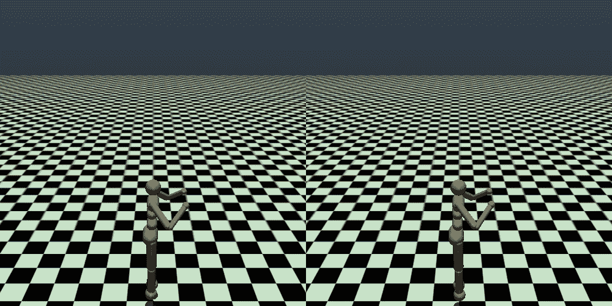

# 模仿学习:从为什么到如何！

> 原文：<https://medium.com/analytics-vidhya/imitation-learning-from-why-to-how-7b713a079501?source=collection_archive---------9----------------------->

[来源](http://modules.ilabs.uw.edu/module/power-learning-imitation/)

裘德是一名业余足球运动员，但他想成为一名伟大的运动员。裘德是克里斯蒂亚诺·罗纳尔多的铁杆粉丝，每次他在任何地方比赛，他都会观看。

裘德想知道他是否能像罗纳尔多一样。如果通过大量的练习，他可以**模仿**罗纳尔多所拥有的所有技能。他不在乎在模仿时他是否进球，他只是像罗纳尔多那样踢球。

> 如果我能像罗纳尔多一样踢球，那肯定会是一个进球！

裘德对这个想法很着迷，但他也认为**太懒**和**喜欢编程**(永恒的结合)。他想为什么他不能在虚拟世界中做一些非常类似的事情，毕竟他可以在控制这个虚拟世界的同时快进这个训练过程。

[来源](https://hub.packtpub.com/google-research-football-environment-a-reinforcement-learning-environment-for-ai-agents-to-master-football/)

裘德偶然发现了他正在寻找的东西！

# 模仿学习

继续这个故事，因为他经常观察罗纳尔多，他知道在许多情况下他会怎么做。比方说，裘德已经练习过，并且能够在完全相同的情况下模仿罗纳尔多。

由于罗纳尔多(或任何足球运动员)可能遇到的情况是无限的，所以无论他多么努力，裘德也无法了解所有的情况！由于裘德只是在复制罗纳尔多，当未知的情况出现时，他什么也没学到。

此外，因为裘德和我们一样也是人，所以没有什么像**和**罗纳尔多一样。无论他多么努力，每次都会有一些错误！

我们将在后面看到上述情况的数学投影。

> 我们可以是错的，或者我们可以知道，但我们不能两者同时发生

如果你理解了裘德，你就得到了模仿学习！😃

## 不同的学习范式

让我们快速定义机器学习的三个垂直领域，这将有助于定义我们的问题陈述。

*   监督学习:基本上找到 Xs 和 Ys，定义一个模型，拟合一个模型预测 Ys。
*   无监督学习:我们希望内在地学习数据的结构，而不需要明确地使用标签。
*   强化学习:它是关于采取适当的行动，以便在一个环境中获得最大的回报。

## 为什么要模仿学习呢？

现在考虑一下，Jude 现在不会使用模仿学习，他想在每种情况下训练自己，目标是使用强化学习射门。

在 RL 设置中，射门的奖励是 **+1** ，休息的奖励是 **0** 。如你所知，这种奖励在本质上是非常稀少的。可能有一些时候代理人(在我们的例子中是裘德！)会得到积极的回报来学习。

> *奖励稀少是阻碍我们击败《蒙特祖马的复仇》的问题之一，这是一款众所周知的艰苦的 Atari 2600 游戏，至今尚未被破解。*

另一个问题是我们上面讨论过的，我们需要虚拟模拟器来加快这个学习过程，但是如果我们没有虚拟模拟器或者我们想在现实生活中学习一些东西怎么办？

模仿学习有可能解决这些问题以及其他一些问题。

虚拟人形试图模仿人类奔跑([来源](https://gfycat.com/discover/siggraph-gifs))

## 如何模仿学习？

一般来说，当专家更容易证明期望的行为时，模仿学习是有用的，这样我们就不必指定任何奖励函数。

假设我们收集专家演示(也称为 RL 中的轨迹)

τ = (s0，a0，s1，a1…..)其中动作(As)基于专家的策略(比如人脑)。在某些情况下，我们可能会在培训期间要求“**专家**”。

一旦我们得到了这个轨迹，我们将这个时间步骤切片，得到一对 s 和 a。

然后，我们将这些对视为独立样本，并应用**监督学习**。

在这种学习中改变损失函数和优化策略定义了各种模仿学习算法。让我们看看它们中的基本的。

# 行为克隆

这是模仿学习的最简单的形式，你把这些对(Ss，As)作为 i.i.d 的例子，应用简单的监督学习。我们可以根据状态和动作空间的复杂性选择基于树的模型(随机森林、梯度推进)或神经网络。

## 说够了，让我们来看看实施吧！

你可以去这个文件夹:

 [## shivanshmundra/强化 _ 学习 _ 初学者

### 在这里，您可以运行 expert_recorder.py 来记录专家演示，专家就是您！。现在它使用…

github.com](https://github.com/Shivanshmundra/reinforcement_learning_beginner/tree/master/imitation_learning_bc) 

在这里，您可以运行`expert_recorder.py`来记录专家演示，专家就是您！。现在它使用`MountainCar-v0`一个你只有两个动作的环境——左或右，来爬山。您可以分别使用左右`a`和`d`进行引导。你也可以根据自己的心情改变环境！

一旦您创建了“专家演示”，您就可以建立一个模型，并根据收集的数据进行训练。然后，经过训练的策略可以用于在相同的环境中进行测试。

详细说明在文件夹的`README`中。另外，我借用了这段代码，所以要很好地理解代码，你可以看一下[这段](https://www.youtube.com/watch?v=0rsrDOXsSeM&feature=youtu.be&t=1370)视频。

一旦经过训练，它看起来就像这样:

使用行为克隆训练山地车

## 缺点

在某些情况下，行为克隆可以很好地发挥作用，尤其是在状态数量有限且一段时间很短的情况下。

行为克隆通常不工作的主要原因是我们在上面的监督学习中采用的 i.i.d .假设，而在像 MDP(马尔可夫决策过程)这样的真实场景中，一个动作引发了下一个状态，这打破了 i.i.d .假设。

此外，正如你所知，这种算法只在给定的状态下训练，因为我们之前说过，没有任何机器学习算法是 100%准确的，在某个时间步长 *t* 上有可能出现错误，并且这种错误将随着 *t* 而不断增加。随着每个错误的决策，代理可能会陷入“更加未知”的状态，从而容易犯更多的错误。

在上述情况下，BC 行为是未定义的，可能会导致灾难性的故障。

*来源:*[*https://web.stanford.edu/class/cs234/slides/lecture7.pdf*](https://web.stanford.edu/class/cs234/slides/lecture7.pdf)

DAgger(数据集聚合)算法

这基本上是我们上面讨论的行为克隆算法的改进版本。

BC 的主要缺点是用于训练的数据是静态的，并且代理可能会导致未知的状态，在这种状态下它没有专家演示。

我们可以通过让 expert 参与训练循环并在每个循环中查询 expert 来收集更多数据，从而改进这一点。

> 这里的“标记”意味着为先前策略中的新状态分布样本提供动作。

来源:https://shivanshmundra.github.io/post/imitation_learning/

让我们看看 DAgger 的实现

我使用了 Sergey Levine 的 [CS285 深度强化学习课程](http://rail.eecs.berkeley.edu/deeprlcourse/)材料中的代码。如果你想深入到深度强化学习，这是一个金矿！

前往我的 GitHub 库:

 [## shivanshmundra/cs 285-DeepRL-解决方案

### Sergey Levine 课程 CS285 深度强化学习课程的解决方案(持续进行-到现在第一周)…

github.com](https://github.com/Shivanshmundra/CS285-DeepRL-Solutions/tree/master/hw1) 

在不同的健身房环境中使用 DAgger。

在这个解决方案中，我们有一个专家策略，当被查询时，在给定的状态上诱导动作，而不是人类专家标记状态空间。你可以看到，随着数据聚合的每一次迭代，阶段性的回报增加，代理人的方法趋向收敛。

这个库还包含一个行为克隆的实现，用来比较 BC 和 DAgger 算法。

让我们来看一些在不同环境下经过培训的策略:

Ant-v2 环境

Hopper-v2 环境

人形-v2 环境

在所有上述模拟中，左边的**是使用**匕首**算法的训练策略，右边的**是在训练期间使用的专家策略。****

# 其他算法

上面解释的所有算法都被归类为模仿学习中的“基本”算法。还有其他几个算法要讨论，但我还没有完全理解它们。

其中一些是:

## 逆向强化学习:

*   从专家轨迹中学习奖励函数，然后得出最优策略。
*   运行起来非常昂贵。
*   从奖励函数中间接学习最优策略。

## 生成性对抗性模仿学习(GAIL):

*   它从数据中学习政策，而不是奖励函数。
*   有时候，这比“专家”政策更好。
*   这一想法受到了生成性对抗网络的启发，在生成性对抗网络中，我们需要近似地面真实概率分布。
*   这里我们需要近似“专家”状态-动作分布。
*   目标是找到一个策略 pi-theta，使得鉴别器不能区分遵循 pi-theta 的状态和来自 pi-expert 的状态。

所以这是模仿学习的一个弯路，希望你发现它很有见地！如果有反馈的话，我很乐意听到。❤️

## 参考资料:

*   [*https://medium . com/@ SmartLabAI/a-brief-overview-of-模仿-学习-8a8a75c44a9c*](/@SmartLabAI/a-brief-overview-of-imitation-learning-8a8a75c44a9c)
*   [*http://rail.eecs.berkeley.edu/deeprlcourse/*](http://rail.eecs.berkeley.edu/deeprlcourse/)
*   [*https://github . com/Shivanshmundra/cs 285-DeepRL-Solutions/tree/master/hw1*](https://github.com/Shivanshmundra/CS285-DeepRL-Solutions/tree/master/hw1)
*   [*https://hollygrimm.com/rl_gail*](https://hollygrimm.com/rl_gail)
*   [*https://medium . com/@ sanketgujar 95/生殖-对抗-模仿-学习-266f45634e60*](/@sanketgujar95/generative-adversarial-imitation-learning-266f45634e60)
*   [*https://medium . com/@ Jonathan _ hui/rl-模仿-学习-AC 28116 c 02 fc*](/@jonathan_hui/rl-imitation-learning-ac28116c02fc)

*如有任何疑问或建议，欢迎联系我*😃。*还有，在* [*Twitter*](https://twitter.com/MundraShivansh) *和*[*Linkedin*](https://www.linkedin.com/in/shivansh-mundra-300849140/)*上找我。再见！！*