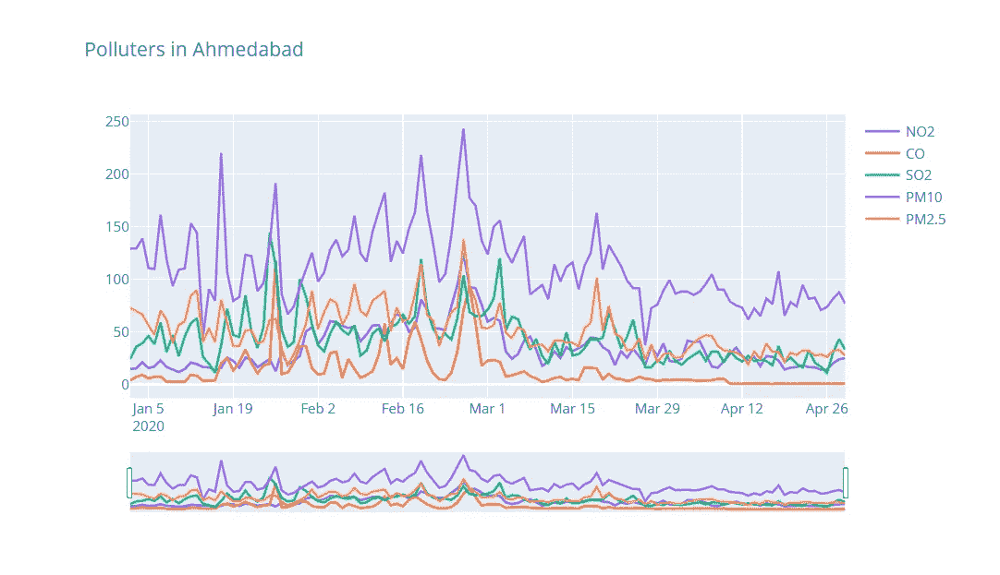

# 空气污染对我们生活的影响(新冠肺炎版)

> 原文：<https://medium.com/analytics-vidhya/impact-of-air-pollution-on-our-lives-6a686f4be02?source=collection_archive---------21----------------------->

许多国家已经决定将公民锁在家中。人们只能在需要外出时离开他们的房子，例如，去买些杂货。我怀疑在这场危机中空气污染有所减少，但问题是，减少了多少？

允许我们精确测量的国家之一是印度。因为我只能找到这个国家准确的污染数据，我将向你展示冠状病毒对这个国家污染的所有影响。

# **污染者**

有几个污染者你应该知道。我将在本笔记本中介绍以下内容:

NO2——二氧化氮

一氧化碳

SO2 —二氧化硫

PM10 —粗颗粒物质

pm 2.5——细颗粒物

这些构成了空气污染的大部分问题。当它们进入你的身体时，它们对生物都是有害的。

## **寻找有足够数据点的城市**

数据越多越好。我将挑选几个最受欢迎的城市在这篇报道中使用。

# **污染随时间推移**

下图显示了不同污染者在城市中的污染量。所有这些图表中最突出的一点是，空气污染在 3 月底左右显著下降。这与印度采取的措施相关，因为他们在 2020 年 3 月 25 日进入封锁状态。

图表中有几个峰值，其中一个是在 1 月 26 日，这可以用印度的“共和国日”来解释，这是一个全国性的节日。我真的无法解释从二月中旬到三月的高峰，但我认为这与季节和天气的变化有关，人们想去户外。

另一个突出的事实是，艾哈迈达巴德的二氧化碳排放量比其他城市高得多。这可能是由于交通非常拥挤的高峰时间造成的，但也可能是因为该市中心有一个国际机场，而其他城市的机场更多地位于机场之外。它还取决于测量这些数字的设备的位置。

​

# **空气质量指数**

空气质量指数可以告诉我们更多关于空气的实际质量，以及它对我们的危害有多大。AQI 通常只考虑六种污染者，分别是臭氧、一氧化碳、二氧化硫、二氧化氮、PM10 和 PM2.5(这些都是悬浮颗粒物)。AQI 越高，对我们的伤害越大。

上面的图表向我们展示了我们所掌握的所有数据点，来观察整个印度的空气污染情况。红色和紫色线是几天的平均值，黑色线是一天中的最大值，绿色虚线是世卫组织令人满意的空气质量标准。

# **前后措施**

在电晕测量前后，你可以非常清楚地看到这些辐射的热点。你可以看到排放量减少了 50%以上！

*【之前】*

[之后]

# **结论**

这项研究揭示了在封锁期间空气质量的调整。然而，为了实施短期(2-4 天)封锁作为减少污染的替代政策措施，应彻底分析其对经济的影响。由于成本充足性将是方法生产商在选择此类控制措施时的关键问题之一，此外，由于气象条件的季节间差异，一个地区的污染物浓度差异很大。因此，为了在每年一次或两次的长距离比赛中有效地实施这类措施，还需要对与区域气象条件相关的空气质量的季节性变化进行深入分析。

