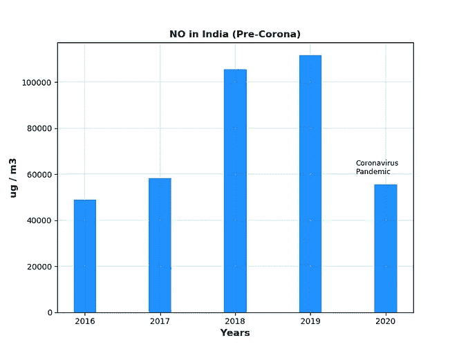
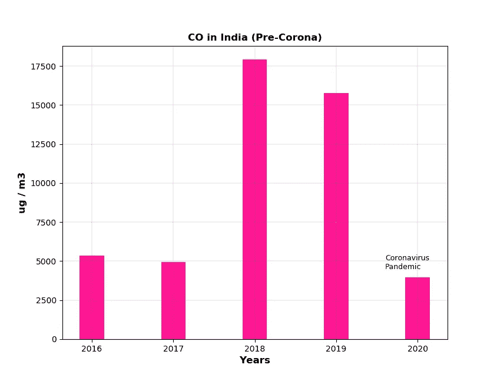
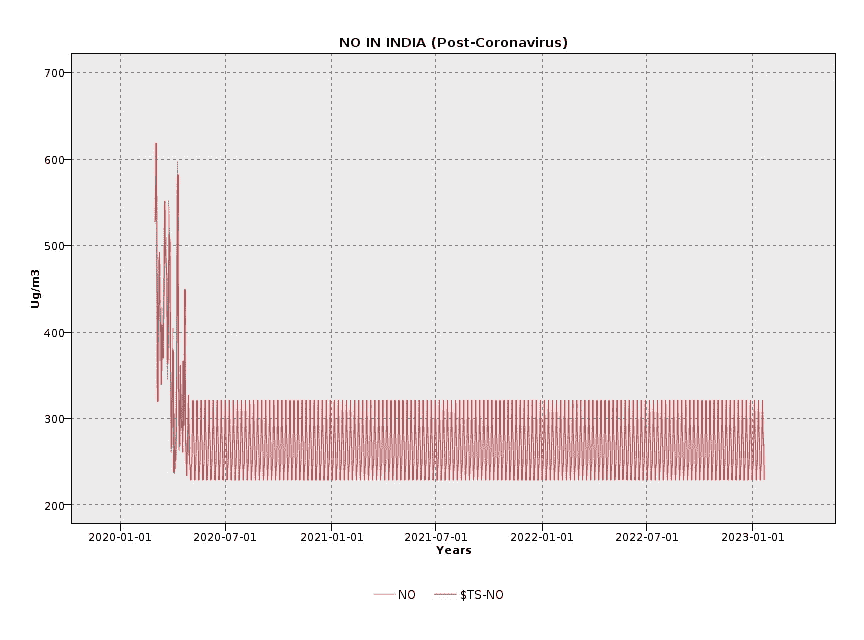

# 空气污染对我们生活的影响

> 原文：<https://medium.com/analytics-vidhya/impact-of-air-pollution-on-our-lives-bb1b09d5ecdf?source=collection_archive---------23----------------------->

空气污染使我们的地球更加有害和危险。一年比一年糟糕。新冠肺炎病毒使暴动污染得到控制。本文展示了对印度日冕前和日冕后期间空气污染影响的分析。

我把数据分析成两部分:

*   日冕前的疫情(2016 年至 2020 年)
*   电晕后的疫情(2020 年至 2023 年)

根据不同来源的可用数据，通过推断电晕后锁定和变化期间的电流变化，分析影响这一趋势的不同因素，以及这一趋势对我们生活的最终反映和影响。

# **前冠状病毒疫情(2016–2020)**

## **印度空气污染率(2016–2020)**

有不同类型的空气污染物对人类和环境都有害。颗粒物(PM2.5 和 PM10)、臭氧、一氧化碳、硫和氮的氧化物、氨是一些有害的空气污染物。这是冠状病毒出现前不同空气污染物比率的图像。

> **颗粒物(PM2.5 和 PM10)**

来自车辆的柴油废气是 PM 污染的主要来源。一些 PM 颗粒，如灰尘或烟雾，很大或很暗，可以用肉眼看到。但最具破坏性的颗粒是较小的颗粒，即 PM2.5 和 PM10。

PM2.5 是直径为 2.5 微米或更小的可吸入微粒。

PM2.5 水平逐年逐渐升高。2020 年表现出相对较低的水平。

PM10 是直径为 10 微米或更小的可吸入颗粒。

2019 年是 PM10 级别最高的一年。2020 年表现出相对较低的水平。

> **硫的氧化物(SO2)**

发电厂和机动车通过燃烧含硫燃料，尤其是柴油，产生这种污染物。二氧化硫可以在大气中反应形成微粒，对幼儿和哮喘患者的健康构成最大的威胁。

2018 年和 2019 年的大气 SO2 浓度较高。

> **氮氧化物(NO、NO2、NOx)**

氮氧化物会刺激肺部，削弱身体对肺炎和流感等呼吸道感染的防御能力。此外，它们有助于地面臭氧和颗粒物的形成。

2018 年和 2019 年显示高浓度的大气 NO、NO2、NOx。

> **氨(NH3)**

化学氨(NH3)是氮和氢的化合物，是农业和工业的副产品。

> **一氧化碳(CO)**

这种剧毒气体是由汽车和卡车燃烧汽油、柴油等化石燃料形成的。一氧化碳阻断大脑、心脏和其他重要器官的氧气供应。胎儿、新生儿和慢性病患者特别容易受到一氧化碳的影响。

2018 年和 2019 年显示高大气 CO。

> **臭氧(O3)**

当两种主要污染物在阳光和不流动的空气中发生反应时，就会产生二氧化碳。这两种主要污染物是氮氧化物(NOx)和挥发性有机化合物(VOCs)。臭氧(O3)是高度刺激性气体，是空气污染致死的主要原因。

2019 年，印度的 O3 水平非常高。

## **空气污染影响我们的生活。**

PM2.5、PM10 和 O3 污染物会导致严重的健康问题。肉眼看不到颗粒物质，这是印度主要的致死污染物。这些年来，导致死亡的污染物水平显著增加。下面这张导致死亡的污染物图表显示，到 2020 年，污染物会急剧减少。

印度因室外颗粒物(PM2.5 和 PM10)和臭氧(O3)导致的死亡率(每 10 万人)从 2016 年到 2020 年一直保持不变**。**

## **二氧化碳(CO2)释放造成的工业和车辆污染。**

火电行业、热生产商和其他能源行业燃烧煤等化石燃料来发电。煤/化石燃料的这种燃烧释放二氧化碳(CO2 ),这是导致全球变暖的主要污染物。

化石燃料的燃烧会释放二氧化碳和其他温室气体。这些碳排放通过将太阳能截留在大气中提高了全球气温。

印度的二氧化碳排放量逐年增加。2019 年，印度的排放量增长温和，电力部门的二氧化碳排放量略有下降，因为电力需求基本稳定，强劲的可再生能源增长促使燃煤发电量自 1973 年以来首次下降。

# 后冠状病毒疫情**(2020–2023)**

我使用 IBM SPSS Modeler 来推断 2023 年之前的封锁变化，以预测印度的空气污染水平。

由于政府对疫情冠状病毒的指导方针，我们被迫从三月中旬开始呆在室内。路上没有车辆，没有全日运转的工业。这无疑改变了印度的空气质量指数。

在这里，我记录了 2020 年 3 月至 2020 年 5 月(全面封锁期)的空气污染物水平。将这些数据外推至 2023 年，我们得到了“如果封锁期持续到 2023 年会怎样？”这个问题的答案

> **颗粒物(PM2.5)**

根据目前的锁定转移推断，到 2023 年，印度的 PM 水平可能会保持在 700 到 800 ug/m3(每天)。

**颗粒物(pm 2.5)——后疫情 2020 年至 2023 年**

> **硫的氧化物(SO2)**

根据目前的锁定转移推断，到 2023 年，印度的二氧化硫水平可能会保持在 200-250 微克/立方米(每天)。

**硫氧化物(SO2)——2020 年至 2023 年后的疫情**

> **氮氧化物(NO、NO2)**

根据目前的锁定转移推断，到 2023 年，印度的 NO 和 NO2 水平可能会保持在 200 到 300 ug/m3(每天)之间。

**氮氧化物(NO，NO2)——疫情 2020 年至 2023 年后**

> **臭氧**

根据目前的锁定转移推断，到 2023 年，印度的臭氧水平可能会保持在 600 至 650 微克/立方米(每天)。

**臭氧(O3)——后疫情 2020 年至 2023 年**

# 结论

在冠状病毒疫情期间，图表显示空气中所有污染物的水平都非常低。封锁使得人们呆在室内。道路上没有任何车辆，也没有任何行业在全时运转。印度的二氧化碳排放量显著减少，这是 40 年来的第一次。根据目前的锁定转移推断，到 2023 年，预测显示，空气污染物水平将保持在比冠状病毒前时期低 50%的水平。当空气污染物水平大幅下降时，空气污染对我们生活的影响也会减少。

疫情时期总有一天会结束，封锁很快就会结束。这意味着我们的预测发生的概率很低。在印度，政府和人民正在采取许多有效措施来降低空气污染水平。其中之一被称为“拼车”，一群人一起开车去上班或上学。路上行驶的汽车越少，意味着温室气体(GHG)排放量的减少和空气质量的改善。虽然如果封锁解除，我们建议人们在接下来的两年里保持社交距离。因此，为了保持社交距离，没有多少人可以一起出行(包括使用公共交通工具)，这将自动增加道路上的车辆数量。因此，电晕后空气污染方面的变化似乎很糟糕。一旦封锁结束，我们需要确定我们工作的优先次序，这样我们就不会频繁使用我们的车辆。

***参考:***

1.  [***https://www.iea.org/countries/india***](https://www.iea.org/countries/india)
2.  [***https://waqi.info/***](https://waqi.info/)
3.  [***https://app.cpcbccr.com/AQI_India/***](https://app.cpcbccr.com/AQI_India/)
4.  [***http://safar.tropmet.res.in/***](http://safar.tropmet.res.in/)
5.  [**【https://en.wikipedia.org/wiki/Air_pollution_in_India】**](https://en.wikipedia.org/wiki/Air_pollution_in_India)
6.  
7.  *[***https://www . the lancet . com/journals/LAN plh/article/piis 2542-5196(18)30261-4/full text***](https://www.thelancet.com/journals/lanplh/article/PIIS2542-5196(18)30261-4/fulltext)*