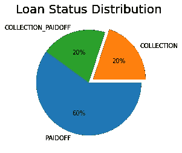

# 平衡不平衡的数据集(SMOTE)

> 原文：<https://medium.com/analytics-vidhya/impact-of-smote-on-accuracy-22b49855d08?source=collection_archive---------23----------------------->

不平衡数据集在现实世界中很常见。处理这些失衡是一项具有挑战性的任务。例如，在贷款偿还预测中，100 个案例中的违约者可能不到 20 个。当这些数据通过任何模型来预测违约者时，准确性将非常低，因为数据偏向于非违约者。

为了处理这种情况，我们可以使用重采样技术。以下是几种类型的重采样技术:

*   **过采样:**少数类值增加以匹配多数类的计数。
*   **欠采样:**多数类值减少，以匹配少数类的计数。
*   **过采样和欠采样的组合:**多数类值减少，少数类值同时增加。

上述增量或减量还可以使用不同的方式来完成。请浏览[这篇](https://imbalanced-learn.readthedocs.io/en/stable/api.html)文档，了解更多关于不同技术的信息。

在本文中，我们将尝试使用**kmeansmote**来理解过采样对这个样本数据[贷款数据](https://www.kaggle.com/zhijinzhai/loandata)的影响

请浏览这个 [kaggle 笔记本](https://www.kaggle.com/shivacharanpabba/loandata-analysis-prediction/notebook)，我在那里进行了基本的 EDA 和模型构建。

下图显示了贷款状态数据的分布(本例中为类)



**班级以 3:1:1 的比例分布**

当对给定数据应用逻辑回归和决策树时，F1 值分别为 **0.26** 和 **0.28** 。让我们尝试应用抽样方法来克服这个问题。

要执行过采样技术，需要安装以下库。

```
pip install imbalanced-learn==0.6.2
```

从这个库中，我们可以导入 KMeansSmote，如下所示:

```
from imblearn.over_sampling import KMeansSMOTE
```

我们可以应用 KMeansSmote，如下所示:

```
#X is the entire dataset except the class(i.e. loan_status)
#y is the class column (loan_status)
X = df_model.drop([‘loan_status’],axis=1)
y = df_model[‘loan_status’]smote = KMeansSMOTE(sampling_strategy='auto')#X_sm and y_sm is the resampled data
X_sm, y_sm = smote.fit_sample(X, y)
```

当逻辑回归和决策树应用于重采样数据时，F1 得分分别增加到 **0.72** 和 **0.74** 。

我希望这可能有助于您对过采样技术的影响有一个基本的了解。我们仍然可以通过超参数调整来提高精度。

请在这里找到笔记本做参考— [kaggle 笔记本](https://www.kaggle.com/shivacharanpabba/loandata-analysis-prediction/notebook)

欢迎在下面评论。

谢谢:)