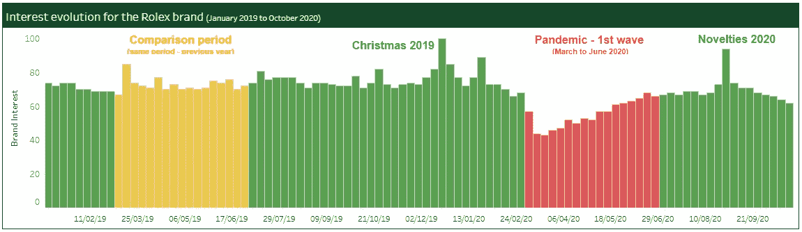
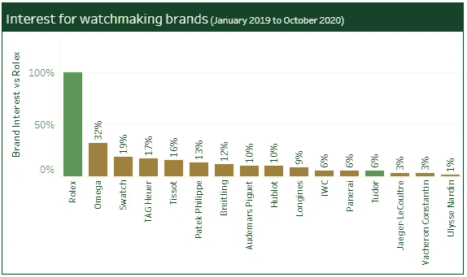
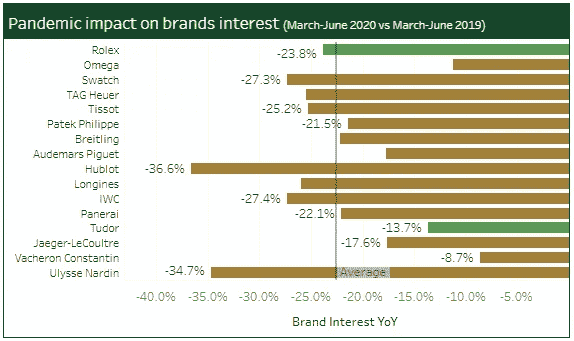
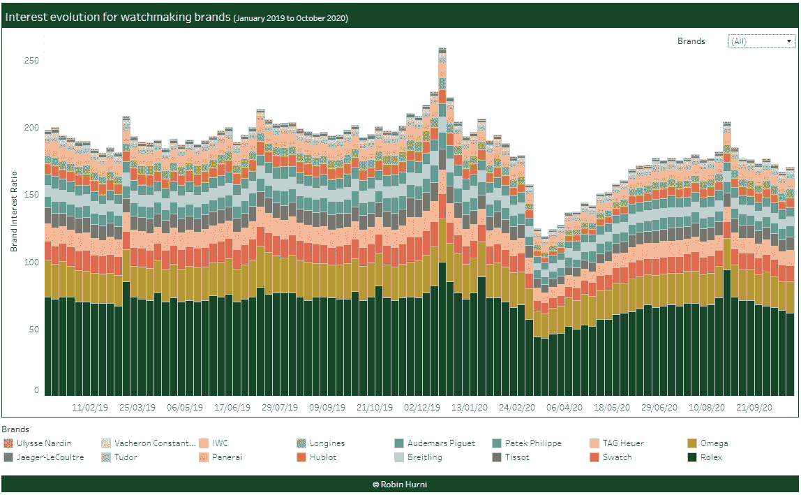
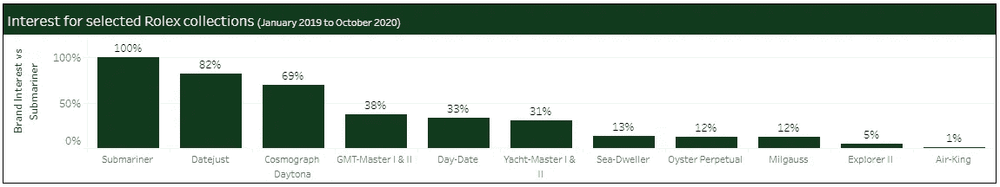
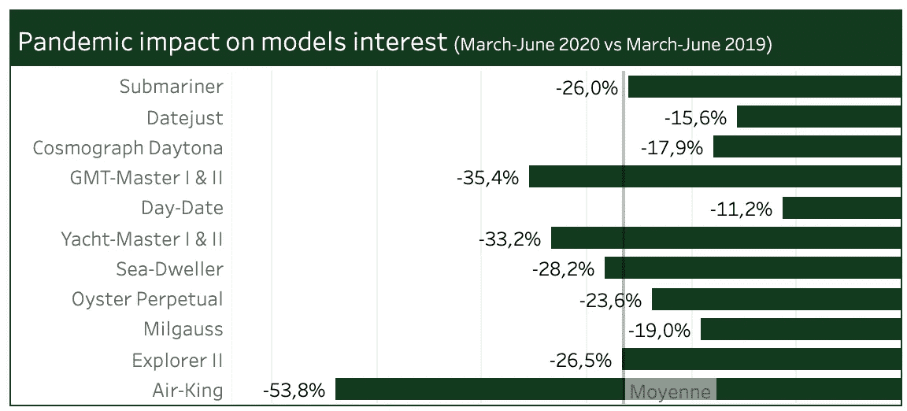
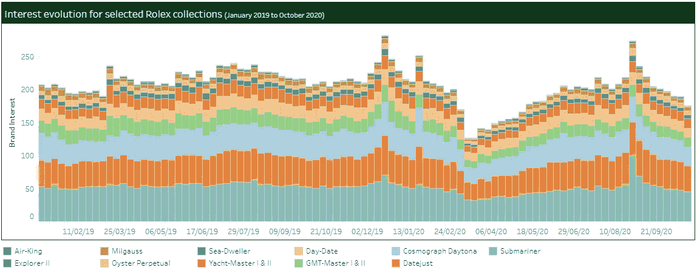
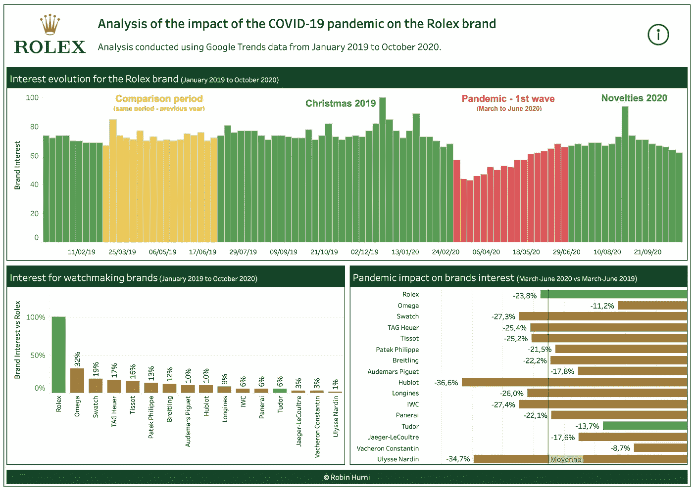

# 新冠肺炎疫情对劳力士品牌的影响

> 原文：<https://medium.com/analytics-vidhya/impact-of-the-covid-19-pandemic-on-the-rolex-brand-62b2056c21f8?source=collection_archive---------17----------------------->

瑞士制表业受到了 Covid 疫情的严重影响，尽管劳力士的品牌形象和韧性很好，但它也不例外。

这就是谷歌趋势数据所显示的在艰难时期人们对该品牌兴趣的反映。

在这项分析中，我提取了 2019 年 1 月至 2020 年 10 月期间 16 个瑞士制表品牌的谷歌搜索量。这一想法是为了分析第一波新冠肺炎疫情(2020 年 3 月至 6 月)期间搜索量的下降，并了解该行业受到的影响有多严重，以及一些品牌是否比其他品牌受到的影响更大。

自 2019 年 1 月以来对劳力士品牌的兴趣

如上图所示，2019 年的搜索次数(以该品牌搜索次数最多的一周的百分比表示)相当稳定，巴塞尔世界在 2019 年 3 月或假日季节在 2019 年 12 月出现小高峰。然而，进入 2020 年，我们看到 3 月份的大幅下降和非常缓慢的复苏，不会达到前一年的水平。我们在 2020 年 8 月看到了 2020 年新奇产品展示的高峰

# 劳力士不是唯一受影响的品牌

劳力士显然是世界上最著名的瑞士手表品牌，但正如我在这篇文章的导言中提到的，它不是唯一受疫情影响的品牌。

劳力士是最著名的品牌，搜索次数是第二品牌欧米茄的 3 倍

事实上，16 个品牌中的大多数都受到了类似程度的影响。Ulysse Nardin 和宇舶表分别下降了 35%和 37%，是受影响最大的品牌，而欧米茄和江诗丹顿受到的影响相对较小。

2020 年 3-6 月搜索量对比去年

自 2019 年以来，瑞士制表品牌的兴趣演变

# 劳力士系列/型号

劳力士有许多不同的型号和价位。潜水艇可能是最具标志性的模型，但正如我们所见，其他一些模型也产生了很多搜索，如 Datejust(仅比潜水艇少 18%)或臭名昭著的 Cosmograph Daytona。

劳力士潜水艇是最受关注的系列

人们对所有这些藏品的兴趣都受到了疫情的影响，但有些藏品表现出了比其他藏品更强的弹性。

疫情对劳力士模型兴趣的影响

2020 年，所有车型的兴趣都有所下降

# 想看更多吗？

我的 Tableau 账户仪表盘上的更多详情:[新冠肺炎·疫情对劳力士品牌仪表盘的影响](https://public.tableau.com/profile/robin.hurni#!/vizhome/Rolex-Analysisoftheinterestforthebrandduringthepandemic/Rolex)。

新冠肺炎对劳力士和瑞士制表业仪表板的影响预览

你也可以在[谷歌趋势](https://trends.google.com/)上做自己的搜索！