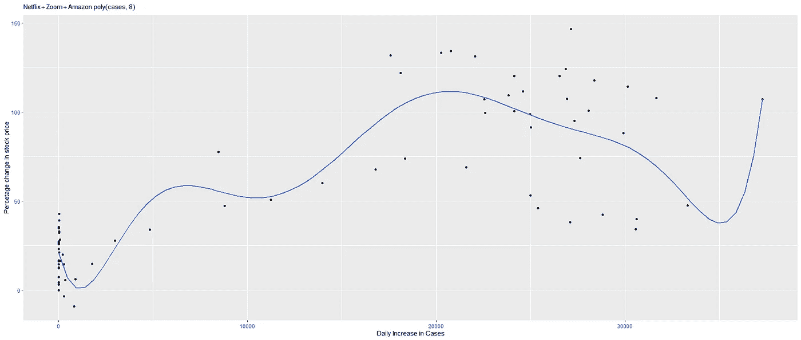

# 放松美国的封锁是个好主意吗？

> 原文：<https://medium.com/analytics-vidhya/impact-on-the-us-stock-market-with-the-increase-in-covid-19-cases-441107dc3ea2?source=collection_archive---------26----------------------->

[来源](https://gulfnews.com/business/global-crash-fears-as-coronavirus-hammers-us-economy-1.1588177710755)

在我之前的博客中，我讨论了不同年龄组和性别如何受到 COVID 19 ( [链接](/@jaswanth.badvelu/how-does-covid-19-affect-different-age-groups-and-genders-8347155a189))的影响。现在让我们看看美国股市如何受到 COVID 19 案件每日增加的影响，以及放松封锁是否会改善美国经济。

> 自 1 月 21 日美国确诊首例冠状病毒病例以来，迄今已有超过 150 万人受到新冠肺炎病毒的影响。4 月 12 日，美国成为全球死亡人数最多的国家，美国股市经历了最糟糕的一个季度。由于新增病例和死亡人数的增长趋于平稳，美国政府正计划放松封锁限制，以使经济恢复正常。

放松限制和开放业务的想法对美国经济来说将是一个巨大的风险，因为这将导致更多 COVID 19 案件的增加，最终导致股市再次崩溃。 [SeekingAlpha](https://seekingalpha.com/article/4333992-stock-market-risk-of-lifting-lockdown-restrictions) 发表的一篇文章称，为了短期经济利益而解除封锁可能会给市场带来更大的风险。BBC 发表的一篇文章称冠状病毒的传播可能会破坏经济。

随着严格的封锁到位，每天感染 COVID 19 病例的趋势似乎有点平缓。但是，放松封锁可能会导致病毒传播更快，并导致病例增加。下面是根据欧洲疾病预防控制中心网站([链接](https://www.ecdc.europa.eu/en/publications-data/download-todays-data-geographic-distribution-covid-19-cases-worldwide))公布的数据，显示美国每日新增病例趋势的图表。

**图 1。美国每日新增病例**

# 新冠肺炎对股票市场的影响

2020 年 3 月 4 日，美国政府宣布封锁，以应对新型冠状病毒的爆发。但是，由于 COVID 19 导致的案例在 2 月份开始增加，道琼斯和纳斯达克的股票市场价格变化百分比大幅下降。由于 COVID 19 导致病例数大幅上升，股市价格在 3 月份出现下跌。3 月 23 日，道·琼斯和[纳斯达克](https://finance.yahoo.com/quote/%5EIXIC/history?p=%5EIXIC)都创下了最低价，与 2 月 3 日的价格相比，道·琼斯下跌了 35%，纳斯达克下跌了 26%。随着每日病例数的减少，这两个市场在 5 月份都有所改善。下图显示了道琼斯和纳斯达克股票市场价格百分比变化的每日趋势。

**图二。道琼斯和纳斯达克股票市场的百分比变化趋势**

由于 1 月份因 COVID 19 而记录的案例数量非常少，因此从 2 月 3 日开始考虑股票价值的变化百分比。当从 2 月 3 日开始对案例的增加与股票市场的百分比变化进行单独关联时，道琼斯股票市场价格的变化显示出 47%的反向关联，而纳斯达克显示出 24%的反向关联。这意味着随着每天案件数量的增加，股票价值会下降。为了进一步证明这一点，这里是多项式回归模型。

图三。组合行业股票价格%变化与案例的多元多项式回归模型

在拟合模型时，以每日案例数量的增加为自变量，以道琼斯和纳斯达克股票价格百分比的变化为因变量。9 阶多项式回归模型显示了更好的拟合，调整后的 R 平方值为 0.72。该模型的 p 值为 3.57*10^-16，小于 0.05，因此推断结果具有统计学意义。可以观察到，总曲线在低于 0%股票价值时拟合。另外，从曲线中可以看出，随着案例的增加，股票价格在下降。

# COVID 19 对汽车工业的影响

甚至汽车行业的公司也显示了与上述类似的模式。随着 COVID 的增加，福特[和通用](https://finance.yahoo.com/quote/F/history?p=F)[的股价都下降了。这两家公司的股价在 3 月份下跌了 50%以上，并随着 COVID 19 导致的案例减少而缓慢回升。](https://finance.yahoo.com/quote/GM/history?p=GM)

**图 4。福特和通用汽车股票市场的百分比变化趋势**

福特股票市场价格的百分比变化显示出 72%的反向相关性，而通用汽车显示出 67 %的反向相关性。通用汽车公司和福特汽车公司股价的综合百分比变化与增长情况的多项式图如下所示。

图五。组合汽车行业股票价格%变化与案例的多元多项式回归模型

在这里，对于该数据，当拟合通用汽车公司和福特公司股票价格的组合百分比变化时，7 次多项式模型似乎是最佳拟合，调整后的 r 平方值为 0.86，p 值为 2.2*10^-16.

# COVID 19 对数字技术的影响

随着封锁的到位和 COVID 19 案件的增加，像 [Zoom](https://finance.yahoo.com/quote/ZM/history?p=ZM) 、[网飞](https://finance.yahoo.com/quote/NFLX/history?p=NFLX)和[亚马逊](https://finance.yahoo.com/quote/AMZN/history?p=AMZN)这样的数字技术的股价已经上涨。到 5 月份，Zoom 股票的价格几乎翻了一番。网飞和亚马逊的股价上涨了近 20%。

**图六。道琼斯和纳斯达克股票市场的百分比变化趋势**

这里，当与案例相关时，Zoom 股票市场价格的百分比变化显示了 74.6%的相关性，而网飞和亚马逊分别显示了 61%和 64%的相关性。下图显示了网飞、亚马逊和 Zoom 的股价变化百分比与案例增长的多项式图。

图 7。综合技术行业股票价格百分比变化与案例的多元多项式回归模型

八阶多项式回归模型显示了更好的拟合，当通过将案例数量的每日增加作为自变量，将亚马逊、Zoom 和网飞股票价格百分比变化作为因变量进行拟合时，调整后的 R 平方值为 0.73%。模型的 p 值是 2.2*10^-16.这里可以观察到，总曲线在 0%股票价值以上拟合。同样，从曲线中可以看出，随着案例的增加，股票价格也在增加。

# COVID 19 对石油的影响

甚至[油价](https://oilprice.com/oil-price-charts/45)也显示出与汽车行业相似的趋势。随着 COVID 19 病例的增加，油价在 2 月份开始缓慢下降，并在 3 月份有所下降。4 月 22 日，油价首次跌破 0。

图 8。油价的每日趋势

图九。识别大纲视图的方框图

当与病例的增加相关联时，油价的变化显示出 79%的反向相关性。

在进行回归模型之前，应识别并移除异常值。可以从图 9 中识别出异常值。这里，由于只有一个值是负的，这可能会影响回归模型。油价变化与油价上涨的多项式模型如下所示。

图 10。油价变化的多项式回归模型与案例

此处，当调整后的 r 平方值为 0.93 且 p 值为 2.2*10^-16.时，7 次多项式模型似乎是最佳拟合模型

# **结论**

可以得出结论，美国股票市场的价格与每天增加的案例呈负相关。美国股市开始缓慢复苏，每天报告的 COVID 案例数量减少了 19 起。如果封锁放松，可能会导致病毒的传播和 COVID 19 病例的增加，最终可能导致股票市场价格进一步下跌。

# 数据

所有的股票市场价格数据都是从[雅虎财经](https://finance.yahoo.com/lookup)收集的，这些数据是可靠的，与 COVID 19 相关的数据是从 [ECDC](https://www.ecdc.europa.eu/en/publications-data/download-todays-data-geographic-distribution-covid-19-cases-worldwide) 收集的。