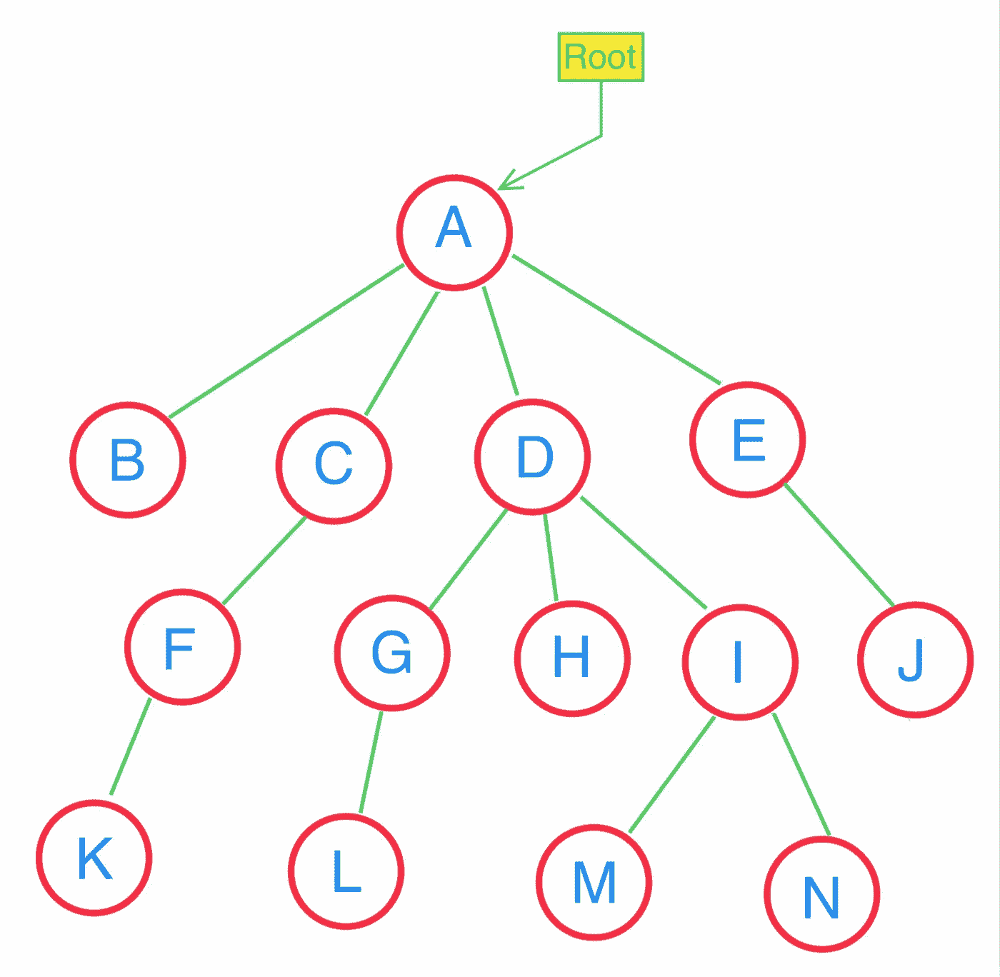
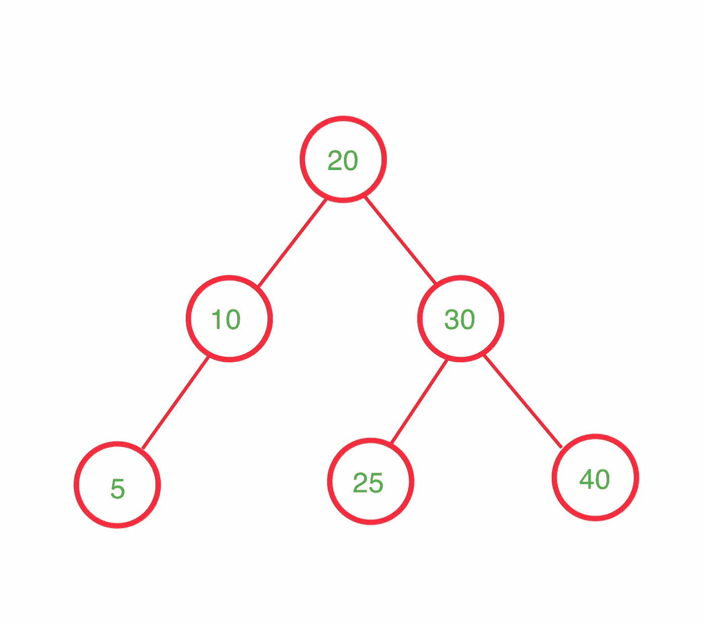
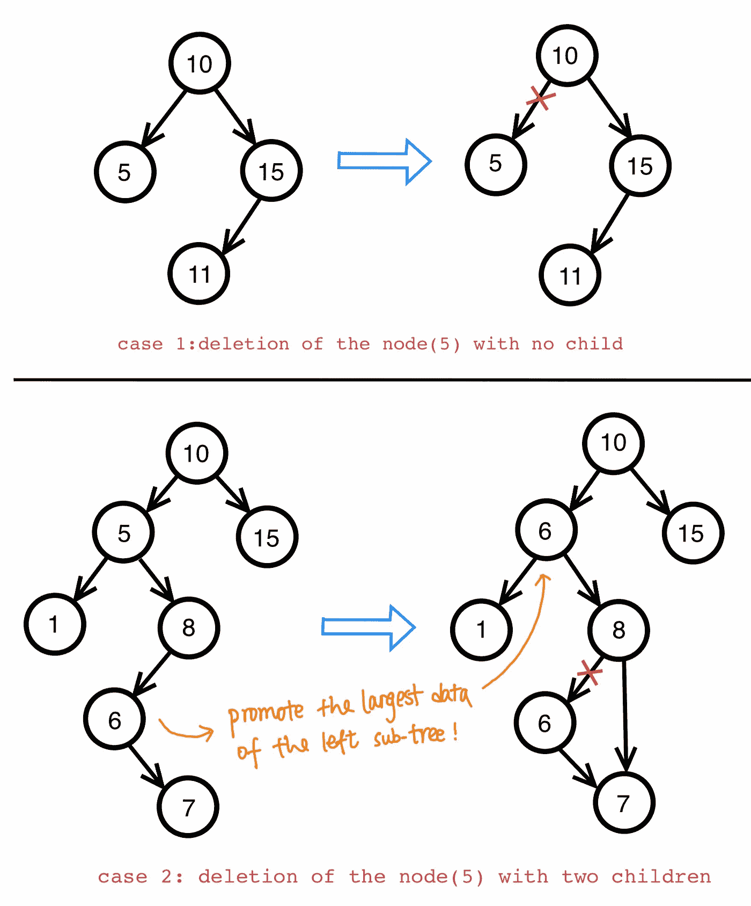
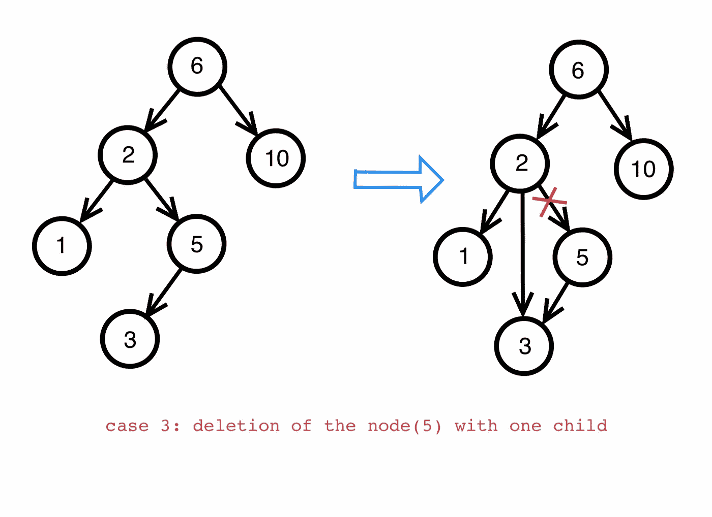

# 在 Ruby 中实现二叉查找树

> 原文：<https://medium.com/analytics-vidhya/implement-a-binary-search-tree-in-ruby-c3fa9192410b?source=collection_archive---------2----------------------->


我之前的帖子介绍过 [**单链表**](/analytics-vidhya/implement-a-linked-list-in-ruby-2aae925acd9c) 。由于链表在插入和删除元素方面的性能，它是一种广泛使用的数据结构。但是，如果数据集中有一个顺序，并且您希望非常频繁地搜索某个特定的项目，那么链表不是最佳选择，因为它的线性搜索时间很长。我们正在寻找的是一个简单的数据结构，其大多数操作的平均运行时间是次线性的。我们提到的数据结构是**二叉查找树(BST)** 。

## 树是什么，我们为什么想要它？

**树**是一种数据结构，用于以**层次模式**存储数据。它由节点组成。一棵树有一个顶级节点(称为根节点)和一堆更低的节点。每个节点只能有一个父节点(根节点除外)，但可以有零个或多个子节点！



一棵简单的树

这种独特的数据结构有很多好处。关于树的一个伟大的事情是每个节点看起来像它自己的**子树**。这意味着我们可以通过使用**递归**来节省代码。此外，二叉查找树经常用于搜索。搜索操作只需要 O(log(n))的运行时间。

## **BST 的特性**

二叉查找树是一种树数据结构。它和树有相同的结构。但是有它自己的特性:

*   在二叉查找树中，每个节点只包含一个左子节点和一个右子节点；
*   左子树中的每个节点的数据值比该节点的数据值小**；**
*   右边子树中的每个节点的数据值大于(或等于)节点的数据值



一个二叉查找树

你可以用这个[网站](https://www.cs.usfca.edu/~galles/visualization/BST.html)来玩玩，看看 BST 是怎么构造的！

# 和我一起用 Ruby 编写 BST 代码吧！

## **步骤 1:为节点和 BST 创建一个类**

BST 由节点组成。每个节点都有一个值，两个指针分别指向左右两个子节点。我们可以先实现一个节点类:

```
class TreeNode
    attr_accessor :value, :left, :right ** #node is initialized with a value, and two children are nil**
    def initialize(value)
        @value = value
        @left = nil
        @right = nil
    end
end
```

节点类到此为止！超级简单吧？

现在让我们编写一个 BST 类:

```
class BST
    attr_accessor :root, :size def initialize()
        @root = nil
        @size = 0;
    end
end
```

我在这里为 BST 设置了两个变量:**根**和**大小**因为:1)。BST 必须有一个根。这是树的起点。2):为了简化计算，当我们插入或删除一个节点时，我们可以很容易地给类变量@size 加 1 或减 1。

## **第二步:实例方法:插入(值)**

回想一下 BST 的属性:**左子**的值是**小于**本身的值，**右子**的值是**大于**本身的值。这就是插入新值的模式。当我们看到一个新值时，我们想把它和根的值进行比较，如果新值大于根的值，我们就向右走。否则，我们走左边。

```
def insert(value)
    if @root == nil
        @root = TreeNode.new(value)
    else
        curr_node = @root
        previous_node = @root #**while loop helps finding the position of insertion**
        while curr_node != nil
            previous_node = curr_node
            if value < curr_node.value
                curr_node = curr_node.left
            else
                curr_node = curr_node.right
            end
        end
        if value < previous_node.value
            previous_node.left = TreeNode.new(value)
        else
            previous_node.right = TreeNode.new(value)
        end
    end
    @size += 1
end
```

## **第三步:实例方法:find_min()和 find_max()**

显然，最小值节点是最左边的子节点。最大值节点是最右边的子节点。

```
def find_max(node = self.root)
    if node == nil
        return nil
    elsif node.right == nil
        return node
    end
    return find_max(node.right)
enddef find_min(node = self.root)
    if node == nil
        return nil
    elsif node.left == nil
        return node
    end
    return find_min(node.left)
end
```

## 第四步:实例方法:包含(值)？

这是一个布尔函数，当 BST 有我们传入的值时，它将返回 true。

```
def contains?(value, node = self.root)
    if node == nil
        return false
    elsif value < node.value
        return contains?(value, node.left)
    elsif value > node.value
        return contains?(value, node.right)
    else
        return true
    end
end
```

代码背后的算法是，我们递归地找到左子树和右子树，看看节点的值是否匹配我们想要找到的值。

## **第五步:实例方法:print()**

对于 BST，有四种常见的遍历:

*   **按序**:先递归处理左边的节点，然后是这个节点，再递归处理右边的节点。这将导致“正常秩序”
*   **预排序**:先处理这个节点，然后递归处理左边的节点，再递归处理右边的节点
*   **后序**:递归处理左边的节点，然后是右边的节点，然后是这个节点
*   **Level-order** :根据深度处理节点:首先是最接近根的节点，然后是更低的节点。

这里，我将使用**有序遍历**来实现我的 print():

```
def print_in_order(node = self.root)
    if node != nil
        print "("
        print_in_order(node.left)
        print ", #{node.value}, "
        print_in_order(node.right)
        print ")"
    end
end
```

## **第六步:实例方法:移除(值)**

当我们想从 BST 中删除一个节点时，我们需要考虑三种情况:

*   如果节点有**零个子节点:**它是‘叶子’节点，我们可以简单地从树中删除；
*   如果节点有**一个子节点**(左子或右子):我们移除这个节点后，需要将其子节点提升到该位置；
*   如果节点有**两个子节点**:我们需要找到一个候选来提升。候选者可以是右边子树的最小数据或左边子树的最大数据。

我画了一些图表来说明这些情况:



```
def remove(value, node = self.root)
    removeHelper(value, node = self.root)
    @size -= 1
    node
endprivate
**#this helper method will avoid the multiple size decreses in recursion**
def removeHelper(value, node = self.root)
    if node == nil
        return nil
    end
    if node.value > value
        node.left = removeHelper(value, node.left)
    elsif node.value < value
        node.right = removeHelper(value, node.right)
    else
        if node.left != nil && node.right != nil
            temp = node
            min_of_right_subtree = find_min(node.right)
            node.value = min_of_right_subtree.value
            node.right = removeHelper(min_of_right_subtree.value, node.right)
        elsif node.left != nil
            node = node.left
        elsif node.right != nil
            node = node.right
        else
            node = nil
        end
    end
    return node
end
```

## **第七步:实例方法:clear()**

clear()是一个简单的方法:我们将根设置为 nil，并将大小重置为零！

```
def clear()
    self.root = nil
    self.size = 0
end
```

## **第八步:实例方法:size()**

这是最简单的方法！因为我们已经有了一个代表树的大小的类变量@size，在这里，我们可以简单地返回这个值:

```
def size()
    @size
end
```

这就是我实现 BST 的全部内容！你可以在这里查看全部代码: [*链接*](https://gist.github.com/wyy1234567/c07b38530ce4e400cdfa278cb4bb3425) 。

感谢你阅读这篇文章，我希望它会有所帮助！