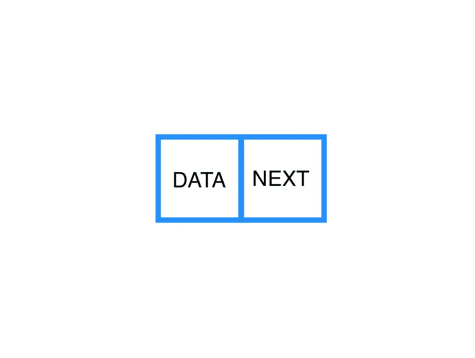
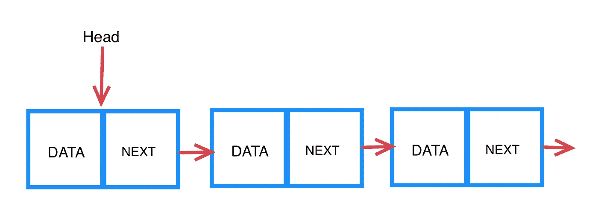
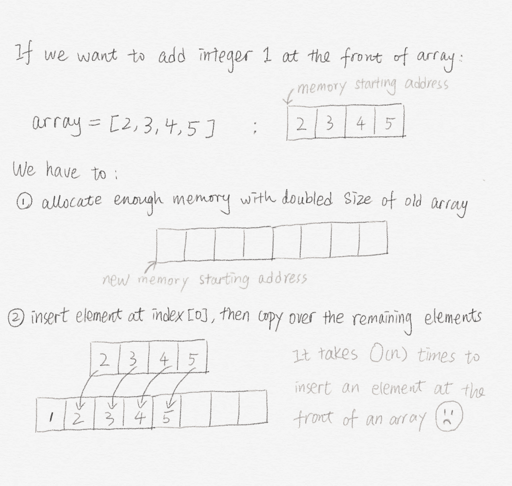

# 在 Ruby 中实现一个链表

> 原文：<https://medium.com/analytics-vidhya/implement-a-linked-list-in-ruby-2aae925acd9c?source=collection_archive---------2----------------------->

在技术面试中，你可能会经常遇到一种叫做“链表”的数据结构。如果你不熟悉这种数据结构，这个博客将帮助你理解:

1.  什么是链表？
2.  为什么我们需要链表？
3.  如何在 Ruby 中实现链表？

# 什么是链表？

链表是存储和管理数据的基本数据结构。顾名思义，链表是元素的线性集合。链表以一种特定的方式存储数据:它由**个节点**链接。每个节点由两部分组成:T2 数据部分 T3 和 T4 指针部分 T5。显然，数据段是存储数据的地方，指针段会指向下一个节点。



简单节点

我们可以有大量的节点来存储各种类型的数据，比如整型、浮点型、散列表，甚至是类实例！

好了，在我们熟悉了节点之后，让我们把它们链接在一起，建立一个链表！



一个链表

上面是一个简单的单链表的格式。每个链表都是由节点链接的。而且它必须有一个起点，指向开头的**头** **节点**。随着每个后续节点指向下一个节点，我们已经建立了一个链表！那很简单！

# **我们为什么需要链表？**

我们已经使用**数组**数千次了。数组在存储和管理数据方面有很好的性能。为什么我们仍然需要一个链表？好吧，继续读！

当我们创建一个数组时，内存会给它一个特定的空间。当一个数组被初始化时，这个内存空间是固定的。这一特点限制了阵列在管理数据方面的性能。

举个例子，如果我们想在一个数组中插入一个新元素，那么处理的时间是 O(n)次(n 是这个数组的长度)。相同的运行时间适用于删除、合并等。



在数组前面插入元素的示例

**链表**在管理数据方面有更好的表现。由于它是动态存储在内存中的，链表可以重组，合并，插入很容易与 O(1)运行时间！

# 如何在 Ruby 中实现链表？

为了实现一个链表，我们需要首先创建节点类。

下面是我编写的实现 node 类的代码:

记住**节点有两个部分:数据和下一个。**当我们用传入数据构建一个节点时，该节点将被初始化为:

```
@data = data  
@next = nil 
```

🥳 🥳 🥳现在，我们准备建立一个🥳 🥳 🥳链表

哦，等等🤔

在开始编码之前，我们先做一些设计:链表需要的功能有哪些？

好吧，如果我们把链表当作一个数组，那么我们可能要做以下任务:

1.  在链表的前端/末端添加新数据
2.  从链表的前端/末端移除元素
3.  计算链表的大小
4.  打印链接列表
5.  清除整个链表

👩‍💻酷！让我们编码👩‍💻

```
class LinkedList #is_empty?: return true if the linked list is empty
    def is_empty?
        if @head == nil
            return true
        else
            return false
        end
    end #push: given a data, add a new node in the end
    def push(data)
        if self.is_empty?
            @head = Node.new(data)
        else
            current_node = @head
            new_node = Node.new(data)
            while current_node.next != nil
                current_node = current_node.next
            end
            current_node.next = new_node
        end
    end #unshift: add a new node in the front
    def unshift(data)
        if self.is_empty?
            @head = Node.new(data)
        else
            curr_head = Node.new(data)
            curr_head.next = @head
            @head = curr_head
        end
    end #pop: remove the last node and return it
    def pop
        if self.is_empty?
            return "This list is currently empty"
        else
            current_node = @head
            while current_node.next.next != nil
                current_node = current_node.next
            end
            last_node = current_node.next
            current_node.next = nil
        end
        last_node
    end #shift: remove the first node and return it
    def shift
        if self.is_empty?
            return "This list is currently empty"
        else
            curr_head = @head
            new_head = @head.next
            @head.next = nil
            @head = new_head
        end
        curr_head
    end #size: return the length of linked list
    def size
        if self.is_empty?
            count = 0
        else
            count = 1
            current_node = @head
            while current_node.next != nil
                current_node = current_node.next
                count += 1
            end
        end
        count
    end #pretty_print: print the current linked list as an array
    def pretty_print
        array = []
        current_node = @head
        if self.is_empty?
            return array
        else
            while current_node.next != nil
                array << current_node.data
                current_node = current_node.next
            end
            array << current_node.data
       end
       array
    end #clear: clear the whole linked list
    def clear
        @head = nil
    end
end
```

以上是我实现的一个链表。您可以通过创建几个节点和列表来玩它，看看当您对它们应用方法时会发生什么！

查看 GitHub 上的代码！

## 我们来做些测试吧！

让我们首先创建一个新的链表实例:

```
list = LinkedList.new
=> #<LinkedList:0x00007fcd4c2fc6e8>
```

看起来不错！我们的列表现在是空的，让我们添加一些项目:

```
> list.push(1)
=> #<Node:0x00007fcd4d013cf0 [@data](http://twitter.com/data)=1, [@next](http://twitter.com/next)=nil>> list.push(2)
=> #<Node:0x00007fcd4c99c340 [@data](http://twitter.com/data)=2, [@next](http://twitter.com/next)=nil>> list.push(3)
=> #<Node:0x00007fcd4c9ac718 [@data](http://twitter.com/data)=3, [@next](http://twitter.com/next)=nil>> list.push(4)
=> #<Node:0x00007fcd4c1157f8 [@data](http://twitter.com/data)=4, [@next](http://twitter.com/next)=nil>> list
=> #<LinkedList:0x00007fcd4c2fc6e8 [@head](http://twitter.com/head)=#<Node:0x00007fcd4d013cf0 [@data](http://twitter.com/data)=1, [@next](http://twitter.com/next)=#<Node:0x00007fcd4c99c340 [@data](http://twitter.com/data)=2, [@next](http://twitter.com/next)=#<Node:0x00007fcd4c9ac718 [@data](http://twitter.com/data)=3, [@next](http://twitter.com/next)=#<Node:0x00007fcd4c1157f8 [@data](http://twitter.com/data)=4, [@next](http://twitter.com/next)=nil>>>>>
```

我们还可以在开头加上一项:

```
> list.unshift(0)
=> #<Node:0x00007fcd4c2857c8
 [@data](http://twitter.com/data)=0,
 [@next](http://twitter.com/next)=
  #<Node:0x00007fcd4d013cf0
   [@data](http://twitter.com/data)=1,
   [@next](http://twitter.com/next)=
    #<Node:0x00007fcd4c99c340
     [@data](http://twitter.com/data)=2,
     [@next](http://twitter.com/next)=
      #<Node:0x00007fcd4c9ac718
       [@data](http://twitter.com/data)=3,
       [@next](http://twitter.com/next)=#<Node:0x00007fcd4c1157f8 [@data](http://twitter.com/data)=4, [@next](http://twitter.com/next)=nil>>>>>> list
=> #<LinkedList:0x00007fcd4c2fc6e8 [@head](http://twitter.com/head)=#<Node:0x00007fcd4c2857c8 [@data](http://twitter.com/data)=0, [@next](http://twitter.com/next)=#<Node:0x00007fcd4d013cf0 [@data](http://twitter.com/data)=1, [@next](http://twitter.com/next)=#<Node:0x00007fcd4c99c340 [@data](http://twitter.com/data)=2, [@next](http://twitter.com/next)=#<Node:0x00007fcd4c9ac718 [@data](http://twitter.com/data)=3, [@next](http://twitter.com/next)=#<Node:0x00007fcd4c1157f8 [@data](http://twitter.com/data)=4, [@next](http://twitter.com/next)=nil>>>>>>
```

太复杂了，无法理解我们列表里面的内容。我们可以利用***#漂亮 _ 打印*** 的方法来看看:

```
> list.pretty_print
=> [0, 1, 2, 3, 4]> list.size
=> 5
```

现在更清楚了！

您可以尝试其他方法来更好地理解链表🤓