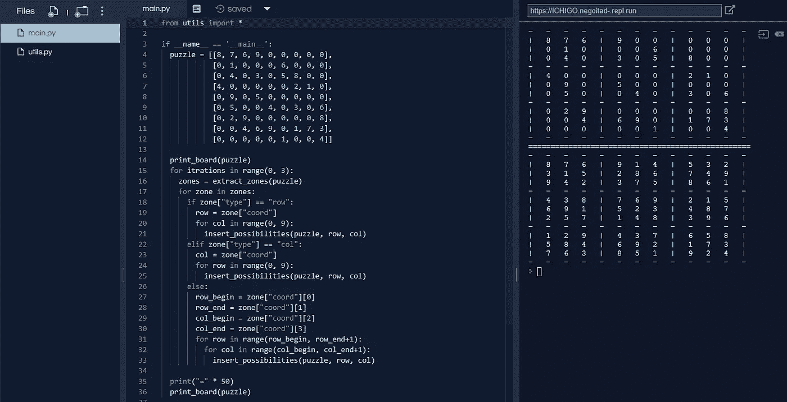
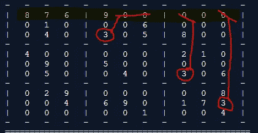
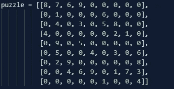
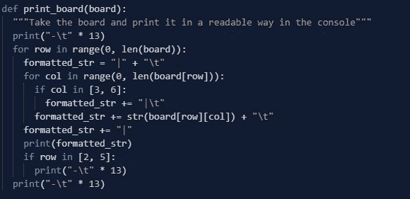
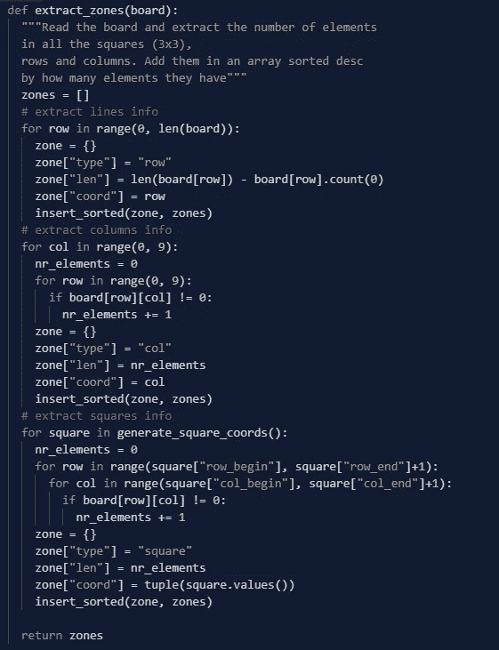
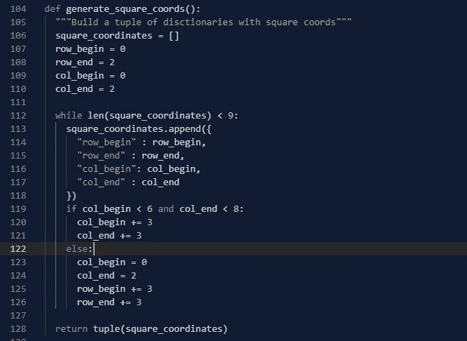
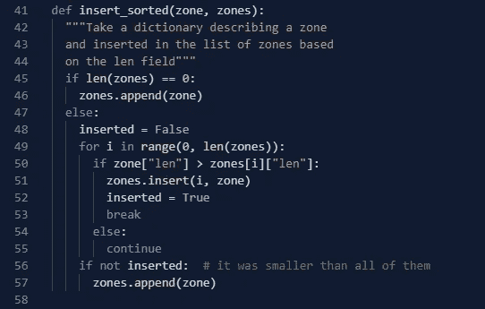
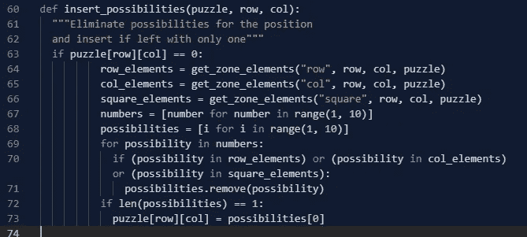
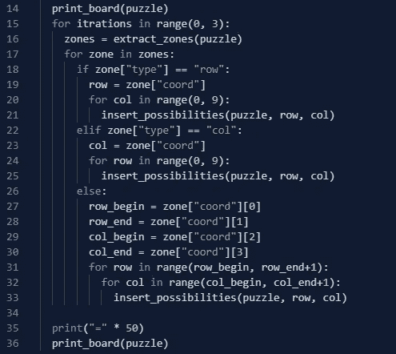

# 实现一个没有回溯的数独算法[初学 Python]

> 原文：<https://medium.com/analytics-vidhya/implement-a-sudoku-algorithm-without-backtracking-beginner-python-353de7217d4c?source=collection_archive---------2----------------------->

大多数与用程序解决数独相关的教程和算法会给你指出一个回溯实现的解决方案。**回溯**是一种算法，递归地尝试潜在的解决方案，并删除那些不起作用的方案。现在，如果目的是学习和练习算法，数独将做得非常好，但是，在许多情况下，回溯具有很高的复杂性，并且由于其**暴力**方法，往往会散发出缺乏正确理解问题的气味。让我们深入探讨一下如何做到没有！

# 理解问题

在数独游戏中，我们需要用从 1 到 9 的数字(包括 1 和 9)填充空白方块(在我们的例子中是 0 ),这样它们就不会在它们的列、行或 3×3 子部分中重复。我们可以通过在同一个地方尝试不同的可能性来实现这一点，继续下去，直到出现问题，然后修改，但这不是我解决这个难题的首选方法。相反，我们可以做的是分别选择线、列或 3×3 的子部分，尝试看看哪些点只有一种可能性，并完成它们。我的意思是，用我难以置信的绘画技巧:

在顶行插入一个 3

如果我尝试完成第一行的一些元素，用黄色突出显示，我可以看到我可以准确地确定它的 3 值应该在哪里。唯一的可能是在倒数第二的位置。我们可以对每一行、列和子部分重复这个过程。这不会完成棋盘，但我们可以根据需要重复做多次，直到我们完成了每个位置的唯一可能性，消除了尝试和纠正的需要。让我们开始编码吧！

*(我会在文末链接源代码，只会粘贴图片)*

# 安装

这里我们将使用基于函数的方法。棋盘将保存在一个矩阵中，这是一种奇特的说法，即数组的数组，或者在 Python 中是列表的列表，其中每个列表代表一行，它看起来像这样:

> 拼图= [[8，7，6，9，0，0，0，0，0]，[0，1，0，0，0，6，0，0]，[0，4，0，3，0，5，8，0，0]，[4，0，0，0，0，2，1，0]，[0，9，0，5，0，0，0，0，0]，[0，5，0，0，0，0，4，0，3，0，6]，[0，0

但是我们可以把它想象成如下:

这仍然不是很好，所以我们可以做的是编写一个函数来获取这个矩阵(从现在开始称为 board ),并以一种更加可读和友好的方式将其打印到控制台中。

我不会在这个函数上花太多时间，但它主要做的是用我们在上面看到的“|”和“-”分隔符将数组打印出来，这样它看起来更像一个真正的数独板。

# 获取有关区域的信息

我们所说的“区域”是指行、列和 3×3 的子部分(从现在开始我们将称之为*方块*，因为它们是很小的方块，我最初编写代码时并没有什么灵感。我们将保留一个**字典列表**，其中每个字典描述一个区域:它是什么类型(row，col，square)，它已经有多少个非零元素(我们马上会看到为什么)，以及我们可以在什么坐标上找到它:如果它是一个行或一个列，坐标是我们可以找到它的索引(就像任何其他编程语言一样，我们从 0 开始计数)，如果它是一个正方形，我们可以存储它的顶行开始和结束的位置以及它的第一列开始和结束的位置。

用于提取区域信息的函数

由于 board 是一个列表的列表，每个列表代表一行，当我们想要迭代行时，可以使用 **len(board)** 。为了访问一个特定的元素，我们使用 **board[row][col]** 。这个函数的解释中缺少了两件事，一是我们调用的 **generate_square_coords()** 函数，二是我们没有将描述一个区域的字典附加到最初定义的列表中，而是使用另一个名为 **insert_sorted()** 的函数，如注释所述，确保名为 **zones** 的列表按照每个区域已经有多少个元素(非 0)的降序排序。让我们依次探讨这些问题。

在这里，我们制作了另一个列表，我们在其中添加了字典，包括我们已经看到的条目“row_begin”、“row_end”、“col_begin”、“col_end”。它会给我们棋盘上每个方块的坐标，然后我们在返回之前将列表转换成一个**元组**，因为元组是**不可变的**(我们不能在之后改变它的元素)，不像列表，我们不想意外地让另一段代码修改它们。

> ***注意*** *:这种完全平方坐标的方法有点复杂，很适合重构！*

其次，我们希望将我们的区域描述字典以排序的方式插入到区域列表中，具有最多元素的字典位于列表的开头。为什么？因为我们想先试着把它们填满。因为它们有更多的元素，我们有可能更快地找到缺失的部分。实现这一点的代码如下:

请记住，每个区域描述字典都有一个“len”字段，我们在其中存储了非零元素的数量。

**重述！**我们现在可以:

*   将棋盘分成由行、列和正方形组成的区域
*   查看每个区域中已经存在的元素数量
*   按照我们的区域已经拥有的元素数量来排列它们

# 插入可能性

我们现在需要开始迭代棋盘/拼图，并尝试确定哪些位置只支持一个数字和一个数字，并填充该位置。所以，很自然地，我们要为此写一个函数，但是让我们首先考虑这个函数应该如何工作。我们应该将我们考虑的位置的坐标(行和列索引)作为参数。然后，我们应该看到哪些元素与我们考虑的位置在同一行、同一列、同一正方形/3x3 子部分中。基于此，我们可以排除进入该插槽的可能性。如果只剩下一种可能性，我们就插入它。代码可能如下所示:

这里我们应该注意一些事情。首先，在第 67 和 68 行，我们使用了一个非常漂亮的 Python 特性，叫做 **list comprehensions。**它们允许我们根据我们在[ ]之间定义的一些逻辑快速生成一个列表。这种逻辑允许我们迭代一些东西，甚至进行一些轻微的转换和过滤。第 67 行基本上是说*给我一个数字列表，其中每个数字都来自生成器范围(1，10)* 。假设您想要从 0 到 100 的每个偶数的平方根。您可以使用列表理解，例如**results =[number * * 2 for number in range(0，101) if number % 2 == 0]** 。

其次，这里没有回报。这个函数修改了驻留在它外面的谜题变量。这意味着它不是一个纯粹的函数，你应该小心，因为这不一定是一个推荐的方法，热衷于函数式编程的人会抓狂，但是对于我们的目的来说，这就足够了。

最后，我们使用尚未定义的 **get_zone_elements()** 。该函数只需从我们的位置所属的行、列和正方形中返回元素，并且可以通过多种方式实现，因此我们不会在此坚持，但您可以查看 repl.it 上的代码。

# 包扎

我们有开始解决问题所需的一切！我建议把上面提到的所有函数放在一个单独的文件中，然后把所有的东西都导入到一个类似“main.py”的文件中，这样我们就可以编写使用它们的逻辑了。我们需要做的是得到棋盘上的所有区域，遍历一个区域中的所有元素，如果唯一可能的话，尝试插入一个数字。我在上面提到过，这样做一次通常不能解决问题，所以我们应该将所有这些放在一个 for 循环中，重复逻辑 2 到 3 次。以下是我所知道的:

你可以在这里找到代码:[https://repl.it/@negoitad_/ICHIGO](https://repl.it/@negoitad_/ICHIGO)

请随意尝试，到处玩，并在对您没有意义的地方进行重构。如果你有任何问题，请联系我们，继续努力😎