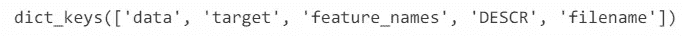
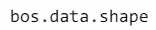
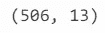
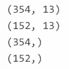
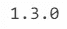
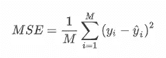
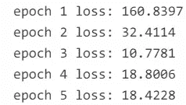
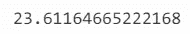
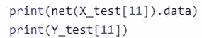
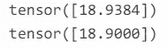

# 用 PyTorch 实现波士顿住房数据集的线性回归

> 原文：<https://medium.com/analytics-vidhya/implement-linear-regression-on-boston-housing-dataset-by-pytorch-c5d29546f938?source=collection_archive---------3----------------------->


由 [Unsplash](https://unsplash.com?utm_source=medium&utm_medium=referral) 上 [Ksenia Makagonova](https://unsplash.com/@dearseymour?utm_source=medium&utm_medium=referral) 拍摄的照片

本文旨在与您分享一些在真实数据集上实现线性回归的方法，包括数据分析、数据集分割和回归构造本身。为了学好 PyTorch，我将演示 PyTorch 的回归，并向您展示 PyTorch 在向前和向后方面的魅力。

这个故事有一个假设，即所有的读者都熟悉线性回归的原理。读者要了解方程 Y = XW + b 的 W 和 b 的含义和求解方法，要有更好的体验，最好了解一下可以用来解题的梯度下降法，了解一下用来评估回归性能的 MSE。

# 波士顿住房数据集处理

[波士顿住房数据集](https://www.cs.toronto.edu/~delve/data/boston/bostonDetail.html)由美国人口普查局收集，涉及波士顿马萨诸塞州地区的住房。

**我们需要的包**

我们利用 sklearn 中构建的数据集来加载我们的住房数据集，并由 pandas 对其进行处理。

**Peek 数据集**

我们加载的数据集已经格式化为一个字典，因此我们可以通过使用。keys()方法。



如我们所见，存在六个字段:

1.  数据:特征的内容，这是我们所关注的。
2.  目标:房价，这是我们需要预测的。
3.  feature_names:如其名，特性名。分别存储每一列的含义。
4.  描述:这个数据集的描述。
5.  文件名:该数据集存储的路径。

更重要的是，观察数据集的大小。



数据集的大小

**预处理**

首先，熊猫把我们的数据加载到 DataFrame。DataFrame 可以被认为是一个高维的表，我们在这里用它作为一个二维矩阵。

为了便于查看，我们将未来的名称映射到数据帧的每一列。然后查看前 5 行数据。head()在我们的数据中添加了一个“价格”列。

通过检查数据的描述。描述()。

```
df.describe()
```

可见数据的取值范围不同，差异较大，需要进行标准化。假设每个特征在整个数据集上都有一个平均值μ和一个标准差σ。因此，我们可以减去特性的每个值，然后用μ除以σ，得到每个特性的归一化值。

Lambda 表达式用于简化代码。

**拆分训练数据和测试数据**

首先在 numpy 中将数据格式化为数组。

然后，把我们的数据分成训练集和测试集。

我们会得到下面的结果。



# 用 PyTorch 构建线性回归

先导入 PyTorch。

这里我用的是我电脑上的 1.3.0 版本。



**数据处理**

将数据转换为 PyTorch 支持的张量。

**构建神经网络**

我们用 nn。顺序定义一个具有一层的神经网络并初始化它。

nn 只接受两个参数。线性，分别是重量维度和产出维度。

在我们的检查中，参数不需要初始化，因为 Linear 会自动初始化。

**数据加载器的用法**

DataLoader 是在 PyTorch 中实现的，它会返回一个迭代器来批量迭代训练数据。很好用，我们先从构造张量的数据集开始。

```
datasets = torch.utils.data.TensorDataset(X_train, Y_train)
```

然后，使用这个数据集生成一个 DataLoder。

```
train_iter = torch.utils.data.DataLoader(datasets, batch_size=10, shuffle=True)
```

batch_size 是返回数据的每个批处理的大小。如果 shuffle 为真，数据将以随机顺序返回。

**损失函数和优化器**

在训练神经网络之前，我们必须定义损失函数，这里我们使用均方差(MSE)。



均方误差

```
loss = torch.nn.MSELoss()
```

然后，用随机梯度下降法优化神经网络。

```
optimizer = torch.optim.SGD(net.parameters(), lr=0.05)
```

这里 0.05 是学习率。

**培训和评估**

现在，让我们开始训练。

训练 5 个时期的训练集。训练过程大致如下。

1.  加载一批数据。
2.  通过*网*预测批量数据。
3.  通过预测值和真实值计算损失值。
4.  清除优化器存储的梯度值。
5.  反向传播损失值。
6.  更新优化器。

训练后将显示以下内容。



培训过程

现在，让我们在测试数据集上检查它的性能。

```
print(loss(net(X_test), Y_test).item())
```



损失价值

和训练集差别不大。

我们也可以观察一个样本的预测。



观看一个样本



输出