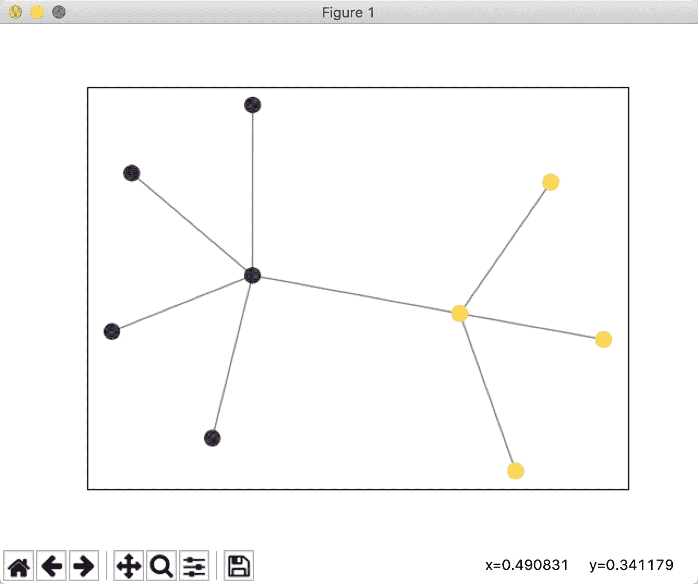
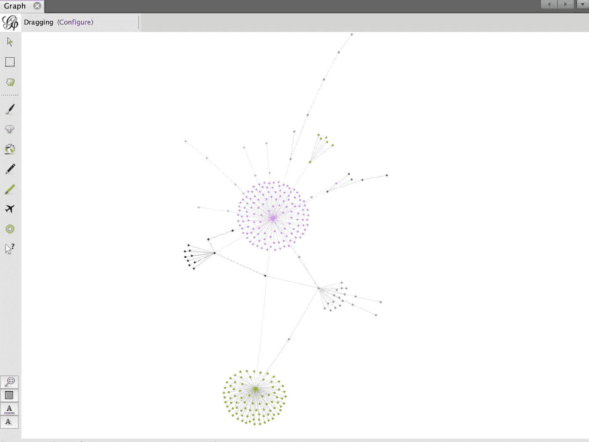

# 用 Python 和 Gephi 实现可视化的 Louvain 社区发现算法

> 原文：<https://medium.com/analytics-vidhya/implement-louvain-community-detection-algorithm-using-python-and-gephi-with-visualization-871250fb2f25?source=collection_archive---------6----------------------->


归功于 [Analytics Vidhya](https://www.analyticsvidhya.com/blog/2020/04/community-detection-graphs-networks/)

# 鲁汶社区检测算法

**卢万社区发现方法**是由[布朗德尔](https://en.wikipedia.org/wiki/Vincent_Blondel) *等人*创建的一种从大型网络中提取社区的方法。来自[鲁汶大学](https://en.wikipedia.org/wiki/Universit%C3%A9_catholique_de_Louvain)(这个方法名字的来源)。该方法是一种贪婪的优化方法，在网络中的节点数为 O(n log2n)时运行。你可以在这里查阅论文[。](https://arxiv.org/pdf/0803.0476.pdf)

我在这里介绍两种实现 Louvain 社区检测算法和可视化聚类图的方法。

# Python 代码

```
**import** networkx **as** nx
**import** community **as** community_louvain
**import** matplotlib.pyplot **as** plt
**import** matplotlib.cm **as** cm# define the graph
edge = [(1,2),(1,3),(1,4),(1,5),(1,6),(2,7),(2,8),(2,9)]
G = nx.Graph()
G.add_edges_from(edge)# retrun partition as a dict
partition = community_louvain.best_partition(G)# visualization
pos = nx.spring_layout(G)
cmap = cm.get_cmap(**'viridis'**, max(partition.values()) + 1)
nx.draw_networkx_nodes(G, pos, partition.keys(), node_size=100,cmap=cmap, node_color=list(partition.values()))
nx.draw_networkx_edges(G, pos, alpha=0.5)
plt.show()
```

结果如下:



上述 Python 代码的结果

# 格菲

[Gephi](https://gephi.org/) 是各种图形和网络的领先可视化和探索软件。可以在 Linux，Windows，macOS 上使用。

我在这里介绍一种简单的方法来导入 CSV 格式的图，实现 Louvain 社区检测算法，并对节点进行聚类。感谢 [Gephi 教程](https://gephi.org/tutorials/gephi-tutorial-quick_start.pdf)，点击了解更多详情。

首先，用 CSV 或 excel 格式创建一个包含图形边的文件。


边缘的 CSV 文件

其次，你需要在 ***数据实验室*面板**中找到***导入电子表格*** 按钮。并导入这个 CSV 或 excel 文件。


单击导入电子表格

转到 ***总览*** 面板，可以看到导入图形的可视化。您可以选择合适的布局来获得美丽的视觉效果。


在胡一帆布局下导入的图形

检测和研究社区的能力是网络分析的核心。在我们的例子中，我们希望给集群着色。Gephi 实现 Louvain 方法，可从**统计**面板获得。点击**运行**附近的 ***模块化*** 线。


单击统计面板中“模块化”附近的运行

社区检测算法为每个节点创建一个“模块性类”值。分区模块可以使用这个新数据来给社区着色。找到左侧面板上的分区模块。选择**模块化类**并点击**应用**。


在“分区”面板中选择模块化类后，单击“应用”

然后，您可以看到下面带有相应颜色的聚类图。



聚类图

# 参考:

1.  【https://gephi.org/ 
2.  [https://gephi.org/tutorials/gephi-tutorial-quick_start.pdf](https://gephi.org/tutorials/gephi-tutorial-quick_start.pdf)
3.  [https://arxiv.org/pdf/0803.0476.pdf](https://arxiv.org/pdf/0803.0476.pdf)
4.  [https://en.wikipedia.org/wiki/Louvain_modularity](https://en.wikipedia.org/wiki/Louvain_modularity)