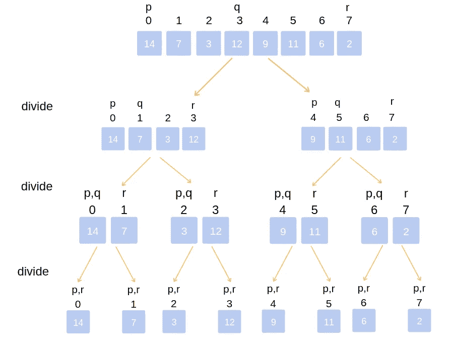

# 用 JavaScript 实现合并排序算法。

> 原文：<https://medium.com/analytics-vidhya/implement-merge-sort-algorithm-in-javascript-7402b7271887?source=collection_archive---------5----------------------->


归并排序是一种应用分而治之原则或模式的高效排序算法。

合并排序将给定的未排序数组分成两个相等的子数组，直到第 n 个(最后一个)数组包含一个元素。这是基于单个元素的数组总是被排序的事实。

**排序数组的合并**

从两个数组的第一个元素开始，通过比较第一个数组和第二个数组的元素来合并子数组。进行比较时，小于的值被压入单个子数组。这个动作一直持续到所有的子数组都被排序和合并。



合并排序可视化

我们将使用两个函数来实现这个算法，即:合并排序函数和合并函数。MergeSort 函数将递归地把未排序的数组分成第 n 个子数组，如前所述，而 merge 函数将顾名思义，合并子数组。

**合并功能伪代码**

1.  创建一个接受数组的函数。
2.  创建三个变量。一个存储第一个数组的索引，另一个存储第二个数组的索引，第三个存储排序后的数组。
3.  创建一个 while 循环，如果第一个和第二个数组的索引都没有超过这两个数组的长度，则该循环继续运行。
4.  如果第二个数组的第一个元素大于第一个元素，则将该元素的第一个元素添加到结果数组中，反之亦然。
5.  为两个数组创建一个 while 循环，将两个数组中没有进行比较的剩余元素推入结果数组。
6.  返回结果数组。

**MergeSort 函数伪代码**

1.  创建一个接受数组的函数。
2.  如果数组只有一个元素，创建一个返回子数组的基本用例。
3.  创建数组的中间点，并将值存储在变量中。
4.  使用中间值使用 JavaScript 数组切片方法将数组分为左右两个子数组，并将左右数组传递给 mergeSort 函数并递归调用。
5.  将左右两个数组都传递给 merge 函数并返回值。

让我们从创建合并函数开始。

```
function merge(arr1, arr2) {
 let i = 0;
 let j = 0;
 let results = []; while(i < arr1.length && j < arr2.length) {
  if (arr2[j] > arr1[i]) {
   results.push(arr1[i]);
   i++;  
  }else {
   results.push(arr2[j])
   j++ }
 } while(i < arr1.length){
  results.push(arr1[i]);
  i++;
 } while(j < arr2.length){
  results.push(arr2[j]);
  j++;
 } return results
}
```

既然我们现在有了一个合并函数，让我们通过创建合并排序函数来完成算法的剩余部分。

```
function mergeSort(arr){
 if (arr.length <= 1) return arr;

 let mid = Math.floor(arr.length/2);
 let left = mergeSort(arr.slice(0, mid));
 let right = mergeSort(arr.slice(mid)); return merge(left, right);
}
```

注意:这个代码和方法可以移植到任何编程语言上。

您可以复制代码并在调试模式下运行它，并通过单步执行代码来了解每一行做了什么。除非你明白代码是如何工作的，否则死记硬背这些步骤并不能在将来拯救你。编码快乐！！！。

**关于作者**


Jude Nwafor 是@sterling_bank Plc 的一名软件工程师。你可以在推特上关注我@thaddydore