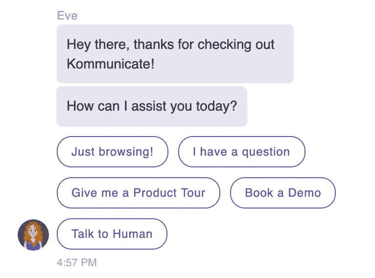
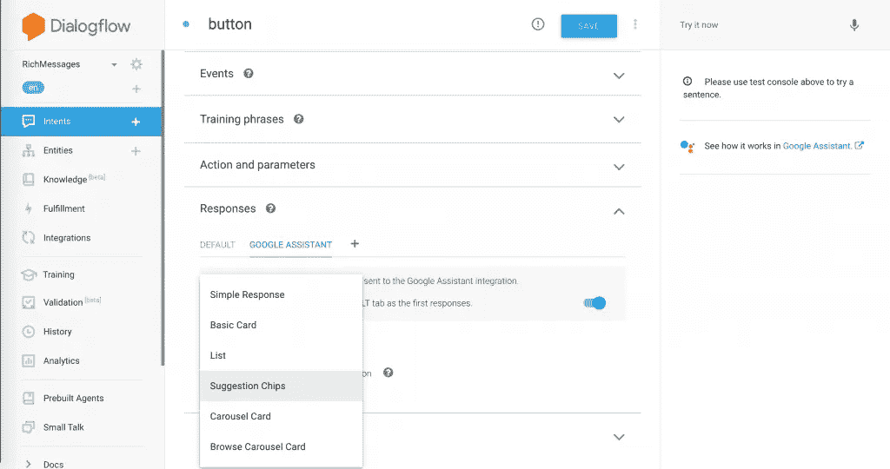
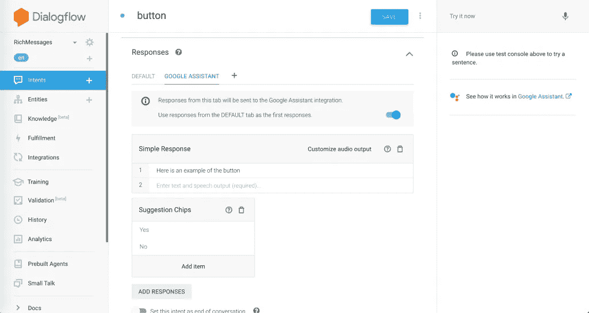
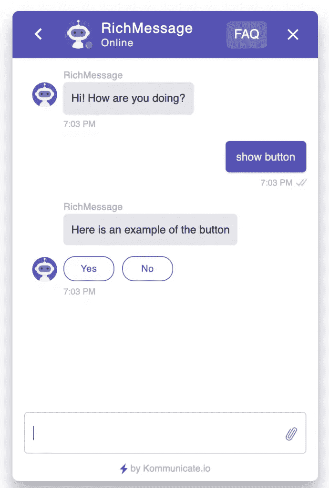

# 使用建议芯片在 Dialogflow 中实现丰富的消息按钮

> 原文：<https://medium.com/analytics-vidhya/implement-rich-message-buttons-in-dialogflow-with-suggestion-chips-bb367988c69a?source=collection_archive---------12----------------------->

丰富的信息促进客户对话。富消息传递的好处在于，它为用户提供了一种简单、方便、快捷的方式来与您的企业进行交互。因此，它在基于机器人的对话中发挥了重要作用，机器人仍在学习理解自然语言。

如果你的机器人正在处理一个对话，并向用户提问，那么用户可以输入任何东西。它可能是一个长句子，可能是一个拼写错误或者你的机器人还不理解的东西。所有这些都会影响用户体验，因为这使得机器人平台很难准确理解。

使用富消息传递，您可以解决这些问题，并为您的用户提供一组特定的选项供选择。这样，用户可以更方便地点击可用选项，机器人平台将有一个定义好的查询来准确回答。

# 如何添加丰富的消息按钮？

按钮是使用最广泛的富消息，用于提供一组选项、调查、预约等。

丰富的消息按钮可以添加到基于 Dialogflow 的机器人中，Dialogflow 支持从按钮、链接、图像到卡片传送带的所有类型的丰富消息。

Dialogflow 提供了两种设置响应的方法:

1.  **文本响应**:用于基于文本的消息，适用于所有平台
2.  **定制有效负载**:针对富消息的 JSON 格式的定制有效负载

不同的平台，如脸书信使，谷歌行动，Kik 等支持自己的自定义有效载荷。

Google Assistant 支持以下丰富的消息:

*   简单响应
*   基本卡
*   目录
*   建议筹码
*   旋转式卡片
*   浏览器转盘卡
*   链接出建议
*   媒体内容
*   自定义有效负载
*   餐桌卡片

在本文中，我们来看看如何使用 Dialogflow 从 chatbot 添加丰富的消息按钮响应。

*如果你想了解更多关于 Dialogflow bot 开发的知识，可以查看 Dialogflow 的* [*初学者指南*](https://www.kommunicate.io/blog/beginners-guide-to-creating-chatbots-using-dialogflow/) *。*

我们将在本教程中使用谷歌助手格式。

# 建议芯片和快速回复

按钮式的丰富信息被谷歌助手称为“建议芯片”，被脸书信使称为“快速回复”。

转到 Dialogflow 控制台，选择目的并向下滚动到响应。点击“谷歌助手”查看支持丰富的消息列表。

选择“建议芯片”并点击“添加项目”列出按钮。

# 使用 Dialogflow 创建丰富的消息自定义响应

上面的屏幕截图展示了如何在 Dialogflow 中创建包含丰富消息的响应的示例。

# 将丰富信息按钮添加到网站和移动应用程序

您可以通过创建 JSON 格式的自定义有效负载，在您的网站和移动应用程序代码库中解析响应并将其呈现在 UI 上，从而将可点击按钮(也称为建议芯片和快速回复)添加到您的网站和移动应用程序中。

如果你需要一个无代码的丰富消息集成，请查看[komunicate . io](https://www.kommunicate.io)。Kommunicate 可以轻松地在你的网站和移动应用程序上添加丰富的信息，包括按钮、图像、卡片、列表、旋转木马等。此外，您不需要担心创建任何自定义有效负载和编写代码。

访问丰富消息的 Dialogflow bot web 演示[此处](https://www.kommunicate.io/test?appId=kommunicate-support&botIds=richmessage-56rgw&assignee=richmessage-56rgw)并键入“显示按钮”观看直播。下面是它在网站上的截图。

总而言之，丰富的消息按钮不仅让界面书变得漂亮，还能让你的用户采取更多的行动。它们还提供了更好的整体对话体验。

因此，如果您仍然在您的机器人中使用纯文本响应，您可能需要重新考虑使用更具交互性的富消息元素。

*原载于 2019 年 12 月 16 日*[*https://www . komunicate . io*](https://www.kommunicate.io/blog/rich-message-button-response-dialogflow-chatbot/)*。*