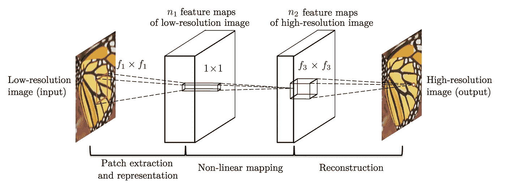
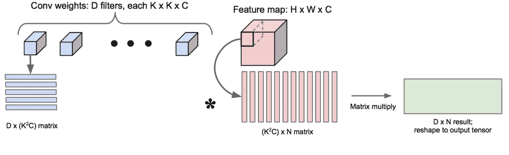
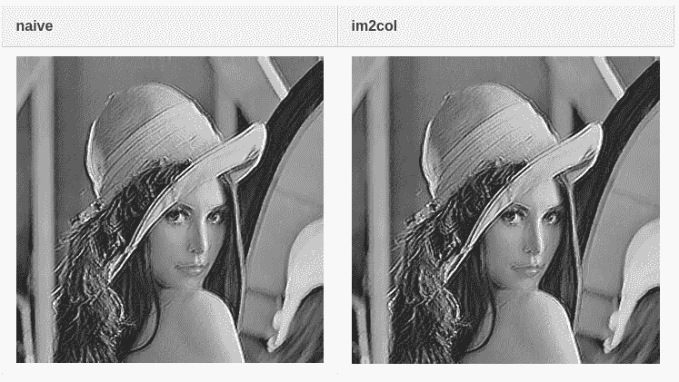

# 用纯 C++实现 SRCNN

> 原文：<https://medium.com/analytics-vidhya/implement-srcnn-with-pure-c-33dcacfbb333?source=collection_archive---------26----------------------->

## 一次走过提醒我主人的时光。


布鲁斯·马斯在 [Unsplash](https://unsplash.com?utm_source=medium&utm_medium=referral) 上的照片

# 动机

刚开始考硕士的时候，教授叫我用纯 C++和 CUDA 实现。经过两个月的工作，我终于完成了第一个版本，但结果似乎不仅模糊，而且大小错误。

然而，我在这个项目中学会了如何使用指针和基本的 CUDA 概念。此外，我对 CNN 的工作方式和架构有了一些概念。作为报复，我想从零开始实现 SRCNN，这篇帖子说的是做这个项目时的注意事项。

# 什么是超分辨率？

超分辨率是一种以更高分辨率构建图像的图像处理技术。到目前为止，我们使用了很多特征来表示图像的属性，神经网络是提取特征的一种方法。在神经网络的帮助下，我们创造了一个前所未有的诱人结果。

# 那么什么是 SRCNN 呢？

卷积神经网络(CNN)广泛应用于视觉任务。在超分辨率方面，SRCNN 是第一个使用 CNN 来完成这项任务的。超东*等人*在 2014 年提出的 SRCNN 优于包括稀疏编码在内的许多方法。

更重要的是，SRCNN 的组成非常简单:3 个卷积和 2 个激活层。我很惊讶这种结构可以击败传统方法，尽管它有两个缺点:

1.  在把图像传给 CNN 之前，你必须把图像调整到输出尺寸。
2.  随着输出图像大小的增长，产生结果需要更多的时间。

# 整体结构

下图显示了 SRCNN 的结构，取自[1]。



SRCNN 的整体结构。

图中暗示，我们要做的就是实现卷积和激活层。

# 实施细节

这部分我将展示一些关于我的实现的细节。

# 卷积层

## 朴素方法

实现朴素卷积很简单:每个输出神经元的值是输入神经元乘以核参数的总和。以下伪代码有助于您实现这一计算:

```
for(k = 0; k < # of output channels; k += stride)
    for(n = 0; n < # of input channels; n += stride)
        for(i = 0; i < # of input height; i += stride)
            for(j = 0; j < # of input width; j += stride)
                sum = 0;
                for(l = 0; l < # of kernel height; l++)
                    for(m = 0; m < # of kernel width; m++)
                        sum += input[n][i][j] * kernel[k][n][l][m];
                output[k][i][j] += sum;
```

## im2col 法

我们看到，在前面的部分中，我们需要 6 个 for-loop 来进行简单的卷积。此外，如果跨度足够大，我们必须收集相距较远的值，因此会失去缓存的局部性使用。

Caffe 作者[建议，可以使用 im2col 技术将卷积计算转化为矩阵乘法问题。在这种情况下，当执行乘法时，我们利用计算机体系结构的局部性。此外，我们可以进一步使用高度优化的 BLAS(基本线性代数子程序)库来提高我们的卷积计算。](https://github.com/Yangqing/caffe/wiki/Convolution-in-Caffe:-a-memo)

这种方法的缺点是需要更多的内存来存储由`im2col`函数创建的矩阵。

下图展示了 im2col 的概念，摘自[2]:



im2col 的一个直观概念。

# 活化层

与卷积层相比，这一层相当简单；你只要把每个神经元的值传递给激活函数，就得到结果了。

我选择 ReLU 是因为这种激活函数在 SRCNN 中使用。

# 读取重量

虽然 Caffe 使用 NCHW 格式，但是 SRCNN 的作者使用 **CHWN 格式**来存储他们的网络权重[1]:

```
**for** i **=** 1 : channel
        **for** j **=** 1 : fnum
             temp **=** conv_filters(:,:,i,j);
             **if** channel **==** 1
                weights(:,j) **=** temp(:);
             **else**
                weights(i,:,j) **=** temp(:);
             **end** 
        **end** 
    **end**
```

有关权重格式布局的更多信息，您可以访问英特尔 MKLDNN 的[这篇文章](https://oneapi-src.github.io/oneDNN/understanding_memory_formats.html)。

在我的实现中，我使用 NCHW 格式，因为大多数神经网络框架都采用这种格式。

# 密码

> *就那句老话，给我看看代码！*

没错，这里的代码是[这里的](https://github.com/Cuda-Chen/SRCNN-cpp)，你可以在`src/srcnn.cpp`里看一下。然而我把它写成了一个怪物类(在`src/srcnn.cpp`中有 1000 多行)。因此，我认为我应该在将来创建单独的文件来存储每个组件。

# 结果

我的 SRCNN 实现的结果如下表所示:



两种实现方法的比较。

当然，我们需要一些比较来实现我的实现是否正确！

所以这里是我实验室一个格式员的成果和我硕士一年级的实现:


您可以看到，与我在硕士一年级时实现的结果相比，这两种实现都产生了正确的结果(输出大小和图像质量)。然而，我的三个实现的质量似乎不如前一个成员。

# 贝克马克

基准参数如下所示:

*   操作系统:macOS 10.13.4
*   CPU:英特尔酷睿 i7 7700 单核处理器
*   内存:32 GB
*   编译器:苹果 LLVM 版本 10.0.0
*   理想的输出尺寸:512 x 512 像素
*   测试方法:用一个因素运行程序三次，然后取平均值
*   计时方法:使用`std::chrono`

下面是每个 SRCNN 实现方法比较的基准:

*   天真:(125.414+122.221+124.625)/3 = 124.0867s
*   im2 col:(323.543+339.007+316.313)/3 = 326.2877s

正如您所看到的，虽然 im2col 方法可以通过牺牲内存来获得提升，但它比 naive 方法慢得多。我猜准备列矩阵需要很多时间。

# 变得更快

卷积是一种尴尬的并行问题；也就是说，它对大量数据应用运算。所以我们可以使用一些并行计算技术来加速执行。

在 CPU 并行场景下，我们可以选择 OpenMP 作为并行计算目标，因为它简单。

以下是应用 OpenMP 后的每个 SRCNN 实现比较的基准:

*   天真:(37.6111+39.9825+38.3595)/3 = 38.6510s
*   im2 col:(97.9533+103.525+94.5232)/3 = 98.6672s

这两种技术都运行得更快，但是 im2col 仍然比 naive 运行得慢。

# 结论

在这篇文章中，我简单介绍一下超分辨率和 SRCNN。然后我演示了 SRCNN 的结构，并讲述了这些层的实现细节。最后，我对两种实现方式的结果和执行时间进行了比较，并给出了一个假设，即为什么大多数框架中的优选实现比简单实现运行得慢得多。

# 特别感谢

我要特别感谢 [masc4ii](https://github.com/masc4ii) 添加 OpenMP 和 QMake 构建选项功能。没有你的帮助，这个项目将远远不能完成。

# 参考

[1]http://mmlab.ie.cuhk.edu.hk/projects/SRCNN.html

[2][https://Leonardo araujosantos . git books . io/artificial-intelligence/content/making _ faster . html](https://leonardoaraujosantos.gitbooks.io/artificial-inteligence/content/making_faster.html)

*原载于 2020 年 6 月 15 日*[*https://cuda-Chen . github . io*](https://cuda-chen.github.io/machine%20learning/2020/06/15/implement-srcnn-in-pure-cpp.html)*。*

> *如果你有什么想法和问题要分享，请联系我*[***clh 960524【at】Gmail . com***](http://clh960524@gmail.com/)*。还有，其他作品可以查看我的* [*GitHub 知识库*](https://github.com/Cuda-Chen) *。如果你和我一样热衷于机器学习、图像处理和并行计算，欢迎在 LinkedIn 上* [*加我*](https://www.linkedin.com/in/lu-hsuan-chen-78071b171/) *。*