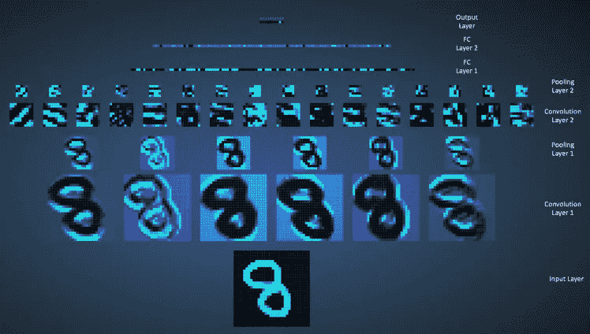

# 使用 MNIST 数据集构建多类影像分类模型。

> 原文：<https://medium.com/analytics-vidhya/implement-your-first-neural-network-8aa43c7c54a6?source=collection_archive---------9----------------------->

## 面向初学者|附带源代码

来源: [KDnuggts](https://www.google.com/url?sa=i&url=https%3A%2F%2Fwww.kdnuggets.com%2F2018%2F02%2F8-neural-network-architectures-machine-learning-researchers-need-learn.html&psig=AOvVaw3W-ckJDBF8yR037N1yX0b3&ust=1597231201178000&source=images&cd=vfe&ved=0CAMQjB1qFwoTCLC494qEk-sCFQAAAAAdAAAAABAD)

下面是建立一个能够以 95%以上的准确率对手写数字进行分类的模型的步骤。阅读本文时，我建议您同时尝试 colab 笔记本中的代码。遵循这些步骤并观察输出。