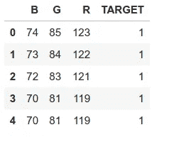
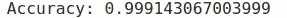
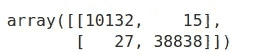
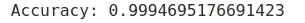
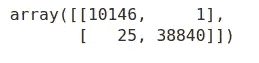
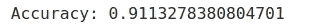
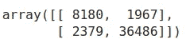
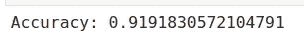
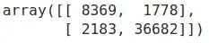

# 用 Python 实现最大似然算法

> 原文：<https://medium.com/analytics-vidhya/implementation-of-ml-algorithms-using-python-7d04a89fd0d2?source=collection_archive---------18----------------------->


Brian Patrick Tagalog 在 [Unsplash](https://unsplash.com?utm_source=medium&utm_medium=referral) 上拍摄的照片

在这篇博客中，我们将回顾机器学习算法的基本实现，以分类图像的给定 B、G、R 值是否对应于皮肤图像。

数据集可以从给定的链接下载

【https://archive.ics.uci.edu/ml/datasets/skin+segmentation 

看一下数据集(文本文件)，我们看到我们有 3 个独立属性(B，G，R)和一个我们想要预测的从属属性(皮肤或非皮肤)。这里 1 代表皮肤样本，2 代表非皮肤样本

我们需要建立一个模型来预测一组给定的 B、G、R 值对应于皮肤还是非皮肤部分

让我们首先使用 pandas read csv 函数加载我们的数据集，分割我们的依赖和独立属性，然后将它们分成训练集和测试集

然后，我们将使用 sklearn MinMaxScaler 扩展相关属性，以便算法更快地收敛。

```
import pandas as pd
df =pd.read_csv('Skin_NonSkin.txt', delimiter='\t', names=('B','G','R','TARGET'))
df.head
```



```
#Loadind Dependent and independent attributes
X=data.iloc[:,:-1]
y=data.iloc[:,-1]#splitting the data into Training and Testing set
from sklearn.model_selection import train_test_split
X_train, X_test, y_train, y_test = train_test_split(X, y, test_size=0.20, random_state=0)#Scaling of data
from sklearn.preprocessing import MinMaxScaler
scaler=MinMaxScaler()
X_train=scaler.fit_transform(X_train)
X_test=scaler.transform(X_test)
```

# **方法:**

使用 sklearn 导入我们的机器学习模型。

根据我们的训练数据拟合模型(X_train，y_train)

获得我们的测试数据的预测(X_test ),并将它们存储为 y_pred

比较预测值和实际值(y_test 和 y_pred)

注意:为了简单起见，我们将保持我们的模型参数默认或最常用的

## **决策树**

```
#Importing and fitting the model to  our dataset
from sklearn.tree import DecisionTreeClassifier
clf=DecisionTreeClassifier(criterion="gini",splitter="best",random_state=0)
clf.fit(X_train,y_train)#Getting predictions
y_pred=clf.predict(X_test)#calculating accuracy
from sklearn import metrics
print("Accuracy:",metrics.accuracy_score(y_test, y_pred))
```



```
from sklearn.metrics import confusion_matrix
cm = confusion_matrix(y_test, y_pred)
cm
```



查看混淆矩阵，我们可以看到我们的模型 48970(10132+38838)次被正确分类，42(27+15)次被错误分类为皮肤和非皮肤样本

准确率:99%

## **随机森林**

```
#Importing and fitting the model to  our dataset
from sklearn.ensemble import RandomForestClassifier
clf_r = RandomForestClassifier(n_estimators = 10, criterion = 'entropy', random_state = 0)
clf_r.fit(X_train, y_train)#Getting predictions
y_predR=clf_r.predict(X_test)#calculating accuracy
print("Accuracy:",metrics.accuracy_score(y_test, y_predR))
```



```
cm = confusion_matrix(y_test, y_predR)
cm
```



查看混淆矩阵，我们可以看到我们的模型 48986(10146+38840)次被正确分类，26(25+1)次被错误分类为皮肤和非皮肤样本

准确率:99%

## **感知器**

```
#Importing and fitting the model to  our dataset
from sklearn.linear_model import Perceptron
p_clf=Perceptron(penalty="none",random_state=0)
p_clf.fit(X_train,y_train)#Getting predictions
y_predP=p_clf.predict(X_test)#calculating accuracy
print("Accuracy:",metrics.accuracy_score(y_test, y_predP))
```



```
cm = confusion_matrix(y_test, y_predP)
cm
```



查看混淆矩阵，我们可以看到我们的模型 44666(8180+36486)次被正确分类，4346(2379+1967)次被错误分类为皮肤和非皮肤样本

准确率:91%

## **逻辑回归**

```
#Importing and fitting the model to  our dataset
from sklearn.linear_model import LogisticRegression
l_clf=LogisticRegression()
l_clf.fit(X_train,y_train)#Getting predictions
y_predL=l_clf.predict(X_test)#calculating accuracy
print("Accuracy:",metrics.accuracy_score(y_test, y_predL))
```



```
cm = confusion_matrix(y_test, y_predL)
cm
```



查看混淆矩阵，我们可以看到我们的模型 45051(8369+36682)次被正确分类，3961(2183+1778)次被错误分类为皮肤和非皮肤样本

准确率:92%

# **观察**:

决策树和随机森林算法比其他算法具有更高的准确性，因为它们试图为每个新的唯一训练实例将假设空间分割成更小的区域，从而使它们易于过拟合，而逻辑回归和感知器学习将假设空间分成两部分。

## **注:**

由于我们选择的问题和数据集的类型，我们的模型具有非常高的准确性。在其他实际应用中，很少能达到如此高的精度

为了检查过度拟合，我们使用 f1 测试，该测试同时考虑了精确度和召回率。