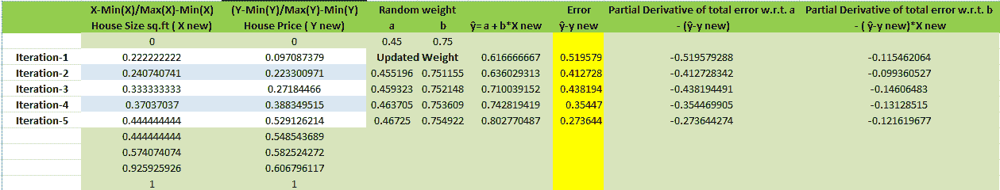

# 随机梯度下降的实现

> 原文：<https://medium.com/analytics-vidhya/implementation-of-stochastic-gradient-descent-1d36b6a0c013?source=collection_archive---------9----------------------->

写这篇文章的目的是为了理解梯度下降背后的数学原理。我们大多数人在机器学习中使用梯度下降，但我们需要理解它背后的数学原理。

作为一个大一新生，我在学习随机梯度下降的时候，发现它有点复杂。在这里，我试图让那些想知道它是如何工作的人更简单。

我这篇文章的重点是展示梯度下降背后的数学原理。

快速复习一下什么是梯度下降？

梯度下降:这是一种优化技术，用于寻找使输出误差最小化的函数系数。

**梯度下降程序:**

1.  初始化系数的值(可以是 0.0 或小的随机值)
2.  通过将系数代入函数来计算成本函数
3.  计算总误差相对于重量的偏导数
4.  更新系数的值
5.  重复上述过程，直到我们得到成本 0.0 或无法实现成本的进一步提高

在我们跳到随机梯度下降的实现之前，我们将看到梯度下降的方法。

梯度下降法

*   **批量梯度下降:**在批量梯度下降中，系数是更新的，在计算训练集中每个训练样本的损失后，参数更新一次，即在所有训练样本都被评估后
*   **随机梯度下降:**当我们有大量的数据时，我们可以使用梯度下降的一种变体，称为随机梯度下降。在 SGD 中，系数是为每个训练实例更新的，而不是在批处理实例结束时更新的。

**充分利用梯度下降算法的几种方法:**

> **绘制成本值:**收集并绘制算法为每次迭代计算的成本值。如果每次迭代的成本没有降低，降低你的学习率
> 
> **学习率:**学习率值应为 0.1、0.001 或 0.0001 等小值。尝试不同的值，看看哪一个效果最好
> 
> **重新调整输入:**将所有输入变量重新调整到相同的范围，例如 0 到 1 之间

随机梯度下降是机器学习中广泛使用的算法。在这里，我演示了如何通过最小化训练数据集的误差，使用随机梯度下降来学习线性回归模型的系数。

让我们看看下面的例子:

**数据:**

抽样资料

我用 excel 显示了计算结果。

1.  *将所有输入变量重新调整到相同的范围，例如 0 到 1 之间。这里，我们使用最小-最大标准化来重新调整数据。*

计算变量的最小值和最大值。

计算变量的最小值和最大值

使用下面的公式将数据标准化。

对我们的数据应用最小-最大标准化

*2。让我们从初始化随机权重开始。* a= 0.45，b=0.75

*3。计算ŷ*

考虑来自新缩放数据的第二个随机观察

**X 新= 0.22222222，Y 新= 0.097087379**

**ŷ = a + b*X 新**

**ŷ= 0.45+0.75 * 0.22222222 = 0.61666**

*4。计算损失*

**误差= ŷ- y 纽= 0.6166666–0.0970873 = 0.519579**

*5。计算偏微分*

计算总误差相对于重量的偏导数

部分差异如下:

**总误差 w.r.t. a(权重)的偏导数**

****= ∂(ŷ- y new)/∂a****

****= ∂(ŷ- (a+b*X new))/∂a****

****= -(ŷ-y 新)****

****=-0.519579****

****总误差 w.r.t. b(权重)的偏导数****

****= ∂E/∂b****

****= ∂(ŷ- y new)/∂b****

****= ∂(ŷ- (a+b*X new))/∂b****

****=-(ŷ-y 新)*X 新****

****=-0.519579 * 0.22222222****

****= -0.115462064****

***6。更新重量***

**更新“a”**

**使用较小的学习率(alpha=0.01)**

****新 a =旧 a —阿尔法* ∂E/∂a****

****= 0.45–0.01 *—0.519579****

****= 0.455196****

**更新“b”**

****新 b =旧 b — alpha*∂E/∂b****

****= 0.75–0.01 *-0.115462064****

****= 0.75115****

**我们刚刚完成了随机梯度下降的第一次迭代，我们已经将权重更新为 **a =** **0.455196，b= 0.455196。**对数据集中剩余的实例重复这个过程。**

***7。迭代次数:5***

**让我们跳到前面。以下是 5 次迭代中所有系数的更新值列表。**

****

**上图中的黄框是每组系数的误差。它向我们展示了误差随着每次迭代而减少。我们可以在简单的线性回归模型中使用误差最小的系数来预测数据集中的每个点。**

**希望现在用 SGD 实现线性回归已经很清楚了。建议你自己试试上面的计算。**

**感谢您的阅读。**

**快乐学习！！！:)**