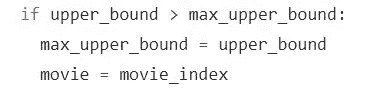

# 置信上限算法的实现

> 原文：<https://medium.com/analytics-vidhya/implementation-of-upper-confidence-bound-algorithm-ce0651b63c15?source=collection_archive---------2----------------------->

在这篇文章中，我们将可视化 UCB 算法如何工作的多臂土匪问题。

## 简而言之，UCB 算法

在 UCB 算法中，我们在初始阶段开始探索所有的机器，然后当我们找到具有最高置信界限的机器时，我们开始利用它来获得最大的回报。

如果你想更好地理解它，你可以看到多武装匪徒问题的[置信上限。在这里，我们将重点放在算法部分，并借助编码将其可视化。](/analytics-vidhya/upper-confidence-bound-for-multi-armed-bandits-problem-ea5d7bc840ff)

让我们看看 UCB 算法的步骤是什么。

## UCB 算法的步骤

1.  *在每一轮* ***n*** *，我们考虑机器 m 的两个数字。
    ->*【nₘ(n)=机器 m 直到第 n 轮被选择的次数。
    ->【rₘ(n)=机器 m 直到第 n 轮的奖励次数
2.  *从这两个数字我们要计算，
    a.* 机器的平均报酬 m 到回合 n，rₘ(n) = Rₘ(n) / Nₘ(n).
    *b.* 置信区间[rₘ(n)—δₘ(n)，rₘ(n)+δₘ(n)]在第 n 轮用，δₘ(n)= sqrt(1.5 * log(n)/nₘ(n))
3.  *我们选择具有最大 UCB 的机器* ***m*** *，*(*rₘ(n)+δₘ(n)*

*我知道这些对你来说可能看起来很混乱，但是让我们把它变得更简单！*

*这个周末我很无聊，去了朋友(Nilesh)家。闲聊了一会儿后，我们计划一起去看电影。但问题是看哪部电影。我建议看一些科幻电影，他不同意，他建议看一些动作片，我不同意。然后他建议我们至少敲定 5 部电影，然后再决定看哪一部。我也同意，因为我们已经建议了很多电影。*

*所以我们列出了 5 部电影。钢铁侠
2。天使坠落了
3。霍布斯&肖
4。6 地下
5。开始*

*现在，我们再次开始争夺哪一个观看，因为他们都有良好的 IMDB 评级。然后他妈妈来了，问我们为什么打架。我们告诉她我们的问题。她想了一下，说你为什么不问问你的其他朋友看哪部电影。我们认为这是个好主意。但是给每个人打电话并不是一个好主意，因为这非常耗时。我们做了一个谷歌表格，发给我们所有的朋友填写。这几乎花了 15 分钟，我们几乎收到了 100 条评论。现在我们有了 100 个不同的电影朋友的数据，他们更喜欢看。该数据包含二进制值，表示 0 表示他们不喜欢该电影，1 表示他们喜欢该电影。*

**

*伟大的兄弟！让我们计算每部电影的总数，并选择最大的一部。*

*我:我们可以这么做，但是有个问题。*

*什么兄弟？*

**我:兄弟，我们的朋友已经给出了他们在 5 部电影中最喜欢哪一部的观点，而不是基于我最喜欢钢铁侠的排名。我想我们做了错误的评论。**

**尼尔什:你疯了吗？你是说我们得到了错误的数据集。如果你再次要求他们都来填充，这次他们可能会忽略我们。**

*我:我不是说我们需要另一个数据集。我认为我们需要用不同的方式来可视化这些数据。*

*如何？*

*我:我们需要一个不偏不倚的决定，因为几乎每个评论都包含了我们的朋友也喜欢的我们选择的电影。*

*是的，但是我们要怎么做呢？我们不能只要求妈妈从 100 个评论中选择任何一部电影，看看我们的朋友是否喜欢它。然后统计每部电影最后是否被妈妈选中，是否被我们的朋友喜欢。伙计，我们最好放弃看电影的计划，去做点别的事情。*

*我:我知道哥哥，但是你为什么要让妈妈来做。我们可以很容易地解决这个问题，使用我读到的置信上限方法。*

*这个问题和你的多股武装匪徒问题有什么相同之处？*

*我:你看，我们有 5 部电影和这 5 部电影的 100 条影评。我们希望机器通过每个评论进行探索，并随机选择一部电影，检查它是否受到我们朋友的喜欢。但与此同时，我们不希望机器偏向一部电影，而希望它也给其他人机会。最后，我们希望它通过利用置信上限来找到被我们的大多数朋友选择的电影。我们也会得到一个很好的视觉效果，我们会据此来看电影。*

*是的，你说到点子上了。让我们看看它会把我们带到哪里。*

*我:是啊兄弟。*

*我们在数据集上运行了下面的代码。*

*我们最终得到了这样的可视化，*

**

*电影 5(盗梦空间)得到了我们大多数朋友的喜欢*

*尼尔什:哇兄弟！我还想看《盗梦空间》，以防它不起作用，但这个模型也暗示了《盗梦空间》电影本身。*

*我:真心老弟！这太神奇了。让我们看《盗梦空间》 **。***

## *它到底是怎么发生的？*

*让我们一步步了解。在此之前，我希望你在另一个[选项卡](https://drive.google.com/file/d/1VOwRqTOYoHl434YmNeQLWEF-MIlcej5G/)中打开算法步骤。*

1.  ****__init__* 方法:** 在这个方法中我们已经完成了算法的步骤 1，并定义了某些属性。
    *自我。__N* →评论总数
    *自我。__m* →电影总数
    *自。__movie_selected* →每轮选出的 100 部电影列表
    *self。__number_of_selection* →到第 n 轮为止电影 m 被选中的次数
    *self。__sum_of_movie_rank →* 电影 m 到第 n 轮的排名总和。*
2.  ***实现 _ucb 方法:** 在这个方法中，我们实现了步骤 2 和步骤 3 的结合。*

**

*UCB 算法的第二步*

*在 If 条件中，我们检查电影是否至少被选择了一次。因为如果它没有被选择至少一次，那么根据算法的步骤 2(a)的公式，我们将得到无穷大，因为分母变成 0。如果电影没有被选择至少一次，那么它将把它的上限设置为无穷大(这里用高值 1e500 表示)。*

*否则，根据步骤 2(a)中的公式计算电影的平均等级，并根据步骤 2(b)中的公式计算上置信度。*

*现在，我们已经实施了第 2 步，让我们进入第 3 步。*

**

*第三步*

*在步骤 3 中，我们将计算的上限与最大上限进行比较，如果它大于 *max_upper_bound* ，则将上限作为最大上限，并将选择的电影作为当前电影。*

*这就是 UCB 的实现方式。可以有多种方法来实现。如果你用另一种方法解决，请随意分享。*

**参考文献*:*

1.  *[https://www . udemy . com/course/machine learning/learn/lecture/6456832 #问题](https://www.udemy.com/course/machinelearning/learn/lecture/6456832#questions)*