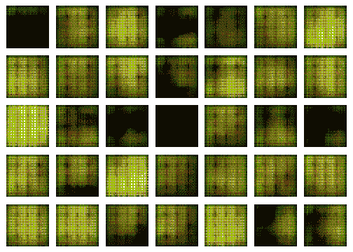

# 在 Keras 中实现 GAN

> 原文：<https://medium.com/analytics-vidhya/implementing-a-gan-in-keras-d6c36bc6ab5f?source=collection_archive---------0----------------------->

## “过去 10 年中最有趣的想法”

> 在我看来，现在提出的变化是过去 10 年中最有趣的想法。-扬·勒昆

生成对抗网络，简称 GANs，是机器学习实践者可以使用的一些最有效的工具。