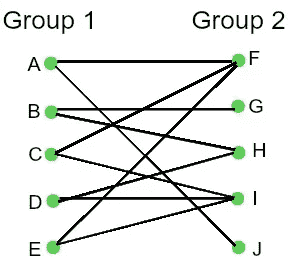
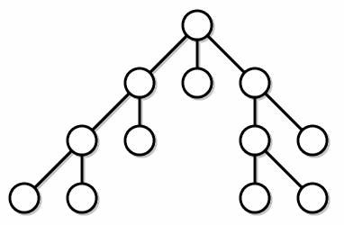

# 用 Python 实现图的二分检查器

> 原文：<https://medium.com/analytics-vidhya/implementing-a-graph-bipartition-checker-in-python-364b619a3d29?source=collection_archive---------5----------------------->


艾莉娜·格鲁布尼亚克在 [Unsplash](https://unsplash.com?utm_source=medium&utm_medium=referral) 上的照片

作为一名软件开发人员，我试着制定一个例行程序，其中包括练习我解决数学/算法问题的技能。几天前，我发现了一个名为 Code Jam 的 Google 年度代码竞赛，我看到的第一个问题就让我迷惑不解(我会谈到它)。经过一些研究，我能够通过图二分检查算法来解决它，并决定写下我得出解决方案的路径。
我们开始吧。

# 图表

图是数学中众所周知的非线性抽象数据结构。它们用于通过节点(或简称为*“点”*)和边(也称为*“链接”*或*“线”*，连接两个节点*)*【1】【2】)的结构/概念对对象之间的成对关系进行建模。对图形及其性质的研究被称为图论，是由一位才华横溢的数学家于 1936 年开发的，他写了第一本关于图论的书。图形用于模拟现实世界中发生的许多情况，如从 x 到 y 的最有效的飞机路径或城市两点之间的最短距离(GPS 算法)，等等。

# 问题是

2014 年研究生考试-练习赛。

**坏马问题
作为邪恶联盟的首领，坏马有很多问题要处理。最近，联盟中有太多的争论和太多的暗箭伤人，以至于“坏马”决定将联盟分成两个部门，以便将麻烦的成员分开。作为罪恶的纯种马，坏马不会把他宝贵的时间花在自己想办法分裂团员上。这就是他让你——他忠诚的亲信——做的事。**

> [https://code.google.com/codejam/contest/2933486/dashboard](https://code.google.com/codejam/contest/2933486/dashboard)

# **解决方案**

读完描述后，在开始编写可能的解决方案之前，我想到了一些想法。

首先，我将不得不**存储一对的名字**和以某种方式**代表然后**之间的关系。此外，我必须能够检查将配对分成 2 组的可能性——没有配对应该在同一个组中。通过更多的搜索，我发现这是**图二分图**的经典问题。

> 我已经意识到这是开始用超级黑客风格编码前的重要一步。分析它，进入问题的头脑。

# 偶图

二部图是这样一种图，它的所有节点可以分成两组，使得一组中的每个元素只与另一组中的元素相关。它也被称为双色图(每个组代表一种颜色，所以图中的每个元素只与另一个颜色元素相关)。它们在 Petri 网(并发系统资源模拟)和其他真实世界情况中非常常用[4]。



二分图示例

# 算法

检查图二分的算法可以非常类似于树数据结构中的 DFS(深度优先搜索)。DFS 算法它被用来寻找树的深度，通过选择根元素并深入到它们的邻居，直到没有元素的子元素或叶子。



DFS 算法如何工作

> 奇怪的事实:每棵树都是一个二分图

为了增加二分检查的功能，我们需要启动另一个结构来存储每个元素的组(或颜色)信息。除此之外，在给定相邻组的情况下，还需要检查属于每个图节点的组

为了更好地理解，伪代码分析将分为两部分。

# 伪代码—控制器

我们来检查一下伪算法。

第一部分将作为一个初始化或“控制器”,确保程序将为图中的所有节点执行。

> 为了解释伪代码，我将假设以下常量
> 
> V =图形节点
> C1 =第 01 组值
> 图形=代码表示的数据结构
> C2 =第 02 组值

```
FOR each graph node V
    Initialize V group value C = C1
end FORFOR every graph node V
    IF group C is C1:
        IF NOT SET_GROUP_VALUE(graph, V, C1)
            return FALSE
        end IF
    end IF
end FORreturn TRUE
```

在第一次循环中，我们将用 group 01 值初始化所有节点。在第二次循环中，对于每个具有 group 01 值的节点，我们将检查它的邻居，如果可能的话，为它设置一个不同的组值。

# 伪代码—递归搜索

第二部分是递归算法，它包含检查一个节点是否属于与其邻居不同的组的逻辑

```
-- Start a routine SET_GROUP_VALUE(graph, V, C) -- Ignore this lineSET the group of V as CFOR every neighbors W of V
    IF group value C of W is neutral
        IF NOT SET_GROUP_VALUE(graph, W, C2)
            return FALSE
        end IF
    ELSE
        IF group value of W is C
            return FALSE
        end IF
    end ELSE
end FORreturn TRUE
```

第一个循环开始深入 V 个节点的子集(根在 V 中的子树)。如果 V 的邻居 W 具有组 01 值，那么算法将检查是否有可能给出组 02 值。

# 履行

如问题中所述，我们的目标是执行文件中描述的 **M** 元素对的 **T** 测试用例。该文件的第一行将包含 **T** 值，后跟 **M** 对的数量，因此，接下来的 **M** 行将包含 **M** 对信息。输出也将是一个文件，描述测试用例编号，以及是否可以将一组 **M** 对名称分成两组，或者，是否可以将一组对表示为一个二分图。

```
-- Input file example -- Ignore this line2
1
Dead_Bowie Fake_Thomas_Jefferson
3
Dead_Bowie Fake_Thomas_Jefferson
Fake_Thomas_Jefferson Fury_Leika
Fury_Leika Dead_Bowie-- Output file example -- Ignore this lineCase #1: Yes
Case #2: No
```

在代码[5]中有一些表示图的方法，其中一种是邻接矩阵，这就是它在本文中的表示方式，但是做一些小的修改，这个解决方案也可以工作。在这里，我将把它表示为一个 python 字典:键是节点，键的值是所有邻居的列表。这里有一个例子

```
g = { 
    “a” : [“d”],
    “b” : [“c”],
    “c” : [“b”, “c”, “d”, “e”],
    “d” : [“a”, “c”],
    “e” : [“c”],
    “f” : []
}
```

# 密码

让我们检查一下我的伪代码实现。

> OBS:颜色=组值

从第 1 行到第 27 行实现了我们之前在伪代码中看到的算法。在第 31 行，我从输入文件(在这个代码的同一个目录中)中得到将要完成的测试的数量。

从第 35 行到文件末尾，我们将:

*   对于每个测试用例( **iTestCase** )，检索将要被分析的对的数量(**n 对**)。
*   对于每一对，我们将得到描述的名字。
*   从第 40 行到第 50 行，它将根据文件中描述的 pair 连接来构造字典。

输出告诉我们哪个测试用例是否代表二分图

我是巴西的一名初级软件开发人员，我对技术和编程非常着迷。

所以请，任何疑问，提示或评论都非常欢迎！

在 [Github](https://github.com/IranNeto) 、 [Twitter](https://twitter.com/IranMacedo3) 或 [Linkedin](https://www.linkedin.com/in/iran-macedo-bezerra-neto/) 中关注我

# 参考

[1]https://mathworld.wolfram.com/Graph.html
[2]https://en.wikipedia.org/wiki/Graph_theory
[3]https://pt.wikipedia.org/wiki/D%C3%A9nes_K%C3%B6nig
[4]https://pt.wikipedia.org/wiki/Grafo_bipartido
[5]https://www . geeks forgeeks . org/graph-and-its-representations/