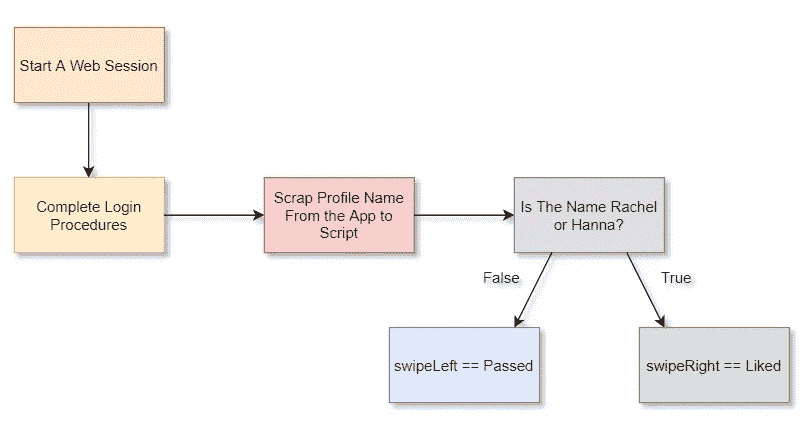
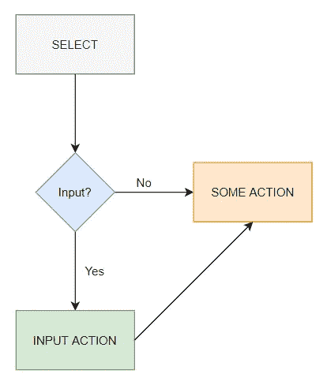
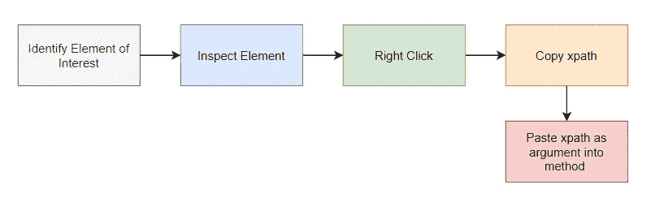
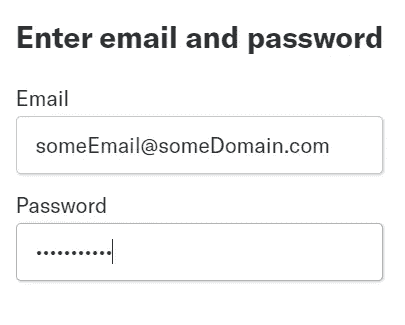
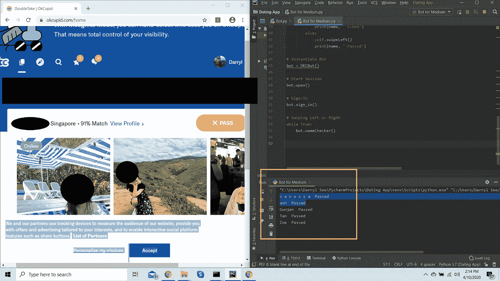

# 实现一个简单的机器人在 OkCupid 上滑动

> 原文：<https://medium.com/analytics-vidhya/implementing-a-simple-bot-to-swipe-on-okcupid-c33081418e45?source=collection_archive---------8----------------------->


[https://www . businessofapps . com/news/dating-app-download-growth-slumps-to-5-3-in-2019/](https://www.businessofapps.com/news/dating-app-download-growth-slumps-to-5-3-in-2019/)

# 序文

毫无疑问，我们在新冠肺炎疫情会感到孤独。需要隔离、实行社交距离、城市被封锁、强制在家工作/上学是世界各地的领导人正在采取的一些预防措施，以遏制这种病毒的传播。这影响了我们与人的社会交往。值得庆幸的是，在线约会应用程序，如 [Tinder](https://tinder.com/?lang=en) 、 [OkCupid](https://www.okcupid.com/home) 和 [Bumble](https://bumble.com/) 等等，是存在的。它使我们能够在家中舒适地认识新朋友并与之互动。

# 议程

用 Python，Selenium 和 Chromedrive.exe 构建 OkCupid 机器人。

# 动机

最近，我在 OkCupid(新加坡)上遇到了这个女孩，她给了我一个挑战，在 2020 年 4 月 092359 日之前，在 OkCupid 上搜索她的两个朋友，以换取她的 Instagram 手柄。我愉快地接受了挑战。

我开始集思广益，寻找应对挑战的可能方案。

值得注意的是，我当时忙于工作和学习，简单地在应用程序上滚动每个可能的匹配既低效又耗时。鉴于这种情况，我决定造一个机器人。

# 先决条件和配置

1.  有 Python (3。x 及以上为推荐)，安装[硒](https://www.selenium.dev/documentation/en/)和[Chromedriver.exe](https://chromedriver.chromium.org/downloads)。

请下载适合您的 chrome 版本的 Chromedriver.exe 软件(设置>关于 Chrome)。我用的是 Chrome 版本 81.0.4044.92(正式版)(64 位)。

```
Python 3.7.6
selenium 3.141.0 (pip install selenium)
ChromeDriver 81.0.4044.69
```

2.将 Chromedriver.exe 添加到路径变量。在你的命令提示符(Windows)或终端(macOS)中输入 chromedriver.exe，如果它打开了一个本地会话，你就一切就绪了，否则就有错误。

3.关于面向对象编程(OOP)的基础知识。

# 游戏攻略

记住这个，选择并输入。自动化网站时，这是你必须记住的两个基本操作。想象你是应用程序的使用者，然后将你的行为转化为代码。

## 密码

从导入这些包开始。

```
from selenium import webdriver
import time
```

创建一个 Bot 类

```
class OKCBot():
    def __init__(self):
        chrome_options = webdriver.ChromeOptions()        chrome_options.add_experimental_option("excludeSwitches", ['enable-automation'])
        self.driver = webdriver.Chrome(options=chrome_options)
```

这消除了开发者对 chrome 的限制，否则 chrome 会提示“Chrome 正由自动化测试软件控制。”

该机器人将采取如下所列的几个功能:

1.  启动会话并完成登录过程。

```
def open(self):
    self.driver.get('https://www.okcupid.com/home')def sign_in(self):
    time.sleep(3)
    email_input = self.driver.find_element_by_xpath('//*[@id="username"]')
    password_input = self.driver.find_element_by_xpath('//*[@id="password"]')
    email_input.send_keys('s**omeEmail@someDomain.com**')
    password_input.send_keys('**somePassword**')
    next_btn = self.driver.find_element_by_xpath('//*[@id="OkModal"]/div/div[1]/div/div/div/div[2]/div/div/div[2]/div/form/div[2]/input')
    next_btn.click()
```

2.按名称过滤配置文件(这是可选的，您可以让 Bot 在遇到的每个配置文件上向右/像滑动)。

```
def nameChecker(self):
    time.sleep(5)
    name = self.driver.find_element_by_xpath('//*[@id="quickmatch-wrapper"]/div/div/span/div/div[2]/div/div[2]/span/div/div/div/div[1]/div[1]/div[1]').text
    if name in ['Rachel', 'hanna']:
        self.swipeRight()
        print(name, ' Liked')
    else:
        self.swipeLeft()
        print(name, ' Passed')
```

3.swipeRight 和 swipeLeft 函数。

```
def swipeRight(self):
    time.sleep(1)
    like_btn = self.driver.find_element_by_xpath(
        '//*[@id="quickmatch-wrapper"]/div/div/span/div/div[2]/div/div[2]/span/div/div/div/div[1]/div[2]/button[2]/div')
    like_btn.click()def swipeLeft(self):
    time.sleep(1)
    pass_btn = self.driver.find_element_by_xpath(
        '//*[@id="quickmatch-wrapper"]/div/div/span/div/div[2]/div/div[2]/span/div/div/div/div[1]/div[2]/button[1]/div')
    pass_btn.click()
```

## 代码解释

如果你理解所使用的方法，你可以完全跳过这一部分。



Bot 函数的伪代码

当您浏览网页时，通常会选择或输入适用的内容。这些是你需要为机器人定义的一步一步(参考伪代码流程图)的指令。我将描述相关的过程。



动作流程图

**选择**

```
someVariable = driver.find_element_by_xpath(*arg)
# Many for Methods
```

还有一大堆其他的 [find_element_by](https://selenium-python.readthedocs.io/locating-elements.html) 方法来定位 HTML 脚本中的元素，但是对于本文，我将使用元素的 xpath。



选择流程图

机器人会将焦点转移到特定元素上，就像我们将鼠标悬停在浏览器上感兴趣的区域上一样。

**输入**



登录页面

```
someVariable.send_keys('someString')
# Input text into HTML input boxes
```

这种方法复制了输入动作、键入登录信息、填写表格等。

**点击动作**


登录页面上的下一步按钮

```
next_btn = self.driver.find_element_by_xpath(*arg)
next_btn.click()
```

这将执行开发人员定义的特定动作，在本例中，这是一个“点击”动作。这类似于您手动单击登录页面中的提交按钮或通过/喜欢按钮。

将元素存储在变量中，并执行*。点击变量上的()*方法。

 [## 7.web driver API—Selenium Python Bindings 2 文档

### 请注意，这不是官方文档。官方 API 文档可从这里获得。本章涵盖了所有的…

selenium-python.readthedocs.io](https://selenium-python.readthedocs.io/api.html#module-selenium.webdriver.common.keys) 

查看该文档，全面了解您可以使用 Selenium 执行的操作类型！

# 运行机器人

实例化机器人，调用它的函数，高枕无忧。

```
# Instantiate Bot
bot = OKCBot()# Start Session
bot.open()# Sign-In
bot.sign_in()# Swiping Left or Right
while True:
    bot.nameChecker()
```

这就是了，一个功能性的 OKCBot()。



# 我遇到的问题和我的解决方案

1.  粗心大意。

```
driver.find_elements_by_xpath(*arg)
```

这个方法返回一个列表。它通常用于查找符合选择器参数的所有元素。我没有意识到我在方法中多打了一个“s ”,不要粗心。检查你的脚本，检查文档。

2.Chrome 不允许自动化。

```
chrome_options = webdriver.ChromeOptions()        chrome_options.add_experimental_option("excludeSwitches", ['enable-automation'])
driver = webdriver.Chrome(options=chrome_options)
```

一个简单的快速修复删除默认设置在铬。

# 走向

我计划在未来通过实现一个简单的人工智能聊天机器人来自动聊天，并使用图像分析来做出通过和喜欢的决定。

# 结论

我希望这篇教程文章足以让你开始构建机器人和自动化网页！请不吝赐教或与我联系！

PS:她没有给我她的 Instagram 账号，但我学到了一些新东西，这才是最重要的。

源代码:[https://github.com/peanutsee/OKCBOT](https://github.com/peanutsee/OKCBOT)