# 从头开始实现 AdaBoost 分类器

> 原文：<https://medium.com/analytics-vidhya/implementing-an-adaboost-classifier-from-scratch-e30ef86e9f1b?source=collection_archive---------7----------------------->

在本文中，我们将看看强大的集成学习方法 AdaBoost。我们将看到这个算法背后的数学。我会尽可能简单地解释数学，这样就容易理解了。最后，我们将用 python 从头开始编写一个 AdaBoost 分类器。那我们开始吧。


## 集合方法:

顾名思义，集成方法试图以这样一种方式将多个模型的结果组合在一起，使它们的表现比单个模型好得多。有两种方法可以实现这一点。即装袋和增压。

在 Bagging 中，每个模型都在数据的随机子集上进行训练，以便每个模型都可以捕捉数据的不同方面/行为。然后在预测时，取每个模型预测的平均值来给出输出。RandomForest 方法是 Bagging 的一个例子(随机数来自随机子集)。

在助推方面，方法是不同的。在这里，每个后续的模型，而训练给予被先前的模型错误分类的数据更多的重要性。然后进行加权投票来决定输出。AdaBoost 就是一个例子。

如果这一切听起来很复杂，那么不要担心。我举个简单的例子。假设你和你妹妹准备历史考试。当然，因为这是集体学习，所以作弊是允许的。😛

假设你们都随机选择了两本不同的涵盖教学大纲的书，并为此进行了学习。然后在考试的时候，你们会写一个你们双方都认同的答案。如果你决定这样做，那么你已经遵循装袋方法。但是假设你采用了不同的方法。在学习的时候，你注意到你的姐姐在法国大革命和莫卧儿时代很软弱。所以当你学习的时候，你会特别关注这些章节，因为你知道如果这些章节出现问题，你姐姐很可能会出错。所以你最好做好准备。你现在所做的正是升压所做的。

# AdaBoost:

不同的增强方法遵循不同的技术，以向后续模型传达这些数据点是被错误分类的数据点。在 AdaBoost 中，我们使用权重来实现这些目标。

首先，让我们定义两个最重要的事情是需要建立任何模型 ie。假设/预测函数和损失/误差函数。

假设函数 f(x)定义为

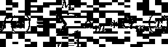

(等式 1)

如果我们将 *fm(x)* 定义为具有 *m* 预测值的函数，将 *fm-1(x)* 定义为具有 *m-1* 预测值的函数，那么很容易证明

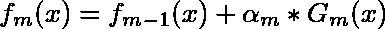

(等式 2)

现在来看看损失函数。AdaBoost 使用指数损失函数，即

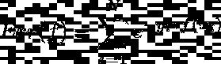

有一点你应该记住，AdaBoost 使用{-1，1}作为二进制标签，而不是{0，1}。这将如何帮助我们，我稍后会解释。

根据等式(2)，我们可以将误差函数展开为

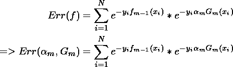

由于*【e^(-yfm-1(xᵢ】)*不依赖于*和 *Gm* 我们可以用一些常数来代替它们，比如 w *ᵢ**

*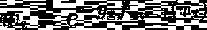*

*这些 *wᵢ* 将成为传递给 *Gm* 以适应功能的权重。在 *Gm* 完成拟合后，我们现在必须找到 *αₘ.的值**

*很容易说明表达式-y *ᵢαₘGm(xᵢ)* 是 *-αₘ* 如果 y *ᵢ* = *Gm(xᵢ)* 并且是 *αₘ* 如果y *ᵢ！=Gm(xᵢ).记住这一点，我们可以将误差函数改写为**

*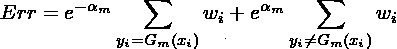*

*(等式 3)*

*如果我定义总重量 *Tw* 为*

*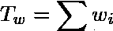*

*误差权重 *Ew* 为*

*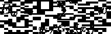*

*那么我可以将等式-(3)改写为*

*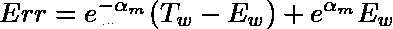*

*这变成了太多的变数。但相信我，我们越来越接近了。现在我们来微分 *Err* w.r.t *αₘ* 得到极小点。*

*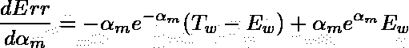*

*等于 d *Err/dαₘ* = 0 我们有*

*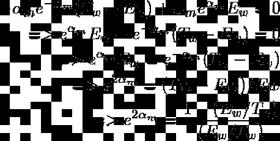*

*我们两边都有原木*

*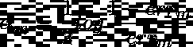*

*在哪里*

*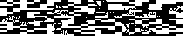*

*我们完成了我们的推导。在继续讨论算法之前，让我解释一些事情。*

*1)看看我们的假设函数。*

**

*注意 *Gm(x)* 只输出 *{-1，1}* 。然后，通过与 *αₘ* 相乘，该输出被缩放到某个正值或负值。因此 *αₘ* 被称为信心，因为我们对那个特定预测器的输出表现出如此大的信心。*

*2)*αₘgm(x)*将产生一系列正/负值。将所有这些相加，我们将得到一个或正或负的和。如果它是正的，那么我们说输出是 1，否则它是-1。*

*要带走的东西是 *αₘGm(x)* 可以是正的，也可以是负的。但是如果更多的分类器说它是正的，那么总和将变成正的。所以我们遵循大多数分类者的主张。这就是我们所说的加权投票。*

## *算法:*

```
***Fit:**Step-1 : Initialize weights. wi = C , i = 1,2,..NThis constant can be anything. I will be using 1/N as my constant. Any constant you pick will give exact same performance given it doesn’t cause overflow.Step-2: For m = 1 to M: a) Fit classifier Gm with weights w b) Compute errₘ = SUM(wi*I(yi!=Gm(xi) ) / SUM(wi) c) Compute αₘ = log( (1-errₘ)/errₘ ) d) Update the weights wi = wi * exp(αₘ*I(yi!=Gm(xi))**Predict:**f(x) = sign( SUM (αₘ*Gm(x)) )*
```

*让我们把它编码。*

*让我们生成一个数据集来检查我们的性能。*

```
*Performance: 84.7926267281106 %
Confusion Matrix:
 [[94 15]
 [18 90]]*
```

*作为健全性检查，我们可以与 sklearn 实现进行比较，*

```
*Performance: 84.7926267281106 %
Confusion Matrix:
 [[94 15]
 [18 90]]*
```

*正如所料，它们产生了相同的结果。有一点你可能会注意到，对于 sklearn，我使用的是 algorithm=" *SAMME"* 。实际上，有两种 AdaBoost 算法用于分类。萨姆。当弱学习者产生连续输出时使用 R (像逻辑回归产生属于一个类的数据点的概率)。但是当我们使用决策树分类器时，产生离散输出的算法，我们应该使用的是 *SAMME* 。我们已经实现的算法是用于 2 类分类的 *SAMME* 的变体。*

**(注意 SAMME 和 SAMME 都有。r 也可以处理连续和离散预测器。但是 SAMME 被设计成与离散预测器和 SAMME 一起工作。r 代表连续预测值)**

*多类分类的算法与这里给出的算法非常相似，只是有一些微小的变化。如果多类分类涉及 k 个类，则 y 不是在{-1，1}之间变化的单个变量，而是变成 k 维向量。类似地，f(x)也输出一个 k 维向量。所以在误差函数中没有做*

*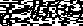*

*我们取 y 和 f(x)向量的点积*

*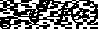*

*然后我们尝试最小化这个新的误差函数。你可以通过这个 github 链接找到用 AdaBoost 进行多类分类的完整代码。*

```
*[https://github.com/Samarendra109/ML-Models/blob/master/ensemble/AdaBoostClassifier.py](https://github.com/Samarendra109/ML-Models/blob/master/ensemble/AdaBoostClassifier.py)*
```

*AdaBoost 是一种非常强大的技术，也可以用于回归。对于回归而非指数损失函数，我们使用平方误差函数的变体。在 sklearn 中，它被实现为 AdaBoostRegressor。*

*现在，在您离开之前，在使用 AdaBoostClassifier 时，您应该记住以下几点。*

## ***收敛:***

*有时在某个点之后，无论你增加多少 *n_estimators* ，AdaBoost 分类器的性能都不会提高。*

*如果您为每个估计器绘制 *errₘ* (在 sklearn 实现中，这些值出现在 *estimator_errors_* 中)，那么您将得到一个类似这样的图形。*

*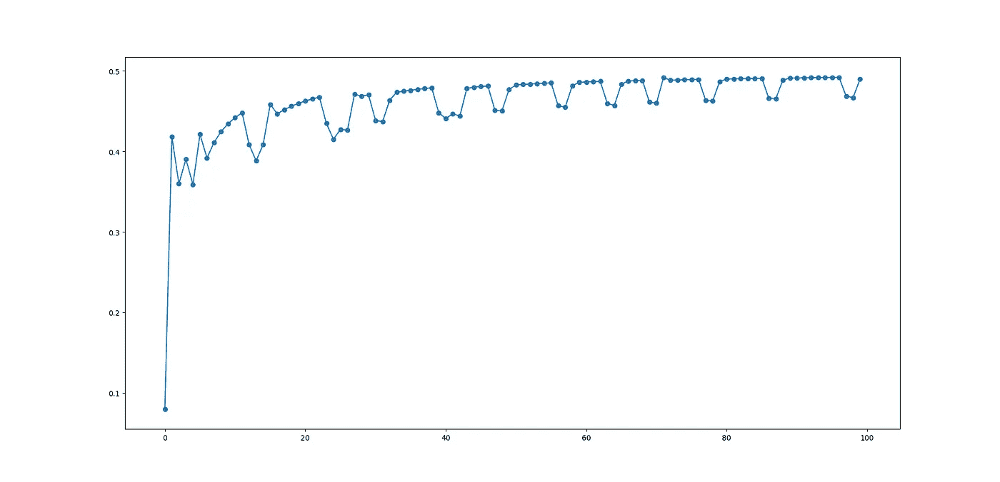*

*您会注意到 *errₘ* 值收敛到 *0.5* (对于 *k* 类分类，该值将为*(1–1/k)*)。让我们看看当 *errₘ* 变成 *0.5* 时会发生什么。*

*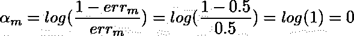*

*置信值变为 0，因此不计算估计量的贡献。在这之后，无论你增加多少 n_estimators 的值，性能都不会进一步提高。如果你绘制置信值 *αₘ.，你也可以看到同样的情况*(估算器 _ 权重 _ 在 sklearn 实现中)*

*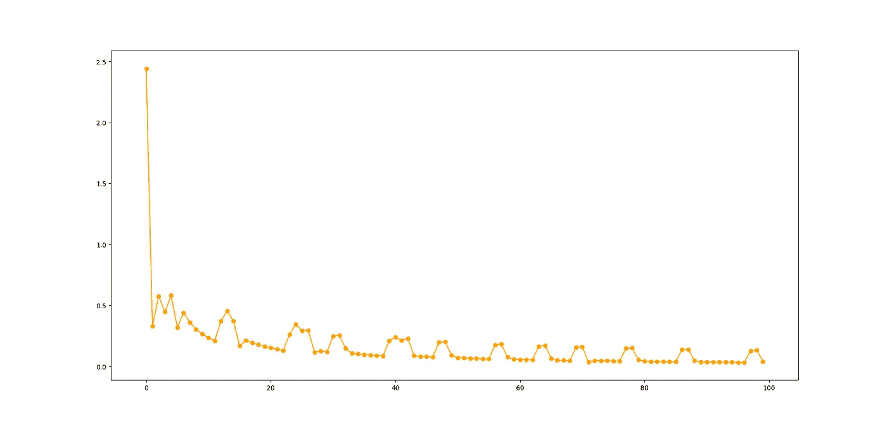*

*在实践中，如果你的模型在增加了 n 个估计量后仍然没有改善，那么你可能需要传递一个比你现在使用的更强的估计量。*

## ***过拟合:***

*正如我们看到的，每次一个点被错误分类，它的权重就会不断增加，直到某个分类器正确预测它。因此，如果你的数据有离群值或噪音，那么 AdaBoost 将迫使模型，直到它被正确分类。换句话说，它对噪音非常敏感，很容易过度拟合。*

*简单点说，你和你妹妹明天有数学考试。你姐姐试图学习一个特定的问题，但无论她如何努力都无法理解。所以你所做的是，你只是一个字一个字地记住那个问题和它的答案。你不知道的是，你的妹妹实际上无法解决这个问题，因为这个问题有一个印刷错误。但是现在这变得危险了，因为你已经记住了答案，而不是学习公式，如果考试中出现类似的问题，你很可能会写错答案，因为你会应用你记住的内容。*

*这个故事的寓意是，如果你打算使用 AdaBoost，那么首先从数据中删除离群值和噪声。*

*就是这样。现在你可以继续使用你自己的 AdaBoostClassifier 来解决你想要的问题。*

# *结论:*

*AdaBoost 算法是一个巨大的讨论话题。定期发布研究论文来调整和改进该算法。我已经尽量用简洁的方式解释了，但是还有更多东西需要学习。谢谢你一直读到最后。如果你喜欢，那就鼓掌吧。如果您有任何疑问/建议，请在回复中提出。*