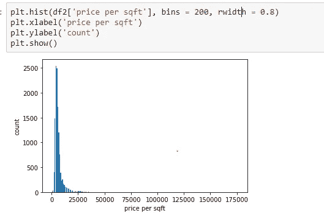
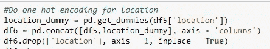
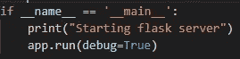

# 通过部署实施端到端机器学习项目

> 原文：<https://medium.com/analytics-vidhya/implementing-an-end-to-end-machine-learning-project-with-deployment-fedaf5125487?source=collection_archive---------13----------------------->

嘿，大家好！我是萨扬坦·古普塔，目前在高通公司做工程师，有两年多的工作经验。

如今，几乎每个人都熟悉这个术语——“机器学习和人工智能”。它在全球范围内的需求、要求和应用呈指数级增长，这使得它成为过去 5-6 年中需要学习的一项基本技能。在本文中，我将介绍一个端到端的机器学习项目，从数据清理和预处理一直到部署。那么，让我们开始吧！！

我们先来了解一下什么是机器学习或者数据科学管道！

# *机器学习管道:*

一般来说，任何数据科学项目都有 5 个**主要**步骤。统称为数据科学项目的生命周期

1.  数据分析
2.  特征工程
3.  离群点去除
4.  模型结构
5.  模型部署

我们可以建立一个数据科学管道，其中每个步骤都可以独立运行，然后最终集成在一起，创建一个完整的数据科学项目。

# **关于项目:**

继续这个项目，这个项目是关于**预测印度班加罗尔**、**基于各种因素的房屋销售价格，如位置、平方英尺、BHK 的数量、浴室等**。这个项目的数据集取自 Kaggle ( [链接](https://www.kaggle.com/amitabhajoy/bengaluru-house-price-data))。正如你们中的一些人可能已经猜到的，这是一个回归问题，所以我们必须相应地解决。在开始一个接一个的步骤之前，让我们先看看最终项目的 UI，这将是我们的输出

**Heroku 上的项目链接**:[https://house-price-predictor-app.herokuapp.com/](https://house-price-predictor-app.herokuapp.com/)

**Github 回购:**[https://Github . com/babai 95/Bangalore _ house _ price _ prediction _ end _ to _ end _ with _ Deployment](https://github.com/babai95/Bangalore_house_price_prediction_end_to_end_with_Deployment)

让我们从步骤开始。在开始之前，我必须说这不是解决这个问题的唯一方法。有多种方法可以解决这个问题，其中一些肯定会比这个更好、更有效、精确度更高。我想向你们展示的是一个完整的端到端的方式来完成一个 ML 项目。如果你对这个项目有任何疑问，请随时在 Linkedin 上联系我。**我的 Linkedin 个人资料**:【https://www.linkedin.com/in/sayantan-gupta-779a23125/】T4

那么，让我们开始吧！！

1.  **数据分析:**

**1.1 导入库**

导入所有需要的库:Pandas、numpy、matplotlib。将显示选项设置为“display.max_columns ”,以确保无论何时查看数据集，都能看到所有列，即数据集中的所有要素。然后

1.2 **获取数据集并检查其基本信息**

读取数据集 csv 文件并获取其形状。正如我们所看到的，形状是(13320，9)，这意味着它有 13320 条记录和 9 个特征。如果我们看到 dataset.head()，我们将看到数据集中的前 5 条记录。然后我们使用 info()函数查看数据集信息。我们可以看到总共有 9 列(特征)。其中 3 个是数据类型“float64”，它们是数字特征，而 6 个是数据类型“object”，它们是分类特征。我们还可以看到其中非空值的数量。

**1.3 特征分析**

这就是你正在做的任何项目所涉及的领域知识发挥作用的地方。拥有良好的领域知识有助于您判断是否应该删除任何您认为对预测相关特性(此处为销售价格)不重要的列。在这种情况下，我们可以选择“可用性”,因为它通常不会影响房屋的销售价格。

这是一个简短的数据分析，现在我们可以转到特征工程

**2。特征工程**

**2.1 从所有特征中移除空值**

这是整个数据科学流程中最重要的步骤之一。首先，我们使用 isnull()检查所有列的空值总和。sum()函数

一般来说，我们可以删除那些空值数量超过所有记录的 50%的列。在这种情况下，我们可以将阈值视为 13320 的 50%，即 6660。这里没有一列的空值数量超过 6660。然而，我们可以看到“society”与其他相比有相当高数量的空值(5502)。因此，数据集中存在比例失调，最好删除“社会”。

我们将首先分离数值列和分类列，然后删除它们各自的空值，因为对于数值列和分类列，删除空值的过程是不同的。首先让我们对数值特征执行此操作:

首先使用 python 中的 list comprehension 找到所有数字特征:**numeric _ features =[feature for feature in dataset . columns if dataset[feature]。dtype！= 'O']。**如上所述，数值特征是那些 dtype 不是 object('O ')的特征，所以我们可以利用这个性质，得到所有的数值特征。对于一个特定的数字特性，我们将使用 fillna()函数用该列中所有值的平均值来替换它的空值。我们将对所有的数字特征都这样做。接下来，我们移除分类特征的空值

使用列表理解，我们找到分类特征，使用属性 dtype = object("O ")作为分类特征。现在，对于一个特定的分类特性，我们将使用 fillna()函数用该列中的模式替换**的空值。众数是数据中最常见的值。我们将对所有的分类特征都这样做。现在所有的空值都被删除了。**

**2.2 处理分类特征，删除冗余或意外值**

如果我们仔细观察数据集，我们会发现一些特征具有冗余值。例如:在 BHK 的功能，两个 BHK 和两个卧室类别都在那里。我们必须将它们合并到一个类别中，否则我们的机器学习模型会将它们视为不同的类别，这是不正确的。让我们从找到所有分类特征的唯一类别开始:

对于 area_type，没有多余的类别

对于位置，看起来也没有多余的类别

对于“尺寸”功能，我们可以看到像 2BHK 和 2 卧室，4 BHK 和 4 卧室等多余的类别。因此，我们可以创建一个没有这些冗余类别的新列。对于尺寸，分类为 2 BHK、2 卧室、3 BHK 等，因此最好只保留第一个数字，即 2、3、4 等，作为“尺寸”功能中 BHK 的数量。为此，我们可以在“”的基础上拆分字符串，只考虑第一部分，即卧室的数量

对于“total_sqft”功能，它是一个数字，但仍然是一种分类数据类型。我们需要将其转换为浮点数据类型。但是首先让我们检查冗余值

正如我们从上面看到的，一些值的范围类似于“1133–1384”。在这种情况下，我们应该考虑两个区间的平均值，然后将其类型化为 float

从上面我们可以看到，在某些情况下“convert_range_to_float”函数会返回 Null。因此，我们需要删除这个空值，并用平均值代替它

我们需要引入一个新功能“每平方英尺的价格”这是进行特征工程时要考虑的一个非常重要的特征。我们将在后面看到它的用法，同时删除异常值

**2.3 处理罕见的分类值**

有一些特征，例如位置，有许多类别。如果我们看到独特类别的总数:->

“位置”中有 1305 个唯一类别，一个热编码将创建额外的 1304 个特征(列)，从而在很大程度上增加数据集的大小，这根本不可行。这种由于一个热门编码而引入如此多新功能的现象被称为**维度诅咒**，我们需要避免它。为此，我们需要执行**降维**。一种技术是用一个标签标记所有罕见的分类特征(例如:“其他”)。稀有类别是出现次数非常少的类别(我们可以将阈值保持为 1%，即出现次数少于记录总数 1%的类别被视为稀有类别)

如果我们做**数据集[‘位置’]。value_counts()** ，我们将看到许多类别出现的次数非常少- >

我们需要将所有这些罕见的类别合并成一个类别。对于“位置”，我们可以将阈值计数保持为 30。之后，我们可以应用 lambda 函数将所有这些类别视为值计数小于 30 的“other_loc”

**3。异常值去除**

异常值是那些具有异常高或异常低值的观察值。它们不符合该特性的预期值范围。应该删除异常值，以便整个数据均匀分布。

同样，没有固定的方法来删除异常值。一切都基于数据洞察力、领域专业知识以及数据分析师/科学家如何分析数据，因此很明显，消除异常值的方法将因人而异。

我们可以从每间卧室的总面积开始考虑。考虑到一间卧室的面积阈值为 300 平方英尺

从上面，我们可以看到一些不寻常的数据(6 bhk 有 1020 总平方英尺，8 bhk 有 600 平方英尺等。).这些是错误的数据，因此是异常值，可以直接删除

现在考虑每平方的价格。制成每平方米价格。英尺可能太低或太高。第一，我们需要检查每平方英尺功能价格的描述

我们可以看到，最小值是 267，最大值是 176470。最小值非常小。最大值非常高，如果区域的 fi 非常高，这是可能的。但是，当我们建立一个通用模型时，我们会将高于某个阈值的值视为异常值并删除它们

让我们绘制每平方英尺价格特征的直方图

从上面的曲线中，我们可以看到“每平方英尺的价格”遵循正态分布。由于它遵循正态分布，我们可以应用标准差方法来消除该特征的异常值

**剔除异常值的标准差法**

有 3 个要点，均值，下限，上限。如果特性值介于下限和上限之间，则不是异常值。否则它就是一个离群值。一般我们考虑 3 个标准差为下限和上限。这意味着下限=均值— 3*(1 个标准差)，上限=均值+ 3(*(1 个标准差)。

在这种情况下，对于每平方英尺价格功能，平均值= 6312，1 标准偏差= 4177。如果我们对下限应用 3 个标准差，下限将是负的。因此，在这种情况下，我们必须考虑下限和上限的 1 个标准差

接下来，谈到浴室，一个 2 BHK 的房子有 5 或 6 个浴室是不寻常的，所以这些是离群值。因此，我们可以考虑，如果浴室的数量大于卧室的数量+ 2，那么它是一个异常值，并删除它们。阳台也是一样

为 BHK 剔除异常值。让我们首先在“Hebbal”位置的“总平方英尺”和“每平方英尺价格”之间绘制一个散点图

在上面高亮的圆圈里(虽然看起来不像是圆圈！XD)，我们看到，对于相同的总平方英尺，每平方英尺 2 BHK 的价格高于 3 BHK。由于各种因素，这是可能的。然而，由于我们在这里建立了一个通用模型，所以我们可以制定一个通用规则:如果 BHK 北部的每平方英尺价格低于 BHK(n-1)的每平方英尺平均价格，那么它是一个异常值，应该被删除。

**实现方法**:维护一个字典，其中 key = BHK 号码，value = BHK 每平方英尺的平均价格。现在创建一个 numpy 数组，其中包含 BHK 北部每平方英尺价格低于 BHK n-1 每平方英尺平均价格的指数。最终删除所有这些索引

现在，如果我们绘制“赫布巴尔”位置的散点图:-> 1

在上面的图中，我们看到在突出显示的圆圈中，离群点被移除。现在所有的离群值都被删除了。因为每平方英尺价格列仅用于删除异常值，所以我们可以删除它

**4。模型构建**

由于我们的机器学习模型只理解数字，所以我们需要首先将所有的分类特征转换为数字特征。我们可以使用一个热编码来实现。对“区域类型”和“位置”特征进行一次热编码

现在模型已经准备好接受训练了。在训练集中，Xtrain 是没有因变量“价格”的数据集，ytrain 只包含因变量“价格”。让我们首先尝试一下**网格搜索 CV，**，这是 scikit learn 的一个 API，它尝试了多个模型，并给出了提供最佳分数的模型

这里我们比较了使用 3 种不同算法的 3 个模型->线性回归、Lasso 回归和决策树回归。我们看到使用线性回归的模型在这 3 个模型中表现最好

因此，让我们在最终模型中使用线性回归。首先使用 train_test_split 将整个数据分成训练集和测试集，并对训练集应用线性回归。

我们得了 0.85 分，相当不错。我们还使用混洗分裂的 K-fold 交叉验证来随机化数据。对于所有的劈叉，我们得到了超过 0.85 的分数

现在，让我们用我们的模型来预测价格。我们编写了一个函数，它将所需的参数作为输入，并将预测价格作为输出

让我们预测如下:

这些是以 10 万卢比为单位的价格。因此，我们终于完成了模型构建。现在，我们将模型保存到 pickle 文件中，以便以后我们可以直接使用这个已经训练好的模型，而无需再次训练它。这个 pickle 文件只包含线性回归的权重和系数，而不是实际的全部数据。因此它的大小非常小，大约只有 3KB。我们还将所有的列(特性)存储到一个 json 文件中。

现在，这个 pickle 文件和 json 文件将被我们的 Python flask 服务器使用，我们将在下面讨论模型部署

**5。模型部署**

我们将使用 Python Flask server，它将作为一个后端服务器来提供前端客户端将请求的所有必需数据。前端部分是用基本的 HTML 和 CSS 编写的(这里不讨论了，大家可以参考我的 Github 库中的所有代码)。我们已经使用 Jquery 对后端 Flask 服务器进行 get 和 post 调用来检索数据。

上面的部分没有“获取”调用我们的后端服务器来检索位置和区域类型，所以当网站页面被加载时，所有的位置和区域类型都已经预先填充在一个下拉菜单中。

这些函数:getbath()、getbhk()和 get 阳台()获取用户在网站中输入的数据，并基于元素 id 存储这些数据。

这个函数 estimate()是主要函数，它获取用户在网站中输入的所有数据，然后对我们的后端服务器进行“post”调用，以获取房子的最终售价

下面是我们的 app.py 文件的代码，它通过 Flask server 运行。永远记住，我们项目的执行将从这个文件 app.py 开始

1.  初始化 flask 服务器并加载模型和列。

2.将主屏幕重定向到我们的 HTML 文件“home.html”

3.当“get”调用完成时，返回位置和区域类型，以在加载时用所有位置和区域类型预填充网站

4.使用用户提供的所有必需输入参数完成“post”调用后，返回最终预测价格

5.现在在 main 中运行 Flask 应用程序，保持调试模式为真

当您运行这个文件时，您将在 localhost 中看到您的输出。但是其他人看不到您的项目，除非您将它部署在某个应用程序中。为此我们将使用 Heroku。为了在 Heroku 中部署，除了所有这些文件，我们还需要另外两个文件，Procfile 和 requirements.txt

**Procfile 内容** - > web: gunicorn app:app

这里，第一个应用程序是将首先执行的文件的名称，这里是 app.py。第二个应用程序是 Flask 服务器的名称

**requirements.txt - >** 这是一个文本文件，包含了所有导入的库及其版本。为了生成 requirements.txt，转到项目文件夹，在 Windows Power Shell/命令提示符下，键入:

**pip 冻结> requirements.txt**

现在创建一个 Github 存储库，并将所有这些文件添加到您的 repo 中。之后，从 Heroku 连接你的 Github Repo，给一个合适的 app 名，然后部署。您可以看到您部署的网站并与其他人共享。就是这样！！恭喜你。你的端到端 ML 项目完成了！