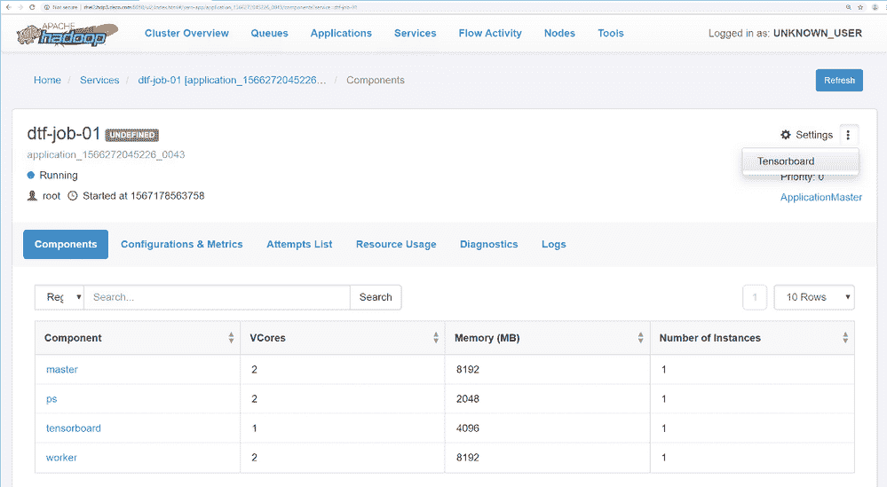

# 实现阿帕奇潜艇——一个统一的人工智能平台

> 原文：<https://medium.com/analytics-vidhya/implementing-apache-submarine-a-unified-ai-platform-459c9edd541e?source=collection_archive---------14----------------------->

# 概观

Apachesub 潜艇是 Apache Hadoop 中最新的机器学习框架子项目。它允许基础设施工程师/数据科学家运行深度学习框架，如 Tensorflow、Pytorch 等。在资源管理平台上，如本例中的 YARN。

Hadoop 2.x 使 YARN 支持 Docker 容器。**Apachesub 潜艇**引入 YARN 在 Docker 容器内调度和运行分布式深度学习框架。

为了使分布式深度学习/机器学习应用程序易于启动、管理和监控，Hadoop 社区启动了潜水艇项目以及其他改进，如一流的 GPU 支持、Docker 容器支持、容器 DNS 支持、调度改进等。

这些改进使分布式深度学习/机器学习应用程序在 Apache Hadoop YARN 上运行就像在本地运行一样简单，这可以让机器学习工程师专注于算法，而不是担心底层基础设施。通过升级到最新的 Hadoop，用户现在可以在同一集群上运行其他 ETL/流作业来运行深度学习工作负载。这可以轻松访问同一集群上的数据，并实现更好的资源利用率。

此概念验证假定已经设置了 Hadoop 集群，其中 HDFS、YARN 和其他相关服务已经配置并运行。此外，在实施 PoC 时，Submarine 还在**进行技术预览**，因此，不建议**将其用于生产级环境。**

# 警告和限制

*   本文档中包含的潜艇设置用于概念验证目的，并在技术预览中。
*   zeppelin 0 . 9 . 0-快照不是 HDP Hadoop 发行版的一部分。在通过 Ambari 部署整个集群之后，必须单独设置它。还要注意的是，在撰写本文档时，Zeppelin 0.9.0 还没有正式发布。
*   它仅通过纱线进行验证和测试。
*   用 nvidia-docker v1 测试。但是，submarine 也支持 nvidia-docker v2
*   Hadoop-yarn-sub 潜艇-3.2.0.jar 不是 HDP 3.0/3.1 的一部分。您需要从参考资料部分提到的 apache 镜像站点下载它。

# 先决条件

*   必须正确设置所有与纱线服务相关的依赖项。
*   如果计划使用 GPU，则必须配置 Docker 相关的依赖项，如 nvidia-driver、cuda 和 nvidia-docker。
*   必须配置主机之间的容器通信。在本参考设计中，使用了**印花棉布**。没有它，分布在不同节点上容器就不能相互通信。例如，在一个主机中运行的 PS(参数服务器)不与在另一个主机中运行的工作节点通信。
*   如果没有正确的 YARN DNS 注册配置，您就无法获得分布式 AI/ML 或通过 YARN 工作的潜水艇。主服务、工作服务和参数服务使用 DNS 相互通信。
*   必须设置 ETCD，它是分布式可靠的键值存储。设置 Calico 网络需要键值存储。ETCD 的法定人数是三人。
*   如果 Docker 私有注册表尚不存在，则必须进行设置。
*   使用 submarine-installer 来安装依赖项，但是，它也可以手动设置。在该参考设计中，水下安装器将用于安装 calico 和 etcd。
*   Docker GPU 调度和隔离必须在 YARN 中为支持 GPU 的节点进行配置。还确保 Docker 使用 cgroupfs cgroupdriver 选项(如果启用了纱线 cgroup 支持)。

# 海底建筑

Hadoop 社区发起了潜艇项目，以使分布式深度学习/机器学习应用易于启动、管理和监控。

**潜艇组件**

1.  海底计算引擎→向 YARN 提交定制的深度学习
2.  潜艇回声系统集成

*   潜艇-齐柏林飞艇集成—允许数据科学家在齐柏林飞艇笔记本电脑内编码，并从齐柏林飞艇提交/管理培训工作。
*   海底阿兹卡班集成—允许数据科学家从 Zeppelin 笔记本电脑直接向阿兹卡班提交一组具有相关性的工作流任务。
*   潜水艇安装工——安装潜水艇及其附属部件。


# 软件版本

以下是用于验证概念验证的软件版本


# 配置说明

## 下载潜艇安装程序

```
# git clone [https://github.com/hadoopsubmarine/submarine-installer.git](https://github.com/hadoopsubmarine/submarine-installer.git)
```

## 设置潜艇安装程序

Submarine-installer 可以直接从网络安装所有依赖项，如 etcd、docker、nvidia-docker 等。但是，在服务器没有连接到互联网的情况下，可以设置下载服务器。

通过在/subscriber-installer/install . conf 中执行以下更改，设置 submarine installer 的下载服务器

```
DOWNLOAD_SERVER_IP="10.16.1.58" 
DOWNLOAD_SERVER_PORT="19000" 
LOCAL_DNS_HOST="10.16.16" 
ETCD_HOSTS=(10.16.1.31 10.16.1.32 10.16.1.33)
```

*注意:设置 ETCD 至少需要三台服务器。在这种情况下，选择 rhel1、rhel2 和 rhel3 来设置 ETCD。*

*本文档在已经安装的 HDP 环境中设置潜艇。因此，不要安装任何其他东西，因为我们假设 yarn、docker、nvidia-driver、cuda 和 nvidia-docker 已经安装并正确配置。通过运行以下命令来验证它:*

```
# nvidia-docker run --rm nvidia/cuda:9.2-base nvidia-smi
```

通过运行以下命令运行安装程序。

```
# ./sibmarine-installer/install.sh
```


输入“y”。将启动主菜单。输入“6”启动下载服务器，如图 2 所示。输入“y”启动下载 http 服务器


这将下载/subscribe-installer/downloads 文件夹中的所有依赖项和包，并启动 http 服务器，该服务器将在/subscribe-installer/install . conf 文件中指定的下载服务器 IP 和端口上可用。在所有服务器都配置好之前，不要关闭在此服务器上运行的潜艇安装程序。

当 sub 潜艇-installer/install.sh 在其他服务器上执行并选择安装组件时，会自动从下载服务器下载并安装组件

# 安装组件

在此参考设计中，我们将仅通过使用潜艇安装程序来安装 ETCD 和印花布网络。本文档在已经配置和部署的 HDP 环境中部署和设置 sub 潜艇，其中假设 docker、nvidia-driver、nvidia-docker 和 yarn 服务已经设置。已安装组件的任何水下特定配置将在后续章节中介绍。

## 安装 ETCD

etcd 是一个可靠的分布式键值存储，用于存储分布式系统中最关键的数据、注册和发现容器中使用的服务。也可以使用 zookeeper、Consul 之类的替代产品，但是，在本参考设计中未对其进行测试。

执行以下步骤来安装组件。

快跑。在 rhel1、rhel2 和 rhel3 中使用/subscribe-installer/install . sh 来安装和设置 ETCD，如图所示。键入 2 安装组件，然后键入 1 安装 etcd 并按 enter 键。


*注意:Etcd 必须安装在三台服务器上才能形成一个集群。这里，我们在 rhel1、rhel2 和 rhel3 中安装了 etcd。*

安装完成后，通过运行以下命令在所有三台服务器上启动 etcd 服务。

```
# systemctl start etcd.service 
# systemctl status etcd. Service
```

通过运行以下命令验证 etcd 安装

```
# etcdctl cluster-health
```


验证集群成员身份

```
# etcdctl member list
```


## 配置 Docker

modify/etc/docker/daemon . JSON 文件。如果它不存在，请在所有节点中创建包含以下内容的文件。

```
{
    "live-restore" : true,
    "debug" : true,
    "insecure-registries": ["${image_registry_ip}:5000"],
    "cluster-store":"etcd://${etcd_host_ip1}:2379,${etcd_host_ip2}:2379,${etcd_host_ip3}:2379",
    "cluster-advertise":"{localhost_ip}:2375",
    "dns": ["${yarn_dns_registry_host_ip}", "${dns_host_ip}"],
    "hosts": ["tcp://{localhost_ip}:2375", "unix:///var/run/docker.sock"]
}
```

根据您的环境替换 daemon.json 文件中的变量，如图所示，以供参考。

```
[root@rhel4 submarine-installer]# cat /etc/docker/daemon.json
{
    "live-restore" : true,
    "debug" : true,
    "insecure-registries" : ["linuxjh.hdp3.cisco.com:5000"],
    "cluster-store" : "etcd://10.16.1.31:2379,10.16.1.32:2379,10.16.1.33:2379",
    "cluster-advertise" : "10.16.1.34:2375",
    "hosts" : ["tcp://10.16.1.34:2375", "unix:///var/run/docker.sock"]}
```

重新加载 docker 守护进程并重启 docker 服务。

```
# systemctl daemon-reload 
# systemctl restart docker
```

如先决条件中所述，如果启用了 YARN cgroups 支持，请确保 Docker 使用 cgroupfs cgroupdriver 选项。

```
# vi /usr/lib/systemd/system/docker.service
```

查找并修复 cgroupdriver:

```
--exec-opt native.cgroupdriver=cgroupfs \
```

## 安装印花棉布

Calico 创建并管理一个扁平的三层网络，每个容器都分配有一个可路由的 IP。

要在指定的服务器上安装 Calico，请运行。/subscriber-installer/install . sh .输入“3”安装 calico 网络，按回车键，如图所示


启动 calico 节点服务。

```
# systemctl start calico-node.service 
# systemctl status calico-node.service
```

通过运行以下命令验证 calico 网络。它将显示除本地主机之外的所有主机状态。

```
[root@rhel17 ~]# calicoctl node status
Calico process is running.IPv4 BGP status
+--------------+-------------------+-------+------------+--------------------------------+
| PEER ADDRESS |     PEER TYPE     | STATE |   SINCE    |              INFO              |
+--------------+-------------------+-------+------------+--------------------------------+
| 10.16.1.31   | node-to-node mesh | up    | 2019-08-27 | Established                    |
| 10.16.1.40   | node-to-node mesh | up    | 2019-08-27 | Established                    |
| 10.16.1.41   | node-to-node mesh | up    | 2019-08-27 | Established                    |
| 10.16.1.43   | node-to-node mesh | up    | 2019-08-27 | Established                    |
| 10.16.1.44   | node-to-node mesh | up    | 2019-08-27 | Established                    |
| 10.16.1.34   | node-to-node mesh | up    | 2019-08-27 | Established                    |
| 10.16.1.35   | node-to-node mesh | up    | 2019-08-27 | Established                    |
| 10.16.1.36   | node-to-node mesh | up    | 2019-08-27 | Established                    |
| 10.16.1.37   | node-to-node mesh | up    | 2019-08-27 | Established                    |
| 10.16.1.38   | node-to-node mesh | up    | 2019-08-27 | Established                    |
| 10.16.1.58   | node-to-node mesh | up    | 2019-08-28 | Established                    |
+--------------+-------------------+-------+------------+--------------------------------+IPv6 BGP status
No IPv6 peers found.[root@rhel17 ~]#
```

测试印花布网络。Calico 网络安装程序还包含在两个不同节点中提供两个 docker 容器并运行 ping 的脚本。如果另一个节点当前没有设置 Calico，它可能会失败。设置好 calico 后，您可以遵循以下手动步骤。

```
# docker network create --driver calico --ipam-driver calico-ipam calico-network 
# docker network ls
```


在新网络的节点 1 中创建一个容器

```
# docker run --net calico-network --name workload-A -tid busybox
```

在同一网络上的节点 2 中创建一个容器

```
# docker run --net calico-network --name workload-B -tid busybox
```

从节点 1 容器 Ping 节点 2 容器

```
# docker exec workload-A ping workload-B
```


## 印花布网络的纱线结构

为 YARN . node manager . runtime . Linux . docker . allowed-container-networks 配置使用 YARN 中的 calico 驱动程序创建的 docker 网络

在 Ambari 中，单击 YARNàCONFIGSàADVANCED，过滤允许的容器网络，并添加 calico-network，如图所示。


单击保存并重新启动所有受影响的服务。

## 验证 nvidia-docker

在这个参考设计中，使用了 nvidia-docker v1。假设 nvidia-driver、cuda 和 nvidia-docker 已正确配置。在我们继续下一步之前，请执行以下步骤来验证环境是否已准备好运行支持 GPU 的分布式 AI/ML。

执行以下测试:

```
[root@rhel14 ~]# nvidia-smi 
[root@rhel14 ~]# nvidia-docker run --rm nvidia/cuda:9.2-base nvidia-smi[root@rhel14 ~]# nvidia-docker run -it tensorflow/tensorflow:1.9.0-gpu bash
root@0b34d22fac56:/notebooks# python
Python 2.7.12 (default, Dec  4 2017, 14:50:18)
[GCC 5.4.0 20160609] on linux2
Type "help", "copyright", "credits" or "license" for more information.
>>> import tensorflow as tf
>>> tf.test.is_gpu_available()
2019-08-30 14:17:41.424470: I tensorflow/core/platform/cpu_feature_guard.cc:141] Your CPU supports instructions that this TensorFlow binary was not compiled to use: AVX2 AVX512F FMA
2019-08-30 14:17:41.812712: I tensorflow/core/common_runtime/gpu/gpu_device.cc:1392] Found device 0 with properties:
name: Tesla V100-PCIE-16GB major: 7 minor: 0 memoryClockRate(GHz): 1.38
pciBusID: 0000:5e:00.0
totalMemory: 15.78GiB freeMemory: 15.37GiB
2019-08-30 14:17:41.812760: I tensorflow/core/common_runtime/gpu/gpu_device.cc:1471] Adding visible gpu devices: 0
2019-08-30 14:17:42.291711: I tensorflow/core/common_runtime/gpu/gpu_device.cc:952] Device interconnect StreamExecutor with strength 1 edge matrix:
2019-08-30 14:17:42.291763: I tensorflow/core/common_runtime/gpu/gpu_device.cc:958]      0
2019-08-30 14:17:42.291775: I tensorflow/core/common_runtime/gpu/gpu_device.cc:971] 0:   N
2019-08-30 14:17:42.292189: I tensorflow/core/common_runtime/gpu/gpu_device.cc:1084] Created TensorFlow device (/device:GPU:0 with 14879 MB memory) -> physical GPU (device: 0, name: Tesla V100-PCIE-16GB, pci bus id: 0000:5e:00.0, compute capability: 7.0)
True
>>>
```

## 为潜艇创建码头工人图像

创建以下 docker 文件。

```
[root@linuxjh dockerfile]# cat tf-1.8.0-gpu.Dockerfile
FROM nvidia/cuda:9.0-cudnn7-devel-ubuntu16.04# Pick up some TF dependencies
RUN apt-get update && apt-get install -y --allow-downgrades --no-install-recommends  --allow-change-held-packages \
        build-essential \
        cuda-command-line-tools-9-0 \
        cuda-cublas-9-0 \
        cuda-cufft-9-0 \
        cuda-curand-9-0 \
        cuda-cusolver-9-0 \
        cuda-cusparse-9-0 \
        curl \
        libcudnn7=7.0.5.15-1+cuda9.0 \
        libfreetype6-dev \
        libpng12-dev \
        libzmq3-dev \
        pkg-config \
        python \
        python-dev \
        rsync \
        software-properties-common \
        unzip \
        && \
    apt-get clean && \
    rm -rf /var/lib/apt/lists/*RUN export DEBIAN_FRONTEND=noninteractive && apt-get update && apt-get install -yq krb5-user libpam-krb5 && apt-get cleanRUN curl -O [https://bootstrap.pypa.io/get-pip.py](https://bootstrap.pypa.io/get-pip.py) && \
    python get-pip.py && \
    rm get-pip.pyRUN pip --no-cache-dir install \
        Pillow \
        h5py \
        ipykernel \
        jupyter \
        matplotlib \
        numpy \
        pandas \
        scipy \
        sklearn \
        && \
    python -m ipykernel.kernelspec# Install TensorFlow GPU version.
RUN pip --no-cache-dir install \
    [http://storage.googleapis.com/tensorflow/linux/gpu/tensorflow_gpu-1.8.0-cp27-none-linux_x86_64.whl](http://storage.googleapis.com/tensorflow/linux/gpu/tensorflow_gpu-1.8.0-cp27-none-linux_x86_64.whl)
RUN apt-get update && apt-get install git -yRUN apt-get update && apt-get install -y openjdk-8-jdk wget
# Downloadhadoop-3.1.1.tar.gz
RUN wget [http://mirrors.hust.edu.cn/apache/hadoop/common/hadoop-3.1.1/hadoop-3.1.1.tar.gz](http://mirrors.hust.edu.cn/apache/hadoop/common/hadoop-3.1.1/hadoop-3.1.1.tar.gz)
RUN tar zxf hadoop-3.1.1.tar.gz
RUN mv hadoop-3.1.1 hadoop-3.1.0# Download jdk which supports kerberos
#RUN wget -qO jdk8.tar.gz 'http://${kerberos_jdk_url}/jdk-8u152-linux-x64.tar.gz'
#RUN tar xzf jdk8.tar.gz -C /opt
#RUN mv /opt/jdk* /opt/java
#RUN rm jdk8.tar.gz
#RUN update-alternatives --install /usr/bin/java java /opt/java/bin/java 100
#RUN update-alternatives --install /usr/bin/javac javac /opt/java/bin/javac 100#ENV JAVA_HOME /opt/java
#ENV PATH $PATH:$JAVA_HOME/bin
[root@linuxjh dockerfile]#
```

构建 Docker 映像

```
[root@linuxjh dockerfile]# docker build -t tf-1.8.0-gpu . -f tf-1.8.0-gpu.Dockerfile
```

标记图像并将其推送到私有 docker 注册表

```
# docker tag tf-1.8.0-gpu linuxjh.hdp3.cisco.com:5000/tf-1.8.0-gpu:0.0.1
# docker push linuxjh.hdp3.cisco.com:5000/tf-1.8.0-gpu:0.0.1
# docker image ls
```

## 驾驶潜艇

为了测试机器学习与潜艇 Cifar-10 张量流估计器的例子已经被利用。

在开始运行 substantial 独立作业或分布式作业之前，请执行以下步骤。

## 下载潜艇 jar 文件

从[https://www . Apache . org/dyn/closer . CGI/Hadoop/common/Hadoop-3 . 2 . 0/Hadoop-3 . 2 . 0 . 0 . tar . gz](https://www.apache.org/dyn/closer.cgi/hadoop/common/hadoop-3.2.0/hadoop-3.2.0.tar.gz)下载 Hadoop-yarn-subscriber-3 . 2 . 0 . jar。它包含在 hadoop 3.2 镜像中。提取下载的文件，将 Hadoop-yarn-subscriber-3 . 2 . 0 . jar 复制到/usr/HDP/3 . 0 . 1 . 0–187/Hadoop-yarn/folder。Hadoop-yarn-sub 潜艇-3.2.0.jar 文件应该在所有 NodeManager 节点中复制。

## 准备测试数据

CIFAR-10 是用于图像识别的机器学习中的常见基准。以下示例基于 CIFAR-10 数据集。

通过运行以下命令下载 tensorflow 模型。

```
# git clone [https://github.com/tensorflow/models/](https://github.com/tensorflow/models/)
```

转到模型/教程/图像/cifar10_estimator。使用以下命令生成数据:(需要安装 Tensorflow)

```
# python generate_cifar10_tfrecords.py --data-dir=cifar-10-data
```

上传数据到 HDFS

```
# hds dfs -put cifar-10-data/ /tmp/cifar-10-data
```

## 运行独立 TensorFlow 作业

对独立 tensorflow 作业运行以下命令。对于单机，不需要指定参数服务器和工作线程数。下面的命令将为 worker 节点和 tensorboard 分别提供一个容器。但是，tensorboard 是可选的，可以在下面的命令中省略

```
[root@rhel4 ~]# cat standalone-tf.sh
hdfs dfs -rm -r /tmp/cifar-10-jobdir
yarn app -destroy standalone-tf-01
yarn jar /usr/hdp/3.0.1.0-187/hadoop-yarn/hadoop-yarn-submarine-3.2.0.jar job run \
--name standalone-tf-01 \
--verbose \
--docker_image linuxjh.hdp3.cisco.com:5000/tf-1.8.0-gpu:1.0  \
--input_path hdfs://CiscoHDP/tmp/cifar-10-data \
--checkpoint_path hdfs://CiscoHDP/tmp/cifar-10-jobdir \
--env YARN_CONTAINER_RUNTIME_DOCKER_CONTAINER_NETWORK=calico-network \
--env DOCKER_JAVA_HOME=/usr/lib/jvm/java-8-openjdk-amd64/jre/ \
--env DOCKER_HADOOP_HDFS_HOME=/hadoop-3.1.0 \
--worker_resources memory=8G,vcores=2,gpu=1 \
--worker_launch_cmd "cd /test/models/tutorials/image/cifar10_estimator && python cifar10_main.py --data-dir=%input_path% --job-dir=%checkpoint_path% --train-steps=10000 --eval-batch-size=16 --train-batch-size=16 --num-gpus=1 --sync" \
--ps_docker_image  linuxjh.hdp3.cisco.com:5000/tf-1.8.0-cpu-wt  \
--tensorboard \
--tensorboard_docker_image linuxjh.hdp3.cisco.com:5000/tf-1.8.0-cpu-wt[root@rhel4 ~]#
```

注意:*请注意，YARN 服务不允许多个服务同名，所以请运行以下命令。#纱线申请-销毁<服务-名称>*

## 运行分布式张量流作业

下面是提交分布式张量流的命令。对于分布式 tensorflow，工作线程数应大于 1，并且还需要参数服务器。在本例中，我们提供了两个工作节点和一个参数服务器。每个工作节点将有 8G 内存、2 个 CPU 和 1 个 GPU。参数服务器请求 2G RAM 和 2 个 CPU。根据您的环境和可用资源，可以请求更多的工作人员。

```
[root@rhel4 ~]# cat distributed-tf.sh
hdfs dfs -rm -r /tmp/cifar-10-jobdir
yarn app -destroy dtf-job-01
yarn jar /usr/hdp/3.0.1.0-187/hadoop-yarn/hadoop-yarn-submarine-3.2.0.jar job run \
--name dtf-job-01 \
--verbose \
--docker_image linuxjh.hdp3.cisco.com:5000/tf-1.8.0-gpu:1.0  \
--input_path hdfs://CiscoHDP/tmp/cifar-10-data \
--checkpoint_path hdfs://CiscoHDP/tmp/cifar-10-jobdir \
--env YARN_CONTAINER_RUNTIME_DOCKER_CONTAINER_NETWORK=calico-network \
--env DOCKER_JAVA_HOME=/usr/lib/jvm/java-8-openjdk-amd64/jre/ \
--env DOCKER_HADOOP_HDFS_HOME=/hadoop-3.1.0 \
--num_workers 2 \
--worker_resources memory=8G,vcores=2,gpu=1 \
--worker_launch_cmd "cd /test/models/tutorials/image/cifar10_estimator && python cifar10_main.py --data-dir=%input_path% --job-dir=%checkpoint_path% --train-steps=10000 --eval-batch-size=16 --train-batch-size=16 --num-gpus=1 --sync" \
--ps_docker_image  linuxjh.hdp3.cisco.com:5000/tf-1.8.0-cpu-wt  \
--num_ps 1 \
--ps_resources memory=2G,vcores=2  \
--ps_launch_cmd "cd /test/models/tutorials/image/cifar10_estimator && python cifar10_main.py --data-dir=%input_path% --job-dir=%checkpoint_path% --num-gpus=0" \
--tensorboard \
--tensorboard_docker_image linuxjh.hdp3.cisco.com:5000/tf-1.8.0-cpu-wt[root@rhel4 ~]#
```


## 验证分布式张量流作业

在上述步骤中使用 YARN 提交作业后，执行以下步骤来验证作业是否成功运行。

启动 YARN(节点管理器)GUI。单击服务。提交的作业将显示在应用程序和服务选项卡中，如下图所示。


单击 dtf-job-01 查看此服务的详细信息。下图显示了该作业创建的组件。因为我们要求 2 名工人，1 名 PS 和 Tensorboard，这是可以核实的。


单击尝试列表，然后单击尝试 ID。网格视图将显示启动的容器的详细信息、它们的状态以及它们被提供的节点。如果请求 GPU 资源，例如在这次运行中，YARN 在 GPU 所在的节点中调度 workers docker 容器。作业成功完成后，资源会自动返回到群集。


*注意:如果任务请求的资源(如 RAM、CPU 和 GPU)大于可用资源，任务将失败。验证 YARN GUI 中的集群资源，以确保高级资源(如 GPU)没有被其他作业或用户占用。*

单击“日志”列中的一个工作节点，验证作业是否正在运行。例如，单击 rhel17 日志，然后单击 stderr.txt 文件。如下图所示验证输出


我们还可以验证 worker 运行时所利用的资源。例如，如下图所示的 rhel17 服务器。


点击 YARN GUI 中的“集群概述”也可以查看集群级资源。我们用 2 个工人和 1 个 GPU 启动了海底作业。下图中的群集概述显示了群集级别的资源利用率。


因为我们已经要求 YARN 为这项工作推出 Tensorboard。在服务/应用程序选项卡中单击设置→Tensorboard 即可启动 Tensorboard。



Tensorboard 可以如下图所示


ssh 到其中一个配置了 worker 的节点，并运行 nvidia-smi 命令，如下所示。


# 潜艇用齐柏林飞艇

Zeppelin 是一个基于网络的笔记本，支持交互式数据分析。可以用 SQL，Scala，Python 等。制作数据驱动、互动、协作的文档。

Zeppelin 有 20 多个解释器(例如 Spark、Hive、Cassandra、Elasticsearch、Kylin、HBase 等。)来收集数据、清理数据、特征提取等。在 Hadoop 中的数据之前完成机器学习模型训练。数据预处理过程。

潜水艇解释器是新开发的解释器，支持机器学习工程师和数据科学家从 Zeppelin 笔记本进行开发，并直接向 YARN job 提交训练作业并从笔记本中获得结果。

## 齐柏林潜艇解释器属性

发射齐柏林飞艇。单击用户名，然后单击解释器下拉菜单，以配置潜艇解释器属性


在过滤器中键入 submarine，然后单击 Edit，根据您的环境配置 submarine 解释器。

在我们的实验室设置中设置了以下属性。

DOCKER _ HADOOP _ HDFS _ HOME =/HADOOP-3 . 1 . 0

DOCKER _ JAVA _ HOME =/usr/lib/JVM/JAVA-8-open JDK-amd64/JRE/

HADOOP _ YARN _ 潜艇 _ JAR =/usr/HDP/3 . 0 . 1 . 0–187/HADOOP-YARN/HADOOP-YARN-sub 潜艇-3.2.0.jar

解释器 _ 启动 _ 模式=本地

subscriber _ HADOOP _ CONF _ DIR =/etc/HADOOP/conf

subscriber _ HADOOP _ HOME =/usr/HDP/3 . 0 . 1 . 0–187/HADOOP

docker . container . network = calico-网络

subscriber . algorithm . HDFS . path = HDFS://CiscoHDP/user/root/algorithm

subscriber . Hadoop . home =/usr/HDP/3 . 0 . 1 . 0–187/Hadoop

TF . check point . path = HDFS://CiscoHDP/user/root/check point/cifar-10-jobdir

tf.parameter.services.cpu=2

TF . parameter . services . docker . image = linuxjh . hdp3 . Cisco . com:5000/TF-1 . 8 . 0-CPU-wt

tf.parameter.services.gpu=0

TF . parameter . services . memory = 2G

tf.parameter.services.num=1

tf.tensorboard.enable=true

tf.worker.services.cpu=2

TF . worker . services . docker . image = linuxjh . hdp3 . Cisco . com:5000/TF-1 . 8 . 0-GPU:1.0

tf.worker.services.gpu=1

tf.worker.services.memory=4G

tf.worker.services.num=2

yarn . web app . http . address =[http://rhel2.hdp3.cisco.com:8088](http://rhel2.hdp3.cisco.com:8088/)

zeppelin . subscriber . auth . type = simple

下图描述了如何设置潜艇解释器属性


## 使用 Zeppelin 潜艇解释器运行分布式张量流

执行以下步骤，使用 Zeppelin subject 解释器提交分布式张量流

点击记事本，选择 **+** 新建便笺。将弹出创建新便笺窗口。指定注释名称，并从默认解释器下拉列表中选择 sub 潜艇，如下所示


在注释中键入以下内容，并通过单击右侧的注释设置图标为注释添加标题

```
%submarine
dashboard
```

单击运行图标。从命令下拉列表中选择作业运行，并输入以下内容。

**关卡路径**

*sub 潜艇为每个用户的笔记设置单独的检查点路径，用于 Tensorflow 训练。保存此注释历史的训练数据，用于训练模型数据的输出，Tensorboard 使用此路径中的数据进行模型演示。用户不能修改它。例如:hdfs://CiscoHDP/…，检查点路径的环境变量名为%checkpoint_path%，您可以使用%checkpoint_path%代替 PS Launch Cmd 和 Worker Launch Cmd 中数据路径的输入值。*

*您不能在作业运行中修改检查点路径，因为它来自潜艇解释器属性 tf.checkpoint.path*

**输入路径**

*用户指定张量流算法的数据 data 目录。仅支持启用 HDFS 的目录。数据路径的环境变量名为%input_path%，您可以使用%input_path%来代替 PS 启动命令和 Worker 启动命令中数据路径的输入值。*

*例如*

*HDFS://CiscoHDP/tmp/cifar-10-data*

**PS 启动 Cmd:**

*Tensorflow 参数服务启动命令。*

*CD/test/models/tutorials/image/CIFS ar 10 _ estimator&&python CIFS ar 10 _ main . py—data-dir = % input _ path %—job-dir = % check point _ path %—num-GPU = 0*

**工人启动命令:**

*Tensorflow 工作者服务启动命令。*

*CD/test/models/tutorials/image/cifar 10 _ estimator&&python cifar 10 _ main . py—data-dir = % input _ path %—job-dir = % check point _ path %—train-steps = 30000—eval-batch-size = 16—train-batch-size = 16—num-GPU = 1—sync*


单击运行命令提交潜艇作业。齐柏林潜艇解释器自动将算法文件合并成段，提交给潜艇计算引擎执行。下图显示了潜艇执行日志。


启动 YARN GUI。单击 Services 选项卡，您会发现作业正在运行，如下所示


单击 anonymous-2ejmbseuu 的服务名以查看详细视图，如下图所示。


单击尝试列表。在下一个屏幕中单击 appattempt。


其余的应用程序尝试、日志、资源利用等可以在 YARN GUI 中进行探索，如本文前面所讨论的。

在命令下拉列表中单击 TENSORBOARD RUN，然后单击 Run Command，如下所示。


YARN GUI 服务选项卡将显示新服务已启动，如下所示。


点击服务(如匿名-tb)。将显示服务详细信息页面。点击设置→张量板，如下图所示，启动张量板


启动冲浪板


# 参考

*原载于 2020 年 4 月 4 日*[*【https://community.cisco.com】*](https://community.cisco.com/t5/unified-computing-system-blogs/implementing-apache-submarine-on-cisco-data-intelligence/ba-p/4058851)*。*