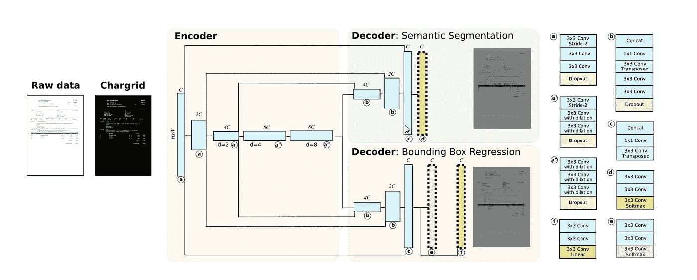
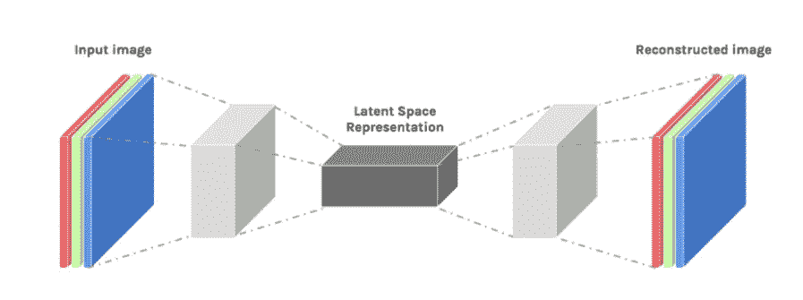

# 实现 Chargrid:网络架构

> 原文：<https://medium.com/analytics-vidhya/implementing-chargrid-network-architecture-cc21eb3d68f8?source=collection_archive---------12----------------------->

Chargrid — OCR(第二部分)

在上一篇文章中，我解释了理解 2d 结构文档的 chargrid 方法。为了更好地理解，请阅读我的上一篇文章 [chargrid — OCR(Part-1)](/analytics-vidhya/implementing-chargrid-towards-understanding-2d-documents-c7189d89a0) 。

在这一部分，我将解释 chargrid 论文中实现的网络架构。可以查看 [**githup 回购**](https://github.com/sciencefictionlab/chargrid-pytorch) 和[研究论文](https://arxiv.org/abs/1809.08799)。

## [**型号说明**](https://github.com/sciencefictionlab/chargrid-pytorch/blob/master/Model%20Architecture.MD) **见此。**

**我们开始吧—**

文件理解的网络结构；

模型架构——充电网。

这种模型架构有一个编码器和两个解码器。编码器使用卷积层对 chargrid 的图像进行编码，解码器用于图像的语义分割和预测边界框。

## 一点术语-

**输入 chargrid 图像的** —(通道数*高度*宽度)

*通道数=3 (rgb)*

**C** —输出基本通道数=64

**d** —扩张率。

## 编码器模块:

该编码器由 5 块 3*3 卷积层、泄漏 Relu 激活、批量归一化和丢弃层组成。

在编码器模块中，我们以因子 2 对图像进行下采样，如同在步长为-2 的第一 conv 模块中一样。每当对图像进行下采样时，我们将每个卷积的输出通道 C 的数量增加 2 倍。如图所示，第一个 conv 模块的输出为 2C。

在编码器的第三、第四和第五块中，我们分别使用了 d = 2、4、8 的扩展卷积层。

> D 膨胀卷积——简单来说，膨胀卷积就是一种应用于具有定义间隙的输入的卷积。利用该定义，假设我们的输入是 2D 图像，膨胀率 k=1 是正常卷积，k=2 意味着每个输入跳过一个像素，k=4 意味着跳过 3 个像素。

## 解码器模块:

这里，我们有两个解码器模块。语义分割解码器和包围盒回归解码器。

如果你仔细观察这个架构，你会发现这两个解码器网络是相同的，只是最后一层不同。

编码器的第三个块和编码器的最后一个块连接(横向连接)的输出首先进入解码器网络的第一个块。这里，我们通过使用 3*3 转置卷积层对图像进行上采样。

> 转置卷积层— **它们对图像进行上采样**意味着减少通道数量，增加图像的高度和宽度。

用两个 Conv2D 后跟两个 ConvTranspose2d 对 RGB 图像进行自动编码。

用于语义分割的**解码器**有一个额外的卷积层，没有批量标准化，有偏差，并且有 softmax 激活。
最后卷积的输出通道数对应于该解码器分支中的**类数=5** 。

**包围盒回归解码器**的最后一层是线性层。输出通道的数量是用于盒屏蔽的`**2 * number of anchors per pixel (Na**)`和用于 4 个盒坐标的`**4 * Na**`。

我们已经使用 **pytorch** 来训练充电网络。借助于 **nn.sequential** 层编写代码的有效方法，以便更容易理解。

我已经解释了网络架构的所有模块。在下一篇文章(第 3 部分)中，我将解释模型的数据处理和训练。

感谢您的阅读，注意安全！