# 实施 Chargrid:理解 2D 文件。

> 原文：<https://medium.com/analytics-vidhya/implementing-chargrid-towards-understanding-2d-documents-c7189d89a0?source=collection_archive---------6----------------------->

Chargrid — OCR(第一部分)

**理解 2D 文档** —即获取 2D 结构化文档的语义。文本信息通常通过具有 2D 布局文档来表示。它们的内容和布局(位置、大小等)决定了文档的语义。为了获得文档的语义，有一种叫做“Chargrid”的新方法。

## **查格里德:**

所提出的名为 chargrid 的方法没有在 1D 文本中使用序列化文档，而是通过将文档表示为稀疏的 2D 字符网格来保存文档的空间结构。

chargrid 可由字符框构成，即，每个包围给定文档页面上某处的单个字符的边界框。

为了实现 chargrid，我们需要从文档的图像中提取信息，如每个字符的坐标(位置信息)，文本信息等，这将在名为“[**pytesserac**](https://pypi.org/project/pytesseract/)的 OCR 工具的帮助下完成。 **Python-tesseract 是 Python 的光学字符识别(OCR)工具。也就是说，它将识别并“读取”嵌入图像中的文本。**

## 实施 Chargrid:

这里，文档的 chargrid 表示背后的思想是获取每个字符并用特定的整数索引替换它的边界框像素。例如，我们可以将字母表(或任何感兴趣的字符)映射到非零索引{a，b，c，…} → {1，2，3，…}。

换句话说，对于任何位置的每个字符，该字符所覆盖的区域将被某个常量值填充。

优势—

a)我们直接通过单个标量值对字符进行编码，而不是通过灰度像素的粒度集合

b)因为属于给定字符的像素组现在都被映射到相同的常数值，所以我们可以显著地对 chargrid 表示进行下采样，而不会丢失任何信息。

你可以看下面的截图了解更多—

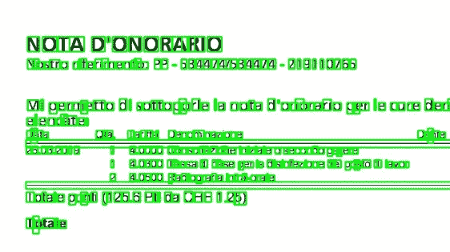

每个字符上的边界框—宇宙魔方。

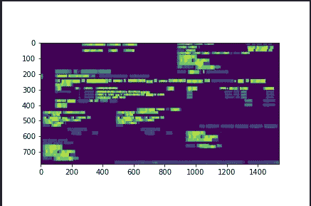

文档图像的 chargrid 表示。

**我们开始吧—**

首先你需要安装 **pytesseract、openCv 和 pdf2image** ，然后导入这些库

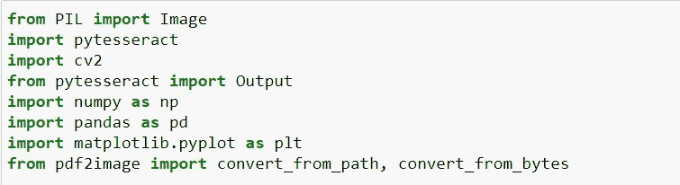

导入库。

**pdf2image** —一个将 pdf 转换为 PIL 图像的 python 模块。

使用 pdf2image 将您的 pdf 文档转换成如下图像—

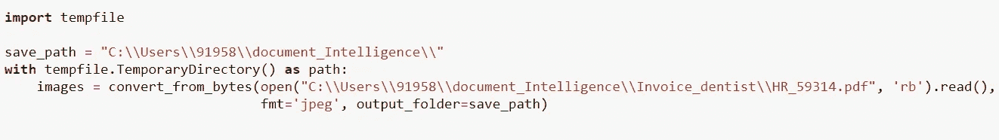

将图像保存在您想要的路径“保存路径”

为了避免你的立方体输出精度下降的所有方式，你需要确保图像被适当地[**预处理**](https://github.com/tesseract-ocr/tesseract/wiki/ImproveQuality#image-processing) **。**

**这包括重缩放、二值化、去噪、去歪斜等。**

要为 OCR 预处理图像，请使用以下任何 python 函数或遵循 [OpenCV 文档](https://opencv-python-tutroals.readthedocs.io/en/latest/py_tutorials/py_imgproc/py_table_of_contents_imgproc/py_table_of_contents_imgproc.html)。

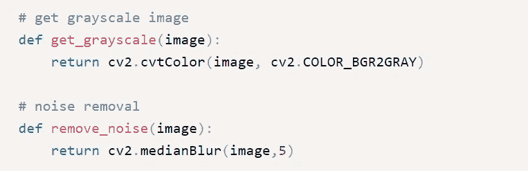

将图像转换为灰度并去除噪点。

预处理图像后，使用 pytesseract 从保存的图像中提取文本，如下所示

注意—输出是数据帧

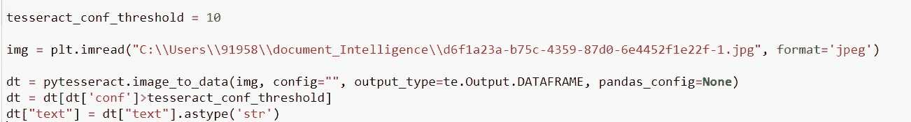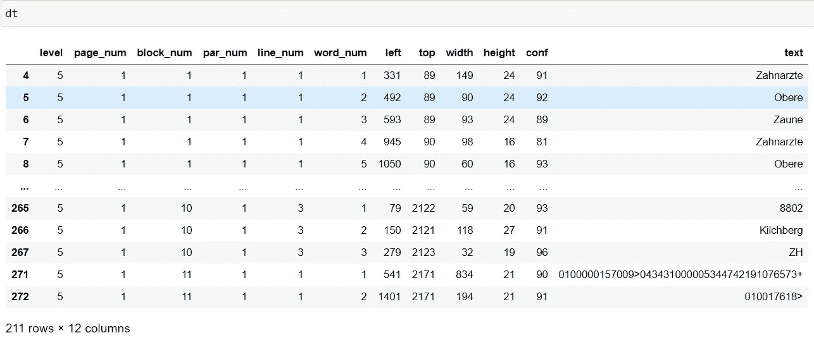

所以你有了 page_num，block_num，par_num，line_num，word_num 和每个单词的坐标以及它们的置信度得分。

图像的形状—

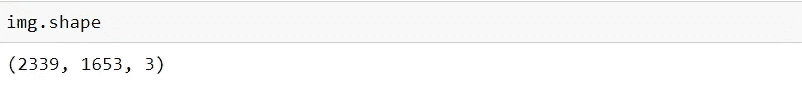

现在定义一个函数来构建这个图像的 chargrid 将 dataframe 作为参数传递，并逐个字符地分割以获得每个字符的坐标。并返回 chargrid 数据帧(chargrid_pd)。

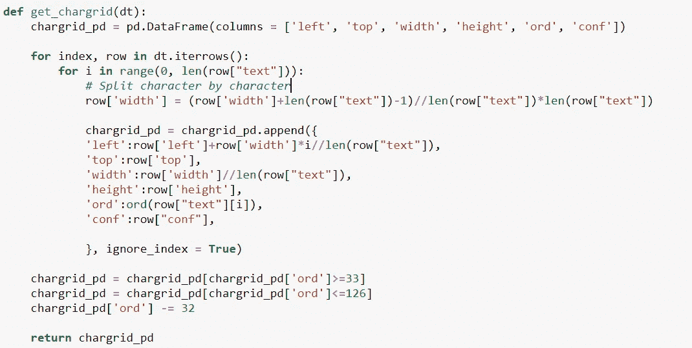

这个 chargrid_pd 包含列 are——它给出了每个字符的位置信息及其相应的置信度得分。

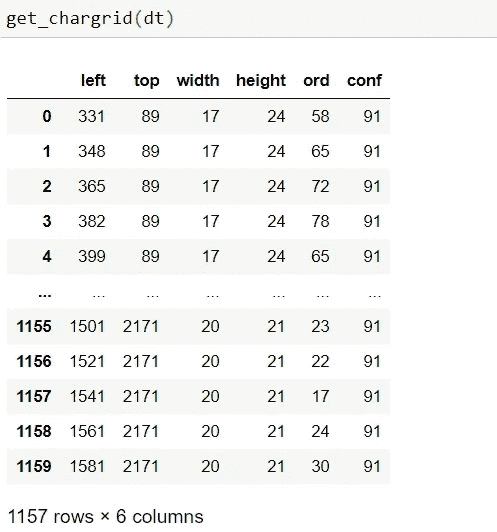

注意—为了在每个字符上有边界框的图像，您可以编写这样的代码—使用 imread()函数读取图像，然后调用 image _ to _ boxes()pytesserac 函数，这样您就有了框，然后绘制矩形。最后使用 cv2.imwrite()函数保存图像。

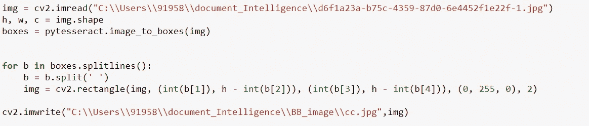

输出将会是—

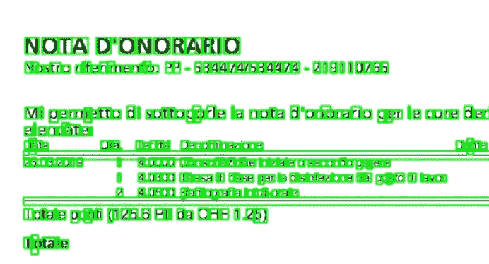

字符周围的边框。

这里我做了一个函数来获取 chargrid_pd 的 numpy 数组—

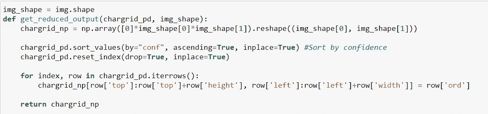

调用这些函数，并将 chargrid_np 文件以‘png’格式保存在所需的路径中。

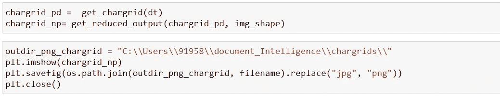

outdir_png_chargrid 应该是您想要的路径。

保存的文件将是—

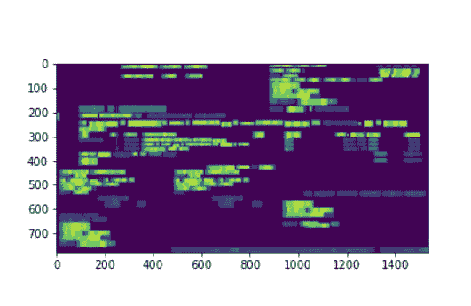

去掉图像。

这就是你如何制作文档图像的 chargrid。在第 2 部分中，我们将着眼于神经网络结构。

我在关注的研究论文，这里是[链接](https://arxiv.org/abs/1809.08799)。为了更好地理解，必须阅读它。

谢谢大家！