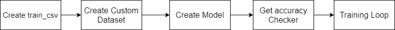

# 用定制数据集和迁移学习在 PyTorch 中实现 CNN

> 原文：<https://medium.com/analytics-vidhya/implementing-cnn-in-pytorch-with-custom-dataset-and-transfer-learning-1864daac14cc?source=collection_archive---------0----------------------->


本文旨在指导在 PyTorch 中实现 CNN 算法，并假设您对 CNN 及其各种模型/架构有所了解，本文的重点将放在 PyTorch 的最佳编码实践的实现部分。在这个特殊的用例中使用了 Inception，因为这些模块被设计来解决计算开销的问题，以及过度拟合等问题。

**关键要点:**

*   **用 python 处理文件目录**
*   **使用数据集和数据加载器在 PyTorch 中创建自定义数据集**
*   **利用迁移学习进行猫狗图像分类**
*   **如何将数据移动到 GPU 进行训练，创建高效的训练循环**

**数据集**—[https://www.kaggle.com/c/dogs-vs-cats/data](https://www.kaggle.com/c/dogs-vs-cats/data)

数据集由猫和狗的图像组成，我们的任务是将图像分类到它们各自的类别中。它由一个 train 和 test 文件夹以及一个示例提交文件组成(对于 kaggle 提交超出了本文的范围)。

# 创建 train_csv

```
import pandas as pd
import os
import torch

device = (**"cuda"** if torch.cuda.is_available() else **"cpu"**)

train_df = pd.DataFrame(columns=[**"img_name"**,**"label"**])
train_df[**"img_name"**] = os.listdir(**"train/"**)
for idx, i in enumerate(os.listdir(**"train/"**)):
    if **"cat"** in i:
        train_df[**"label"**][idx] = 0
    if **"dog"** in i:
        train_df[**"label"**][idx] = 1

train_df.to_csv (**r'train_csv.csv'**, index = False, header=True)
```

在导入必要的库之后，我们将 device 设置为 cuda，以便利用 GPU 资源进行训练。要检查是否正在使用 GPU，可以使用 print(device ),根据系统中 GPU 的可用性，输出将是“cuda”或“cpu”。对于那些试图利用 GPU 进行培训的人，必须安装 pytorch 和 cudatoolkit 版本—使用此[链接](https://pytorch.org/get-started/locally/)获取安装指南。

对于第一部分，我们需要创建一个 csv 文件，其中包含 train 文件夹中的图像文件名及其相应的图像标签。因此，我们创建了一个熊猫数据框架，标题为“img_name”和“label”。然后我们使用 os.listdir 获取“train/”目录中所有文件名的列表。所有文件名都有“cat”或“dog”作为文件名的一部分，因此我们将此作为条件语句来创建 0 或 1 标签，并将其添加到数据帧中的标签列。最后，我们保存文件，这样我们就不必每次都重新运行代码来获取数据帧。

# 创建自定义数据集

```
from torch.utils.data import Dataset
import pandas as pd
import os
from PIL import Image
import torch

class CatsAndDogsDataset(Dataset):
    def __init__(self, root_dir, annotation_file, transform=None):
        self.root_dir = root_dir
        self.annotations = pd.read_csv(annotation_file)
        self.transform = transform

    def __len__(self):
        return len(self.annotations)

    def __getitem__(self, index):
        img_id = self.annotations.iloc[index, 0]
        img = Image.open(os.path.join(self.root_dir, img_id)).convert(**"RGB"**)
        y_label = torch.tensor(float(self.annotations.iloc[index, 1]))

        if self.transform is not None:
            img = self.transform(img)

        return (img, y_label)
```

Dataset 是一个 pytorch 工具，允许我们创建自定义数据集。PIL 是一个流行的计算机视觉库，它允许我们加载 python 中的图像并将其转换为 RGB 格式。我们的目标是使用 train 文件夹中的图像以及 train_csv 文件中的图像文件名和标签来返回(img，label)元组，对于此任务，我们使用 CatsAndDogsDataset 类，它将 root_dir(这是存储训练图像的位置)和 annotation_file(train_csv)作为参数。Transform 已被设置为 None，稍后将被设置为对图像执行特定的一组转换，以匹配随后将用于 CNN 的 inception 模型的输入标准，因此如果您不理解这一点，请稍等！

__init__ 是一个初始化器，它设置定义类的参数。__len__ 函数返回数据集的长度，在本例中，我们返回 self.annoations 数据帧的长度，因为它保存所有训练文件名，即 train_csv 文件中的条目数。__getitem__ 函数定义了(x，y)或(img，label)对以及如何提取它。请注意，索引是在 pytorch 内部使用的，用于跟踪数据点、创建批处理等。跟踪已经加载和尚未加载的批处理—它负责数据集的所有簿记工作，是 pytorch 自定义数据集的新特性之一。img_id 设置为图像的文件名(来自 train_csv，因此是[index，0]，其中 0 是 img_name 列)。os.path.join 使用“/”符号将 csv 文件中的 root _ dir(“train/”)和 img_name(图像文件名)组合在一起，然后使用 PIL 加载图像并将其转换为 RGB 格式。最后，从 train_csv 文件中提取 y 标签([index，1]，其中 1 是标签列)。请注意，index 是用于访问 csv 文件行的指针，0 或 1 对应于 csv 文件的列。我们还将其包含在 float 和 tensor 中，以满足损失函数的要求，并且所有数据在馈送到 CNN 模型之前必须是张量形式。

# 创建模型

```
import torch.nn as nn
import torchvision.models as models

class CNN(nn.Module):
    def __init__(self, train_CNN=False, num_classes=1):
        super(CNN, self).__init__()
        self.train_CNN = train_CNN
        self.inception = models.inception_v3(pretrained=True, aux_logits=False)
        self.inception.fc = nn.Linear(self.inception.fc.in_features, num_classes)
        self.relu = nn.ReLU()
        self.dropout = nn.Dropout(0.5)
        self.sigmoid = nn.Sigmoid()

    def forward(self, images):
        features = self.inception(images)
        return self.sigmoid(self.dropout(self.relu(features))).squeeze(1)
```

火炬视觉模块有几个内置的 CNN 模型，如 VGG16，LeNet，ResNet 等。用于计算机视觉和其他任务。在我们的例子中，我们将使用 inception_v3 架构。对于那些不熟悉 inception 模型的人，我强烈建议在用代码实现它之前先阅读它。

迁移学习是一种强大的技术，其中我们使用预先训练的模型，其中权重已经在大型数据集(数百万张图像)上训练过，并且对所有开发人员开放源代码。这里唯一重要的是，最后几层必须根据开发者项目的需要进行修改(微调)。这里我们使用 train_CNN 变量，并将其设置为 false，这将用作一个标志，将初始模型的参数设置为可训练或不可训练。对于我们的二进制分类问题，将使用 CNN 权重，并且完全连接的层将从最初的 1000 个类修改为 2 个类。

如上面的代码所示，self.inception.fc 已被修改为线性层，它接受初始模型的原始 fc 层的数字输入特征，并将其映射到 num_classes(二进制分类)。对于所有参数，pretrained 设置为 True，但是对于使用 train_CNN 的最后一个 fc 层，它将设置为 False。aux_logits 是 inception 模型的一个特性，通过在除最后一层之外的几个地方附加 fc、softmax/sigmoid，从中间隐藏层返回 rin 输出(在线阅读更多信息)。在我们的例子中，它被设置为 false。丢弃用于正则化，在 fc 层中丢弃权重的概率为 0.5。

例如，如果我们有一批 32 个图像，那么在分别应用 inception、relu、dropout 和 sigmoid 层后，我们将得到形状为[32，[1]]的输出。然而，为了在输出上应用二进制交叉熵损失函数，我们要求张量的大小为[N，*],这意味着我们必须得到[32，]作为输出大小。因此，对于这个任务，我们使用 squeeze(1)来移除张量大小中位置 1 处的 1 维。

# 为训练循环导入库

```
import torch
import torch.nn as nn
from torch.utils.data import DataLoader
import torchvision.transforms as transforms
from Model import CNN
from Dataset import CatsAndDogsDataset
from tqdm import tqdmdevice = (**"cuda"** if torch.cuda.is_available() else **"cpu"**)
```

# 转换

```
transform = transforms.Compose(
        [
            transforms.Resize((356, 356)),
            transforms.RandomCrop((299, 299)),
            transforms.ToTensor(),
            transforms.Normalize((0.5, 0.5, 0.5), (0.5, 0.5, 0.5)),
        ]
    )
```

torcvhvision.transforms 库允许我们在训练期间对图像进行处理和数据扩充。然后，我们将从自定义数据集中加载的图像将按照上面定义的顺序进行这些转换。Resize 确保所有批处理具有相同的图像尺寸，以便可以成批进行训练，并且还可以将图像调整到标准 CNN 模型的推荐输入。随机裁剪在随机位置裁剪图像。最后，我们将其转换为张量，并归一化图像。为了火炬。归一化第一个元组是每个通道所有批次的三个通道的平均值(RGB ),下一个元组是每个通道所有批次的三个通道的标准差(RGB)。然后，它使用以下公式来归一化图像，其中 **μ** 是平均值， **σ** 是标准偏差。正常化对于加速训练是必不可少的。注意，inception 对所有通道**的 **μ** 和 **σ** 使用值 0.5。**


**归一化公式**

# 超参数

```
num_epochs = 10
learning_rate = 0.00001
train_CNN = False
batch_size = 32
shuffle = True
pin_memory = True
num_workers = 1
```

Pin_memory 是一个非常重要的功能。由于我们创建的自定义数据集的所有操作都在 CPU 中运行，因此数据也被加载到 CPU 中。只有在训练期间，批量图像才会被移动到 GPU。pin_memory 确保数据的这种移动是高效和快速的。如果使用 MNIST 或 CIFAR10 等内置数据集，则不需要此参数，因为在这种情况下，数据会直接加载到 GPU 中。 **num_workers** 属性告诉数据加载器实例有多少子进程用于数据加载(主要是关于矢量化)。默认情况下，**的 num_workers** 值被设置为零。

# 设置数据集和数据加载器

```
dataset = CatsAndDogsDataset(**"train"**,**"train_csv.csv"**,transform=transform)
train_set, validation_set = torch.utils.data.random_split(dataset,[20000,5000])
train_loader = DataLoader(dataset=train_set, shuffle=shuffle, batch_size=batch_size,num_workers=num_workers,pin_memory=pin_memory)
validation_loader = DataLoader(dataset=validation_set, shuffle=shuffle, batch_size=batch_size,num_workers=num_workers, pin_memory=pin_memory)
```

训练数据被分为训练和验证两部分，以便我们能够在稍后使用早期停止来获取提供最佳验证准确性的模型。

```
model = CNN().to(device)

criterion = nn.BCELoss()
optimizer = torch.optim.Adam(model.parameters(), lr=learning_rate)

for name, param in model.inception.named_parameters():
    if **"fc.weight"** in name or **"fc.bias"** in name:
        param.requires_grad = True
    else:
        param.requires_grad = train_CNN
```

我们之前设置的标志现在用于将 fc 层设置为可训练的，而将所有其他层设置为不可训练的，以避免通过这些层的反向传播。美国有线电视新闻网()。to(设备)将模型移动到 GPU。注意:对于 GPU 培训，模型和数据都必须加载到 GPU。有关 BCELoss 和 Adam optimizer 的输入格式，请参考 torch 文档。

# 准确性检查

```
def check_accuracy(loader, model):
    if loader == train_loader:
        print(**"Checking accuracy on training data"**)
    else:
        print(**"Checking accuracy on validation data"**)

    num_correct = 0
    num_samples = 0
    model.eval()

    with torch.no_grad():
        for x, y in loader:
            x = x.to(device=device)
            y = y.to(device=device)

            scores = model(x)
            predictions = torch.tensor([1.0 if i >= 0.5 else 0.0 for i in scores]).to(device)
            num_correct += (predictions == y).sum()
            num_samples += predictions.size(0)
    return **f"**{float(num_correct)/float(num_samples)*100:**.2f**}**"** print(
            **f"Got** {num_correct} **/** {num_samples} **with accuracy** {float(num_correct)/float(num_samples)*100:**.2f**}**"** )
    model.train()
```

我们检查训练或验证加载程序，并相应地设置输出。torch.no_grad()确保模型不处于训练模式，而只是应用模型权重来获得预测，以计算训练/验证准确性。如上所示，图像和标签在从加载器加载后被移动到设备，然后通过将 sigmoid 层返回的最终值舍入为 0 或 1(0 —猫，1 —狗)来设置预测张量，并移动到 GPU。我们还跟踪样本的数量，方法是随着批次的加载，将 num_samples 递增 batch_size。num_correct 将预测与真实标签进行比较，并返回正确预测的总数。最后，该函数返回整个数据集的精度(训练/验证取决于我们输入到该函数的内容)。请注意，将模型置于评估模式(model.eval())非常重要，这样可以避免在精度计算过程中出现回推。还需要注意的是，在准确性检查之后，我们将继续训练以寻找更好的准确性，因此在最后，模型将再次设置为训练模式(model.train())。

# 训练循环

```
def train():
    model.train()
    for epoch in range(num_epochs):
        loop = tqdm(train_loader, total = len(train_loader), leave = True)
        if epoch % 2 == 0:
            loop.set_postfix(val_acc = check_accuracy(validation_loader, model))
        for imgs, labels in loop:
            imgs = imgs.to(device)
            labels = labels.to(device)
            outputs = model(imgs)
            loss = criterion(outputs, labels)
            optimizer.zero_grad()
            loss.backward()
            optimizer.step()
            loop.set_description(**f"Epoch [**{epoch}**/**{num_epochs}**]"**)
            loop.set_postfix(loss = loss.item())

if __name__ == **"__main__"**:
    train()
```

对于每个时期，我们遍历训练加载器中所有批次的图像和标签，并将它们移动到 GPU(分批)。然后，我们使用模型的输出，并使用 BCELoss 函数计算损失。在我们进行反向传播以计算梯度之前，我们必须执行 optimizer.zero_grad()操作——这将清空前一批的梯度张量，以便重新计算新一批的梯度。现在，为了执行反向传播，我们使用 loss.backward()，最后使用 optimizer.step()用新计算的梯度更新权重参数。从上面的代码中可以看出，这里定义了一个循环变量——它使用 tqdm 库，在终端/控制台的训练过程中可以方便地创建一个进度条。leave = True 确保较旧的进度条随着时期的进展而保持不变，或者将其设置为 False 将使先前时期的较旧进度条离开，并且仅显示当前时期的进度条。tqdm 还增加了损失和准确性(每两个时期打印一次，以查看它在验证集上的表现)。最后一部分是必不可少的运行在笔记本的脚本代码，它不是必要的。

# 结论



链接到代码:[https://github.com/ajinkya98/PyTorchCNN](https://github.com/ajinkya98/PyTorchCNN)