# 在 Numpy 中实现没有 for 循环的卷积！！！

> 原文：<https://medium.com/analytics-vidhya/implementing-convolution-without-for-loops-in-numpy-ce111322a7cd?source=collection_archive---------0----------------------->


# 介绍

使用不同核(3×3，5×5)的卷积来对图像施加效果，即锐化、模糊、轮廓化或浮雕。

图像是一串数字，表示为一些宽乘高像素的数组，每个像素与三个范围从 0 到 255 的浮点值相关联。这三个数字代表给定像素的红色、绿色和蓝色，这三个数字的组合捕捉到了它的颜色。

如果图像是灰度的，每个像素可以使用一个值，0 表示黑色，255 表示白色。卷积是通过将核放在图片的每个区域前面来获得的，就像滑动窗口一样，然后将我们的核中的值与图片中它重叠的值进行元素乘积，并将其求和，如下所示:

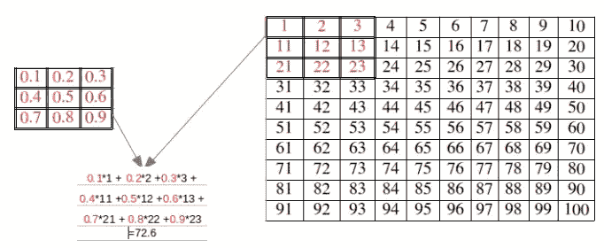

如果我们有一个 3 通道的常规彩色图像，那么我们的内核也应该有 3 个通道，如下所示。

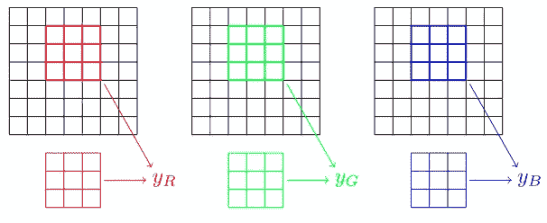

对于这篇博客，我将主要使用灰度图像，尺寸为[1，1，10，10]，内核尺寸为[1，1，3，3]。

# 方法

我们不会把卷积编码成一个循环，因为这样效率很低。取而代之的是，我们将对图像进行矢量化处理，这样卷积运算就变成了矩阵乘积。**这意味着取每个感受野窗口，并将数字写在如下所示的**栏中。

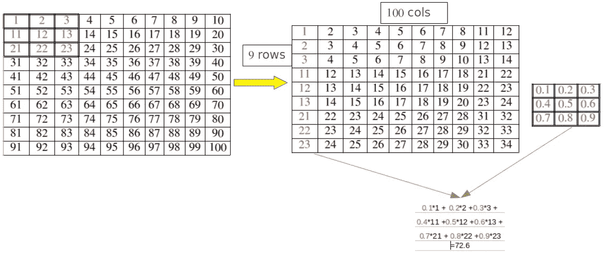

*注意上图只显示了 10 个感受野列。

类似的矢量化也可用于具有 3 个通道的彩色图像，如下所示。

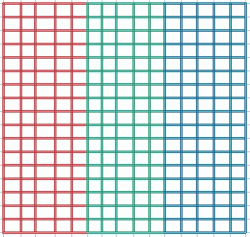

彩色图像的矢量化。

# 让我们对此进行编码！

因此，让我们尝试使用 Numpy 从头实现卷积层！

首先，我们将编写一个类**conv _ 模块**，它将有基本的代码流，这里正向传递没有实现，反向传递需要定义 **bwd 方法**。
其次，我们将使用一个类**卷积**，它继承自 Conv 模块，然后覆盖正向类，它还包含反向传递所需的 **bwd 方法**。

```
import numpy as np
import matplotlib.pyplot as pltimg=np.random.rand(1,1,10,10)
ker=np.random.rand(1,1,3,3)
```

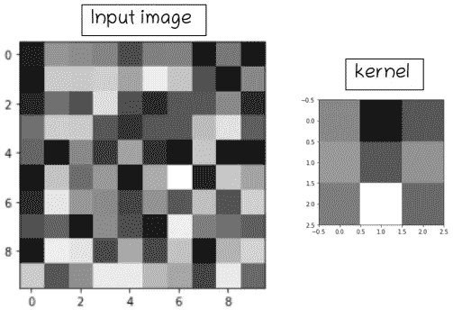

输入图像和内核可视化

在 **img 上面，ker** 表示我们将在实现中使用的映像/内核。命名约定类似于[B，D，H，W],其中 B 是批量大小，D 是通道数或深度，H 是高度&, W 是宽度。
默认填充和步幅为 1，b 是偏差，我们将其初始化为 0。

**conv _ 模块**

我们将使用的 numpy 的主要功能是
1)NP . repeat()
2)NP . tile()
3)NP . add . at()

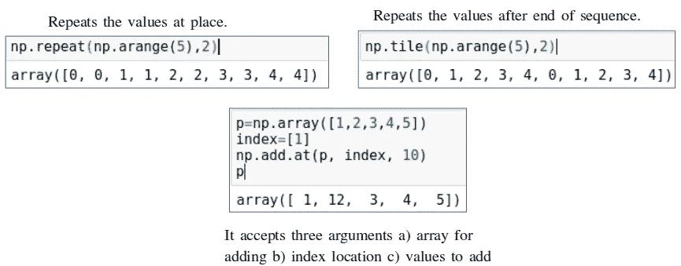

# 前进传球

为了更好的理解，大部分地方都在代码中做了注释。在这篇博客的最后附上代码片段，我会通过代码，但主要是指数计算和向后传递，我觉得这是关键方面。

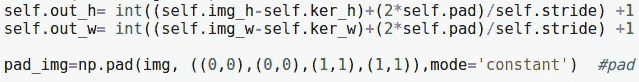

输出高度(self.out_h)和宽度(self.out_w)将类似于输入高度和宽度，即 10，10，因为我们使用相同的填充。使用 pad_img 在原始图像周围创建填充。

**指标计算**

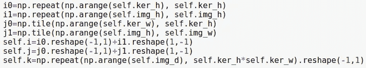

为了将感受野储存为载体，需要索引。这里 **i 与感受野的第一指标**相关， **j 与感受野的第二指标**相关， **k 为通道尺寸**。self.i 计算为 i0 和 i1 之和，类似地，self.j 计算为 j0 和 j1 之和。

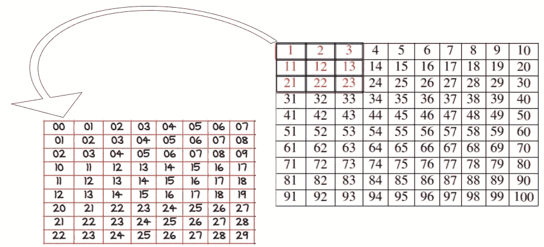

对应于每个感受野的指数。

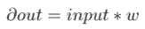

向前传球公式

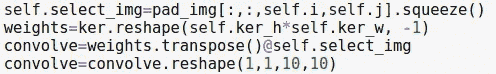

使用 I、j、k 索引，图像以矢量化形式存储，然后乘以权重以获得前向传递(卷积)的输出。下面是正向传递输出的可视化。

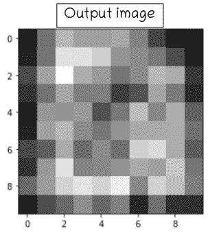

# 偶数道次

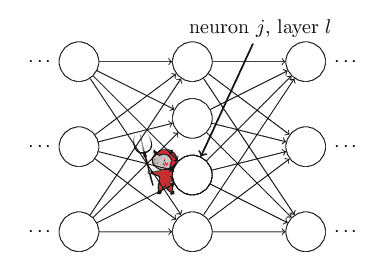

在反向传递期间，需要计算三个梯度:-
a)相对于偏差的梯度。
b)相对于重量的梯度。
c)相对于输入图像的梯度。

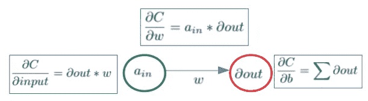

计算不同参数梯度的公式。

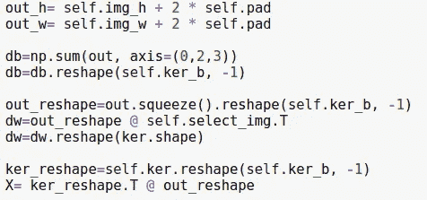

db 是相对于偏差的梯度计算值，dw 是相对于权重的梯度计算值，X 是相对于输入的梯度计算值。

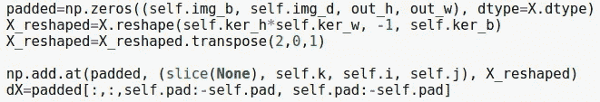

创建维度为[1，1，12，12]的空白零填充，并使用填充有梯度值的索引值。

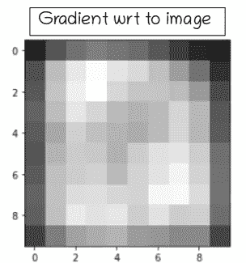

输入图像的梯度 wrt 的可视化。

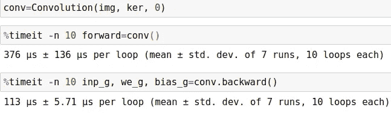

向前和向后计算花费的时间。

正如我们所看到的，向前传递平均需要 376 s，向后传递平均需要 113 s。整个卷积代码片段如下…

**卷积类**

# 结论

因为卷积是任何体系结构的基本块，所以在没有任何 for 循环的情况下实现它节省了大量计算时间。请**分享，如果你喜欢就留下你的评论**。