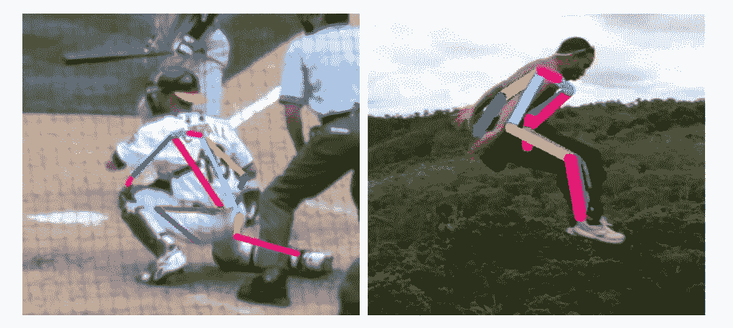
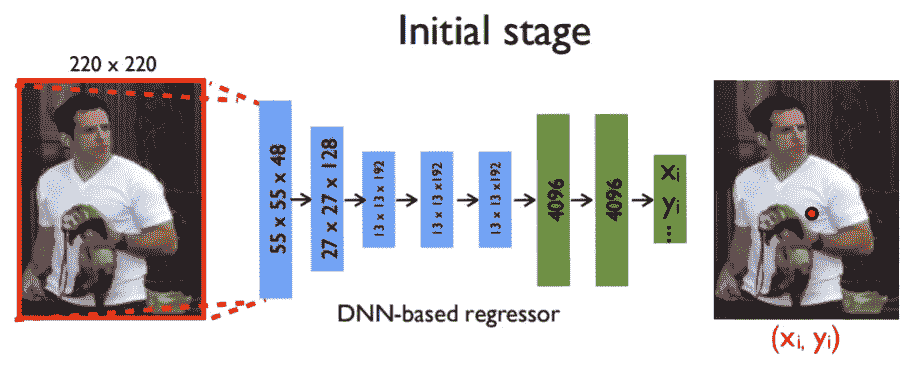
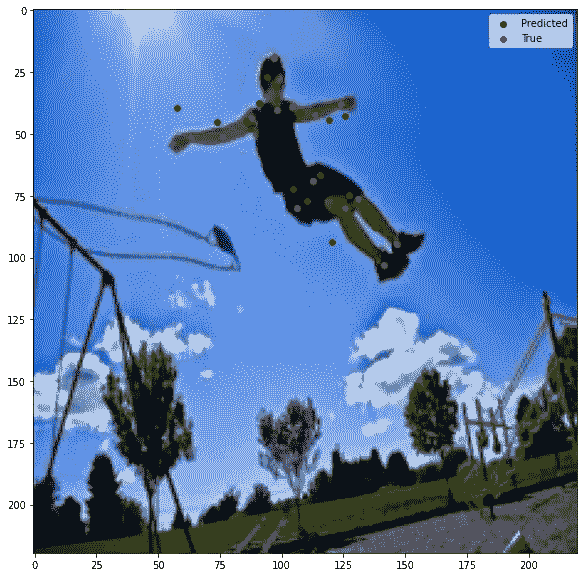
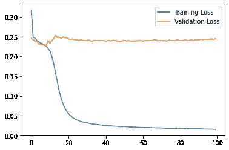

# 用 Keras 实现深度基线 HPE 模型

> 原文：<https://medium.com/analytics-vidhya/implementing-deeppose-baseline-model-with-keras-67f8c8ab63c1?source=collection_archive---------9----------------------->


威尔逊·蒙托亚在[的照片](https://unsplash.com/photos/XqQwigfqje4)

# 动机

DeepPose 论文是基于深度学习的 HPE(人体姿态估计)的基础论文之一。我，作为一个在 HPE 复习以前关于 HPE 的论文的学生，不得不阅读这篇论文。

# 什么是 HPE



2D 人体姿态估计的例子

姿态估计是通过基于 2D/3D 镜头定位关节来预测人体姿态的任务。我们可以用不同的方法来解决这个问题，比如回归与检测，自顶向下与自底向上，以及生成与鉴别。HPE 的各种变体和方法将在本系列关于姿态估计的后续故事中描述。

# 准备数据(LSP 扩展)

[LSP 数据集](https://sam.johnson.io/research/lspet.html)将用于训练我们的模型。在 url 中下载 zip 存档文件并解压缩文件。该数据集包含一个图像文件夹，其中有 10，000 张不同尺寸的运动员图像。图像的关节在 joints.mat 文件中被标记为每个像素的像素坐标。我们将所有的图片重新整形为统一的大小(220，220)，并将所有的图片合并成一个 numpy 文件。

```
import cv2
import os
import matplotlib.pyplot as plt
import numpy as np
import scipy.io
import progressbarbase_directory='YOUR DIRECTORY TO DATA\\lspet_dataset\\images'
images_directory=os.listdir(base_directory)
target_size=(220,220)
resized_images=[]
resized_poses=[]
original_scale=[]
poses=scipy.io.loadmat('YOUR DIRECTORY TO DATA \\lspet_dataset\\joints.mat')['joints']for idx,x in progressbar.progressbar(enumerate(images_directory)):
    path=os.path.join(base_directory,x)

    image = plt.imread(path)
    height,width=image.shape[0],image.shape[1]
    scale_w,scale_h=220/width,220/height
    original_scale.append([width,height])

    resized_poses.append([poses[:,0,idx]*scale_w*2-1,poses[:,1,idx]*scale_h*2-1])

    image=cv2.resize(image,target_size,interpolation=cv2.INTER_AREA)
    resized_images.append(image)resized_images=np.array(resized_images)
resized_poses=np.array(resized_poses)
original_scale=np.array(original_scale)np.save('Leeds Sports Dataset NPY.npy',resized_images[:9000])
np.save('Resized Poses.npy',resized_poses[:9000])
np.save('Image scale.npy',original_scale[:9000])np.save('Leeds Sports Dataset NPY Test.npy',resized_images[9000:])
np.save('Resized Poses Test.npy',resized_poses[9000:])
np.save('Image scale Test.npy',original_scale[9000:])
```

姿势像素坐标按照图像大小缩放成[-1，1]。在所有预处理阶段之后，数据被保存到单个。npy 文件。我必须将数据转换成合并文件，因为对于大量的文件来说，上传到 google drive(供 colab 使用)需要不确定的时间。

# 定义模型



DeepPose 的模型架构

我们将使用 Tensorflow Keras 定义 DeepPose 论文中提出的基线模型架构。该模型基本上是具有 28 个输出的 AlexNet 模型，每个输出回归图像中关节的坐标。文中定义了具体的模型超参数(如滤波器尺寸)。为了方便起见，本地响应规范化层被批量规范化所取代。

```
def define_model(self):
  #Changes made on model architecture
  #LRN->BN, Pooling->Strided Convolution model=tf.keras.models.Sequential()
  model.add(tf.keras.layers.Conv2D(48,11,(4,4),padding='same',input_shape=(220,220,3)))
  model.add(tf.keras.layers.BatchNormalization()) model.add(tf.keras.layers.ReLU())
  model.add(tf.keras.layers.Conv2D(128,5,(2,2),padding='same')) model.add(tf.keras.layers.BatchNormalization())
  model.add(tf.keras.layers.ReLU()) model.add(tf.keras.layers.Conv2D(192,3,(2,2),padding='same',activation='relu')) model.add(tf.keras.layers.Conv2D(192,3,(1,1),padding='same',activation='relu'))
  model.add(tf.keras.layers.Conv2D(192,3,(1,1),padding='same',activation='relu'))
  model.add(tf.keras.layers.MaxPooling2D())
  model.add(tf.keras.layers.Flatten()) model.add(tf.keras.layers.Dense(4096,activation='relu'))
  model.add(tf.keras.layers.Dropout(0.4))
  model.add(tf.keras.layers.Dense(4096,activation='relu'))
  model.add(tf.keras.layers.Dropout(0.4))
  model.add(tf.keras.layers.Dense(28,activation='linear'))
  return model
```

因为 DeepPose 论文中的姿态估计问题是作为回归问题来处理的，所以我们应用原始的 MSE 误差来进行训练。更多细节和完整代码在 [colab 链接](https://colab.research.google.com/drive/1J2oHgwX5RtsCI7DU3ToNgz00rb_p9S2T?usp=sharing)中提供。



训练模型的结果

# 模型评估



损失图

基线模型未能对数据进行正则化，导致过度拟合。丢弃参数已经设置得很高，但是似乎需要更高的正则化惩罚。论文中提出的姿态回归器级联没有成功实现，这也可能是一个原因。验证损失的图表非常怪异，需要更多的分析。