# 在植物幼苗分类数据集上实现不同的 CNN 架构—第 2 部分(AlexNet)

> 原文：<https://medium.com/analytics-vidhya/implementing-different-cnn-architectures-on-plant-seedlings-classification-dataset-part-2-8db1c3ad4865?source=collection_archive---------18----------------------->

在我之前的[文章](/analytics-vidhya/implementing-different-cnn-architectures-on-plant-seedlings-dataset-to-get-a-good-score-part-1-a90c2d3f306f)中，我研究过植物幼苗数据集，因为它是一个竞赛数据集，我们可以在那里提交我们的预测并检查我们的分数。这是测试我们模型的好方法。我们实现了 **LeNet** 架构，但只能得到 29.77%的分数。首先，这很好，但我们确实需要提高我们的模型性能。为了实现这一点，我想实现一些 CNN 架构，比如 **Alexnet** 、 **VGG** 、 **Inceptionv3** 和 **Xception** 。因为，我们理解理论和实际实现是非常重要的。作为计算机视觉的初学者，这一系列文章的目的是让我们想出处理图像分类问题的最佳策略，这样随着我们的进步，我们将逐渐看到代码变得更加复杂。

我几乎无法从头开始训练 **AlexNet** ，但是对于其余的架构( **VGG** 、**盗梦空间**、**除了**)，我不得不使用预先训练好的模型。我们将详细介绍预训练模型的含义以及它对我们的益处。

我不会对这些架构进行深入的解释，而是简单的介绍，然后是实际的代码。

所以，让我们从 AlexNet 开始:

1.  AlexNet :它最初是由 Alex Krizhevsky 设计的。它是与**伊利亚·苏茨基弗**和克里热夫斯基的博士导师**杰弗里·辛顿**一起发表的，是一个卷积神经网络或 CNN。

*   在参加 ImageNet 大规模视觉识别挑战赛后，AlexNet 一举成名。它实现了 15.3%的前 5 名误差。这比亚军低了 10.8%。
*   原始论文的主要结果是，模型的深度对于其高性能是绝对必要的。这在计算上非常昂贵，但在训练期间，由于 GPU 或图形处理单元，这是可行的。
*   我们现在将尝试从头开始实现该架构。我将遵循我上次遵循的相同步骤。
*   我首先下载数据，这是一个 zip 文件，然后提取内容。我看到有三个文件夹:' ***训练*** '，' ***测试*** '和' ***样本提交. csv*** '。

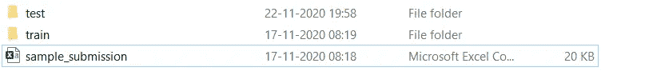

植物幼苗数据

*   然后我检查了'**列车**'数据文件夹，看到有 12 个不同的类别。

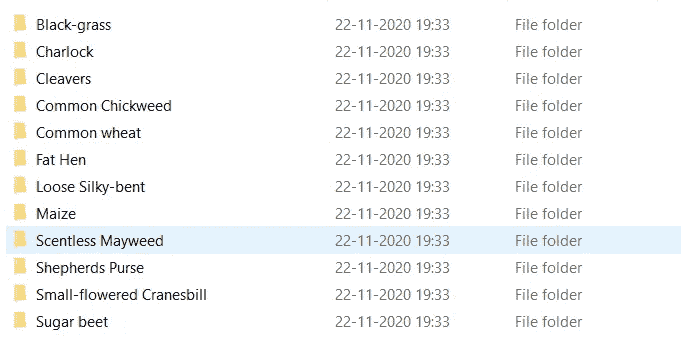

植物幼苗数据内的不同类别

*   我手动检查了每个文件夹中的不同项目，发现一些类与其他类相比有更多的图像。
*   这是令人担忧的，因为我知道模型会偏向数量更多的图像。
*   为了解决这个问题，我创建了一个新的 train 文件夹，从每个类中复制了 200 张图片。
*   然后我创建了一个验证集，里面有来自每个类的 20 张图片。这样，我就防止了不必要的偏见在模型中蔓延。
*   我首先导入所有的包。我用的是 Tensorflow-gpu 1.15 和 Keras 2.3.1

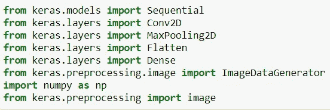

导入所有包

*   然后，我使用图像数据生成器来创建我的训练和验证集。这将处理所有需要训练数据和标签的预处理步骤。这包括标准化，增加一些剪切和缩放范围，以创建一定程度的数据扩充。

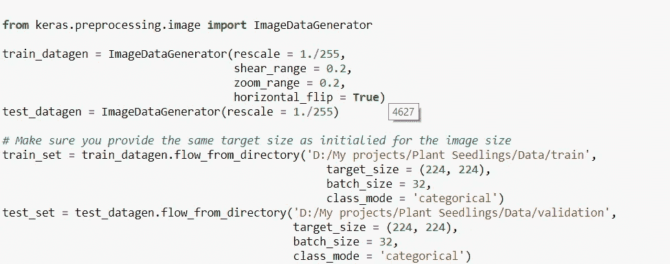

使用图像数据生成器创建训练和验证集。

*   数据设置好后，我创建了 AlexNet 模型:
*   它由五个卷积层组成，中间是最大池化和批标准化层，后面是三个完全连接的层。

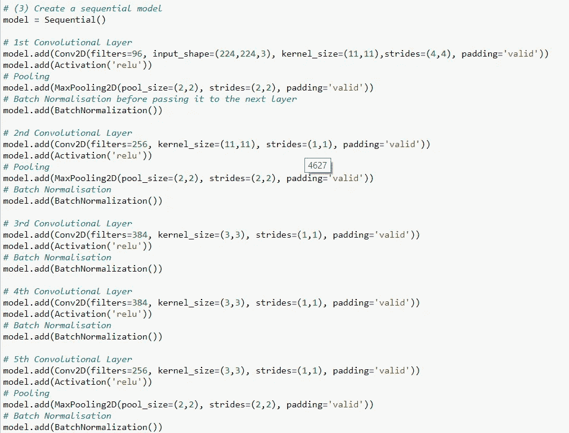

AlexNet 的卷积层

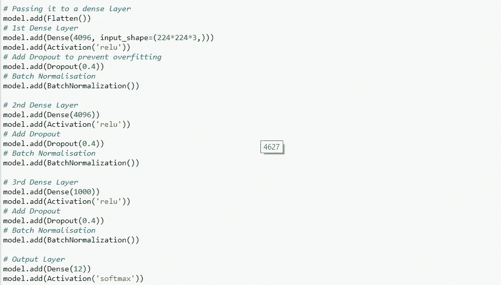

AlexNet 的全连接层

*   然后，我使用' **SGD** '作为我的优化器，具有学习率和衰减。
*   因为，有 12 个类，我用，'**分类 _ 交叉熵【T5 ' '，作为我的损失。**

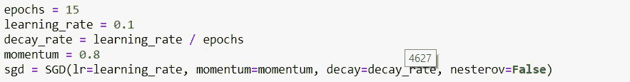

初始化学习率，设置衰减和优化器

*   然后，我对' **15** 时期的模型进行训练，训练步骤为' **500** '，验证步骤为' **300** '。

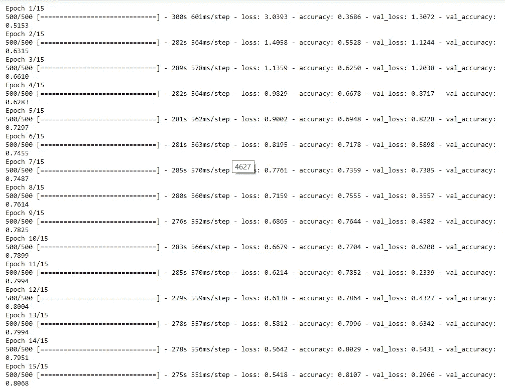

损失和准确性的模型训练

*   根据上面的图像，我们可以确认我们的训练准确率稳步上升到 81%,我们的验证准确率也达到 80%
*   这很好，这意味着我们的模型没有过度拟合。
*   保存模型后，我在测试集上使用它，并生成一个 sample_submission.csv 文件，其中包含 ID 和适当的类。

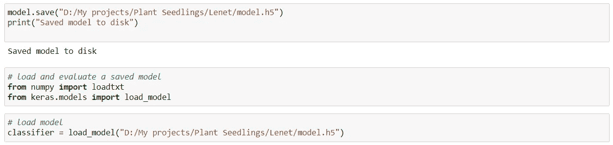

将模型保存到磁盘并加载模型进行预测

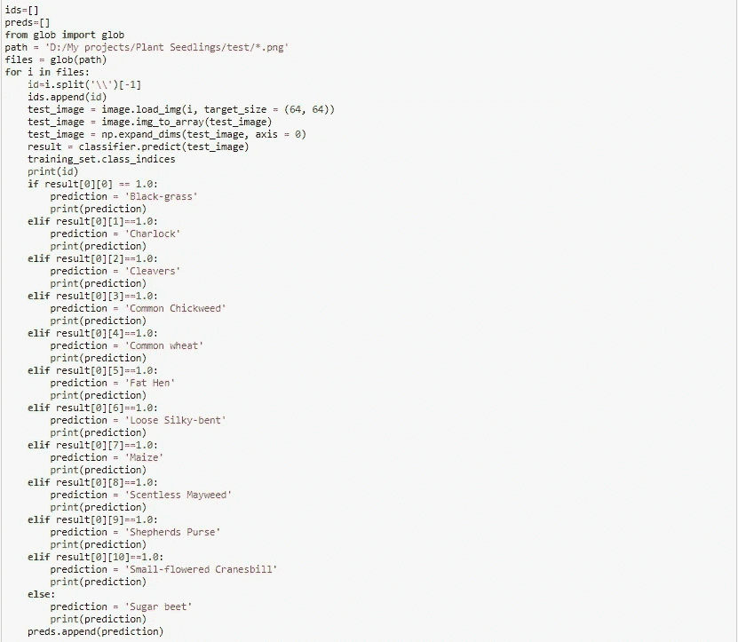

加载模型并将其用于预测

*   基于上面的图像，我使用模型开始对测试集进行预测。
*   我使用 glob 库获得所有文件的列表，然后遍历它们，将图像的名称附加到一个名为“IDs”的空列表中。
*   然后我加载图像，将其转换为数组，然后使用' expand_dims '来展平数组。
*   然后我用我的模型做预测，它以数组的形式出现。对于 ex: [[0，0，0，1，0，0，0，0，0，0，0，0]]
*   我使用“If-Else”条件来获取各种类，并将它们附加到一个名为“Preds”的空列表中。
*   我现在使用“Ids”和“Preds”来创建我的“sample_submission.csv”文件。
*   我们现在需要将此文件上传到“[植物幼苗分类](https://www.kaggle.com/c/plant-seedlings-classification/submit)网站，以进行预测。
*   为此，请转到[植物幼苗分类](https://www.kaggle.com/c/plant-seedlings-classification/overview)，点击**迟交**。

延迟提交选项卡

*   当你点击**延迟提交**时，你会看到一个上传文件的选项。

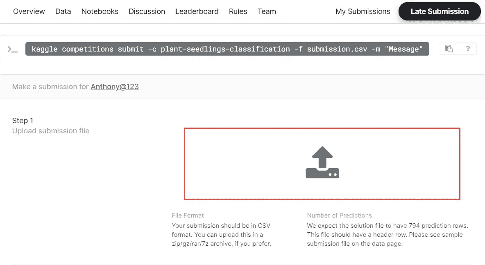

上传文件以获得分数

*   文件上传后，点击**提交**，即可获得分数。

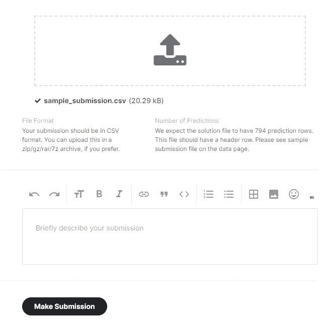

上传文件并提交

*   因此，我得到了大约 12.8%的分数，这意味着，我只能正确预测 100 分中的 12 张图像。

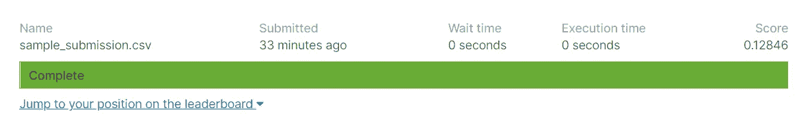

预测的分类分数

*   因此，我们看到 AlexNet 与 LeNet 相比表现不佳，
*   即使 AlexNet 运行了更多的纪元，它仍然没有提供与 LeNet 相同的准确性。
*   我们可以进行一些超参数调整，例如，增加时期、更改图像的输入大小、更改优化器、更改批处理大小，以检查其对预测的影响。
*   我把这个选项留给读者。请让我知道你是否能通过改变一些超参数来改变分数。
*   在下一个系列中，我们将使用一些预先训练好的模型，如“VGG”、“概念网”和“例外网”来检查我们的预测分数。
*   我还将经历一些“超参数”调整代码，这样一旦我们有了一个给我们带来良好准确性的模型，我们就可以调整它以获得最佳结果。