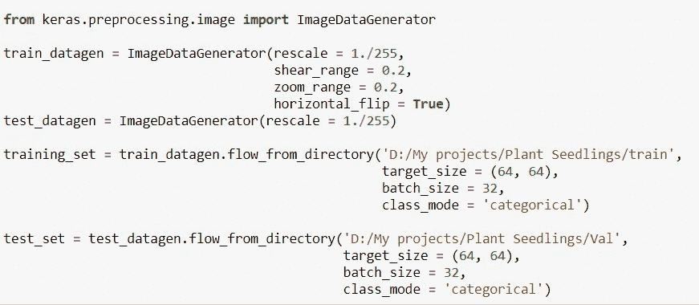

# 在植物幼苗分类数据集上实现不同的 CNN 架构—第 1 部分(LeNet)

> 原文：<https://medium.com/analytics-vidhya/implementing-different-cnn-architectures-on-plant-seedlings-dataset-to-get-a-good-score-part-1-a90c2d3f306f?source=collection_archive---------13----------------------->

本文将是一个系列，其中我在植物幼苗数据集上实现了不同的 CNN 架构，包括我自己的定制模型，并检查了分数，以更好地理解不同的卷积神经网络。

这篇文章将有“LeNet”实现，下一组文章将有其他 CNN 架构，最后一组文章将有我们自己的定制模型，这将为我们提供一个好的分数，并且可以在任何 Kaggle 数据集上遵循通用方法。

作为一名数据科学的初学者，我对计算机视觉非常感兴趣，这是因为，在计算机视觉中完成的工作很容易看到(通过脸书和谷歌的应用程序，例如。而我们，作为人类，总是倾向于追求闪光的东西。即使在传统的机器学习甚至 NLP 领域已经做了很多工作，我们还是觉得计算机视觉，更有意思。在经历了神经网络的最初概念后，我开始探索 CNN，我立即知道，从理论上理解所有这些非常重要，但实际实施也同样重要。我们做过的一些最常见的数据集有， **MNIST，CIFAR-10，猫狗品种分类等。**

但是这些数据集是为了理论目的而精心策划的。我知道我必须拿出一个数据集，利用它，我可以从头开始做任何事情，这意味着，获取数据，重塑数据，拆分数据，从头开始实施不同的 CNN 架构，然后最终构建我自己的定制模型并测试其效率。现在，为了得到一个多类图像数据集，我去了 Kaggle，在那里，我得到了[植物幼苗](https://www.kaggle.com/c/plant-seedlings-classification/overview)数据集。

这个数据集是一个操场预测比赛，我可以创建一个模型，用它来获得一些预测，然后通过将结果上传到 Kaggle 平台来测试它们。我认为这是测试所有不同 CNN 架构的好方法，包括我自己的定制模型。

这是从头开始研究架构和实现它的一种很好的迭代方式。

我曾经遵循的练习是阅读 CNN 架构研究论文，然后在植物幼苗数据集上从头开始实现它们。我有一台 16 GB 内存的 MSI GF-65 笔记本电脑，我的 GPU 是 6 GB Nvidia 1660ti(还是不够…:-)。

我实现的各种架构如下:

1.  LeNet
2.  Alexnet
3.  VGG
4.  开始
5.  定制模型

让我们从实现不同的架构开始:

*   我首先下载数据，这是一个 zip 文件，然后提取内容。我看到有三个文件夹:'*培训*'、*测试*、*样本提交. csv* '。

植物幼苗数据

*   然后，我检查了“火车”数据文件夹，看到有 12 个不同的类。

植物幼苗数据内的不同类别

*   我手动检查了每个文件夹中的不同项目，发现一些类与其他类相比有更多的图像。
*   这是令人担忧的，因为我知道模型会偏向数量更多的图像。
*   为了解决这个问题，我创建了一个新的 train 文件夹，从每个类中复制了 200 张图片。
*   然后我创建了一个验证集，里面有来自每个类的 20 张图片。这样，我就防止了不必要的偏见在模型中蔓延。
*   既然训练和验证数据已经准备好了，我就开始实现不同的模型。

1.  LeNet:我从 LeNet 架构开始，阅读了研究论文，并用 Keras 实现了代码。

*   我首先导入所有的包。我用的是 Tensorflow-gpu 1.15 和 Keras 2.3.1

导入所有包

*   然后，我使用图像数据生成器来创建我的训练和验证集。这将处理所有需要训练数据和标签的预处理步骤。这包括标准化，增加一些剪切和缩放范围，以创建一定程度的数据扩充。

使用图像数据生成器创建训练和验证集。

*   **Keras ImageDataGenerator** 接受一批输入图像，对每幅图像应用一系列随机变换，然后用最近变换的图像替换原始图像。
*   数据设置完成后，我创建了 LeNet 模型:
*   它由两个卷积层组成，中间是 max pooling 层，后面是两个完全连接的层。
*   然后，我使用“Adam”作为我的优化器，因为有 12 个类，所以我使用“Categorical _ Crossentropy”作为我的损失。

LeNet 模型

*   然后，我对模型进行 10 个时期的训练，训练步骤为 500，验证步骤为 300。我将训练集和验证集传递给模型。

损失和准确性的模型训练

*   根据上面的图像，我们可以确认我们的准确率从未超过 73%。
*   保存模型后，我在测试集上使用它，并生成一个 sample_submission.csv 文件，其中包含 ID 和适当的类。

将模型保存到磁盘并加载模型进行预测

加载模型并将其用于预测

*   基于上面的图像，我使用模型开始对测试集进行预测。
*   我使用 glob 库获得所有文件的列表，然后遍历它们，将图像的名称附加到一个名为“IDs”的空列表中。
*   然后我加载图像，将其转换为数组，然后使用' expand_dims '来展平数组。
*   然后我用我的模型做预测，它以数组的形式出现。对于 ex: [[0，0，0，1，0，0，0，0，0，0，0，0]]
*   我使用“If-Else”条件来获取各种类，并将它们附加到一个名为“Preds”的空列表中。
*   我现在使用“Ids”和“Preds”来创建我的“sample_submission.csv”文件。

将预测保存到 CSV 文件中

*   您应该总是打开' **sample_submission.csv** '文件，该文件是通过 Kaggle 数据获得列名的。

样本提交文件的列

*   因为我现在知道这些专栏了，所以我使用相同的名称准备 CSV，然后上传到 Kaggle。
*   为此，请转到[植物幼苗分类](https://www.kaggle.com/c/plant-seedlings-classification/overview)，点击**迟交**。

延迟提交选项卡

*   当你点击“延迟提交”时，你会看到一个上传文件的选项。

上传文件以获得分数

*   文件上传后，点击“提交”，获得分数。

上传文件并提交

*   所以，我得到了大约 29%的分数，这意味着，我只能正确预测 100 张图片中的 29 张。

预测的分类分数

*   很明显，我错过了很多东西。也许，一个额外的卷积层可以做到这一点，或者我可以增加纪元的数量。我可以使用一个不同的优化器，它的学习速度会随着时间而衰减。
*   我是一个初学者，所以有很多东西是缺失的。我不得不手动检查每个类的图像数量，并且不得不手动创建我自己的训练和验证集。
*   在下一个系列中，我将提出一个不同的策略来增加分数，这是我目前的目标，之后，我还将自动创建训练集和验证集。
*   我知道这是一篇很长的文章，但我希望它对 CNN 的初学者有所帮助，尝试在不同的数据集上工作。