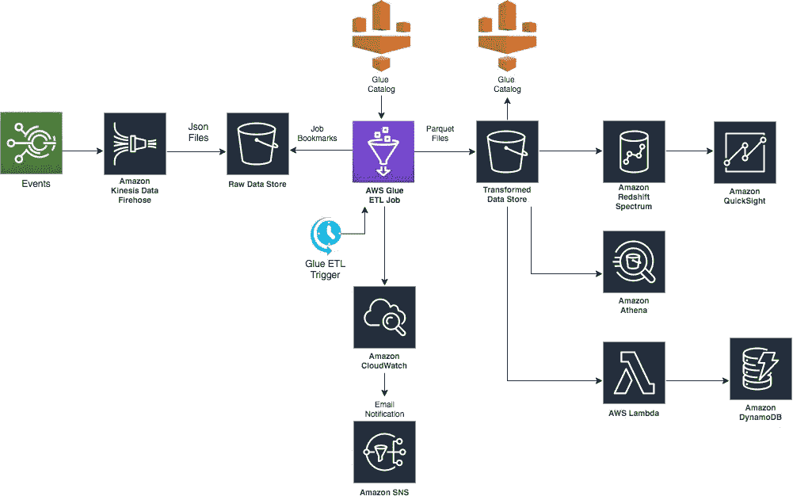

# 用作业书签实现粘合 ETL 作业

> 原文：<https://medium.com/analytics-vidhya/implementing-glue-etl-job-with-job-bookmarks-b76a8ba38dc8?source=collection_archive---------9----------------------->

AWS Glue 是一个完全托管的 ETL 服务，可以从各种来源加载大量数据集，用于 Apache Spark ETL 作业的分析和数据处理。

在这篇文章中，我将讨论在以下架构中使用 AWS Glue Job 书签功能。

AWS Glue 作业书签有助于 Glue 维护 ETL 作业的状态信息，并有助于在以下情况下处理新数据…