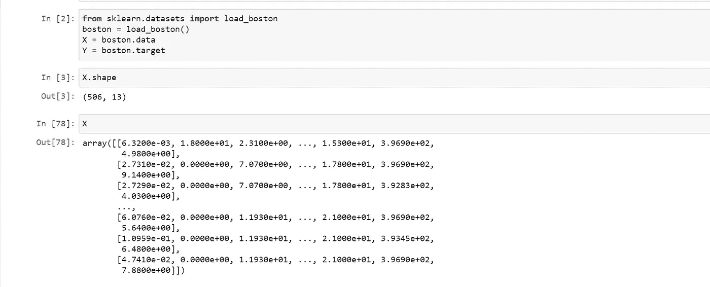
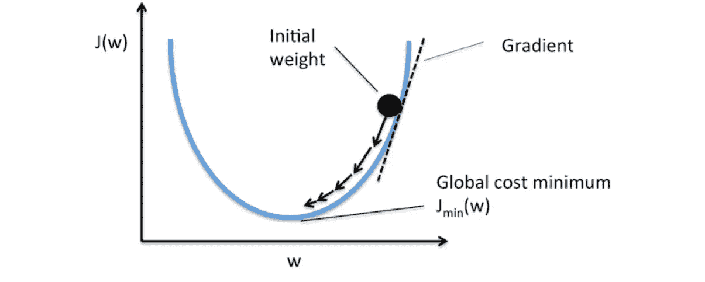
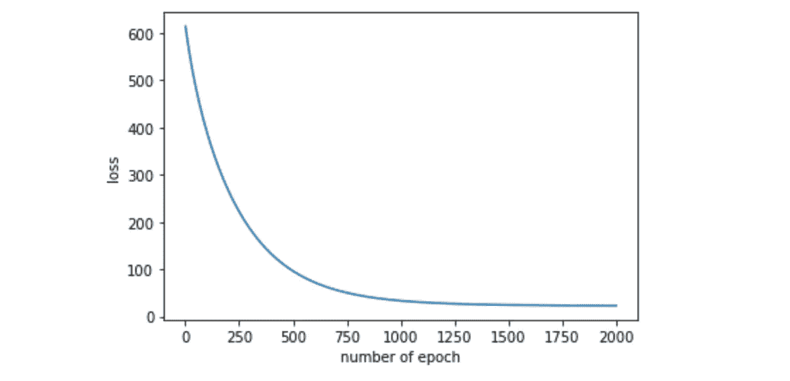
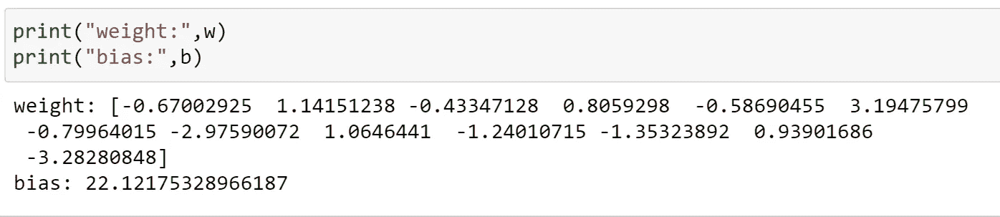
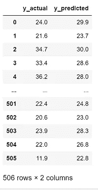

# 从头开始实现多线性回归的梯度下降。

> 原文：<https://medium.com/analytics-vidhya/implementing-gradient-descent-for-multi-linear-regression-from-scratch-3e31c114ae12?source=collection_archive---------2----------------------->

[https://unsplash.com/photos/wrfj-SRaB1Q?utm_source=unsplash&UTM _ medium = referral&UTM _ content = creditShareLink](https://unsplash.com/photos/wrfj-SRaB1Q?utm_source=unsplash&utm_medium=referral&utm_content=creditShareLink)

**梯度下降**是最流行的优化算法之一，每个数据科学爱好者都应该对这个话题有深刻的理解。

在这里，在这个博客中，我的目标是让即使是机器学习领域的新手也能容易地理解。唯一的先决条件只是基本的 python。在这篇博客中，我将使用波士顿房价数据集，这是一个由 sklearn 图书馆提供的玩具数据集。

关于数据集:它有 506 条记录、13 个特征和 1 个目标变量。

梯度下降法是一种迭代算法，用于损失函数中寻找全局极小值。损失可以是任何微分损失函数。不同类型的损失函数是线性损失、逻辑损失、铰链损失等。对于我们的数据集，我们将使用线性损失，因为目标是一个连续变量。

[https://data science . stack exchange . com/questions/24534/does-gradient-descent-always-converge-to-a-optimum/24537](https://datascience.stackexchange.com/questions/24534/does-gradient-descent-always-converge-to-an-optimum/24537)

在上图中，将损失函数视为凸函数，在 x 轴上，我们有参数权重，在 y 轴上，我们有损失值，蓝色曲线是损失函数。首先，我们随机初始化权重“w ”,并使用梯度下降算法获得给出最小损失的最终权重“w”。

当我们说我们正在建立一个线性回归模型时，它只不过是我们试图找到一条最适合数据的直线(一个特征)或超平面(多个特征)。并且直线的方程由“mx+b=0”表示，其中“m”是斜率，“b”是偏差。我们也可以把“m”称为重量，“b”称为截距。

例如，如果我们有 5 个特征，那么超平面的方程表示为:

## 现在让我们看看如何找到最佳拟合线使用梯度下降。

在上面的线方程中，“m”和“b”是我们需要使用梯度下降来更新以找到最佳拟合线(当我说最佳拟合线时，它无非是在损失函数中找到最小值)的参数，“x”是给定的输入数据。

更新权重和偏差的等式:

其中“dl/dw”是损耗 w.r.t .重量的导数，“dl/db”是损耗 w.r.t .偏差的导数，“n”是记录总数。这里，权重是一个大小=13 的向量(我们有 13 个特征)。

**梯度下降的步骤:**

1.  标准化数据:

2.初始化参数和超级参数

3.求重量和偏差损失的导数。

*   损耗方程

*   “重量”损失的衍生产品

*   损失的导数与“偏差”或“截距”有关

4.更新权重和偏差，直到我们得到全局最小值。

*   上图是损失和纪元编号之间的关系图。
*   在每个时期之后，损失减少
*   最初，损失急剧下降，直到 1000 纪元
*   在 1000 个时期之后，损失有最小的减少。
*   这表明我们已经达到了全球最低水平。

5.使用最终的权重向量和偏差，我们可以预测输出

这是 2000 年后的最终权重和偏差

*   上表是实际目标和模型预测目标之间的比较。

*最后，如果你想看到完整的代码，可以点击这个链接*[*【Github】*](https://github.com/GUNAND12/multi_linear-Gradient-descent/blob/main/gradient_descent.ipynb)*。*

这里是在同一数据集上实现多线性回归的随机梯度下降的链接:[链接](https://github.com/GUNAND12/multi_linear-Gradient-descent/blob/main/Stocastic_gradient_descent.ipynb)

# 如果你喜欢这篇文章:

*   你可以在 [LinkedIn](https://www.linkedin.com/in/gunand-mayanglambam-98727b141/) 上联系我