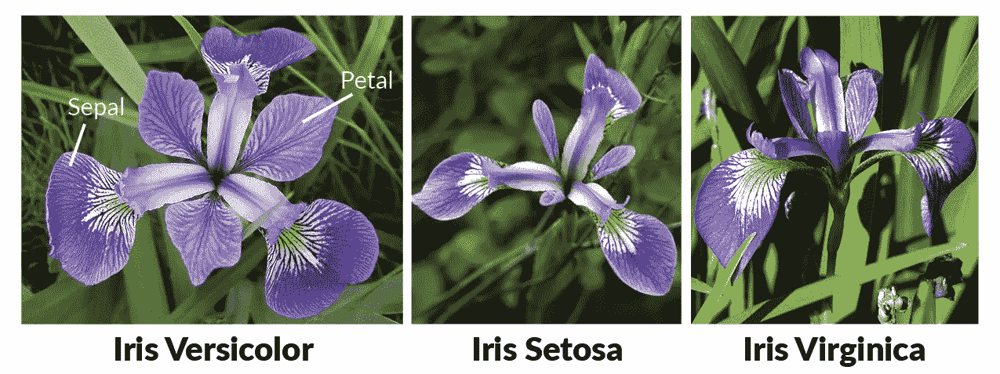
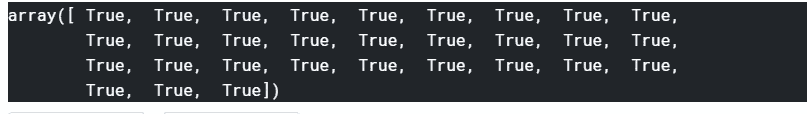

# 无需 Scikit Learn 构建 K 近邻(KNN)模型:易于实现

> 原文：<https://medium.com/analytics-vidhya/implementing-k-nearest-neighbours-knn-without-using-scikit-learn-3905b4decc3c?source=collection_archive---------3----------------------->


为新来的穿红衣服的家伙找到 K 个最近的邻居并不难

> k 近邻(KNN)无疑是机器学习中我最喜欢的算法之一，因为它非常直观、简单易懂，同时也是一种需要学习的基本算法。

**让我们看看定义是怎么说的** : KNN 是一种监督学习算法，它根据一个数据点(实例)的“k”个最近的实例属于哪个类，来估计该数据点(实例)属于一个类或另一个类的可能性。

> 这就像，告诉我你的密友，我就能知道你是谁！K '亲密朋友的数量，其中 K 是我们需要定义的整数。


你有一群很酷的朋友吗？你也很酷！

看，KNN 是一个通用的算法，可以用于分类和回归。它是一个***非参数*** 模型，这意味着它不像线性回归那样预先对数据做出假设，即数据必须是线性的。

此外，KNN 被称为*懒惰学习者，因为它在训练阶段不做任何事情，实际上，KNN 没有这样的训练阶段，这意味着它使用训练数据点来做任何类型的*概括。*它只是记住所有的数据，或者只是保存所有的训练数据，然后在对新实例进行预测时使用这些数据。这意味着我们在训练过程中很快，但在测试阶段很慢。*

***那么让我们从 KNN 的实现开始吧。它实际上只涉及 3 个简单的步骤:***

1.  *计算测试数据点和每个训练数据点之间的距离(欧几里德距离、曼哈顿距离等)。这是看谁近，谁远多少。*
2.  *对距离进行排序，并从中挑选 K 个最近的距离(前 K 个条目)。这将是 K 个与给定测试数据点最近的邻居。*
3.  *获取所选 K 个邻居的标签。最常见的标签(多数投票的标签)将是我们的测试数据点的预测标签。*

*对测试集中的所有测试数据点重复上面的一切。*

# *现在让我们在不使用 Scikit learn 的情况下编写实现 KNN 的代码。*

*我们将使用 iris 数据集进行实施和预测。我假设你知道虹膜数据集。你可以在这里阅读这个非常受欢迎的数据集。*

**

*Iris 数据集中的三个类*

***导入基本库***

```
*import numpy as np
import scipy.spatial
from collections import Counter*
```

***从 Sklearn** 加载鸢尾花数据集*

```
*from sklearn import datasets
from sklearn.model_selection import train_test_splitiris = datasets.load_iris()X_train, X_test, y_train, y_test = train_test_split(iris.data, iris.target, random_state = 42, test_size = 0.2)*
```

**我们做了一个拆分，用于训练我们的算法，然后分别在测试数据上测试它。**

*我们将定义一个“KNN”类，在这个类中我们将定义使我们的算法工作的每一个基本函数。我们将在我们的类中使用以下方法。*

1.  ****fit*** :如前所述，它只是将数据保存在自身中，因为 KNN 不执行任何显式的训练过程。*
2.  ***距离**:这里我们将计算欧几里德距离。*
3.  ***预测**:在这个阶段，我们将使用完整的训练数据来预测测试实例的类。我们将用这种方法实现上面讨论的 3 步过程。*
4.  ***Score** :最后我们将有一个 Score 方法，根据测试数据计算我们模型的分数*
5.  ***那‘K’呢**？:这里最重要的人是 K，我们将在初始化 KNN 类的对象时将“K”作为参数传递(在 *__init__* 内)*

**这是我得到的一张关于所使用的各种距离度量的好图片:
它们中的每一个都可以使用它们的 Numpy 内置函数很容易地计算出来，或者如果你愿意也可以直接编码。**

**

*我们将在这里使用欧几里德距离*

*我将首先编写完整的类，然后我们将讨论流程:*

```
*class KNN:
    def __init__(self, k):
        self.k = k

    def fit(self, X, y):
        self.X_train = X
        self.y_train = y

    def distance(self, X1, X2):
        distance = scipy.spatial.distance.euclidean(X1, X2)

    **def predict(self, X_test):
        final_output = []
        for i in range(len(X_test)):
            d = []
            votes = []
            for j in range(len(X_train)):
                dist = scipy.spatial.distance.euclidean(X_train[j] , X_test[i])
                d.append([dist, j])
            d.sort()
            d = d[0:self.k]
            for d, j in d:
                votes.append(y_train[j])
            ans = Counter(votes).most_common(1)[0][0]
            final_output.append(ans)

        return final_output**

    def score(self, X_test, y_test):
        predictions = self.predict(X_test)
        return (predictions == y_test).sum() / len(y_test)*
```

**查看发生了什么:**

> *我们将在为类“KNN”创建一个对象时传递 K。*
> 
> ***Fit** 方法只是接受训练数据，没有别的。*
> 
> *我们使用[scipy . spatial . distance . euclidean](https://docs.scipy.org/doc/scipy/reference/generated/scipy.spatial.distance.euclidean.html)来计算两点之间的**距离**。*
> 
> ***预测**方法对每个测试数据点运行一个循环，每次计算测试实例和每个训练实例之间的距离。它将训练数据的距离和索引一起存储在 2D 列表中。然后，它根据距离对列表进行排序，然后更新列表，只保留列表中的 K 个最短距离(以及它们的索引)。*
> 
> *然后，它取出对应于这 K 个最近数据点的标签，并使用计数器检查哪个标签占多数。该多数标签成为测试数据点的标签。*
> 
> ***Score** 方法只是将我们的测试输出与他们的实际输出进行比较，来发现我们预测的准确性。*

*太棒了。就是这样。真的就这么简单！现在让我们运行我们的模型，并在我们之前分开的测试数据上测试我们的算法。*

```
*clf = KNN(3)
clf.fit(X_train, y_train)
prediction = clf.predict(X_test)for i in prediction:
    print(i, end= ' ')*
```

**

*这是我们对 X_test 的预测标签*

*那是我们对测试数据的预测！我们不介意将它与实际的测试标签进行比较，看看我们做得如何。让我们看看。*

```
*prediction == y_test*
```

**

*似乎每个输出都被正确预测了。*

*所以！我们走在正确的道路上。因为每个预测都是正确的，所以我们的预测显然会得到满分。*

```
*clf.score(X_test, y_test)*
```

**

*百分百得分！*

*我们完事了。真的就这么简单利落。KNN 有一个非常基本和极简的方法，非常直观，但它是一个强大和通用的机器学习算法，可以解决各种各样的问题。*

*那都是乡亲们！:)*