# 在您自己的系统中实现内核/过滤器/卷积

> 原文：<https://medium.com/analytics-vidhya/implementing-kernel-filter-convolutional-in-your-own-a6146d87d791?source=collection_archive---------10----------------------->

今天我讨论如何在不使用预定义函数的情况下自己实现内核/过滤器。在进入主题之前，我先讨论一下卷积，以便更好地理解。

在数学中，卷积是两个事物产生第三个事物的运算。简而言之，把两种东西混合在一起得到一种新的东西。例如，在牛奶中加入咖啡粉可以得到咖啡。这里有两样东西是牛奶和咖啡粉。第三件事是咖啡。

来到我们的主题图像，这两件事是原始图像和过滤器。第三件事是修改图像。

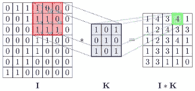

在上面的图片中，第一张图片是原始图像，第二张图片是过滤器，第三张图片是修改后的图像。作为人类，我们可以看到图像。但是计算机理解为一种价值。我只讨论灰度格式和 RGB 格式。灰度格式的范围是 0–255。0 表示全黑，255 表示全白。中间值是黑色和白色的阴影。

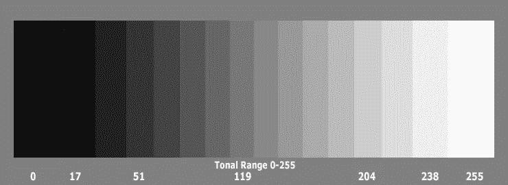

从上面的图片你可以直观的了解它是什么。如果计算机在那个像素上看到 0 值，它就在屏幕上呈现黑色。它为各个值呈现各个值。我们可以把整个世界缩小到这 256 个色度。

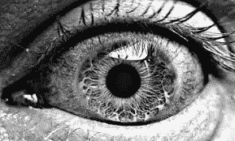

灰度图像的例子

我们可以看到惊人的画面。但是如果我们放大观察每一个像素，就会有 256 种颜色中的一种

下一个是 rgb 格式。它也与 0–255 的范围相同。但是三次，一次是红色通道，一次是蓝色通道，一次是绿色通道。所以通过使用这些组合，我们得到 16777216 种颜色

(0，0，0)-黑色

(0,0,1)

…………

(0，0，255)-蓝色

(0，255，0)-绿色

(255，0，0)-红色

…….

(255,255,254)

(255，255，255)-白色。

够了，我们进入主题。你知道什么是原始图像和修改后的图像。过滤器是我们在日常生活中使用的，如模糊，边缘检测，锐化等。现实生活中有很多过滤器。

在 opencv 中，有许多预定义的函数来完成这种类型的操作。(例如:cv2.gaussianblur 用于模糊)。但是我想知道内部发生的工作流程，并为此编写代码。让我们进入代码

首先导入所需的包。我只承诺不会对卷积运算使用预定义的运算。但是对于像图像打开，图像保存，转换数组到图像包的过程是必需的(如果你知道如何做，请分享)

```
*import cv2
import numpy as np
from PIL import Image*
```

下一步是加载图像。在以下代码中，0 表示以灰度读取图像

> `img=cv2.imread(‘E:\sit.jpg’,0)`


sit.jpg

这是图像。尺寸是 1050*700。接下来我们来看看计算机是如何看待图像的

> `print(img)`

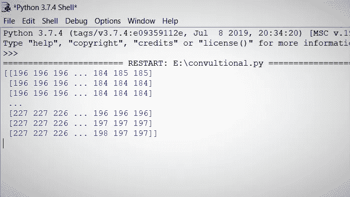

这是图像在电脑上的样子。(也就是说，完整的图像没有作为值打印出来，所以它放在…)

下一步是初始化过滤器。过滤器只是一个值(矩阵)。在下图中，我选择了锐化矩阵作为例子。请访问下面的链接了解更多关于过滤器的信息

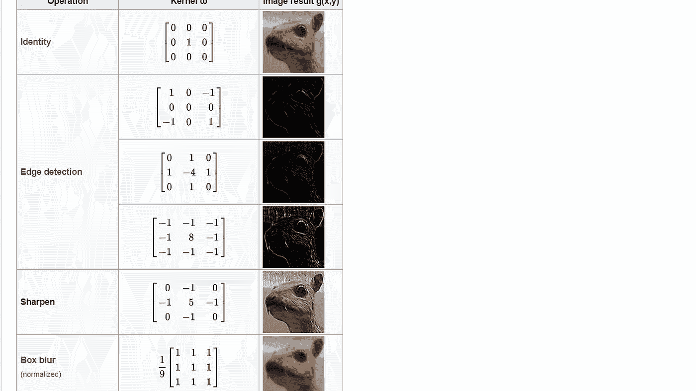

**向维基百科致谢**

[https://en . Wikipedia . org/wiki/Kernel _(图像处理)](https://en.wikipedia.org/wiki/Kernel_(image_processing))

> `x=np.array([[0,-1,0],[-1,5,-1],[0,-1,0]])`

现在你明白为什么我把这个值？下一步是初始化所有变量。img.shape[0]表示图像的高度，img.shape[1]表示图像的宽度

```
y=img.shape[0]-2
z=img.shape[1]-2tempw=0
temph=0h1=0
w1=0
go=0
go1=0
ko=0
ko1=0
sum=0b=input()s=np.zeros((y,z))
#s is an 2d array with z width & y height with full of zero values.
```

你可能会想为什么我在两者上都加了-2。我解释这个。

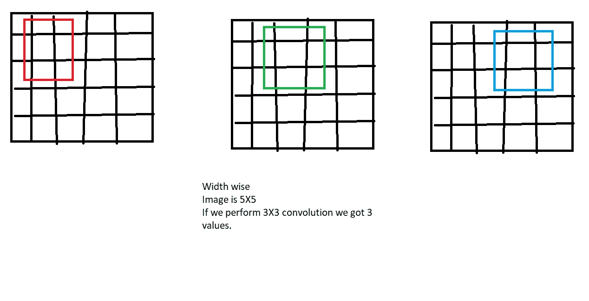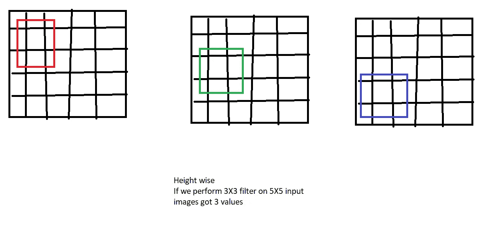

所以总共是宽度方向 3 和高度方向 3。所以一共 9 个值。当我们执行 5X5 输入图像时，输出是 3X3 图像。如果我们执行 7X7(输入)，那么 5X5(输出)同样如此。

所以你明白为什么我在宽度和高度上加-2 值。输出图像的尺寸为(宽度-2)*(高度-2)。

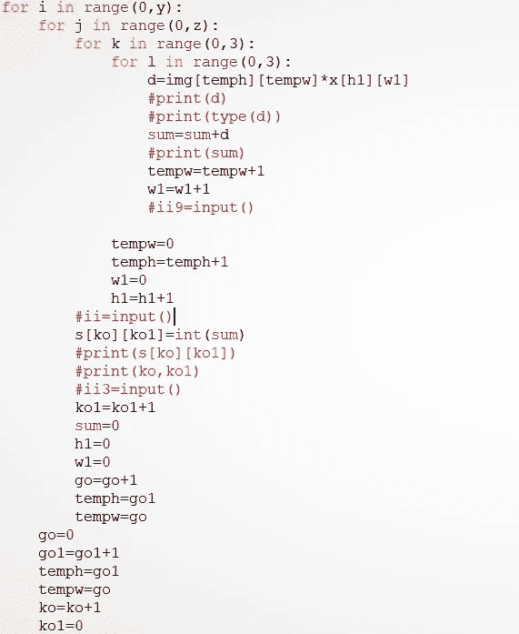

这是卷积的代码。请省略注释行，因为它用于某些调试过程。它包含四个 for 循环

1.  在图像的高度上跟踪
2.  在图像宽度上描摹
3.  在过滤器的高度上追踪
4.  在过滤器的宽度上追踪


**归功于 TowardsDataScience**

这正是逻辑正在做的事情。我为任何大小的输入图像实现这个。但是我用的是静态滤镜尺寸(3*3)。对于某些人来说，这些代码可能看起来很奇怪。对于这些，请记下来，并解决一些迭代，你可能会明白为什么我把这些值放在这一点上。因为我花 10 分钟写代码，20 分钟做文书工作。我没有解释每一行并调试它，因为这很费时间。我再说一遍，当你在纸上解决它的时候，它是容易的。转换成数字数组后，我们要输出的是一个图像。为此

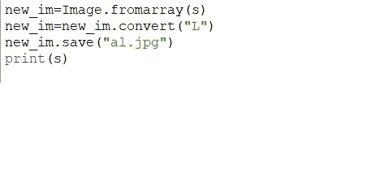

那么输出看起来像

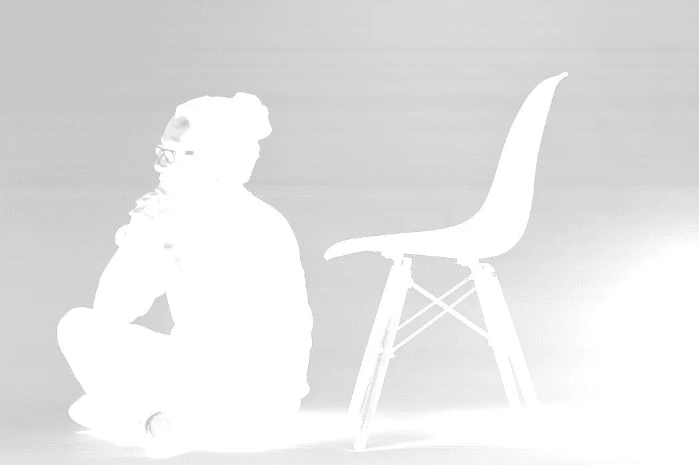

是的，现在你可以自己应用过滤器了。现在我们的输出图像尺寸是(1048X698)。记住我们的输入大小(1050X700)。此图像需要 33 秒才能输出(效率不高)。感谢您阅读此给予回应，并询问任何有关代码或任何问题。

注意:请使用其他相同和不同大小的过滤器，并在这附近玩。

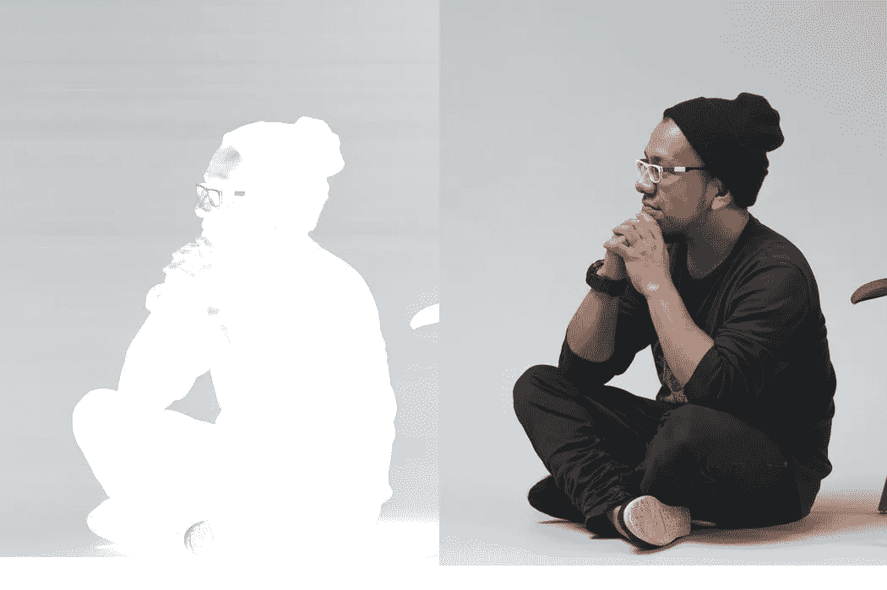