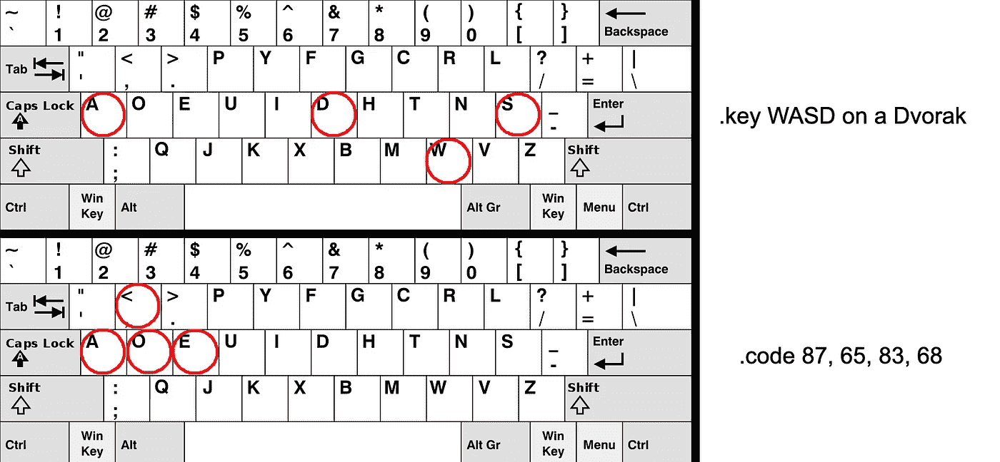

# 在 Javascript 中实现键盘控件或快捷键

> 原文：<https://medium.com/analytics-vidhya/implementing-keyboard-controls-or-shortcuts-in-javascript-82e11fccbf0c?source=collection_archive---------8----------------------->

如果你试图用 Javascript 开发一个游戏或交互式 webapp，你可能会发现自己想要实现键盘控制。

# 事件监听器

为此，我们将使用键盘事件监听器。它们是 **keydown** (检测按键何时被按下)和 **keyup** (检测按键何时被释放)。

```
document.addEventListener('keydown', sayHi);

function sayHi(e) {
  console.log("Hello!");
}
```

上面的代码将打印“Hello！”每当按下任何键时。

# 特定键

我们可以使用事件的内置方法来访问特定的按键。**。按键**将返回被按下的按键:

```
document.addEventListener('keydown', recordKey);

function recordKey(e) {
  console.log("You pressed ${e.key}");
}
```

此事件可以使用的一些其他有用的方法:

```
**e.ctrlKey** : detects if ctrl is also pressed (boolean) **e.shiftKey** : detects if shift is also pressed (boolean) **e.metaKey** : detects if the window key / command key is also pressed
             (boolean) **e.repeat** : detects if the key is being held down (boolean) **e.code** : outputs a code unique to each key
```

**。key** 报告由键(w，7，shift，tab)给出的值，而 key.code 关心键的物理位置。所以**的一个用处。代码**可能是如果你想实现 WASD 控制，但适应那些使用非英语或非 QWERTY 键盘:



另一方面，他们不使用德沃夏克，因为他们想适应

现在我们可以访问被按下的按键，我们可以让不同的按键做不同的事情:

```
switch (e.key) {
  case "w":
    someUpFunction()
  break
  case "s":
    someDownFunction()
  break
  case "Up":
  case "ArrowUp":
    someOtherUpFunction()
  break
  case "Down":
  case "ArrowDown":
    someOtherDownFunction()
  break
  case " ":
  case "Spacebar":
    someOtherFunction()
  break
  default:
    return
}
```

你会注意到在空格键和箭头的例子中，有两个看起来多余的例子。这是因为 Internet Explorer(和 Edge)对键使用不同的命名方案，所以我们以这种方式涵盖了这两种命名方案。这可能是使用**的另一个原因。代码**。

# 同时输入

浏览器中 Javascript 的一个限制是，它一次只能检测一个键盘输入；如果我用箭头移动我的飞船，并想用空格键射击，当我射击时，移动会停止，直到我再次按下箭头键时，移动才会重新开始。如果你想允许输入的组合(除了使用 **shift** 、 **control** 和**windows**/**command**)，你需要通过在等式中添加 **keyup** 来跟踪每个按键的寿命。

以下是我最近的一个项目中的真实代码，该项目在一个键盘上同时接受两个用户(“p1”和“p2”)的移动输入。

```
function controlKeydown(event){
  if (event.defaultPrevented) {
    return
  }
  switch (event.key) {
    case "w":
      p1.direction = 1
    break
    case "s":
      p1.direction = -1
    break
    case "Up":
    case "ArrowUp":
      p2.direction = 1
    break
    case "Down":
    case "ArrowDown":
      p2.direction = -1
    break
    case " ":
    case "Spacebar":
      app.paused = !app.paused
    break
    default:
      return
  }
  event.preventDefault();
}
function controlKeyup(event){
  if (event.defaultPrevented) {
    return
  }
  switch (event.key) {
    case "w":
    case "s":
      p1.direction = 0
    break
    case "Up":
    case "ArrowUp":
    case "Down":
    case "ArrowDown":
      p2.direction = 0
    break
    default:
      return
  }
  event.preventDefault()
}
window.addEventListener("keydown", function (event) {
  controlKeydown(event)
}, true)
window.addEventListener("keyup", function (event) {
  controlKeyup(event)
}, true)
```

他们投入的实际效果在别处处理；输入只是创建一种状态(“向上移动”、“向下移动”、“不移动”)。这样，多个输入不会相互中断。

请在下面分享你的评论，或者私信我。