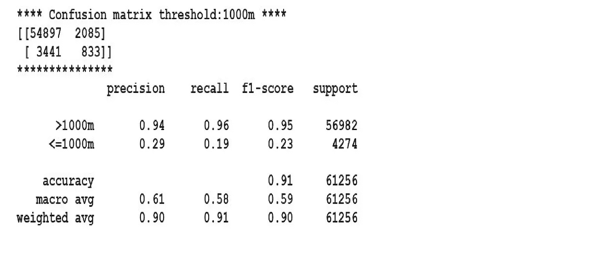
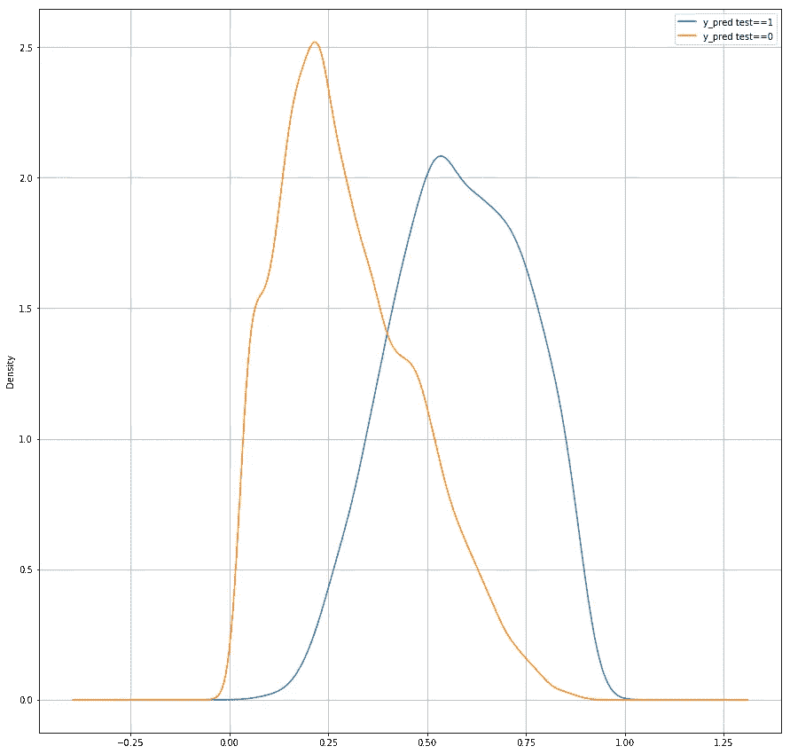
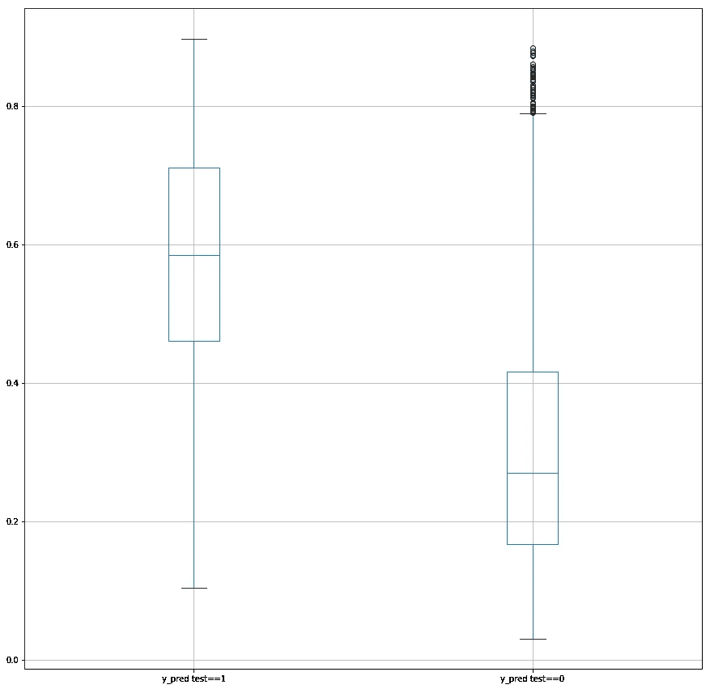
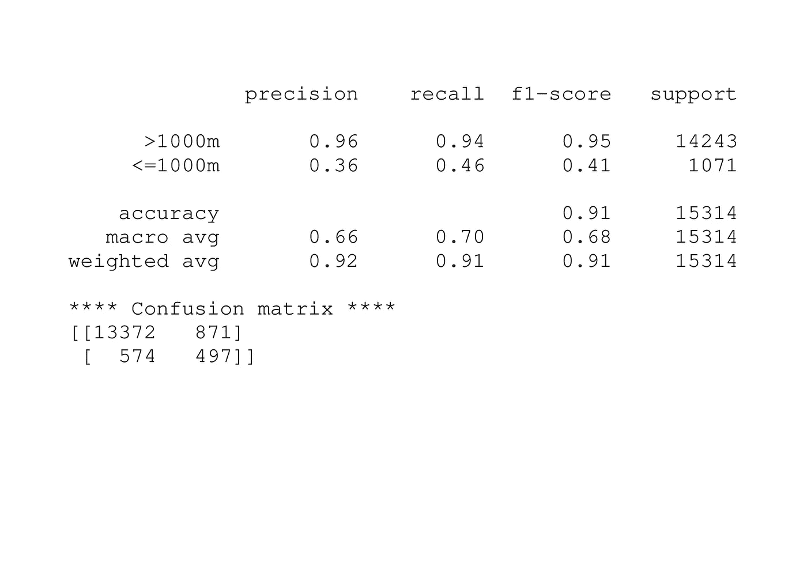
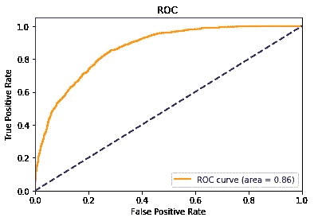

# 实施 LightGBM 以改进来自气象模式的能见度变量的准确性

> 原文：<https://medium.com/analytics-vidhya/implementing-lightgbm-to-improve-the-accuracy-of-visibility-variable-from-a-meteorological-model-952e7418335?source=collection_archive---------9----------------------->

我们的目标是提高气象模型的准确性。气象模型为我们提供了预测的变量。一些变量，如温度和压力，表现良好。您可以查看以下两个链接，了解更多信息:

[利用机器学习改进气象和海洋模型(第 0 部分:建立数据框架)](/@robinat539/improving-meteorological-and-ocean-models-with-machine-learning-part-0-set-up-a-data-frame-4abd3744ec75)

[利用机器学习改进气象和海洋模型(第 1 部分:评估气象模型)](/@robinat539/improving-meteorological-and-ocean-models-with-machine-learning-part-1-assessing-the-4c309851a81e)

在本出版物中，我们将重点放在可见性变量上。首先，像往常一样，我们从我的 Github 存储库中获取数据帧:

```
**import pandas as pd
#from Github link 
url=”**[**https://raw.githubusercontent.com/granantuin/LEVX_class/master/maestro.csv**](https://raw.githubusercontent.com/granantuin/LEVX_class/master/maestro.csv)**"
master=pd.read_csv(url,index_col=”datetime”,parse_dates=True)****#filter conditions
master_f=master[[‘dir_p’, ‘lhflx_p’, ‘mod_p’, ‘prec_p’, ‘rh_p’, ‘visibility_p’,
 ‘mslp_p’, ‘temp_p’, ‘cape_p’, ‘cfl_p’, ‘cfm_p’, ‘cin_p’,
 ‘conv_prec_p’,”visibility_o”]]**
```

我们想解决一个分类二元问题。我们定义了一个阈值(1000 米),并将能见度指定为阈值以下 1，阈值以上 0。代码应该是:

```
**#change label dependent variables
threshold=1000
X=master_f[[“dir_p”, ‘lhflx_p’, ‘mod_p’, ‘prec_p’, ‘rh_p’, ‘visibility_p’,
 ‘mslp_p’, ‘temp_p’, ‘cape_p’, ‘cfl_p’, ‘cfm_p’, ‘cin_p’,
 ‘conv_prec_p’]]
y=pd.DataFrame({“datetime”:master_f.index,
 “visibility_o”:[1 if c<=threshold else 0
 for c in master_f[“visibility_o”]]}).set_index(“datetime”)**
```

从上一篇文章(查看此[链接](/@robinat539/improving-meteorological-and-ocean-models-with-machine-learning-part-2-applying-deep-learning-to-239883b4815e))中，我们知道了可变能见度的模型预测。我们指定能见度小于 1000 米为 1，否则为 0。我们对比了气象站的真实能见度。结果是:



f1 分数 0.23 似乎不是一个很难打败的分数！

我们必须将量表标准化，并将数据分为数据测试和数据训练。

```
**# Splitting the dataset into the Training set and Test set
from sklearn.model_selection import train_test_split
x_train, x_test, y_train, y_test = train_test_split(X, y, test_size = 0.25, random_state = 0)
# Feature Scaling
from sklearn.preprocessing import StandardScaler
sc = StandardScaler()
x_train = sc.fit_transform(x_train)
x_test = sc.transform(x_test)**
```

现在，我们定义 LightGBM 参数。我尝试了几种设置，最后，我找到了一组运行良好的设置。

我阅读这篇[文章](/@pushkarmandot/https-medium-com-pushkarmandot-what-is-lightgbm-how-to-implement-it-how-to-fine-tune-the-parameters-60347819b7fc)来帮助我找到最佳设置。参数是字典数据的代码是:

```
**import lightgbm as lgb
d_train = lgb.Dataset(x_train, label=y_train)
params = {}
params[‘learning_rate’] = 0.001
params[‘boosting_type’] = ‘gbdt’
params[‘objective’] = ‘binary’
params[‘metric’] = ‘binary_logloss’
params[‘sub_feature’] = 0.5
params[‘num_leaves’] = 1000
params[‘min_data’] = 2000
params[‘max_depth’] = 40
clf = lgb.train(params, d_train, 10000)**
```

我们得到分类器“clf”并测试它:

```
**#Prediction dealing with skewed data
y_pred=clf.predict(x_test)**(1/3)
result=pd.DataFrame({“y_pred”:y_pred, “y_test”:y_test.values.reshape(1,-1)[0]})
pd.DataFrame({“y_pred test==1”:result[“y_pred”][result.y_test==1],
 “y_pred test==0”:result[“y_pred”][result.y_test==0]}).plot(kind=”kde”,figsize=(15,15),grid=True)**
```

结果，这张漂亮的照片:



黄线是 y_test 为 0 时的密度曲线。蓝线是 y_test 为 1 时的密度曲线。我们的目标是找到一个低于它的阈值，LightGBM 算法的结果将是 0(能见度在 1000 米以上)，高于它，结果将是 1(能见度小于 1000 米)。完美的结果将是当两个情节完全分开。也许另一个情节可以帮助我们:



要获得此图，请将上面代码中的“kde”替换为“box”。我找到一个阈值(0.6)，使能见度小于 1000 米时的参数 f1 最大化。代码是:

```
**from sklearn.metrics import confusion_matrix ,classification_report 
#select threhold_nor
threshold_nor=0.6
y_pred_nor=[0 if c<=threshold_nor else 1 for c in result.y_pred]
target_names = [“>”+str(threshold)+”m”,”<=”+str(threshold)+”m” ]
print(classification_report(y_test.values,y_pred_nor , target_names=target_names))
print(“**** Confusion matrix ****”)
print(confusion_matrix(y_test,y_pred_nor))**
```



我们可以绘制 ROC 并计算 AUC，以查看 LightGBM 算法的性能。代码可以是:

```
**from sklearn.metrics import roc_curve, auc
from sklearn import metrics
#ROC model 
fpr, tpr, thresholds = metrics.roc_curve(y_test,y_pred)
roc_auc = auc(fpr, tpr)
plt.figure()
lw = 2
plt.plot(fpr, tpr, color=’darkorange’,
 lw=lw, label=’ROC curve (area = %0.2f)’ % roc_auc)
plt.plot([0, 1], [0, 1], color=’navy’, lw=lw, linestyle=’ — ‘)
plt.xlim([0.0, 1.0])
plt.ylim([0.0, 1.05])
plt.xlabel(‘False Positive Rate’)
plt.ylabel(‘True Positive Rate’)
plt.title(“ROC “)
plt.legend(loc=”lower right”)
plt.show()**
```

结果是:



结论和展望

看来我们达到了我们的目标:获得比气象模型更好的结果。气象模型的 f1 值为 0.23，LightGBM 算法的 f1 值为 0.41。应用交叉验证，不要只相信 train_test_split 库中的 random_state=0，这将是一个很好的练习！在气象层面，我们可以尝试其他的能见度阈值。我鼓励其他读者将 LightGBM 应用于 50、500、1000、5000 米的阈值，并获得比气象模型更好的 f1 分数。来自气象模型的每个阈值的 f1 分数是:0、0.19、0.23(我们的情况)和 0.25。点击[此处](/analytics-vidhya/improving-meteorological-and-ocean-models-with-machine-learning-part-2-applying-deep-learning-to-239883b4815e)查看车型 f1 评分。

谢谢大家！